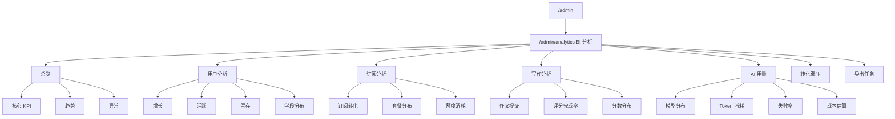

# Admin BI 分析后台前端方案

## 当前结论

BI 后台可以先按前端页面和交互完整设计，再逐块接入真实数据。第一版不做自由拖拽报表，也不让管理员直接拼 SQL，而是采用“固定指标看板 + Mock 数据 + API 契约预留”的方式落地。

推荐把 `/admin` 拆成两类能力：

- 业务管理后台：用户中心、作文排查、订阅额度、内容资产、AI 调试、审计日志。
- BI 分析后台：增长、活跃、订阅、写作、AI 用量、漏斗和成本分析。

BI 前端先建设 `/admin/analytics` 模块，页面结构、筛选器、图表组件、Mock 数据和 API 类型先稳定。后端按模块逐步提供聚合接口，接入时只替换 API 层，页面不大改。

## 范围

覆盖：

- BI 导航结构。
- 固定看板的信息架构。
- 页面原型图。
- 前端模块和组件拆分。
- Mock 数据和真实接口切换策略。
- 指标口径分层。
- 分阶段工作周期。

不覆盖：

- 自助式拖拽报表。
- 任意 SQL 查询。
- 外部 BI 产品嵌入。
- 数据仓库、ClickHouse、BigQuery 等分析基础设施选型。
- 生产级成本计费精算。

## 设计原则

1. 先做固定看板，不做自由 BI。
2. 页面先行，数据分块接入。
3. 指标口径集中，不在组件里临时计算业务口径。
4. 页面组件只消费 API DTO，不直接关心后端表结构。
5. 筛选条件统一，避免每个图表各自维护一套状态。
6. 高风险数据默认聚合展示，明细和导出按权限控制。

## 信息架构



## 导航设计

BI 作为 `/admin` 下的独立分组，不混入用户中心详情页。

| 分组 | 菜单 | 路由 | 首版数据 |
| --- | --- | --- | --- |
| 数据分析 | BI 总览 | `/admin/analytics` | Mock，后续接聚合接口 |
| 数据分析 | 用户分析 | `/admin/analytics/users` | Mock，后续接用户增长和留存 |
| 数据分析 | 订阅分析 | `/admin/analytics/subscriptions` | 可先复用部分订阅概览接口 |
| 数据分析 | 写作分析 | `/admin/analytics/writing` | Mock，后续接作文聚合 |
| 数据分析 | AI 用量 | `/admin/analytics/ai-usage` | Mock，后续接模型用量聚合 |
| 数据分析 | 转化漏斗 | `/admin/analytics/funnel` | Mock，后续接事件或聚合表 |
| 数据分析 | 导出任务 | `/admin/analytics/exports` | 可先做空状态 |

## 全局筛选器

所有 BI 页面共用顶部筛选器：

| 筛选项 | 说明 |
| --- | --- |
| 日期范围 | 默认近 30 天，支持今日、近 7 天、近 30 天、自定义 |
| 学段 | 全部、IELTS、TOEFL、考研、高考等 |
| 套餐 | 全部、Free、Basic、Pro、Premium |
| 渠道 | 全部、Web、管理员导入、活动兑换等 |
| 用户类型 | 全部、新用户、活跃用户、订阅用户、超额用户 |
| 刷新 | 重新拉取当前页面数据 |

筛选状态建议放在 `useAnalyticsFilters` composable 中，路由 query 同步仅保存稳定字段，例如 `from`、`to`、`stage`、`planCode`。

## 原型图

### BI 总览

```text
+--------------------------------------------------------------------------------+
| Admin 后台 / 数据分析 / BI 总览                         日期  学段  套餐  刷新 |
+--------------------------------------------------------------------------------+
| 新增用户     活跃用户     订阅新增     作文提交     AI Tokens     失败率       |
| 1,240        8,920        126          3,482        12.8M         1.8%         |
+--------------------------------------------------------------------------------+
| 用户增长趋势                         | 订阅转化趋势                             |
| line chart                           | line chart                                |
+--------------------------------------------------------------------------------+
| 写作提交与评分完成率                 | AI token 与失败率                         |
| stacked bar + line                   | stacked bar + line                        |
+--------------------------------------------------------------------------------+
| 异常提醒                              | Top 模块                                  |
| - 评分失败率升高                      | 学段排行 / 模型排行 / 套餐排行             |
| - gpt-4o-mini token 异常              |                                            |
+--------------------------------------------------------------------------------+
```

### 用户分析

```text
+--------------------------------------------------------------------------------+
| 用户分析                                                   日期  学段  渠道     |
+--------------------------------------------------------------------------------+
| 新增用户 | 活跃用户 | 次日留存 | 7 日留存 | 学段完成率 | 最近活跃中位数       |
+--------------------------------------------------------------------------------+
| 用户增长趋势                         | 活跃用户趋势                             |
+--------------------------------------------------------------------------------+
| 留存矩阵                             | 学段分布                                  |
| cohort table                         | donut / bar                               |
+--------------------------------------------------------------------------------+
| 用户分群排行                         | 最近新增用户摘要                          |
+--------------------------------------------------------------------------------+
```

### 订阅分析

```text
+--------------------------------------------------------------------------------+
| 订阅分析                                                   日期  学段  套餐     |
+--------------------------------------------------------------------------------+
| 订阅用户 | 新增订阅 | 订阅转化率 | 过期用户 | 超额用户 | 额度消耗             |
+--------------------------------------------------------------------------------+
| 订阅转化趋势                       | 套餐分布                                  |
+--------------------------------------------------------------------------------+
| Free -> Paid 漏斗                  | 额度消耗排行                              |
+--------------------------------------------------------------------------------+
| 即将到期用户                       | 超额用户                                  |
+--------------------------------------------------------------------------------+
```

### 写作分析

```text
+--------------------------------------------------------------------------------+
| 写作分析                                                   日期  学段  模式     |
+--------------------------------------------------------------------------------+
| 作文提交 | 评分完成 | 评分失败 | 平均分 | 平均完成时间 | 异常任务             |
+--------------------------------------------------------------------------------+
| 提交趋势                              | 评分完成率趋势                          |
+--------------------------------------------------------------------------------+
| 分数分布                              | 题型 / 模式分布                         |
+--------------------------------------------------------------------------------+
| 失败任务排行                          | 高使用题目排行                          |
+--------------------------------------------------------------------------------+
```

### AI 用量

```text
+--------------------------------------------------------------------------------+
| AI 用量                                                    日期  模型  Provider |
+--------------------------------------------------------------------------------+
| Total Tokens | Prompt Tokens | Completion Tokens | 请求数 | 失败率 | 成本估算 |
+--------------------------------------------------------------------------------+
| Token 趋势                              | 成本趋势                                |
+--------------------------------------------------------------------------------+
| 模型分布                                | Workflow 分布                           |
+--------------------------------------------------------------------------------+
| 失败原因排行                            | 最近异常请求                            |
+--------------------------------------------------------------------------------+
```

### 转化漏斗

```text
+--------------------------------------------------------------------------------+
| 转化漏斗                                                   日期  学段  渠道     |
+--------------------------------------------------------------------------------+
| 注册 -> 完善学段 -> 首篇作文 -> 完成评分 -> 订阅                         |
+--------------------------------------------------------------------------------+
| 注册用户        10,000   100%                                                |
| 完善学段         7,800    78%                                                |
| 首篇作文         4,260    43%                                                |
| 完成评分         3,920    39%                                                |
| 订阅               520     5%                                                |
+--------------------------------------------------------------------------------+
| 分渠道漏斗对比                         | 分学段漏斗对比                           |
+--------------------------------------------------------------------------------+
```

## 前端模块拆分

建议新增目录：

```text
web/src/modules/admin/analytics/
  api/
    adminAnalyticsApi.ts
  mocks/
    analyticsMock.ts
  composables/
    useAnalyticsFilters.ts
    useAnalyticsDataset.ts
  components/
    AnalyticsFilterBar.vue
    AnalyticsKpiCard.vue
    AnalyticsChartPanel.vue
    AnalyticsDataTable.vue
    AnalyticsEmptyState.vue
  pages/
    AdminAnalyticsOverviewPage.vue
    AdminAnalyticsUsersPage.vue
    AdminAnalyticsSubscriptionsPage.vue
    AdminAnalyticsWritingPage.vue
    AdminAnalyticsAiUsagePage.vue
    AdminAnalyticsFunnelPage.vue
    AdminAnalyticsExportsPage.vue
  types/
    index.ts
```

组件职责：

| 组件 | 职责 |
| --- | --- |
| `AnalyticsFilterBar` | 日期、学段、套餐、渠道等统一筛选 |
| `AnalyticsKpiCard` | 指标值、环比、同比、状态 |
| `AnalyticsChartPanel` | 图表容器、标题、说明、加载态、错误态 |
| `AnalyticsDataTable` | 排行、明细、异常列表 |
| `AnalyticsEmptyState` | 未接入或无数据状态 |

第一版图表继续使用项目已有 ECharts，不引入新的图表库。

## API 契约预留

前端 API 先按真实接口形态设计，首期内部返回 Mock 数据。

建议接口：

| 方法 | 路径 | 用途 |
| --- | --- | --- |
| `GET` | `/api/admin/analytics/overview` | BI 总览 |
| `GET` | `/api/admin/analytics/users` | 用户增长、活跃、留存 |
| `GET` | `/api/admin/analytics/subscriptions` | 订阅转化、套餐分布、额度消耗 |
| `GET` | `/api/admin/analytics/writing` | 写作提交、评分完成率、分数分布 |
| `GET` | `/api/admin/analytics/ai-usage` | 模型、token、失败率、成本 |
| `GET` | `/api/admin/analytics/funnel` | 注册到订阅漏斗 |
| `GET` | `/api/admin/analytics/exports` | 导出任务列表 |

统一请求参数：

```json
{
  "dateFrom": "2026-04-16",
  "dateTo": "2026-05-16",
  "studyStage": "ielts",
  "planCode": "pro",
  "channel": "web"
}
```

统一响应结构建议：

```json
{
  "summary": [],
  "charts": {},
  "tables": {},
  "generatedAt": "2026-05-16T12:00:00",
  "dataFreshness": "mock"
}
```

`dataFreshness` 可取值：

| 值 | 含义 |
| --- | --- |
| `mock` | 前端 Mock 数据 |
| `realtime` | 实时业务库查询 |
| `daily_snapshot` | 日聚合快照 |
| `manual_export` | 离线导出结果 |

## 数据接入策略

### 阶段 1：Mock 前端

目标是先确认信息架构和视觉密度。

- 页面路由完整。
- 图表和表格有稳定 DTO。
- 筛选器可交互。
- Mock 数据集中维护。
- 所有未接真实接口的位置显示数据新鲜度。

### 阶段 2：复用现有接口

优先接已有接口，不急着补全所有后端：

- `/api/admin/subscriptions/overview`
- `/api/admin/subscriptions/daily-stats`
- `/api/admin/subscriptions`
- `/api/admin/users`
- `/api/admin/essays`
- `/api/admin/audit-logs`

这一阶段允许部分图表仍使用 Mock，但页面要明确显示数据来源。

### 阶段 3：新增聚合接口

当页面和指标确认后，再补：

- 用户增长和留存聚合。
- 写作提交和评分完成率聚合。
- AI token、模型、workflow、失败原因聚合。
- 漏斗聚合。

### 阶段 4：快照和导出

数据量上来后，不能长期依赖实时业务库查询。

- 增加每日快照表。
- 导出任务异步化。
- 明细下载加权限和审计。
- 大范围日期默认走快照数据。

## 指标分层

| 层级 | 示例 | 说明 |
| --- | --- | --- |
| 展示指标 | 新增用户、活跃用户、评分失败率 | 页面直接展示 |
| 业务口径 | 活跃用户定义、订阅转化率定义 | 统一文档维护 |
| 数据来源 | users、essay_evaluation、subscription、usage | 后端聚合实现关心 |
| 刷新策略 | 实时、每日快照、手动导出 | 前端展示数据新鲜度 |

第一版必须明确但不强求全部精确：

- 新增用户：按 `users.created_at` 统计。
- 活跃用户：按 `users.last_active_at` 或事件表统计，首版可用 `last_active_at`。
- 作文提交：按评测记录创建时间统计。
- 评分失败率：失败任务数 / 总评分任务数。
- 订阅转化率：新增订阅用户 / 新增注册用户。
- AI token：按已有 token usage 聚合表统计。

## 权限与安全

建议新增权限：

| 权限 | 能力 |
| --- | --- |
| `admin.analytics.read` | 查看 BI 看板 |
| `admin.analytics.export` | 导出 BI 数据 |
| `admin.analytics.cost.read` | 查看成本估算 |

安全规则：

- BI 默认展示聚合数据。
- 用户明细、异常请求明细和导出功能必须按权限控制。
- 导出任务写审计日志。
- 不在 BI 页面展示密码、token、验证码、完整 prompt payload。
- 成本估算可先只给 `super_admin` 或单独权限。

## 工作周期

按 1 名前端 + 1 名后端的节奏估算，首版前端先行约 4 周，完整真实数据接入约 6 到 8 周。

| 阶段 | 周期 | 交付 | 说明 |
| --- | --- | --- | --- |
| 0. 方案确认 | 0.5 周 | 文档、原型、指标清单 | 确认页面范围和首批指标 |
| 1. 前端骨架 | 1 周 | 路由、导航、筛选器、基础组件 | 使用 Mock 数据，不接后端 |
| 2. 总览和三大页面 | 1 周 | BI 总览、用户分析、订阅分析 | 图表、表格、空状态、错误态 |
| 3. 写作、AI、漏斗页面 | 1 周 | 写作分析、AI 用量、转化漏斗 | 继续 Mock，统一 DTO |
| 4. 复用现有接口 | 1 周 | 订阅、用户、作文部分真实数据 | 混合 Mock 和真实接口 |
| 5. 后端聚合接口 | 2 周 | users、writing、ai-usage、funnel 聚合接口 | 指标口径稳定后实施 |
| 6. 导出和权限 | 1 周 | 导出任务、权限裁剪、审计 | 可作为首版后续增强 |

如果只做“可点击的 BI 前端原型”，周期约 1.5 到 2 周。  
如果要求“主要看板都接真实数据”，周期约 4 到 6 周。  
如果要求“完整 BI 产品能力，包括自定义报表、字段拖拽、查询 DSL、导出审计”，周期至少 8 到 12 周，并且需要重新评估数据基础设施。

## 验收标准

前端原型阶段：

- `/admin/analytics` 和子页面可访问。
- 左侧导航出现数据分析分组。
- 页面有统一筛选器、KPI、图表、表格和异常状态。
- Mock 数据集中维护，不写死在模板里。
- `npm run build` 通过。

真实接入阶段：

- 每个页面清楚显示数据来源和生成时间。
- 已接入接口的图表不再依赖 Mock。
- 口径文档和 API 文档同步更新。
- 权限不足时隐藏入口或显示无权限状态。
- 导出和明细访问写审计日志。

## 取舍说明

不首期做自由 BI 的原因：

- 需要语义模型、查询 DSL、字段权限和性能保护。
- 管理员容易构造高成本查询影响业务库。
- 指标口径尚未稳定，自由报表会放大口径不一致问题。

先做固定看板的原因：

- 能更快验证产品方向。
- 适合当前 Vue 3、ECharts、Spring Boot、MyBatis 技术栈。
- 可以逐块接入真实接口。
- 后续要做自定义报表时，已有指标和 DTO 可以沉淀为语义模型基础。
