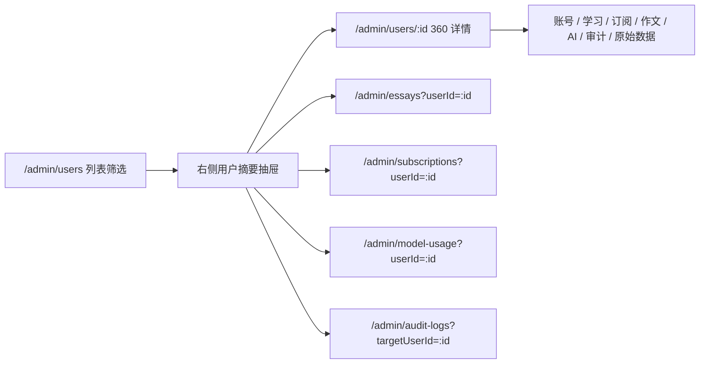

# 当前管理员端产品说明与设计方案

## 当前结论

当前管理员端已经从早期页面集合演进为一个运营治理后台。它的核心定位是替代日常运营、客服和产品同学对数据库的直接查询，让用户、订阅、作文、内容资产、AI 调试和审计可以通过受权限控制的后台完成。

当前已实现的能力具备三个特点：

1. 后台壳和导航已经按业务域分组。
2. 用户、订阅和 Agent Debug 已经接入真实接口或真实运行数据。
3. 文档首页、数据地图、BI 分析、内容资产扩展项和模型用量等模块已有前端骨架或导航入口，其中数据地图已接入只读元数据接口。

后续设计不应推翻现有实现，而应在当前基础上补齐产品闭环：用户中心补摘要抽屉和 360 详情页；订阅模块继续保持用户资产视角；Agent Debug 保持排查支持定位；数据地图保持只读数据目录边界；BI 分析逐步从 Mock 和复用接口迁移到真实聚合接口。

## 产品定位

Admin 后台面向三类内部角色：

| 角色 | 主要任务 | 关键页面 |
| --- | --- | --- |
| 运营 / 客服 | 找用户、查权益、处理账号状态、确认用量异常 | 用户中心、订阅与权益、审计日志 |
| 教研 / 内容 | 管理题库、Rubric、Prompt、素材和评分配置 | 内容资产、作文排查 |
| 工程 / AI 质量治理 | 查看 Agent run、Prompt snapshot、模型失败和 trace | Agent Debug、模型用量、AI 调试页 |

后台不是数据库客户端，也不是营销展示页。它应保持高信息密度、清晰筛选、稳定表格和可审计的治理操作。

## 当前已实现范围

### 后台壳和导航

当前已有：

- `AdminLayout` 管理后台壳。
- `adminNav.ts` 集中维护导航分组、路由、权限和实现状态。
- 左侧导航按总览、用户运营、订阅与权益、作文与评测、内容资产、AI 与 Agent、数据分析、审计与系统分组。
- 导航入口按管理员权限裁剪。
- 顶部提供文档首页、返回主站和 AI 调试端入口。
- `/admin/docs` 提供项目文档站快捷入口，默认打开本地 VitePress 文档站 `http://127.0.0.1:5174/`。

当前限制：

- 部分菜单仍是占位入口。
- `/ops/agent/*` 仍在独立路径下，视觉上通过后台入口进入，但路由不完全归入 `/admin`。

### Dashboard

当前已有：

- 运营工作台结构。
- KPI 卡片、快捷入口和 Admin 快速链接。
- Agent Debug 和 BI 分析入口。

当前限制：

- 部分指标仍偏静态或聚合不足。
- 待处理事项还没有形成完整任务流。

### 用户中心

当前已有：

- `/admin/users` 用户列表。
- 支持关键词、状态、学段、账号角色、管理员角色、套餐、订阅状态、是否超额、注册时间和最近活跃筛选。
- 列表展示身份、状态、学段、角色、订阅、额度、注册时间和最近活跃。
- `/admin/users/:id` 用户详情基础页。
- 用户详情已展示账号信息、治理操作、订阅与额度、能力画像、统计摘要和最近评测。
- 后端 `GET /api/admin/users` 和 `GET /api/admin/users/{userId}` 已扩展订阅与额度摘要。

当前限制：

- 列表点击当前仍直接进入详情，尚未实现右侧摘要抽屉。
- 详情页尚未按视觉稿改成 360 标签页。
- 作文、AI 使用、审计日志还没有在详情页内以业务表格形式展示。
- 用户 ID 精确筛选在设计中存在，当前列表实现还未单独呈现输入框。

### 订阅与权益

当前已有：

- `/admin/subscriptions` 接入真实订阅列表。
- 支持用户分层：全部、普通用户、订阅用户、已过期、已超额。
- `GET /api/admin/subscriptions/overview` 已提供用户规模、订阅规模、等级分布、数据库排查信息和管理员账号摘要。
- `GET /api/admin/subscriptions/daily-stats` 已提供每日用户和订阅数据。
- `GET /api/admin/subscription/quota-rules` 和 `PUT /api/admin/subscription/quota-rules/{planCode}` 已支持额度规则查看和修改。
- 页面展示 Free / Basic / Pro / Premium 等级分布和额度规则。

当前限制：

- 兑换码、权益流水仍是后续模块。
- 从用户中心携带 `userId` 反查订阅的路径需要继续补齐。
- 额度规则修改后的审计和操作确认需要保持一致体验。

### Agent Debug

当前已有：

- `/ops/agent/runs` Run 列表。
- `/ops/agent/runs/:runId` Run 详情。
- `/ops/agent/prompts` Prompt Snapshot 查询。
- 后端 `AgentDebugController` 和 `AgentDebugService` 提供只读查询。
- Agent run metadata 从 Python assistant run 返回，Java 后端落库到 `agent_debug_run`、`agent_debug_step` 和 `agent_prompt_snapshot`。
- 前端可查看 route request、routing decision、steps、prompt snapshot、model IO 和 token usage。
- 敏感字段由后端服务层做脱敏。

当前限制：

- Python 侧没有单独命名的 `DebugRecorder` 模块，当前通过 run metadata + Java 落库完成闭环。
- Agent Debug 仍是排查支持能力，不应进入用户中心主流程。
- 导出 debug JSON 的权限和审计还需要补齐。

### BI 分析

当前已有：

- `/admin/analytics` BI 总览前端骨架。
- 用户分析、订阅分析、写作分析、AI 用量、转化漏斗路由和页面占位。
- 首版可以使用 Mock 数据或复用已有订阅接口。

当前限制：

- 真实聚合 API 尚未完整实现。
- 成本估算、留存、漏斗等指标还需要统一数据口径。

### 数据地图

当前已有：

- `/admin/data-catalog` 数据表列表。
- `/admin/data-catalog/:tableName` 数据表详情。
- 后端 `GET /api/admin/data-catalog/tables` 和 `GET /api/admin/data-catalog/tables/{tableName}` 只读接口。
- 后端通过 `information_schema` 读取表、字段、索引和外键元数据。
- `admin-data-catalog.yml` 维护中文名、所属模块、敏感级别、业务入口和安全说明。
- `super_admin` 通过 `admin.data_catalog.read` 权限查看数据地图。
- 页面只展示表结构、表级状态和业务入口，不展示业务表原始行数据。

当前限制：

- 首版不提供任意 SQL 查询。
- 首版不展示脱敏样例行。
- 表级行数使用 MySQL 近似值，不对大表实时 `COUNT(*)`。
- 数据健康异常提示和跨模块排查建议仍需继续增强。

## 目标视觉和交互方向

当前视觉稿确认后台应采用主流 SaaS 管理工具风格：

- 深色左侧导航，当前模块高亮。
- 主内容区使用白底、浅灰背景和 8px 左右卡片。
- 列表页聚焦筛选、表格和分页。
- 详情页使用顶部用户摘要、指标卡、标签页和模块化数据表。
- 用户中心采用“列表 + 右侧摘要抽屉 + 360 详情页”的结构。

用户中心目标体验：

设计原则是：列表页不离开上下文；抽屉快速排查；详情页承载深度信息；业务模块继续独立演进。

## 当前实现与目标设计差距

| 模块 | 当前状态 | 目标状态 | 优先级 |
| --- | --- | --- | --- |
| 用户列表 | 已有核心筛选和字段 | 补用户 ID 精确筛选、行点击抽屉、详情按钮 | P0 |
| 用户摘要抽屉 | 未实现 | 展示账号、订阅、作文、AI、审计摘要和快捷入口 | P0 |
| 用户详情 | 基础详情页 | 360 顶部摘要 + 标签页 + 模块化数据表 | P1 |
| 订阅模块 | 已接真实数据 | 支持从用户中心带 `userId` 反查，补兑换码和权益流水 | P1 |
| Agent Debug | 已接真实 run | 补导出权限、访问审计和更明确的调试数据边界 | P1 |
| 数据地图 | 已接只读元数据接口 | 补数据健康异常提示、排查建议和脱敏样例权限 | P1 |
| BI 分析 | 前端骨架 / Mock | 逐步接真实聚合接口 | P2 |
| 模型用量 | 导航占位 | 模型、workflow、token、成本和失败率聚合 | P2 |
| 原始数据 | 未实现 | `super_admin` 脱敏查看，访问写审计 | P3 |

## 用户中心设计方案

### 列表页

列表页继续保持轻量，不追加完整作文、完整 AI 请求或审计明细。

第一阶段补齐：

- 用户 ID 精确筛选。
- 行点击打开摘要抽屉。
- 行内“查看详情”进入 360 详情页。
- 空状态、错误状态和加载态。
- 当前筛选条件保留在 URL query，方便运营复制排查链接。

### 摘要抽屉

摘要抽屉用于高频轻量排查，宽度控制在 360-420px。

内容分区：

- 账号摘要：昵称、邮箱、手机号脱敏、状态、学段、角色。
- 订阅与额度：套餐、订阅状态、用量、剩余、是否超额。
- 最近作文：最近 3 条评测摘要。
- AI 使用：今日 token、最近失败。
- 审计日志：最近 5 条操作。
- 快捷入口：完整详情、作文、订阅、AI、审计。

推荐接口：

`GET /api/admin/users/{userId}/overview`

### 360 详情页

详情页按视觉稿改为标签页结构。

首版 Tab：

- 概览。
- 账号资料。
- 学习画像。
- 订阅与额度。
- 作文与评测。
- AI 使用记录。
- 审计日志。
- 原始数据。

P1 先交付概览、账号资料、学习画像、订阅与额度；P2 再接入作文、AI 和审计；P3 增加原始数据和导出。

## 权限、安全和审计

当前权限模型应继续复用 `AdminAuthorizationService`，前端只负责裁剪导航和按钮，后端必须在 controller 或 service 层校验。

关键操作建议：

| 操作 | 权限 | 审计 |
| --- | --- | --- |
| 查看用户列表和详情 | `admin.users.read` | 不强制逐次写审计 |
| 修改用户状态 | `admin.users.write` | 写 before / after |
| 修改管理员角色 | `super_admin` | 写 before / after |
| 查看审计日志 | `admin.audit.read` | 可记录敏感查询 |
| 查看 Agent Debug | `admin.agent_debug.read` | 首版可只读 |
| 导出用户数据 | `admin.users.export` | 必须写导出审计 |
| 导出 Debug JSON | `admin.agent_debug.export` | 必须写导出审计 |
| 查看原始数据 | `super_admin` | 必须写访问审计 |

敏感字段禁止返回：

- 密码 hash。
- JWT。
- refresh token。
- 邮箱验证码、短信验证码。
- 数据库连接信息。
- 未脱敏的 API key。

高风险字段默认折叠：

- 完整 prompt。
- 完整用户输入。
- 完整作文正文。
- Debug 原始 JSON。

## 数据和 API 边界

当前原则：

1. 列表接口返回摘要，不承担详情页全量聚合。
2. 用户详情接口返回基础资料和高频摘要。
3. 作文、订阅、AI、审计明细优先复用独立模块查询接口。
4. 如详情页需要更轻量的聚合数据，再新增用户维度 overview 接口。

推荐 API：

| API | 用途 | 状态 |
| --- | --- | --- |
| `GET /api/admin/users` | 用户列表和筛选 | 已实现核心字段 |
| `GET /api/admin/users/{userId}` | 用户基础详情 | 已实现基础详情和订阅摘要 |
| `GET /api/admin/users/{userId}/overview` | 抽屉和 360 概览摘要 | 待实现 |
| `GET /api/admin/essays?userId=:id` | 用户作文反查 | 待补用户中心联动 |
| `GET /api/admin/subscriptions?userId=:id` | 用户订阅反查 | 待补用户中心联动 |
| `GET /api/admin/audit-logs?targetUserId=:id` | 用户审计反查 | 待补用户中心联动 |
| `GET /api/ops/agent/runs` | Agent run 查询 | 已实现 |
| `GET /api/ops/agent/prompts` | Prompt snapshot 查询 | 已实现 |
| `GET /api/admin/data-catalog/tables` | 数据地图表列表 | 已实现 |
| `GET /api/admin/data-catalog/tables/{tableName}` | 数据地图表详情 | 已实现 |

## 后续实施计划

### P0：用户中心补齐视觉稿主路径

- `/admin/users` 增加用户 ID 筛选。
- 行点击打开用户摘要抽屉。
- 抽屉接入 `GET /api/admin/users/{userId}/overview` 或等效聚合。
- 抽屉提供完整详情和跨模块跳转。
- 增加前端契约测试和后端 service 测试。

### P1：360 详情页和订阅反查

- `/admin/users/:id` 改为视觉稿中的顶部摘要 + 指标卡 + tabs。
- 首批接入概览、账号资料、学习画像、订阅与额度。
- `/admin/subscriptions` 支持从 `userId` query 自动筛选。
- Agent Debug 增加导出和权限边界设计。

### P2：作文、AI、审计和模型用量

- 详情页接入作文与评测表格。
- 详情页接入 AI 使用记录。
- 详情页接入审计日志。
- `/admin/model-usage` 接入真实聚合接口。
- BI 页面从 Mock 迁移到真实聚合。

### P3：高级排障和治理闭环

- 原始数据 Tab。
- 用户摘要导出。
- Debug JSON 导出。
- 所有高风险查看和导出写审计。
- 管理员备注和治理记录沉淀。

## 验收标准

- 管理员可以从 `/admin/users` 快速找到用户。
- 点击用户不丢失列表上下文，可以先看摘要抽屉。
- 用户 360 详情页能按标签页查看账号、学习、订阅、作文、AI 和审计信息。
- 作文、订阅、AI、审计模块能从用户中心带筛选跳转。
- 订阅页继续展示用户规模、等级分布、额度规则和排查信息。
- Agent Debug 能查看真实 run、steps、prompt snapshot 和 model IO。
- 所有高风险字段默认脱敏或折叠。
- 导出、原始数据和管理员角色修改有权限控制和审计记录。
- `web` 构建、`backend` 测试和 `docs` 构建通过。
