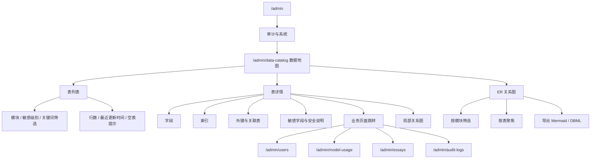

# Admin 数据地图设计方案

## 当前结论

管理员端需要一个“数据地图”模块，用来解释系统核心数据资产、展示表级健康状态，并引导管理员进入正确的业务模块排查问题。

该模块不是数据库客户端，不提供任意 SQL 查询，也不直接暴露所有表的原始数据。它的产品定位是“系统数据说明书 + 业务入口导航”，帮助管理员、产品、运营和开发理解：

- 系统有哪些核心数据表。
- 每张表属于哪个业务模块。
- 每张表保存什么业务对象。
- 表中是否包含敏感字段。
- 当前大概有多少数据。
- 应该跳转到哪个管理员页面继续排查。

当前版本保持只读边界，但已从“表级概览”升级为“自动发现 + 业务增强 + 关系图可视化”模式，不做脱敏样例和自由查询。

## 范围

覆盖：

- 表列表和表详情。
- 自动发现新建表。
- 表中文名、所属模块、业务说明、敏感级别。
- 字段、主键、索引、外键关系。
- ER 关系图、逻辑关系补充和 Mermaid / DBML 导出。
- 近似行数、最近更新时间等表级健康信息。
- 表到管理员业务页面的跳转。
- `super_admin` 或细粒度权限控制。

不覆盖：

- 任意 SQL 查询器。
- 全表数据浏览。
- 密码、token、验证码、密钥等敏感值展示。
- 生产库大表实时 `COUNT(*)`。
- 替代 DataGrip、DBeaver、MySQL Workbench 等工程数据库工具。
- 替代 BI 看板或数据仓库。

## 业务定位

数据地图属于管理员端的“审计与系统”或“数据治理”能力，服务对象包括：

| 角色 | 主要诉求 |
| --- | --- |
| `super_admin` | 了解系统数据资产、定位业务模块、排查数据口径 |
| 产品/运营 | 理解用户、订阅、作文、AI 用量等数据在哪里产生 |
| 开发/维护者 | 快速确认表结构、关联关系和排查入口 |

它解决的是“数据可理解性”和“排查导航”问题，不解决通用数据库管理问题。

## 信息架构



## 页面设计

### 数据地图列表页

路由：`/admin/data-catalog`

定位：快速浏览数据库核心表、理解所属模块和数据健康状态。

首版筛选项：

| 筛选项 | 说明 |
| --- | --- |
| 关键词 | 表名、中文名、说明 |
| 所属模块 | 用户中心、订阅与权益、作文与评测、AI 用量、审计与系统 |
| 敏感级别 | low、medium、high、critical |
| 是否有业务入口 | 全部、有入口、无入口 |

列表字段：

| 字段 | 说明 |
| --- | --- |
| 表名 | 数据库真实表名 |
| 中文名 | 面向管理员的业务名称 |
| 所属模块 | 归属业务域 |
| 状态 | 配置增强 / 自动发现 |
| 行数 | 使用近似行数或缓存行数 |
| 敏感级别 | 表级数据敏感度 |
| 最近更新时间 | 基于配置的时间字段或统计时间 |
| 管理员入口 | 跳转对应业务页面 |

说明：

- 新建表只要已经落到当前数据库，就会自动出现在列表里。
- 未配置 `admin-data-catalog.yml` 的表也会展示，但只显示基础信息。
- 已配置的表会补中文名、模块、敏感级别、说明、入口和安全说明。

### 数据地图详情页

路由：`/admin/data-catalog/:tableName`

定位：解释单张表的字段、关系、安全边界和排查入口。

详情区块：

| 区块 | 内容 |
| --- | --- |
| 表摘要 | 表名、中文名、模块、敏感级别、行数、说明 |
| 字段列表 | 字段名、类型、是否为空、默认值、字段说明、敏感标记 |
| 主键与索引 | 主键、唯一索引、普通索引、索引用途 |
| 关联关系 | 外键、被引用表、业务关系说明 |
| 局部关系图 | 当前表为中心的一跳关系图 |
| 安全说明 | 哪些字段不可展示、哪些字段需要脱敏 |
| 业务入口 | 对应管理员页面、排查建议 |

首版不展示样例行。P4 如果需要脱敏样例，应独立加权限和审计。

### ER 图视图

路由：`/admin/data-catalog?view=graph`

定位：帮助管理员在不进入数据库客户端的情况下，快速理解表与表之间的结构关系和业务关系。

支持：

- 全库关系图
- 按模块查看
- 按表聚焦
- 区分真实外键与逻辑关系
- 导出 Mermaid / DBML

## 数据来源

数据地图由两类数据合并生成。

### 数据库自动元数据

从 MySQL `information_schema` 获取结构信息：

| 来源 | 用途 |
| --- | --- |
| `information_schema.tables` | 表名、近似行数、表注释 |
| `information_schema.columns` | 字段名、字段类型、nullable、默认值、注释 |
| `information_schema.statistics` | 主键、唯一索引、普通索引 |
| `information_schema.key_column_usage` | 外键关系 |

注意：

- 行数优先使用 `information_schema.tables.table_rows` 的近似值。
- 不对大表执行实时 `COUNT(*)`。
- 最近更新时间优先使用人工配置的时间字段；未配置时自动推断 `updated_at`、`occurred_at`、`last_lookup_at`、`created_at` 等常见时间列。

### 人工业务配置

建议首版使用配置文件维护业务语义：

```text
backend/src/main/resources/admin-data-catalog.yml
```

示例：

```yaml
users:
  title: 用户账号
  module: 用户中心
  sensitivity: high
  adminRoute: /admin/users
  timeColumn: updated_at
  description: 存储用户账号基础信息，不展示密码、token、验证码。
  sensitiveColumns:
    - email
    - phone
    - password_hash

ai_token_usage_event:
  title: AI Token 消耗明细
  module: AI 用量
  sensitivity: medium
  adminRoute: /admin/model-usage
  timeColumn: occurred_at
  description: 每次可统计 usage 的 AI 调用明细流水，是 token 对账的明细账本。
  sensitiveColumns:
    - trace_id
```

选择配置文件而不是数据库表的原因：

- 首版迭代快，不新增迁移风险。
- 业务说明可以随代码评审一起变更。
- 对生产库没有写入要求。
- 后续如果需要运营在线维护，再迁移成配置表。

### 逻辑关系配置

除了数据库真实外键外，数据地图还支持通过 `admin-data-catalog.yml` 补充逻辑关系，用于弥补历史表结构中未显式声明外键、但业务上存在稳定从属关系的场景。

例如词典域中：

- `dictionary_entry -> dictionary_sense`
- `dictionary_sense -> dictionary_example`
- `dictionary_entry -> dictionary_pronunciation`
- `user_dictionary_word_state -> dictionary_entry`

逻辑关系只用于管理员端图谱展示和文档导出，不会伪造成数据库真实外键。

## 后端接口

### 表列表

`GET /api/admin/data-catalog/tables`

请求参数：

| 参数 | 类型 | 说明 |
| --- | --- | --- |
| `keyword` | string | 表名、中文名、说明关键词 |
| `module` | string | 所属模块 |
| `sensitivity` | string | 敏感级别 |
| `hasAdminRoute` | boolean | 是否有业务入口 |

响应示例：

```json
{
  "items": [
    {
      "tableName": "ai_token_usage_event",
      "title": "AI Token 消耗明细",
      "module": "AI 用量",
      "rowCount": 8,
      "sensitivity": "medium",
      "latestAt": "2026-05-16 02:52:24",
      "adminRoute": "/admin/model-usage",
      "description": "每次可统计 usage 的 AI 调用明细流水"
    }
  ]
}
```

### 表详情

`GET /api/admin/data-catalog/tables/{tableName}`

### 关系图

`GET /api/admin/data-catalog/graph`

请求参数：

| 参数 | 类型 | 说明 |
| --- | --- | --- |
| `module` | string | 按模块过滤 |
| `tableName` | string | 按单表聚焦 |

### Mermaid 导出

`GET /api/admin/data-catalog/export/mermaid`

### DBML 导出

`GET /api/admin/data-catalog/export/dbml`

响应示例：

```json
{
  "tableName": "users",
  "title": "用户账号",
  "module": "用户中心",
  "sensitivity": "high",
  "rowCount": 1200,
  "adminRoute": "/admin/users",
  "description": "存储用户账号基础信息",
  "columns": [
    {
      "name": "email",
      "type": "varchar(255)",
      "nullable": true,
      "primaryKey": false,
      "sensitive": true,
      "comment": "用户邮箱"
    }
  ],
  "indexes": [],
  "foreignKeys": [],
  "securityNotes": [
    "不展示 password_hash、refresh token、验证码等敏感值"
  ]
}
```

## 权限与安全

首版建议只允许 `super_admin` 查看。

如果后续需要拆权限，可新增：

| 权限 | 用途 |
| --- | --- |
| `admin.data_catalog.read` | 查看数据地图 |
| `admin.data_catalog.sample_read` | 查看脱敏样例 |

安全规则：

- 不提供 SQL 输入框。
- 不提供任意表分页浏览。
- 不返回敏感字段原值。
- 不展示密码 hash、JWT、refresh token、验证码、密钥。
- prompt、作文正文、模型输入输出等大文本字段首版只展示字段说明。
- P4 如果支持脱敏样例，必须限制行数、字段打码，并记录审计日志。

## 与其他模块的关系

| 数据表 | 数据地图说明 | 业务排查入口 |
| --- | --- | --- |
| `users` | 用户账号基础信息 | `/admin/users` |
| `user_subscription` | 用户当前订阅状态 | `/admin/subscriptions` |
| `ai_token_usage_event` | AI token 明细流水 | `/admin/model-usage` |
| `user_ai_token_usage_daily` | Free 用户日额度聚合 | `/admin/subscriptions` |
| `user_ai_token_usage_monthly` | 付费用户月额度聚合 | `/admin/subscriptions` |
| `essay_evaluation` | 作文评测结果 | `/admin/essays` |
| `admin_audit_log` | 管理员操作审计 | `/admin/audit-logs` |

数据地图负责解释和导航，业务模块负责展示可操作的业务数据。

## 分期实施

### P1：数据字典基础版

交付：

- `/admin/data-catalog` 表列表。
- `/admin/data-catalog/:tableName` 表详情。
- 后端读取 `information_schema`。
- 后端合并 `admin-data-catalog.yml` 业务说明。
- 字段、索引、外键、敏感级别展示。
- 业务页面跳转。

### P2：数据健康概览

交付：

- 表行数。
- 最近更新时间。
- 空表提示。
- 核心表缺数据提示。
- 数据统计时间说明。

### P3：排查入口增强

交付：

- 表详情页给出排查建议。
- 核心表跳转对应业务页面并自动带过滤参数。
- 用户、订阅、AI 用量、作文、审计链路互相可达。

### P4：脱敏样例

交付：

- 仅 `super_admin` 或 `admin.data_catalog.sample_read` 可见。
- 每张表最多展示 5-10 行。
- 敏感字段打码或隐藏。
- 大文本字段截断。
- 打开样例写入审计日志。

## 验收标准

P1 完成后应满足：

- 管理员能看到核心表列表。
- 每张表有中文名、所属模块、敏感级别和业务说明。
- 管理员能查看字段、主键、索引、外键。
- 敏感字段被明确标记。
- 能从表跳到对应管理员业务页面。
- 后端不返回敏感字段原值。
- 页面没有任意 SQL 输入能力。
- 不对大表执行实时 `COUNT(*)`。

## 设计取舍

不做数据库客户端的原因：

- 权限和审计边界复杂。
- 容易泄露敏感数据。
- 任意查询可能拖慢生产数据库。
- 业务管理员通常需要业务解释，而不是原始表数据。

采用“自动元数据 + 人工业务说明”的原因：

- 表结构变化可以自动反映。
- 中文业务含义和敏感级别可控。
- 首版不增加数据库迁移。
- 后续可以平滑扩展为数据治理中心。
