# Admin 后台体验改造

## 当前结论

`/admin` 后台按主流 SaaS 管理员端改造，定位为运营治理优先的业务后台，用于管理用户、订阅权益、作文评测、内容资产和项目治理能力。

首版采用“运营工作台 + 资源模块”的信息架构。Dashboard 负责发现问题和进入高频任务；用户、订阅、作文、内容资产、AI 与 Agent、审计系统按运营处理路径分组。AI 调试能力保留为后台支持入口，不替代业务管理员端主线。

用户中心的后续演进采用“用户索引页 + 用户摘要抽屉 + 用户 360 详情页 + 独立业务模块反查”的结构，详见 [Admin 用户中心设计方案](./user-center-design.md)。

BI 分析后台作为 `/admin` 下的独立数据分析模块演进，不塞进用户中心或普通 Dashboard。首版采用“固定指标看板 + Mock 数据 + API 契约预留”的前端先行方案，详见 [Admin BI 分析后台前端方案](./bi-analytics-design.md)。

当前分支已实现的后台壳、用户中心、订阅与权益、Agent Debug 和 BI 骨架状态，统一记录在 [当前管理员端产品说明与设计方案](./current-admin-product-design.md)。该文档用于区分“已经可用的能力”和“基于视觉稿继续补齐的目标形态”。

## 范围

覆盖：

- Dashboard：业务健康、待处理事项、关键指标和快捷入口。
- 用户运营：用户列表、用户详情、账号状态、管理员角色、用户画像摘要。
- 订阅与权益：订阅状态、套餐、兑换码、额度、权益变更记录。
- 作文与评测：作文列表、评测详情、任务状态、异常排查、评分结果查看。
- 内容资产：题库、Rubric、Prompt、素材、评分配置。
- AI 与 Agent：Agent Debug Center、模型用量、Prompt 调试入口。
- 审计与系统：管理员操作日志、权限可见性、系统配置入口。
- 数据分析：增长、活跃、订阅、写作、AI 用量、漏斗和导出任务。

不覆盖：

- 重写用户端 `/app`。
- 立即重做全部后端 admin API。
- 首期引入新的前端框架、组件库或状态层。
- 在业务后台内嵌 Langfuse、DeepEval 或第三方控制台。
- 首期实现自由拖拽 BI、自定义 SQL 查询或完整数据仓库。

## 设计原则

1. 以运营任务为主线，而不是按数据库表堆菜单。
2. 信息密度高、视觉克制，优先表格、筛选、详情页、抽屉、状态标签。
3. 所有资源列表使用统一结构：筛选区、批量操作区、表格、分页、空状态、错误状态。
4. 所有资源详情使用统一结构：标题区、关键状态、标签页、侧栏元信息、危险操作确认。
5. 权限只影响可见入口和操作按钮，后端仍必须执行权限校验。
6. Agent 调试、模型用量、审计日志属于排查支持能力，不抢占运营主流程。

## 信息架构

```mermaid
flowchart TB
  ADMIN["/admin"] --> DASHBOARD["总览 Dashboard"]
  ADMIN --> USERS["用户运营"]
  ADMIN --> SUBSCRIPTION["订阅与权益"]
  ADMIN --> WRITING["作文与评测"]
  ADMIN --> CONTENT["内容资产"]
  ADMIN --> AI["AI 与 Agent"]
  ADMIN --> SYSTEM["审计与系统"]
  ADMIN --> ANALYTICS["数据分析 BI"]

  USERS --> USER_LIST["用户列表"]
  USERS --> USER_DETAIL["用户详情"]

  SUBSCRIPTION --> SUB_USERS["订阅用户"]
  SUBSCRIPTION --> REDEEM["兑换码"]
  SUBSCRIPTION --> QUOTA["额度与权益"]

  WRITING --> ESSAYS["作文列表"]
  WRITING --> EVAL_DETAIL["评测详情"]
  WRITING --> TASKS["评测任务"]

  CONTENT --> PROMPTS["题库"]
  CONTENT --> RUBRICS["Rubric"]
  CONTENT --> PROMPT_ASSETS["Prompt"]
  CONTENT --> MATERIALS["素材"]
  CONTENT --> SCORING_CONFIG["评分配置"]

  AI --> AGENT_DEBUG["Agent Debug"]
  AI --> MODEL_USAGE["模型用量"]
  AI --> PROMPT_DEBUG["Prompt 调试"]

  SYSTEM --> AUDIT["审计日志"]
  SYSTEM --> ADMIN_USERS["管理员权限"]
  SYSTEM --> SETTINGS["系统配置"]

  ANALYTICS --> ANALYTICS_OVERVIEW["BI 总览"]
  ANALYTICS --> ANALYTICS_USERS["用户分析"]
  ANALYTICS --> ANALYTICS_SUBS["订阅分析"]
  ANALYTICS --> ANALYTICS_WRITING["写作分析"]
  ANALYTICS --> ANALYTICS_AI["AI 用量"]
  ANALYTICS --> ANALYTICS_FUNNEL["转化漏斗"]
```

## 导航结构

左侧导航固定分组：

| 分组 | 菜单 | 路由建议 | 说明 |
| --- | --- | --- | --- |
| 总览 | Dashboard | `/admin/dashboard` | 运营概览和待处理任务 |
| 用户运营 | 用户 | `/admin/users` | 用户搜索、状态治理、画像、订阅和额度摘要 |
| 订阅与权益 | 订阅用户 | `/admin/subscriptions` | 订阅状态、套餐、到期、异常 |
| 订阅与权益 | 兑换码 | `/admin/subscription/redeem-codes` | 生成和追踪兑换码 |
| 作文与评测 | 作文排查 | `/admin/essays` | 作文、评测结果、异步任务状态 |
| 内容资产 | 题库 | `/admin/prompts` | 真题、作文题、素材化题目 |
| 内容资产 | Rubric | `/admin/rubrics` | 评分维度、版本、激活状态 |
| 内容资产 | Prompt | `/admin/prompt-assets` | 业务 Prompt、版本、启停 |
| 内容资产 | 素材 | `/admin/materials` | 写作素材、范文、表达库 |
| 内容资产 | 评分配置 | `/admin/scoring-config` | 模式、分值、规则映射 |
| AI 与 Agent | Agent Debug | `/ops/agent/runs` | Agent run 列表和详情 |
| AI 与 Agent | 模型用量 | `/admin/model-usage` | token、成本、模型分布 |
| 数据分析 | BI 总览 | `/admin/analytics` | 固定指标看板，首版可接 Mock |
| 数据分析 | 用户分析 | `/admin/analytics/users` | 增长、活跃、留存、学段分布 |
| 数据分析 | 订阅分析 | `/admin/analytics/subscriptions` | 转化、套餐、额度消耗 |
| 数据分析 | 写作分析 | `/admin/analytics/writing` | 作文提交、评分完成率、分数分布 |
| 数据分析 | AI 用量 | `/admin/analytics/ai-usage` | 模型、token、失败率、成本估算 |
| 数据分析 | 转化漏斗 | `/admin/analytics/funnel` | 注册到订阅漏斗 |
| 审计与系统 | 审计日志 | `/admin/audit-logs` | 管理员操作追踪 |
| 审计与系统 | 管理员权限 | `/admin/admin-users` | 角色和权限分配 |

当前已有路由优先复用：`/admin/users`、`/admin/essays`、`/admin/prompts`、`/admin/rubrics`、`/admin/audit-logs`。新模块首期可以先做空状态或只读列表，不阻塞已有能力。

## 页面骨架

### 全局布局

- 左侧：240-260px 固定导航，按分组折叠；显示当前管理员、角色、返回主站入口。
- 顶部：当前页面标题、面包屑、全局搜索、时间范围、刷新、账号菜单。
- 主内容：最大化可用宽度，适配大表格；移动端折叠导航。
- 状态系统：统一使用 `success`、`warning`、`danger`、`neutral`、`info` 五类状态标签。

### 列表页

列表页统一结构：

1. 页面标题和一句用途说明。
2. 筛选栏：关键词、状态、时间范围、业务类型、负责人或角色。
3. 操作栏：刷新、导出、创建、批量操作。
4. 表格：关键字段优先，长文本截断，行点击进入详情。
5. 分页：统一 page / size / total。
6. 空状态和错误状态：说明原因，并提供可执行动作。

### 详情页

详情页统一结构：

1. 标题区：资源名称、ID、状态、关键操作。
2. 摘要卡：只放高价值字段，不直接堆 JSON。
3. 标签页：概览、记录、配置、关联资源、审计。
4. 右侧元信息：创建时间、更新时间、负责人、权限、来源。
5. 危险操作：禁用、删除、激活、覆盖配置必须二次确认，并写审计日志。

## 核心模块设计

### Dashboard

Dashboard 是运营入口，不是装饰性数据大屏。

首屏模块：

- 今日关键指标：新增用户、活跃用户、订阅新增、写作提交、评测失败率、模型成本。
- 待处理事项：异常评测任务、待审核内容、即将到期订阅、近期高频错误。
- 快捷入口：用户搜索、作文排查、新建题目、Rubric 管理、Agent Debug。
- 趋势区：用户增长、订阅转化、写作提交、模型 usage。

### 用户运营

用户列表支持按关键词、状态、学段、注册来源、账号角色、管理员角色、订阅套餐、订阅状态、是否超额、注册时间和最近活跃时间筛选。

用户详情按运营视角组织：

- 账号信息：邮箱、手机号、昵称、状态、注册来源、最近活跃。
- 学习信息：学段、写作提交、最近评测、能力画像摘要。
- 权益信息：当前套餐、订阅状态、额度周期、已用额度、剩余额度、是否超额和到期时间。
- 治理操作：禁用 / 启用、管理员角色、备注。
- 关联记录：作文、订阅、审计。

### 订阅与权益

订阅模块用于管理付费和权益，不与用户详情重复。

首期页面：

- 订阅与用户运营概览：总用户、今日新增用户、今日新增订阅、普通用户、订阅用户、7 日订阅转化率和 Free / Basic / Pro / Premium 订阅等级分布。当前已接入 `/api/admin/subscriptions/overview`。
- 用户分层列表：按全部用户、普通用户、订阅用户、已过期、已超额切换；展示套餐、额度周期、已用额度和剩余额度。当前已接入 `/api/admin/subscriptions`。
- 每日用户数据：按天查看新增用户、新增订阅、转化率、普通/订阅用户规模和 token 消耗。当前已接入 `/api/admin/subscriptions/daily-stats`。
- 额度规则管理：Free 每日额度、Basic / Pro / Premium 月额度。当前已接入 `/api/admin/subscription/quota-rules`。
- 兑换码管理：创建批次、查看兑换状态、停用异常码。
- 权益流水：额度增加、扣减、过期、手工调整。

### 作文与评测

作文排查用于定位评分和任务问题。

列表字段：

- 评测 ID、用户、模式、题目摘要、作文摘要、分数、任务状态、创建时间、错误标记。

详情页：

- 作文原文、题目、评分结果、任务状态、requestId、模型输出摘要、关联 Agent run。
- JSON 原始数据默认折叠，排查时可展开复制。

### 内容资产

内容资产是教研和运营共同维护区。

分为：

- 题库：作文题、考试年份、学段、来源、启用状态。
- Rubric：评分维度、版本、适用模式、激活状态。
- Prompt：业务 Prompt key、版本、适用 workflow、启停和灰度。
- 素材：范文、表达库、主题素材、标签。
- 评分配置：分值映射、模式配置、评分口径。

内容资产必须支持版本意识。首期不做复杂发布流，但至少在界面上区分 `draft`、`active`、`archived`。

### AI 与 Agent

AI 与 Agent 是排查和质量治理入口。

首期包括：

- Agent Debug：从 `/ops/agent/runs` 进入 run 列表和详情。
- 模型用量：按模型、workflow、日期统计 token 和成本。
- Prompt 调试：查看 Prompt snapshot、prompt key、版本和 hash。

它可以复用 `docs/ai-debug/` 的能力设计，但路由和导航应合并到 `/admin` 下，避免业务后台和 AI 调试后台割裂。

### 数据分析

数据分析模块用于固定 BI 看板，不替代用户中心和业务排查模块。

首期页面：

- BI 总览：新增用户、活跃用户、订阅新增、作文提交、AI token、失败率和异常提醒。
- 用户分析：增长、活跃、留存、学段分布和用户分群。
- 订阅分析：订阅转化、套餐分布、额度消耗、即将到期和超额用户。
- 写作分析：作文提交、评分完成率、分数分布、失败任务和高使用题目。
- AI 用量：模型分布、token 趋势、workflow 分布、失败原因和成本估算。
- 转化漏斗：注册、完善学段、首篇作文、完成评分、订阅。

首版允许使用 Mock 数据完成前端原型和交互，但 DTO 和 API 层必须按真实接口形态设计，后续逐块接入聚合接口。

### 审计与系统

审计日志记录管理员关键操作：

- 用户状态变更。
- 管理员角色变更。
- 题库、Rubric、Prompt、评分配置变更。
- 兑换码生成和停用。
- Debug JSON 下载。

系统配置首期只作为入口，不急于实现复杂配置中心。

## 权限模型

复用现有角色：

| 角色 | 主要能力 |
| --- | --- |
| `super_admin` | 全部模块和角色管理 |
| `support_admin` | 用户、作文排查、订阅只读或有限操作 |
| `content_admin` | 题库、Rubric、Prompt、素材、评分配置 |

本地开发种子账号由 `backend/src/main/resources/db/seed_admin_accounts.sql` 维护：

| 账号 | 角色 | 初始密码 |
| --- | --- | --- |
| `superadmin@peai.local` | `super_admin` | `Admin123!` |
| `supportadmin@peai.local` | `support_admin` | `Admin123!` |
| `contentadmin@peai.local` | `content_admin` | `Admin123!` |
| `admin01@admin.com` | `super_admin` | `Kiss497.*` |
| `admin02@admin.com` | `super_admin` | `Kiss497.*` |
| `admin03@admin.com` | `super_admin` | `Kiss497.*` |

如果本地数据库已有旧账号，重新执行该脚本会刷新密码 hash、邮箱验证状态、管理员角色和基础 profile。

建议补充权限：

| 权限 | 用途 |
| --- | --- |
| `admin.dashboard.read` | 查看 Dashboard |
| `admin.subscription.read` | 查看订阅和权益 |
| `admin.subscription.write` | 创建兑换码、调整权益 |
| `admin.assets.read` | 查看内容资产 |
| `admin.assets.write` | 编辑题库、素材、Prompt |
| `admin.scoring_config.write` | 修改评分配置 |
| `admin.agent_debug.read` | 查看 Agent run |
| `admin.agent_debug.export` | 导出 debug JSON |
| `admin.model_usage.read` | 查看模型用量 |
| `admin.analytics.read` | 查看 BI 看板 |
| `admin.analytics.export` | 导出 BI 数据 |
| `admin.analytics.cost.read` | 查看成本估算 |

前端根据权限裁剪导航和按钮；后端仍必须在 controller 或 service 层执行权限校验。

## 视觉规范

后台视觉应偏主流 SaaS 管理工具：

- 背景使用浅灰或白色，不使用大面积渐变和装饰图形。
- 卡片半径控制在 8px 左右，避免圆润营销感。
- 表格、筛选、状态标签、详情页是主要 UI。
- 主色建议使用稳定的蓝绿或中性蓝，危险操作使用红色。
- 字号克制：页面标题 20-24px，卡片标题 16-18px，表格 13-14px。
- 操作按钮区分主按钮、次按钮、危险按钮；危险按钮必须二次确认。

## 分期落地

### P0：统一后台壳和导航

- 重构 `AdminLayout` 的导航分组、顶部栏、面包屑和权限可见性。
- 保留已有用户、作文、题库、Rubric、审计页面。
- Dashboard 改为运营工作台结构，mock 数据集中管理。

### P1：补齐运营核心模块

- 订阅与权益列表、兑换码管理入口。
- 内容资产统一入口，Prompt、素材、评分配置先做列表和空状态。
- 作文详情补充任务状态和 Agent run 关联入口。

### P2：质量治理和技术排查

- Agent Debug 接入真实 run。
- 模型用量接真实聚合接口。
- Prompt 调试和 eval case 进入后台。

### P3：BI 前端先行和逐块接入

- 新增 `/admin/analytics` 数据分析分组。
- 使用 Mock 数据完成 BI 总览、用户、订阅、写作、AI 用量和漏斗页面。
- 抽象统一筛选器、KPI 卡、图表面板和数据表组件。
- 优先复用现有订阅、用户、作文、审计接口。
- 指标稳定后新增聚合接口和快照能力。

## 验收标准

- `/admin` 左侧导航按方案 A 分组展示。
- 管理员进入 Dashboard 后能看到运营指标、待处理事项和快捷入口。
- 现有用户、作文、题库、Rubric、审计页面仍可访问。
- 没有权限的模块不展示入口，有权限但暂无实现的模块展示明确空状态。
- 列表页和详情页遵循统一结构。
- BI 页面可以先使用 Mock 数据，但必须显示数据来源并通过统一 API 层获取。
- 危险操作有二次确认，关键操作写审计日志。
- `web` 构建通过。
- 文档站构建通过。
