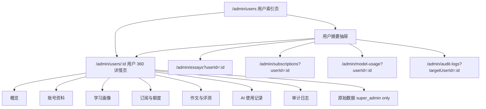
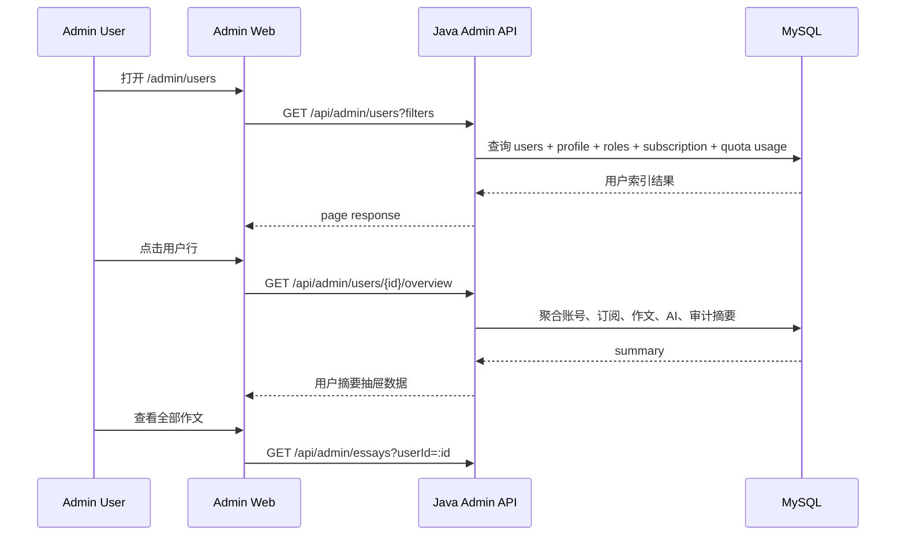

# Admin 用户中心设计方案

## 当前结论

Admin 用户能力不应做成数据库全字段镜像，也不应把作文、订阅、AI 用量和审计日志全部堆进 `/admin/users` 横向表格。

推荐采用“用户中心 + 用户摘要抽屉 + 用户 360 详情页 + 独立业务模块反查”的结构：

- `/admin/users` 是用户索引页，负责快速找人和判断用户状态。
- 用户行点击先打开摘要抽屉，满足高频轻量排查。
- `/admin/users/:id` 是用户 360 详情页，用标签页组织账号、学习、订阅、作文、AI 和审计信息。
- 作文、订阅、AI 用量、审计仍保留独立模块，并支持按 `userId` 过滤。

这套结构的目标是让管理员端替代日常 SQL 查询，而不是变成另一个数据库客户端。

## 范围

覆盖：

- 用户列表的信息边界和筛选方式。
- 用户摘要抽屉的信息结构。
- 用户 360 详情页的标签页拆分。
- 作文、订阅、AI 用量、审计模块与用户中心的跳转关系。
- 后端 API 拆分建议。
- 权限、安全和审计原则。
- 分阶段实施计划和验收标准。

不覆盖：

- 一次性展示 `users` 表及所有关联表的全部字段。
- 管理员端直接执行任意 SQL。
- 在用户列表中内嵌完整作文、完整 AI 请求日志或完整审计日志。
- 绕过现有 Admin 权限体系新增排查接口。

## 设计原则

1. 用户列表是入口，不是数据库表格。
2. 详情页聚合用户画像，但业务明细仍归各自模块。
3. 高频信息前置，低频和高风险信息下钻。
4. 所有跨模块入口必须能带 `userId` 过滤。
5. 敏感字段默认不展示，必要时只给 `super_admin` 且写审计。
6. 后端接口保持业务口径，不把 SQL 口径泄露给前端。

## 视觉稿补充结论

当前视觉稿确认了用户中心的落地形态：左侧是固定 Admin 导航，中间是轻量用户列表，右侧是用户摘要抽屉，深度排查进入用户 360 详情页。

后续实现不应把视觉稿理解为“把所有字段塞进一个页面”。它表达的是三层信息密度：

| 层级 | 页面 | 信息密度 | 主要任务 |
| --- | --- | --- | --- |
| L1 | `/admin/users` 用户列表 | 轻 | 快速筛选、扫描用户状态、判断是否需要下钻 |
| L2 | 用户摘要抽屉 | 中 | 不离开列表上下文，快速确认订阅、作文、AI 和审计摘要 |
| L3 | `/admin/users/:id` 用户 360 详情 | 深 | 聚合单用户全链路数据，支持治理和跨模块排查 |

视觉稿中的“列表轻、抽屉快、详情深、模块独立”应作为用户中心后续开发的验收口径。

## 信息架构



## 页面一：用户索引页

路由：`/admin/users`

定位：快速找人、判断账号和权益状态、进入详情或摘要抽屉。

### 筛选区

第一版筛选项：

| 筛选项 | 说明 |
| --- | --- |
| 关键词 | 邮箱、手机号、昵称 |
| 用户 ID | 精确查找用户 |
| 状态 | active、disabled |
| 学段 | ielts、toefl、postgrad、kaoyan、gaokao 等 |
| 账号角色 | user、admin |
| 管理员角色 | super_admin、support_admin、content_admin |
| 当前套餐 | free、basic、pro、premium |
| 订阅状态 | free、active、expired |
| 是否超额 | 全部、已超额 |
| 注册时间 | createdFrom、createdTo |
| 最近活跃 | lastActiveFrom、lastActiveTo |

### 列表字段

用户列表只展示摘要字段：

| 分组 | 字段 |
| --- | --- |
| 身份 | ID、昵称、邮箱、手机号 |
| 状态 | 用户状态、学段 |
| 角色 | 账号角色、管理员角色 |
| 权益 | 当前套餐、订阅状态、额度周期 |
| 用量 | 已用额度、额度上限、剩余额度、是否超额 |
| 时间 | 注册时间、最近活跃 |

不放入列表：

- 完整作文内容。
- 完整评分 JSON。
- AI 请求 payload。
- refresh token、JWT、验证码。
- 密码 hash。
- 审计日志明细。
- 数据库连接信息。

### 线框

```text
+--------------------------------------------------------------------------+
| 用户中心                                                   查询  重置     |
+--------------------------------------------------------------------------+
| keyword | userId | status | stage | role | adminRole | plan | subStatus |
| overLimit | createdFrom | createdTo | activeFrom | activeTo              |
+--------------------------------------------------------------------------+
| ID | 用户 | 状态/学段 | 角色 | 订阅 | 额度 | 注册时间 | 最近活跃 | 操作 |
| 43 | New Postgrad Learner | active/postgrad | user/- | Free/free | ... |
| 36 | Basic Active Today   | active/postgrad | user/- | Basic/active | ... |
+--------------------------------------------------------------------------+
| 上一页                                  第 1 页 / 共 N 条          下一页 |
+--------------------------------------------------------------------------+
```

点击行的默认行为：打开用户摘要抽屉。  
点击“完整详情”：进入 `/admin/users/:id`。

### 交互补充

用户索引页的默认交互按视觉稿执行：

1. 点击用户行打开右侧摘要抽屉，不直接离开列表页。
2. 行内“查看详情”进入 `/admin/users/:id`。
3. 筛选区点击“查询”后重置到第一页。
4. 点击“重置”清空筛选并重新加载列表。
5. 抽屉关闭后保留当前筛选、分页和表格滚动上下文。
6. 空筛选项不传给后端，日期筛选转换为当天开始和结束时间。

列表页必须覆盖以下状态：

| 状态 | 展示要求 |
| --- | --- |
| 加载中 | 表格区域显示加载态，保留筛选区可见 |
| 空结果 | 说明当前筛选无匹配用户，提供重置筛选动作 |
| 接口失败 | 显示错误提示和重试动作 |
| 权限不足 | 隐藏入口或显示无权限说明，不发起无意义请求 |
| 字段缺失 | 使用 `-` 或空状态文案，不显示 `null`、`undefined` |

## 页面二：用户摘要抽屉

触发方式：用户索引页点击行。

定位：高频轻量排查，不离开列表上下文。

### 抽屉内容

| 区块 | 内容 |
| --- | --- |
| 账号摘要 | ID、昵称、邮箱、手机号、状态、学段、角色 |
| 订阅摘要 | 当前套餐、订阅状态、到期时间、是否超额 |
| 额度摘要 | 已用、上限、剩余、周期 |
| 作文摘要 | 最近 3 篇作文、最近评分、异常任务数 |
| AI 摘要 | 今日 token、本月 token、最近失败请求 |
| 审计摘要 | 最近 5 条管理员操作 |
| 快捷入口 | 完整详情、查看作文、查看订阅、查看 AI 用量、查看审计 |

### 抽屉数据契约

建议新增聚合接口：

`GET /api/admin/users/{userId}/overview`

第一版响应建议：

```json
{
  "account": {
    "id": 1003,
    "nickname": "Admin 03",
    "email": "admin03@admin.com",
    "phoneMasked": "138****0021",
    "status": "active",
    "studyStage": "ielts",
    "role": "admin",
    "adminRoles": ["super_admin"],
    "lastActiveAt": "2026-05-16 14:22:10"
  },
  "subscription": {
    "planCode": "free",
    "planName": "Free",
    "subscriptionStatus": "active",
    "quotaPeriod": "daily",
    "tokenUsed": 0,
    "tokenLimit": 10000,
    "tokenRemaining": 10000,
    "overLimit": false
  },
  "writing": {
    "recentEvaluations": [
      {
        "evaluationId": 1001,
        "score": 78,
        "status": "completed",
        "createdAt": "2026-05-16 14:10:00"
      }
    ]
  },
  "aiUsage": {
    "todayTokens": 1200,
    "monthTokens": 18400,
    "recentFailedRequests": 0
  },
  "audit": {
    "recentLogs": [
      {
        "createdAt": "2026-05-16 14:22:10",
        "adminName": "system",
        "action": "UPDATE_USER_STATUS"
      }
    ]
  },
  "quickLinks": {
    "detail": "/admin/users/1003",
    "essays": "/admin/essays?userId=1003",
    "subscriptions": "/admin/subscriptions?userId=1003",
    "aiUsage": "/admin/model-usage?userId=1003",
    "auditLogs": "/admin/audit-logs?targetUserId=1003"
  }
}
```

接口要求：

- 只返回摘要，不返回完整作文正文、完整 prompt、密码 hash、token 或验证码。
- `phoneMasked` 默认脱敏；如需完整手机号必须单独权限和审计。
- 任一业务摘要查询失败时，不应导致整个抽屉不可用；前端应能显示局部错误或空状态。
- `quickLinks` 可以由前端生成，但后端字段口径必须支持这些跳转筛选。

### 线框

```text
页面右侧抽屉
+----------------------------------+
| Admin 03                    X    |
| admin03@admin.com                |
| active / ielts / super_admin     |
+----------------------------------+
| 订阅与额度                       |
| Free / free / daily              |
| 0 / 10,000  剩余 10,000          |
+----------------------------------+
| 最近作文                         |
| - 作文 #1001  78分  completed    |
| - 作文 #998   72分  completed    |
+----------------------------------+
| AI 使用                           |
| 今日 1,200 tokens                |
| 最近失败 0                       |
+----------------------------------+
| 审计日志                         |
| 2026-05-16 UPDATE_USER_STATUS    |
+----------------------------------+
| 完整详情 | 作文 | 订阅 | AI | 审计 |
+----------------------------------+
```

## 页面三：用户 360 详情页

路由：`/admin/users/:id`

定位：深度排查和治理单个用户。

视觉稿中的 360 详情页由四部分组成：

1. 顶部返回区和面包屑。
2. 用户身份摘要和关键指标卡。
3. 标签页导航。
4. 标签页内的数据卡片和业务明细表。

详情页首屏必须让管理员不用滚动就能看到用户身份、账号状态、当前权益、额度使用、写作活跃、AI 使用和治理记录摘要。

### 标签页结构

| Tab | 用途 |
| --- | --- |
| 概览 | 用户关键状态、订阅、额度、作文、AI、审计摘要 |
| 账号资料 | 基础账号字段、登录信息、注册来源、状态治理 |
| 学习画像 | 学段、能力画像、样本数、最近评测摘要 |
| 订阅与额度 | 当前套餐、用量、到期、额度规则、权益流水入口 |
| 作文与评测 | 用户作文列表、评分记录、任务状态、异常入口 |
| AI 使用记录 | token、模型、请求时间、失败原因 |
| 审计日志 | 管理员对该用户的操作 |
| 原始数据 | 仅 `super_admin`，脱敏展示排查字段 |

### 详情页分期边界

| 阶段 | 交付范围 | 说明 |
| --- | --- | --- |
| P1 | 顶部用户摘要、关键指标卡、概览、账号资料、订阅与额度 | 对齐视觉稿主结构，先形成 360 详情页骨架 |
| P2 | 作文与评测、AI 使用记录、审计日志 | 接入真实列表或复用独立模块查询接口 |
| P3 | 原始数据、导出数据、更多操作 | 仅 `super_admin` 或细粒度权限可见，必须写审计 |

当前已实现的 `/admin/users/:id` 仍是基础详情页，后续需要按上表演进为标签页结构。

### 概览 Tab

展示卡片：

- 账号状态：active / disabled、注册时间、最近活跃。
- 当前权益：套餐、订阅状态、到期时间。
- 额度使用：已用、上限、剩余、是否超额。
- 写作活跃：作文总数、最近作文时间、平均分。
- AI 使用：今日 token、本月 token、最近失败。
- 治理记录：最近管理员操作。

### 账号资料 Tab

展示：

- ID。
- 邮箱。
- 手机号。
- 昵称。
- 头像。
- 用户状态。
- 注册来源。
- 账号角色。
- 管理员角色。
- 创建时间。
- 最近活跃。

允许操作：

- 启用 / 禁用用户。
- 修改管理员角色。
- 添加备注。

所有写操作必须写审计日志。

### 学习画像 Tab

展示：

- 学段。
- AI 模式。
- 能力画像维度。
- 样本数。
- 画像置信度。
- 最近更新时间。
- 最近评测摘要。

不在这里展示完整作文正文。完整作文进入作文与评测 Tab 或 `/admin/essays`。

### 订阅与额度 Tab

展示：

- 当前套餐。
- 订阅状态。
- 当前周期开始和结束。
- 额度周期。
- 已用额度。
- 额度上限。
- 剩余额度。
- 是否超额。
- 最近权益变更。
- 跳转到 `/admin/subscriptions?userId=:id`。

### 作文与评测 Tab

展示该用户的作文列表摘要：

- 评测 ID。
- 模式。
- 题目摘要。
- 分数。
- 任务状态。
- 创建时间。
- 错误状态。

点击作文进入 `/admin/essays/:evaluationId`。  
列表也可以跳到 `/admin/essays?userId=:id`。

### AI 使用记录 Tab

展示：

- 请求时间。
- 模型。
- provider。
- prompt tokens。
- completion tokens。
- total tokens。
- 成功 / 失败。
- 失败原因。
- traceId 或 requestId。

高风险字段例如 prompt 原文、用户完整输入，应默认折叠并按权限控制。

### 审计日志 Tab

展示：

- 操作时间。
- 管理员。
- action。
- resourceType。
- resourceId。
- before / after 摘要。
- IP。
- userAgent。

### 原始数据 Tab

仅 `super_admin` 可见。

用途：工程排障时查看脱敏后的原始字段摘要。

规则：

- 不展示密码 hash。
- 不展示 token。
- 不展示验证码。
- 不展示数据库连接信息。
- 打开该 Tab 也应写审计或访问日志。

## 视觉组件规范

用户中心应复用 Admin 后台统一视觉语言，避免每个页面重新定义样式。

| 组件 | 规范 |
| --- | --- |
| 左侧导航 | 深色固定导航，当前项高亮，分组和图标稳定 |
| 页面标题区 | 标题 + 面包屑 + 右侧操作，避免大面积说明文案 |
| 筛选栏 | 多行紧凑布局，字段 label 清晰，按钮固定在右上角或右侧 |
| 表格 | 行高紧凑，长文本截断，关键字段上下两行展示 |
| 状态标签 | `active` 用绿色，`disabled/failed` 用红色，角色和学段用中性或蓝色 |
| 额度进度 | 使用细进度条表达已用比例，超额使用红色 |
| 摘要抽屉 | 宽度约 360-420px，右侧滑入，卡片分区，不阻塞列表筛选上下文 |
| 详情页卡片 | 卡片半径约 8px，模块编号可用于视觉稿中的“1/2/3”区块 |
| Tabs | 概览、账号资料、学习画像、订阅与额度、作文与评测、AI 使用记录、审计日志、原始数据 |
| 空状态 | 说明当前模块暂无数据，并提供可执行跳转或重试 |

详情页不使用营销式 hero、不使用装饰渐变、不使用过大的标题字号。后台视觉应服务扫描、比较和排查。

## 操作、导出与审计

视觉稿中的“导出数据”和“更多”属于高风险操作入口，必须先定义权限和审计边界。

| 操作 | 权限建议 | 审计要求 | 首版范围 |
| --- | --- | --- | --- |
| 导出用户摘要 | `admin.users.read` + `admin.users.export` | 写入导出审计 | 只导出当前用户脱敏摘要 |
| 修改用户状态 | `admin.users.write` | 写入 before / after | 启用、禁用 |
| 修改管理员角色 | `super_admin` | 写入 before / after | 角色全量覆盖 |
| 查看原始数据 | `super_admin` | 写入访问审计 | 脱敏字段摘要 |
| 查看 AI 原始输入 | `admin.agent_debug.read` 或更细权限 | 写入访问审计 | 默认折叠，敏感字段脱敏 |

首版导出不包含：

- 密码 hash。
- JWT、refresh token。
- 邮箱验证码、短信验证码。
- 完整 prompt。
- 完整作文正文。
- 数据库连接信息。

## 独立业务模块

用户中心不替代业务模块。各模块必须支持按用户反查。

| 模块 | 路由 | 用户反查方式 |
| --- | --- | --- |
| 作文排查 | `/admin/essays` | `/admin/essays?userId=:id` |
| 订阅与额度 | `/admin/subscriptions` | `/admin/subscriptions?userId=:id` |
| 模型用量 | `/admin/model-usage` | `/admin/model-usage?userId=:id` |
| 审计日志 | `/admin/audit-logs` | `/admin/audit-logs?targetUserId=:id` |

## API 设计建议

### 用户索引

`GET /api/admin/users`

返回轻量列表字段，用于索引页。

### 用户基础详情

`GET /api/admin/users/{userId}`

返回基础账号信息和已有详情字段。

### 用户 360 概览

`GET /api/admin/users/{userId}/overview`

建议返回：

```json
{
  "account": {},
  "subscription": {},
  "quota": {},
  "writing": {},
  "aiUsage": {},
  "audit": {}
}
```

### 用户作文摘要

优先复用：

`GET /api/admin/essays?userId={userId}`

如需要详情页更轻量的摘要接口，再增加：

`GET /api/admin/users/{userId}/essays`

### 用户订阅摘要

优先复用：

`GET /api/admin/subscriptions?userId={userId}`

如需要单用户详情接口，再增加：

`GET /api/admin/users/{userId}/subscription`

### 用户 AI 用量

`GET /api/admin/users/{userId}/ai-usage`

第一版可只返回聚合和最近记录。

### 用户审计日志

优先复用：

`GET /api/admin/audit-logs?targetUserId={userId}`

## 数据流



## 权限与安全

权限建议：

| 能力 | 权限 |
| --- | --- |
| 查看用户列表 | `admin.users.read` |
| 查看用户详情 | `admin.users.read` |
| 查看用户 AI 用量 | `admin.ai.read` 或 `admin.users.read` 加细粒度校验 |
| 查看用户审计 | `admin.audit.read` |
| 修改用户状态 | `admin.users.write` |
| 修改管理员角色 | `super_admin` |
| 查看原始数据 | `super_admin` |

安全规则：

- 不返回密码 hash。
- 不返回 refresh token。
- 不返回 JWT。
- 不返回邮箱验证码、短信验证码。
- 不返回数据库连接信息。
- 高风险字段按权限和场景折叠展示。
- 写操作必须进入 `admin_audit_log`。
- 原始数据访问建议记录访问日志。

## 实施阶段

### 阶段 1：稳定用户索引页

目标：

- `/admin/users` 支持用户资产核心筛选。
- 表格字段收敛为高频摘要。
- 不继续无限横向加列。

交付：

- 用户列表字段和筛选稳定。
- API 文档同步。
- 后端和前端测试覆盖。

### 阶段 2：摘要抽屉

目标：

- 点击用户行先打开抽屉。
- 展示账号、订阅、额度、作文、AI、审计摘要。
- 提供跳转入口。

交付：

- `GET /api/admin/users/{userId}/overview` 或等效聚合接口。
- 用户摘要抽屉组件。
- 快捷跳转链接。

### 阶段 3：用户 360 详情页

目标：

- `/admin/users/:id` 改为标签页结构。
- 把账号、学习、订阅、作文、AI、审计分区。

交付：

- Tab 页面。
- 各区块空状态和错误状态。
- 权限控制。

### 阶段 4：业务模块反查

目标：

- 作文、订阅、模型用量、审计都支持从 `userId` 反查。

交付：

- `/admin/essays?userId=:id`。
- `/admin/subscriptions?userId=:id`。
- `/admin/model-usage?userId=:id`。
- `/admin/audit-logs?targetUserId=:id`。

### 阶段 5：原始数据和高级排障

目标：

- 给 `super_admin` 提供脱敏原始数据视图。
- 用于工程排障，不作为日常运营入口。

交付：

- 原始数据 Tab。
- 敏感字段屏蔽。
- 访问审计。

## 验收标准

- `/admin/users` 可以按用户核心属性快速定位用户。
- 用户列表不展示敏感凭证和完整业务明细。
- 点击用户可以快速查看摘要抽屉。
- 用户 360 详情页按标签页拆分，不堆长页面。
- 作文、订阅、AI、审计模块都支持按用户反查。
- 用户详情页能跳转到对应业务模块并自动带上用户筛选。
- 写操作均写入管理员审计日志。
- 文档、API 类型、后端测试、前端测试同步更新。

## 取舍说明

不采用“所有字段塞进用户列表”的原因：

- 表格过宽，运营扫描效率低。
- SQL 复杂度和页面加载成本高。
- 敏感字段更容易误暴露。
- 作文、AI 请求和审计日志有独立生命周期，不适合成为用户列表字段。

采用“列表轻、抽屉快、详情深、模块独立”的原因：

- 高频任务路径短。
- 深度排查有完整上下文。
- 各业务模块边界清晰。
- 后续扩展不会持续污染用户列表。
