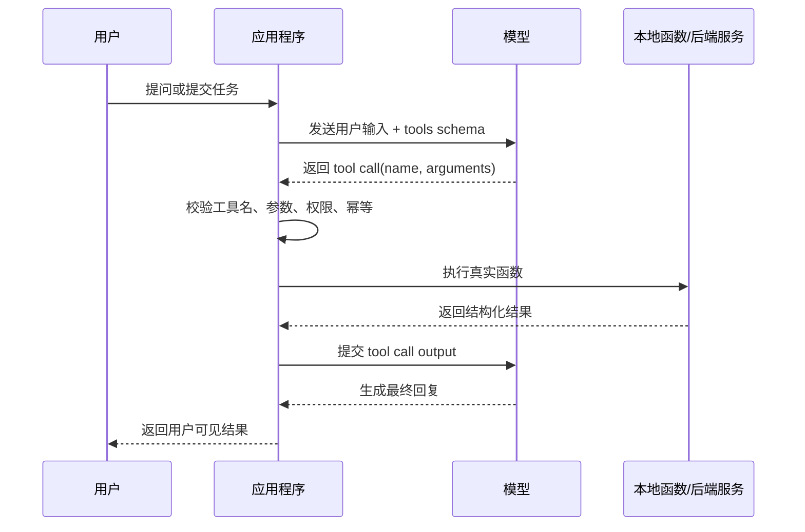
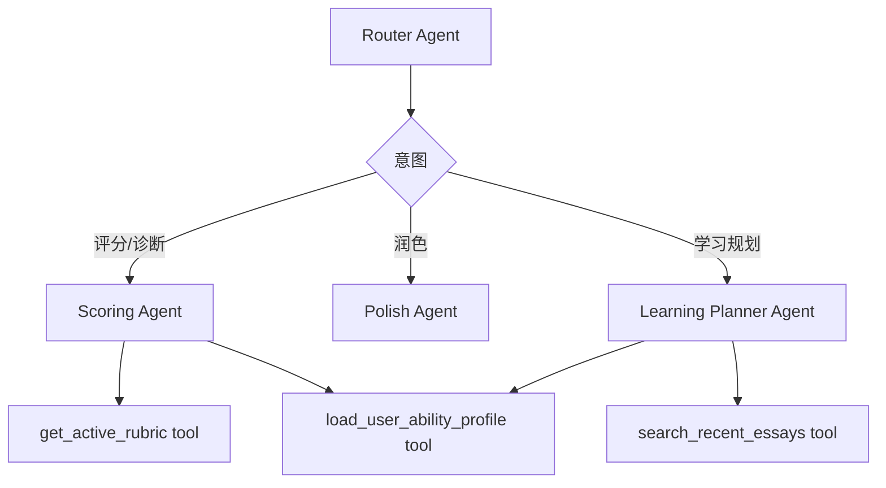

# Function Call 学习笔记

## 当前结论

Function call，也常被称为 tool calling，本质是让模型在需要外部数据或外部动作时，按开发者提供的工具 schema 生成一次结构化调用请求。应用程序负责执行真实函数，并把函数结果返回给模型，模型再基于结果继续生成最终回复。

在 PEAI 中，function call 不应该被理解成“让模型直接操作系统”，而应该被理解成一种受控接口：

- 模型只负责判断是否需要工具，以及生成符合 schema 的参数。
- 应用程序负责鉴权、校验、执行、幂等、错误处理和审计。
- 工具边界应该围绕业务对象设计，例如 rubric、作文、用户画像、语法事件、历史对话和写作任务元数据。
- 对有副作用的工具，必须显式说明副作用、权限、幂等策略和失败恢复方式。

## 学习目标

读完本文后，应该能回答以下问题：

- Function call 和普通 LLM 回复有什么区别。
- Function call 在 Responses API、Chat Completions 和 Agents SDK 中分别长什么样。
- 什么时候应该把能力做成 function tool，什么时候应该交给 Agent、workflow 或后端 service。
- 如何为 PEAI 设计一个可验证、可维护、低风险的 function tool。
- 如何测试 function tool 的 schema、参数校验、错误路径和业务副作用。

## 核心概念

| 概念 | 说明 |
| --- | --- |
| Tool / Function | 应用程序暴露给模型的能力，例如查询 rubric、读取用户画像、保存语法学习事件。 |
| Tool schema | 工具输入参数的 JSON Schema 或 SDK 自动生成的 schema。 |
| Tool call | 模型发出的调用请求，包含工具名和参数。 |
| Tool call output | 应用程序执行函数后返回给模型的结果。 |
| Final response | 模型拿到工具结果后，面向用户生成的最终回复。 |

Function call 的关键价值是让模型从“只会生成文本”变成“能通过受控接口使用系统能力”。但真实业务动作永远由应用代码执行，不由模型直接执行。

## 基本调用链



## Responses API 与 Chat Completions 的差异

OpenAI 文档中目前同时能看到 Responses API 和 Chat Completions 的 function calling 写法。学习时要区分两种消息结构，避免混用。

| 维度 | Responses API | Chat Completions |
| --- | --- | --- |
| 模型返回工具调用 | `response.output` 中出现 `type: "function_call"` 的 item | `message.tool_calls` |
| 工具调用 ID | `call_id` | `tool_call.id` |
| 返回工具结果 | 追加 `type: "function_call_output"`，并带上 `call_id` | 追加 `role: "tool"` 消息，并带上 `tool_call_id` |
| 当前建议 | 新功能优先学习 Responses API 和 Agents SDK 的工具模型 | 维护旧链路时仍需理解 |

PEAI 的 Python Agent 侧应优先沿用 OpenAI Agents SDK 的抽象，由 SDK 管理运行、工具、handoff 和 session。除非要维护历史接口，不要在新功能里手写一套通用 function call runtime。

## Agents SDK 中的 function tool

在 OpenAI Agents SDK 中，可以用 `@function_tool` 把 Python 函数暴露为 Agent 可调用的工具。SDK 会根据函数签名、类型标注和 docstring 自动生成工具名称、描述和参数 schema。

最小示例：

```python
from agents import Agent, Runner, function_tool


@function_tool
def get_active_rubric(stage: str, task_type: str) -> str:
    """Get the active writing rubric for a study stage and task type.

    Args:
        stage: Study stage, such as cet4, cet6, postgrad.
        task_type: Writing task type, such as essay or chart.
    """
    return "rubric text"


agent = Agent(
    name="Writing Coach",
    instructions="Use tools only when rubric details are needed.",
    tools=[get_active_rubric],
)
```

学习重点不是语法本身，而是工具契约：

- 函数名要表达业务动作，不要叫 `handle`、`process`、`do_task`。
- docstring 要说明何时使用，不只是复述函数名。
- 参数要少而明确，优先使用枚举、布尔值和结构化对象。
- 返回值要利于模型继续推理，避免返回过长、无结构、混杂日志的文本。
- 工具内部要做权限、参数、超时、异常和审计处理。

## PEAI 中适合做成 function tool 的能力

| 工具候选 | 输入 | 输出 | 是否有副作用 | 适合原因 |
| --- | --- | --- | --- | --- |
| `get_active_rubric` | `stage`, `taskType` | 当前评分规则摘要 | 否 | Agent 评分、解释、学习建议都需要 rubric。 |
| `load_user_ability_profile` | `userId`, `stage` | 用户能力画像 | 否 | 学习规划和能力解读需要用户上下文。 |
| `search_recent_essays` | `userId`, `limit`, `stage` | 最近作文摘要 | 否 | 用于个性化反馈和复盘。 |
| `record_grammar_learning_events` | `userId`, `events[]` | 写入结果 | 是 | 把 Agent 反馈沉淀为学习资产。 |
| `get_writing_task_metadata` | `docId` | 题目、学段、考试类型、字数要求 | 否 | 写作教练需要理解当前写作任务。 |
| `save_agent_debug_snapshot` | `runId`, `steps`, `usage` | 调试记录 ID | 是 | 便于 Agent 调试中心回放和排障。 |

不建议做成 function tool 的内容：

- 单纯文本润色：更适合作为 Specialist Agent 的主能力。
- 大段 prompt 拼接：应放在 prompt resolver 或 workflow 中。
- 复杂业务事务：应放在后端 service，tool 只作为受控入口。
- 无明确输入输出的“万能查询工具”：容易扩大权限和上下文污染。

## Function tool 与 handoff 的边界

| 场景 | 优先选择 |
| --- | --- |
| 需要查询数据、写入业务状态、调用确定性能力 | Function tool |
| 需要切换到另一个专业 Agent 继续推理 | Handoff |
| 需要固定多步骤业务链路 | Workflow |
| 需要让一个 Agent 作为另一个 Agent 的可调用能力，但不转移对话控制权 | Agent as tool |

在 PEAI 的学习助手中，一个典型组合可以是：



这里 Router Agent 负责路由，Specialist Agent 负责专业生成，function tool 负责读取或写入受控业务数据。

## Schema 设计原则

### 1. 参数少而稳定

优先：

```json
{
  "stage": "postgrad",
  "taskType": "essay"
}
```

避免：

```json
{
  "query": "帮我查一下考研作文评分规则，最好也看看用户情况"
}
```

自由文本参数会把问题重新丢回模型，降低可验证性。

### 2. 用枚举约束业务范围

例如：

```python
from typing import Literal


Stage = Literal["cet4", "cet6", "postgrad", "general"]
```

枚举能减少模型生成不存在业务值的概率，也能让测试更明确。

### 3. 区分读取工具和写入工具

读取工具可以相对宽松；写入工具必须更严格：

- 必须有用户身份来源。
- 必须有幂等键或去重规则。
- 必须记录 traceId/runId。
- 必须明确失败后是否可重试。

### 4. 返回结构化、短内容

工具返回给模型的内容不是给用户看的最终 UI，不应该塞入过长 Markdown。更适合返回：

```json
{
  "rubricId": 12,
  "stage": "postgrad",
  "maxScore": 20,
  "dimensions": [
    {"name": "content", "weight": 0.35},
    {"name": "structure", "weight": 0.25},
    {"name": "language", "weight": 0.40}
  ]
}
```

## 错误处理

Function tool 的失败不要直接暴露底层异常。建议统一为结构化结果：

```json
{
  "ok": false,
  "code": "RUBRIC_NOT_FOUND",
  "message": "未找到当前学段的评分规则",
  "retryable": false
}
```

错误处理原则：

- 参数非法：返回明确错误，不让模型猜。
- 权限不足：不要泄露资源是否存在。
- 外部服务超时：标记 `retryable`。
- 写入失败：说明是否已产生部分副作用。
- 工具内部异常：记录日志和 traceId，给模型短错误。

## 安全边界

Function call 会让模型影响真实系统，因此必须限制能力范围。

| 风险 | 控制方式 |
| --- | --- |
| 越权读取用户数据 | 工具从认证上下文取 `userId`，不要信任模型传入的用户 ID。 |
| 非预期写入 | 写入工具加入权限、幂等键和审计日志。 |
| Prompt 注入诱导工具滥用 | 工具执行前做服务端校验，不让模型决定权限。 |
| 参数幻觉 | 使用枚举、必填字段、Pydantic 校验和失败返回。 |
| 工具结果过长 | 限制返回字段和最大长度，必要时分页或摘要。 |

## 测试清单

新增 function tool 时，至少覆盖以下测试：

- Schema 测试：函数参数、必填字段、枚举值是否符合预期。
- 正常路径：给定合法输入，返回稳定结构。
- 参数错误：缺字段、非法枚举、空字符串。
- 权限错误：不能访问其他用户资源。
- 外部依赖失败：数据库失败、HTTP 超时、模型调用失败。
- 幂等测试：同一个写入请求重复调用不会生成重复数据。
- Agent 调用测试：Agent 能在合适场景选择工具，并能利用工具结果生成最终回复。

建议测试命令：

```powershell
cd python/ai_orchestrator
python -m pytest tests
```

如工具会调用后端接口，还应补充后端 service 或 controller 测试：

```powershell
cd backend
.\mvnw.cmd test
```

## 常见反模式

- 把所有能力都塞进一个 `execute_action` 工具。
- 让模型传 `userId`、`role`、`permission` 等安全敏感字段。
- 工具返回整篇数据库记录或大段日志。
- 工具名只有技术含义，没有业务语义。
- 写入工具没有幂等和审计。
- Agent prompt 里写了工具规则，但工具服务端没有校验。
- 为了让模型“更自由”，故意把参数设计成单个 `query`。

## PEAI 学习路线

建议按下面顺序学习：

1. 先理解 tool calling 的基本循环：模型请求工具，应用执行工具，模型基于结果继续回复。
2. 再理解 Responses API 和 Chat Completions 的消息结构差异。
3. 学习 Agents SDK 的 `@function_tool`，重点看自动 schema、docstring、错误处理和 timeout。
4. 回到 PEAI，挑一个只读工具练手，例如 `get_active_rubric`。
5. 再实现一个有副作用的工具，例如 `record_grammar_learning_events`，重点练幂等、权限和审计。
6. 最后把工具接入 Specialist Agent，并补 Agent 选择工具的测试。

## 相关资料

- OpenAI Function Calling 指南：https://platform.openai.com/docs/guides/function-calling
- OpenAI Tools 指南：https://platform.openai.com/docs/guides/tools
- OpenAI Responses API 参考：https://platform.openai.com/docs/api-reference/responses
- OpenAI Agents SDK Tools：https://openai.github.io/openai-agents-python/tools/
- OpenAI Agents SDK Agent 概念：https://openai.github.io/openai-agents-python/agents/
