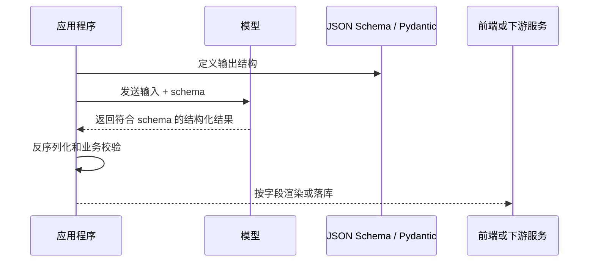
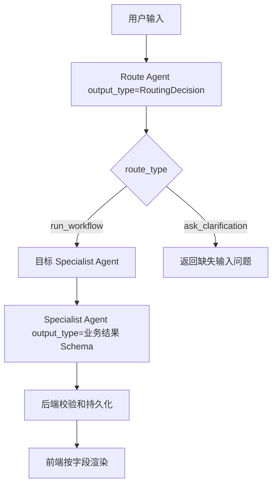

# Structured Output 学习笔记

## 当前结论

Structured Outputs 是让模型输出严格匹配开发者定义 schema 的机制。它解决的是“模型最终回复要稳定可解析”的问题，不等同于 function call。

在 PEAI 中，Structured Output 最适合用于以下场景：

- 路由 Agent 输出 `intent`、`route_type`、`target_agent`、`confidence` 等决策字段。
- 写作评分 Agent 输出分数、维度、错误列表、建议和下一步行动。
- 语法/词汇采集输出可落库的事件结构。
- Agent 调试中心记录 run metadata、steps、usage、routingDecision。
- 前端需要按字段渲染 UI，而不是解析一段自然语言。

原则上：

- 如果模型是在“调用系统能力”，优先看 function/tool calling。
- 如果模型是在“给应用返回结构化结果”，优先看 Structured Outputs。
- 如果 Structured Output 会进入数据库、前端状态或跨服务接口，应先定义 Pydantic/DTO/schema，再写 prompt。

## Structured Output 解决什么问题

普通 LLM 输出适合给人阅读，但不适合直接给程序消费。常见问题包括：

- 漏掉必填字段。
- 枚举值写错。
- JSON 格式合法但字段结构不符合预期。
- 数字、数组、对象层级不稳定。
- 前端或后端需要写大量兜底解析逻辑。

Structured Outputs 的价值是把输出约束到 schema 上，让应用可以用类型、字段和枚举来消费模型结果，而不是靠字符串猜测。

## 官方页面中文导读

OpenAI 官方页面的核心意思可以理解成一句话：你给模型一个 JSON Schema，模型会尽量让输出严格贴合这个 schema，这样程序就不需要从自然语言里猜字段。

官方页面重点讲了三件事：

1. 为什么需要 Structured Outputs：让模型输出更可靠，减少字段缺失、枚举幻觉和格式不稳定。
2. 怎么使用 Structured Outputs：可以用于普通结构化回复，也可以用于 function calling 的参数约束。
3. 支持哪些 JSON Schema 特性和限制：不是完整 JSON Schema 全集，写 schema 时要遵守一组约束。

### 两种典型使用方式

官方页面把 Structured Outputs 放在两个入口里理解：

| 使用方式 | 解决的问题 | PEAI 示例 |
| --- | --- | --- |
| 结构化模型回复 | 模型最终回复必须符合 schema | 路由结果、作文评分结果、语法事件抽取结果 |
| Function calling 参数 | 模型调用工具时，参数必须符合工具 schema | `get_active_rubric(stage, taskType)`、`record_grammar_learning_events(events)` |

也就是说，Structured Outputs 不只是“返回 JSON”，它也会影响工具调用参数的可靠性。

### 官方示例的中文理解

官方文档常用“数学题分步解答”说明结构化输出。它想表达的是：

- 不要让模型随意写一段答案。
- 先定义结构，例如 `steps` 和 `final_answer`。
- 每个 `step` 里再定义 `explanation` 和 `output`。
- 模型输出时就必须按这个结构填。

换成 PEAI 的作文评分，就是：

```json
{
  "total_score": 16,
  "max_score": 20,
  "summary": "文章观点清晰，但论证细节不足。",
  "dimensions": [
    {
      "name": "content",
      "score": 6,
      "max_score": 8,
      "comment": "内容完整，但例证偏少。"
    }
  ],
  "next_actions": ["补充一个具体例子", "优化结尾句"]
}
```

前端可以直接读取 `total_score`、`dimensions`、`next_actions`，不需要从一段中文点评里正则提取分数。

### 支持的 schema 类型

官方页面说明 Structured Outputs 支持常用 JSON Schema 类型。学习时先记住这些就够了：

| 类型 | 用途 |
| --- | --- |
| `string` | 文本，例如总结、理由、建议 |
| `number` | 小数，例如评分 |
| `integer` | 整数，例如数量、排序 |
| `boolean` | 是否类字段 |
| `object` | 结构体，例如评分结果 |
| `array` | 列表，例如错误列表、行动建议 |
| `enum` | 固定选项，例如 intent、severity |
| `anyOf` | 多种可能结构，但不能放在根节点 |

PEAI 中最常用的是 `object`、`array`、`string`、`number`、`enum`。

### 官方限制的中文解释

Structured Outputs 不是完整 JSON Schema 引擎，它有一些实用限制：

| 限制 | 中文理解 | PEAI 建议 |
| --- | --- | --- |
| 根节点必须是 object | 最外层不要直接是数组、字符串或 `anyOf` | 所有输出都包成一个对象，例如 `{ "items": [] }` |
| 所有字段都要 required | 不要靠省略字段表示没有值 | 可选语义用 `null` 或空数组表达 |
| object 必须设置 `additionalProperties: false` | 不允许模型额外发明 schema 外字段 | 每个对象层级都显式写 |
| 嵌套深度和属性数量有限制 | schema 不能无限复杂 | 控制层级，必要时拆成多个 schema |
| enum 数量有限制 | 不适合把大词库塞进 enum | enum 只放稳定业务状态 |
| 部分 JSON Schema 关键字不支持 | 不能把所有校验都交给模型 | 复杂校验放应用代码里 |

这也是为什么项目里应该先设计业务 DTO/Pydantic 模型，再生成或维护 schema，而不是随手写一大段 JSON Schema。

### 拒绝和不完整输出

Structured Outputs 能约束正常输出，但不能绕过安全策略。如果用户请求触发安全拒绝，模型可能返回拒绝信息，而不是你的业务 schema。

另外，如果生成被截断、超出 token、请求中断，也可能拿不到完整结构。所以应用层仍然要处理：

- 拒绝响应。
- 输出不完整。
- SDK 解析异常。
- schema 合法但业务含义不合格。

PEAI 的做法应该是：记录 `runId`、`traceId`、模型名、schema 名称和失败原因，然后给前端一个明确错误状态，不要让前端继续解析半截数据。

### 字段顺序

官方文档还提到一个实用细节：模型输出字段通常会按照 schema 中定义的 key 顺序出现。

这对人类阅读和调试有帮助。建议 PEAI 的 schema 字段顺序按“从总到细”组织：

1. `summary`
2. `score` / `decision`
3. `dimensions` / `items`
4. `issues`
5. `next_actions`
6. `metadata`

这样日志、调试中心和前端预览都会更清晰。

## 和 JSON mode 的区别

| 能力 | JSON mode | Structured Outputs |
| --- | --- | --- |
| 保证输出是 JSON | 是 | 是 |
| 保证符合指定 schema | 否 | 是 |
| 适合场景 | 旧模型或简单 JSON 输出 | 新功能、稳定接口、前端渲染、落库 |
| 仍需业务校验 | 是 | 是 |

JSON mode 只能保证“像 JSON”，不能保证字段完整、枚举正确或数组元素结构稳定。新功能能用 Structured Outputs 时，应优先使用 Structured Outputs。

## 和 Function Call 的区别

| 维度 | Structured Outputs | Function Call |
| --- | --- | --- |
| 目标 | 约束模型最终输出结构 | 让模型请求调用应用工具 |
| 谁执行动作 | 模型只生成结构化回复 | 应用程序执行真实函数 |
| 典型用途 | 路由结果、评分结果、前端 UI 数据、抽取结果 | 查数据库、写状态、调用外部 API、保存事件 |
| PEAI 示例 | `RoutingDecision`、`WritingEvaluationResult` | `get_active_rubric`、`record_grammar_learning_events` |

简单判断：

- “我要模型按格式回答我” -> Structured Outputs。
- “我要模型决定是否调用系统能力” -> Function Call。
- “我要 Agent 先查数据再输出稳定结构” -> Function Call + Structured Outputs 组合。

## 基本调用链



## Responses API 中的使用方式

Responses API 中，结构化输出通过 `text.format` 指定 JSON Schema。概念上是告诉模型：最终文本输出必须匹配这个 schema。

示意结构：

```python
from openai import OpenAI

client = OpenAI()

response = client.responses.create(
    model="gpt-5.4-mini",
    input="分析这篇作文的主要问题。",
    text={
        "format": {
            "type": "json_schema",
            "name": "writing_feedback",
            "strict": True,
            "schema": {
                "type": "object",
                "properties": {
                    "summary": {"type": "string"},
                    "priority": {
                        "type": "string",
                        "enum": ["grammar", "structure", "vocabulary", "content"]
                    },
                    "actions": {
                        "type": "array",
                        "items": {"type": "string"}
                    }
                },
                "required": ["summary", "priority", "actions"],
                "additionalProperties": False
            }
        }
    },
)
```

项目中如果直接使用 OpenAI API，应优先让 schema 从代码类型生成，避免“代码类型”和“手写 JSON Schema”慢慢分叉。

## Chat Completions 中的使用方式

Chat Completions 中常见方式是使用 SDK 的解析 helper 或 `response_format`。学习时重点理解两点：

- `response_format` 适合约束模型最终回复。
- function calling 的参数 schema 适合约束工具调用参数。

这两个都属于 schema 约束，但一个约束“回复”，一个约束“调用工具的参数”。

## Agents SDK 中的 `output_type`

OpenAI Agents SDK 中，Agent 默认输出普通文本。如果希望 Agent 输出结构化对象，可以给 Agent 设置 `output_type`。官方 SDK 文档说明：传入 `output_type` 后，Agent 会使用 Structured Outputs，而不是普通文本回复。

典型写法：

```python
from pydantic import BaseModel, Field
from agents import Agent, Runner


class RouteDecision(BaseModel):
    intent: str = Field(description="用户意图")
    target_agent: str = Field(description="目标 Agent 名称")
    confidence: float = Field(description="0 到 1 的置信度")
    reason: str = Field(description="简短路由理由")


route_agent = Agent(
    name="Route Agent",
    instructions="根据用户输入选择最合适的写作学习 Agent。",
    output_type=RouteDecision,
)

result = await Runner.run(route_agent, "帮我润色这段作文")
decision = result.final_output
```

在 PEAI 中，这类结构适合放在 `python/ai_orchestrator/schemas/` 下，作为 Agent 输出契约，而不是散落在 prompt 或测试里。

## PEAI 推荐落地位置

| 场景 | 推荐 schema | 说明 |
| --- | --- | --- |
| 路由决策 | `RoutingDecision` | intent、route_type、target_agent、missing_inputs、confidence。 |
| 写作评分 | `WritingEvaluationResult` | 总分、维度分、问题、建议、下一步练习。 |
| 续问判断 | `ContinuationDecision` | 是否延续上一轮、目标 intent、续问动作。 |
| 语法学习事件 | `GrammarLearningEventPayload` | 错误类型、原句、修正、解释、学习标签。 |
| Prompt Sheet 生成 | `PromptSheetResult` | 题目、要求、评分标准、素材和输出格式。 |
| Agent Debug | `AssistantRunMetadata` | runId、traceId、agentName、usage、steps。 |

## Schema 设计规则

### 1. 根节点使用 object

Structured Outputs 的根 schema 应设计为对象，不要把根节点直接设计成数组或顶层联合类型。

推荐：

```json
{
  "type": "object",
  "properties": {
    "items": {
      "type": "array",
      "items": {"type": "string"}
    }
  },
  "required": ["items"],
  "additionalProperties": false
}
```

### 2. 所有字段都 required

Structured Outputs 的严格 schema 中，字段应全部列入 `required`。如果业务上允许为空，用 `null` 表达可空，而不是省略字段。

示例：

```json
{
  "type": "object",
  "properties": {
    "next_action": {
      "type": ["string", "null"],
      "description": "没有下一步动作时为 null"
    }
  },
  "required": ["next_action"],
  "additionalProperties": false
}
```

### 3. 对象设置 `additionalProperties: false`

所有对象都应该显式设置 `additionalProperties: false`，避免模型返回 schema 外字段，导致前端或后端误用。

注意：这不是只在根对象写一次就够了。只要 schema 里还有嵌套 object，也应该给对应 object 设置 `additionalProperties: false`。

### 4. 枚举值要稳定

适合枚举的字段：

- `intent`
- `route_type`
- `target_agent`
- `severity`
- `stage`
- `task_type`
- `action_type`

不稳定枚举会造成大量兼容逻辑。新增枚举前先检查前端、后端、测试和文档是否同步。

### 5. 用 `null` 表达可选语义

因为严格 schema 要求字段都在 `required` 中，所以“可选字段”不要省略，而是显式允许 `null`。

推荐：

```json
{
  "target_agent": "Polish Agent",
  "clarifying_question": null
}
```

不推荐：

```json
{
  "target_agent": "Polish Agent"
}
```

第二种会让调用方不知道：是模型忘了返回字段，还是确实没有澄清问题。

### 6. 字段名要面向业务

推荐：

```text
grammar_errors
rewrite_suggestions
missing_inputs
learning_actions
```

避免：

```text
data
result
info
extra
misc
```

泛字段会让 schema 看似灵活，实际会把解析复杂度转移给调用方。

### 7. 不要把业务校验全部塞进 schema

Structured Outputs 管输出结构，不适合承载所有业务校验。

例如作文评分中：

- `total_score` 是 number，可以由 schema 约束。
- `total_score <= max_score` 应由应用代码再校验。
- “评分理由是否充分”应由测试样例或 eval 检查。
- “是否符合考研英语评分标准”应由 prompt、rubric 和人工/自动评估共同保证。

## Prompt 设计注意点

Structured Outputs 不代表 prompt 可以随便写。Schema 约束结构，prompt 仍然负责行为质量。

Prompt 中应该说明：

- 每个字段的业务含义。
- 不确定时如何填值。
- 空数组、null、低置信度的使用规则。
- 不允许编造的字段来源。
- 输出要服务哪个下游流程。

例如路由 Agent：

```text
你只负责路由决策，不生成教学内容。
当用户请求缺少必要输入时，route_type 使用 "ask_clarification"。
missing_inputs 必须列出缺失字段；没有缺失时返回空数组。
confidence 低于 0.6 时优先 ask_clarification。
```

## 错误和拒绝处理

Structured Outputs 仍然要处理边界情况：

- 模型基于安全策略拒绝回答。
- 用户输入和 schema 目标完全不匹配。
- 输出符合 schema，但业务判断错误。
- schema 太复杂导致请求失败。
- SDK 解析失败或运行时抛出模型行为错误。

应用层建议统一处理：

```python
try:
    result = await Runner.run(agent, user_input)
    payload = result.final_output
except Exception as exc:
    # 记录 traceId/runId、输入规模、schema 名称、模型名
    raise
```

不要只因为用了 Structured Outputs 就删除业务校验。它保证结构，不保证业务事实永远正确。

## 和 PEAI Agent 编排的组合方式

推荐组合：



这条链路里有两个结构化输出点：

- Route Agent 输出路由决策。
- Specialist Agent 输出业务结果。

这样做的好处是：路由、执行、展示、调试都能按字段记录和测试。

## 适合 PEAI 的练习任务

### 练习 1：路由输出

定义：

```python
class RoutingDecision(BaseModel):
    intent: Literal["polish", "scoring", "translation", "vocab", "learning_planner"]
    route_type: Literal["run_workflow", "ask_clarification", "reject"]
    target_agent: str | None
    missing_inputs: list[str]
    confidence: float
    reason: str
```

练习目标：

- 用户说“帮我润色这段话”时输出 `polish`。
- 用户说“给我制定计划”但没有学段时输出 `ask_clarification`。
- `missing_inputs` 不要省略，用空数组表示没有缺失。

### 练习 2：作文评分输出

定义：

```python
class WritingScoreDimension(BaseModel):
    name: str
    score: float
    max_score: float
    comment: str


class WritingEvaluationResult(BaseModel):
    total_score: float
    max_score: float
    summary: str
    dimensions: list[WritingScoreDimension]
    priority_issues: list[str]
    next_actions: list[str]
```

练习目标：

- 让评分结果稳定给前端渲染。
- 每个维度都有分数和解释。
- `priority_issues` 控制在 3 条以内。

### 练习 3：语法学习事件

定义：

```python
class GrammarLearningEvent(BaseModel):
    original: str
    correction: str
    error_type: str
    explanation: str
    tags: list[str]
```

练习目标：

- 从 Agent 回复中抽取可落库的语法学习事件。
- 保持 tags 可枚举，不要生成无限开放标签。

## 测试清单

新增 Structured Output 时至少测试：

- Schema 是否能被 SDK 接受。
- 正常输入是否能解析成 Pydantic 对象。
- 空输入、缺上下文、跨语言输入的输出是否合理。
- 枚举值是否只出现允许值。
- 空数组和 null 是否按约定出现。
- 前端或后端消费字段是否兼容。
- Agent trace 中是否能看到 schema 名称、runId 和模型信息。

建议命令：

```powershell
cd python/ai_orchestrator
python -m pytest tests
```

如果 schema 会被后端 DTO 或前端类型消费，还要补充：

```powershell
cd backend
.\mvnw.cmd test

cd web
npm run build
```

## 常见反模式

- 只在 prompt 里说“请输出 JSON”，但没有 schema。
- schema 字段过宽，比如 `result: string` 承载所有内容。
- schema 过深，导致维护和模型生成都变难。
- 前端直接依赖模型自然语言，而不是结构字段。
- 把业务可选字段省略掉，而不是显式使用 `null`。
- Route Agent 同时输出路由决策和大段教学内容。
- 写了 Pydantic 类型，但没有测试解析失败路径。

## 和现有文档的关系

- [Function Call 学习笔记](./FunctionCall学习笔记.md)：学习模型如何请求调用工具。
- [OpenAI Agents SDK 中文学习笔记](./OpenAI Agents SDK中文学习笔记.md)：学习 Agents SDK 的 Agent、Runner、tool、handoff、session 等概念。
- [学习助手 Agent 编排架构](./学习助手Agent编排架构.md)：看 PEAI 当前 Agent 编排和字段字典。
- [助手输出格式](../ai/assistant-output-format.md)：看用户可见回复格式和前端展示要求。

## 相关资料

- OpenAI 结构化输出指南：https://platform.openai.com/docs/guides/structured-outputs
- OpenAI 函数调用指南：https://platform.openai.com/docs/guides/function-calling
- OpenAI Agents SDK Agent 基础概念：https://openai.github.io/openai-agents-python/agents/
- OpenAI Agents SDK Agent 输出类型参考：https://openai.github.io/openai-agents-python/ref/agent_output/
