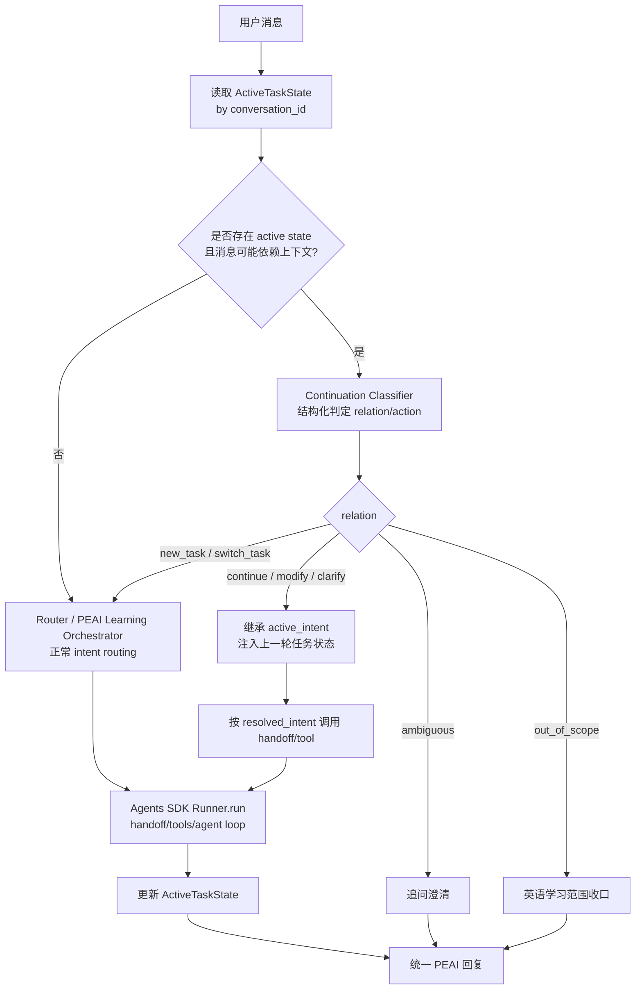
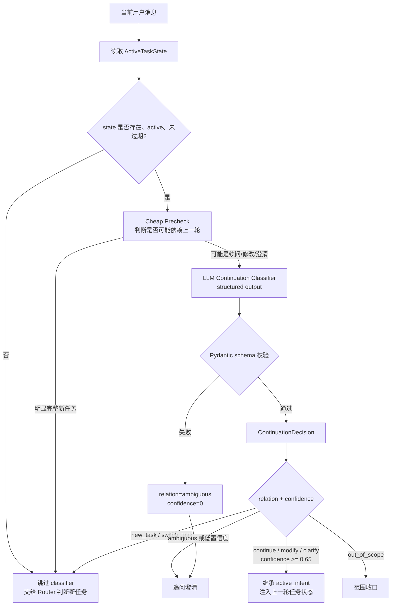
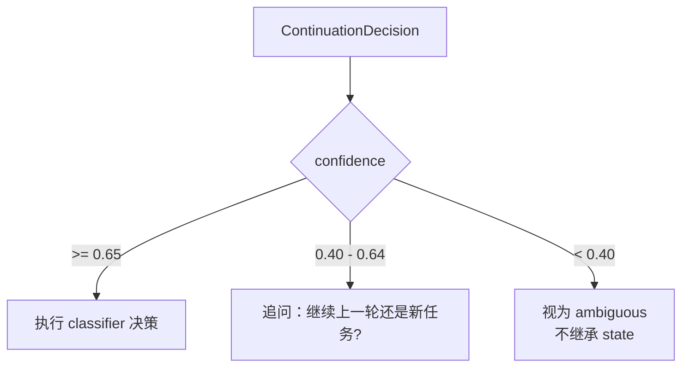
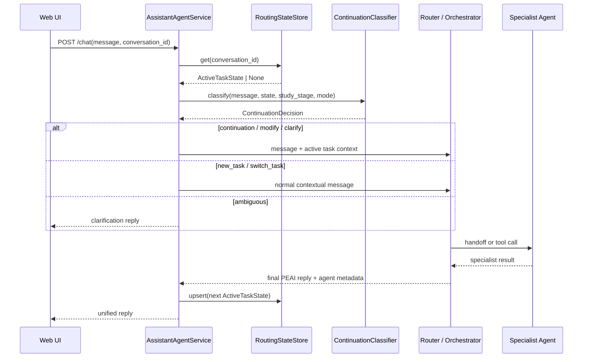
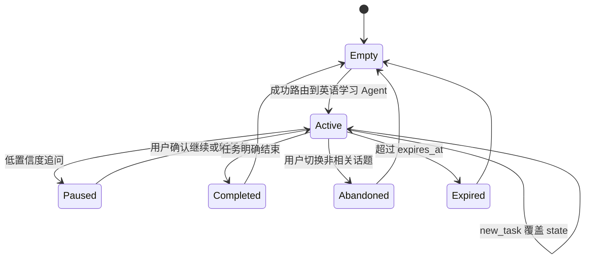

# Active Task State 与续问判定设计

## 背景

学习助手当前已经使用 OpenAI Agents SDK 的 `SQLiteSession` 保存完整对话历史。Session 能让下一轮模型看到上一轮自然语言内容，但它不维护业务层状态，例如：

- 上一轮任务的标准 intent 是什么
- 上一轮由哪个专职 Agent 完成
- 当前用户短句是否在延续上一轮任务
- 续问应该继承哪个 intent

因此用户先问“你可以给我规划一下如何学好英语作文？”，再问“还有其他方案吗？”时，系统可能把第二句当成孤立轻量问题，而不是继续调用 `Learning Planner Agent`。

本设计用结构化 `ActiveTaskState` 和 LLM `ContinuationClassifier` 解决这个问题，避免在 Router prompt 里不断补充“还有吗 / 继续 / 换一种”等枚举规则。

## 目标

- 稳定识别新任务、续问、修改上一轮输出、澄清上一轮内容和切换任务。
- 让续问继承上一轮 `active_intent`，而不是重新猜 intent。
- 保持 Router/Orchestrator 的职责边界：classifier 只做内部判定，不面向用户输出，不替代专职 Agent。
- 提供可观测日志、状态生命周期和回归测试集。

不做：

- 不把 active task state 做成长期用户画像。
- 不保存完整学习记录。
- 不新增自治 capability agent。
- 不让 classifier 生成最终学习内容。

## 总体流程



## 分层职责

| 层 | 职责 | 不负责 |
| --- | --- | --- |
| SDK Session | 保存完整对话历史，给模型提供历史上下文 | 业务 intent 继承、任务生命周期 |
| ActiveTaskState | 保存当前会话正在进行的结构化任务状态 | 长期画像、完整学习记录 |
| ContinuationClassifier | 判断当前消息与 active task 的关系 | 生成最终回复、调用专职 Agent |
| Router / Orchestrator | 新任务 intent routing、多工具编排、统一汇总 | 穷举所有续问表达 |
| Capability Agents | 完成具体英语学习能力 | 全局任务状态管理 |

## ActiveTaskState 数据结构

```python
class ActiveTaskState(BaseModel):
    conversation_id: str
    active_intent: RoutingIntent
    active_agent: str

    task_title: str
    task_summary: str
    user_goal: str | None = None

    last_user_message: str
    last_assistant_summary: str | None = None

    last_output_type: Literal[
        "plan",
        "polished_text",
        "translation",
        "score_feedback",
        "vocab_explanation",
        "sentence_analysis",
        "practice_set",
        "ability_profile",
        "mixed_result",
    ]

    continuation_capabilities: set[Literal[
        "more_options",
        "expand_detail",
        "simplify",
        "make_harder",
        "rewrite_variant",
        "continue_sequence",
        "compare_options",
        "generate_practice",
    ]]

    status: Literal["active", "paused", "completed", "abandoned"] = "active"
    turn_id: str
    updated_at: datetime
    expires_at: datetime | None = None
```

示例：

```json
{
  "conversation_id": "conv-1",
  "active_intent": "learning_planner",
  "active_agent": "Learning Planner Agent",
  "task_title": "英语作文学习规划",
  "task_summary": "用户想获得学好英语作文的可执行学习方案",
  "user_goal": "提高英语作文能力",
  "last_user_message": "你可以给我规划一下如何学好英语作文？",
  "last_assistant_summary": "已给出一个按输入、积累、仿写、修改组成的学习方案",
  "last_output_type": "plan",
  "continuation_capabilities": [
    "more_options",
    "expand_detail",
    "compare_options",
    "generate_practice"
  ],
  "status": "active"
}
```

## 状态判断

状态判断分两步：cheap precheck 和 LLM classifier。



### Cheap Precheck

Cheap precheck 不做最终业务判断，只决定是否值得调用 classifier。

调用 classifier 的条件：

- 存在 `ActiveTaskState`
- state 为 `active`
- state 未过期
- 当前消息短、指代明显，或包含依赖上一轮的表达，例如“还有”“继续”“换一种”“更详细”“按刚才”

不调用 classifier 的条件：

- 没有 active state
- 当前消息明显是完整新任务，例如“润色这句话：...”
- 当前消息明显是英语学习范围外
- 当前消息带有新的完整任务对象和动作，足以让 Router 直接判断

### Continuation Classifier

Classifier 输入：

```python
class ContinuationClassifierInput(BaseModel):
    current_user_message: str
    active_task_state: ActiveTaskState | None
    recent_messages_summary: str | None = None
    study_stage: str | None = None
    assistant_mode: str | None = None
```

Classifier 输出：

```python
class ContinuationDecision(BaseModel):
    relation: Literal[
        "new_task",
        "continue_previous_task",
        "modify_previous_output",
        "clarify_previous_task",
        "switch_task",
        "out_of_scope",
        "ambiguous",
    ]
    resolved_intent: RoutingIntent | None
    continuation_action: Literal[
        "more_options",
        "expand_detail",
        "simplify",
        "make_harder",
        "rewrite_variant",
        "continue_sequence",
        "compare_options",
        "generate_practice",
        "none",
    ] = "none"
    target_task_title: str | None = None
    reason: str
    confidence: float
```

### 决策矩阵

| relation | 含义 | 处理方式 |
| --- | --- | --- |
| `continue_previous_task` | 用户要继续上一轮任务，例如更多方案、继续生成 | 继承 `active_intent` |
| `modify_previous_output` | 用户要调整上一轮输出，例如简单点、高级点、换一种 | 继承 `active_intent`，附加 action |
| `clarify_previous_task` | 用户追问上一轮结果里的概念或细节 | 继承 `active_intent` 或由 Router 判断是否直接轻答 |
| `new_task` | 用户提出完整新英语学习任务 | 清空或覆盖 state，走 Router |
| `switch_task` | 用户明确换任务 | 覆盖 state，走 Router |
| `out_of_scope` | 非英语学习请求 | 范围收口，不更新 state |
| `ambiguous` | 无法判断是否续接 | 追问澄清 |

### 置信度策略



建议阈值：

- `confidence >= 0.65`：执行判定。
- `0.40 <= confidence < 0.65`：追问澄清。
- `confidence < 0.40`：不继承 state，走 ambiguous 或 Router 保守处理。

## Classifier Prompt 资产

存放位置：

```text
python/ai_orchestrator/prompts/shared/continuation_classifier.md
```

Prompt 要求：

```text
你是 PEAI Learning Orchestrator 的续问判定器。

你只负责判断当前用户消息和上一轮 active task 的关系。
你不回答用户问题，不生成学习内容，不调用专职 Agent。

你必须输出 JSON，字段为：
- relation
- resolved_intent
- continuation_action
- target_task_title
- reason
- confidence

判定规则：
1. 如果当前消息明显开启新的英语学习任务，relation=new_task。
2. 如果当前消息要求继续、再给、换一种、更多方案、展开上一轮内容，relation=continue_previous_task。
3. 如果当前消息要求调整上一轮输出的风格、难度、长度或版本，relation=modify_previous_output。
4. 如果当前消息在问上一轮结果里的某个概念或细节，relation=clarify_previous_task。
5. 如果当前消息明确说换话题或提出新的不相关英语学习任务，relation=switch_task。
6. 如果不是英语学习相关请求，relation=out_of_scope。
7. 如果无法判断是否继承上一轮任务，relation=ambiguous。

如果 relation 是 continue_previous_task、modify_previous_output 或 clarify_previous_task：
- resolved_intent 优先继承 active_task_state.active_intent。
- continuation_action 根据当前消息选择。
- 不要发明新的 intent。
```

## Classifier 在系统中的位置



## Router 输入注入

当 classifier 判定需要继承上一轮任务时，给 Router 注入：

```text
[上一轮任务状态]
- active_intent: learning_planner
- active_agent: Learning Planner Agent
- task_title: 英语作文学习规划
- task_summary: 用户想获得学好英语作文的可执行学习方案
- last_output_type: plan
- continuation_action: more_options
- routing_requirement: 本轮应继承 active_intent，继续完成上一轮任务，除非用户明确切换新任务。

[当前用户消息]
还有其他方案吗？
```

如果 classifier 判定为 `new_task` 或 `switch_task`，不注入继承要求，只走正常 Router。

## 状态生命周期



状态更新规则：

- 成功调用专职 Agent 后，写入或覆盖 active state。
- `continue_previous_task`、`modify_previous_output`、`clarify_previous_task` 更新同一个 state。
- `new_task`、`switch_task` 覆盖旧 state。
- `out_of_scope` 不更新 state，必要时标记 `paused` 或 `abandoned`。
- state 超过过期时间后不再继承。

## 状态更新来源

优先级：

1. Handoff metadata 中的 `intent`
2. `result.agent_name -> intent` 映射
3. Router structured routing output
4. 无法识别则不更新

Agent 到 intent 映射：

```python
AGENT_TO_INTENT = {
    "Polish Agent": "polish",
    "Sentence Structure Agent": "sentence_structure",
    "Vocab Agent": "vocab",
    "Translation Agent": "translation",
    "Scoring Agent": "scoring",
    "Prompt Design Agent": "practice_design",
    "Ability Profile Agent": "ability_profile",
    "Learning Planner Agent": "learning_planner",
}
```

Intent 到输出类型映射：

```python
INTENT_TO_OUTPUT_TYPE = {
    "learning_planner": "plan",
    "polish": "polished_text",
    "translation": "translation",
    "scoring": "score_feedback",
    "vocab": "vocab_explanation",
    "sentence_structure": "sentence_analysis",
    "practice_design": "practice_set",
    "ability_profile": "ability_profile",
}
```

Intent 到 continuation capability 映射：

```python
INTENT_TO_CAPABILITIES = {
    "learning_planner": {
        "more_options",
        "expand_detail",
        "compare_options",
        "generate_practice",
    },
    "polish": {
        "rewrite_variant",
        "simplify",
        "make_harder",
    },
    "translation": {
        "rewrite_variant",
        "simplify",
        "make_harder",
    },
    "scoring": {
        "expand_detail",
        "generate_practice",
    },
    "vocab": {
        "expand_detail",
        "generate_practice",
    },
    "sentence_structure": {
        "expand_detail",
        "simplify",
    },
    "practice_design": {
        "more_options",
        "make_harder",
        "simplify",
    },
    "ability_profile": {
        "expand_detail",
        "compare_options",
    },
}
```

## 存储设计

使用 SQLite 表，不使用进程内内存作为主存储。

```sql
CREATE TABLE IF NOT EXISTS conversation_active_task_state (
  conversation_id TEXT PRIMARY KEY,
  active_intent TEXT NOT NULL,
  active_agent TEXT NOT NULL,
  task_title TEXT NOT NULL,
  task_summary TEXT NOT NULL,
  user_goal TEXT,
  last_user_message TEXT NOT NULL,
  last_assistant_summary TEXT,
  last_output_type TEXT NOT NULL,
  continuation_capabilities TEXT NOT NULL,
  status TEXT NOT NULL,
  turn_id TEXT NOT NULL,
  updated_at TEXT NOT NULL,
  expires_at TEXT
);
```

`continuation_capabilities` 存 JSON array。

数据库路径复用：

```text
AI_ASSISTANT_SESSION_DB_PATH
```

## 模块划分

```text
python/ai_orchestrator/
- schemas/
  - routing_state.py
- services/
  - routing_state_store.py
  - continuation_classifier.py
  - routing_state_builder.py
- prompts/
  - shared/
    - continuation_classifier.md
```

### `schemas/routing_state.py`

定义：

- `ActiveTaskState`
- `ContinuationDecision`
- `ContinuationClassifierInput`
- `ContinuationRelation`
- `ContinuationAction`

### `services/routing_state_store.py`

职责：

- `get(conversation_id)`
- `upsert(state)`
- `clear(conversation_id)`
- `mark_completed(conversation_id)`

### `services/continuation_classifier.py`

职责：

- 执行 cheap precheck
- 调用 LLM structured output
- 校验 `ContinuationDecision`
- 处理 validation failed / timeout / low confidence

### `services/routing_state_builder.py`

职责：

- 根据本轮用户消息、最终 Agent、intent、输出摘要生成下一轮 `ActiveTaskState`
- 管理 `last_output_type`
- 管理 `continuation_capabilities`
- 管理 `expires_at`

## 调用方式

Classifier 建议使用结构化输出，温度设为 0。

伪代码：

```python
state = routing_state_store.get(conversation_id)
decision = continuation_classifier.classify(
    current_user_message=message,
    active_task_state=state,
    study_stage=study_stage,
    assistant_mode=assistant_mode,
)

if decision.relation in {"continue_previous_task", "modify_previous_output", "clarify_previous_task"}:
    if decision.confidence >= 0.65:
        contextual_message = inject_active_task_state(message, state, decision)
    else:
        return clarification_reply(state)
elif decision.relation == "out_of_scope":
    return out_of_scope_reply()
else:
    contextual_message = build_contextual_user_message(message, ...)

result = await run_agent_session(...)

next_state = routing_state_builder.build(...)
routing_state_store.upsert(next_state)
```

## 可观测性

新增日志：

```text
[ASSISTANT_CONTINUATION_DECISION]
conversation_id=...
relation=...
resolved_intent=...
confidence=...
action=...
state_intent=...
state_title=...
```

```text
[ASSISTANT_ACTIVE_TASK_STATE_UPDATED]
conversation_id=...
active_intent=...
active_agent=...
task_title=...
status=active
```

```text
[ASSISTANT_CONTINUATION_AMBIGUOUS]
conversation_id=...
message_chars=...
state_intent=...
confidence=...
```

## 测试计划

### Schema 测试

- `ActiveTaskState` 可序列化和反序列化。
- `ContinuationDecision` 限制 relation/action 枚举。
- invalid intent 校验失败。

### Store 测试

- upsert 后可以 get。
- clear 后 get 为 None。
- JSON capabilities 正确保存和读取。
- expired state 不参与继承。

### Classifier 测试

使用 fake LLM client 或 mock structured output：

- “还有其他方案吗？” + `learning_planner` state -> `continue_previous_task`
- “换一种说法” + `polish` state -> `modify_previous_output`
- “这个单词什么意思？” + `learning_planner` state -> `new_task`
- “不说这个了，帮我翻译...” -> `switch_task`
- 空 state + “继续” -> `ambiguous`

### Service 集成测试

- 第一轮 `Learning Planner Agent` 返回后写入 active state。
- 第二轮“还有其他方案吗？”注入 active state context。
- classifier 低置信度时返回澄清问题，不调用 specialist。
- 新任务覆盖旧 state。
- `out_of_scope` 不更新 active state。

### Prompt 测试

- `continuation_classifier.md` 可加载。
- Router prompt 包含 active task state 使用规则。
- 用户回复中不暴露 state、classifier、intent、reason、confidence。

## 风险与缓解

| 风险 | 缓解 |
| --- | --- |
| 多一次模型调用 | cheap precheck；只在存在 active state 且消息依赖上下文时调用 |
| classifier 误判 | structured output、confidence 阈值、ambiguous 追问、回归集 |
| state 过期导致错误继承 | `expires_at`、`status`、新任务覆盖旧 state |
| state 摘要质量差 | 第一阶段用用户目标和 Agent 输出类型，后续再加摘要生成 |
| 多进程状态不一致 | SQLite 持久化，不用内存作为主存储 |

## 推荐落地顺序

虽然目标是健壮方案，但实现可以分阶段提交：

1. Schema、SQLite store、文档和测试。
2. Continuation classifier prompt 与 structured output client。
3. `AssistantAgentService.chat()` 接入 classifier 和 state 注入。
4. state builder 与更新逻辑。
5. 低置信度澄清和观测日志。
6. 回归集扩展与线上日志分析。

每个阶段都应保持可验证，不改变前端 API。
