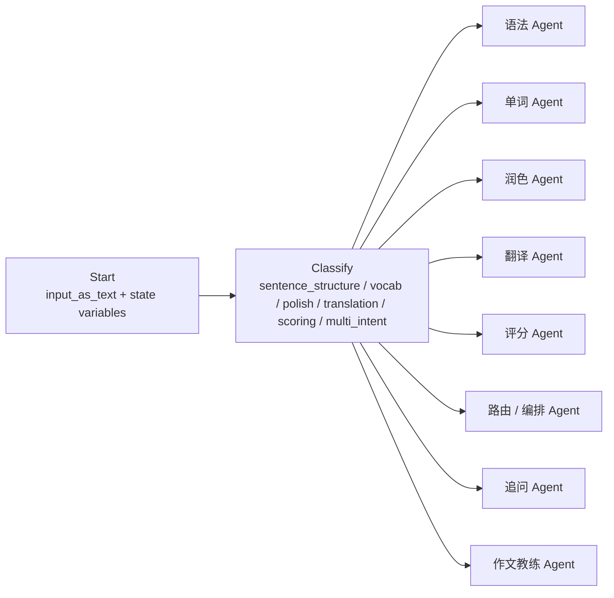

# Agent Builder 学习资料

本目录专门收集 OpenAI Agent Builder 的学习资料，用来沉淀可视化 workflow、节点、变量、状态和 PEAI 学习助手落地方式。

它和 [OpenAI Agents SDK 中文学习笔记](../OpenAI%20Agents%20SDK中文学习笔记.md) 的区别是：

| 目录 | 重点 | 使用场景 |
| --- | --- | --- |
| `OpenAI Agents SDK 中文学习笔记` | Python / SDK 代码层 agent 概念 | 理解 `Agent`、`Runner`、`Session`、tools、handoff |
| `agent-builder/` | OpenAI Platform 可视化工作流 | 学习 Start、Classify、Agent、State、变量引用和发布方式 |

## 当前资料

| 文档 | 解决的问题 |
| --- | --- |
| [Node reference 学习笔记](./node-reference.md) | 理解 Agent Builder 里每类节点的职责、输入输出和 PEAI 映射方式。 |

## PEAI 当前学习重点

| 主题 | 为什么重要 | 推荐沉淀方式 |
| --- | --- | --- |
| Start 输入变量 | 决定 `input_as_text`、`study_stage`、`assistant_mode` 等上下文从哪里进入工作流 | 单独写 Start 节点说明 |
| Classify 路由 | 决定用户请求进入哪个专职 Agent 或编排 Agent | 单独写分类类别和例子 |
| Agent instructions | 决定专职 Agent 的职责、边界和输出格式 | 维护每个 Agent 的提示词策略 |
| State variables | 承载运行时上下文，不替代长期记忆 | 建字段字典 |
| Multi-intent 编排 | 用户同时要求“评分 + 润色 + 讲解”时需要统一回答 | 画流程图和样例 |
| 发布与评估 | 防止 draft 配置无法稳定复现 | 记录发布前检查清单 |

## 建议目录结构

```text
docs/agent/agent-builder/
  index.md
  node-reference.md
  start-node.md
  classify-routing.md
  runtime-context.md
  peai-workflow-mapping.md
```

## PEAI 当前 Agent Builder 草图



## 维护规则

- 官方概念优先链接 OpenAI Platform 文档，不在本目录复制整篇官方文档。
- 每篇学习笔记都要说明“官方节点概念”和“PEAI 项目里怎么用”。
- 如果 Agent Builder 配置改变，需要同步更新本目录和 [学习助手 Agent 编排架构](../学习助手Agent编排架构.md)。
- 变量、分类、节点名称变化时，要同步更新流程图。

