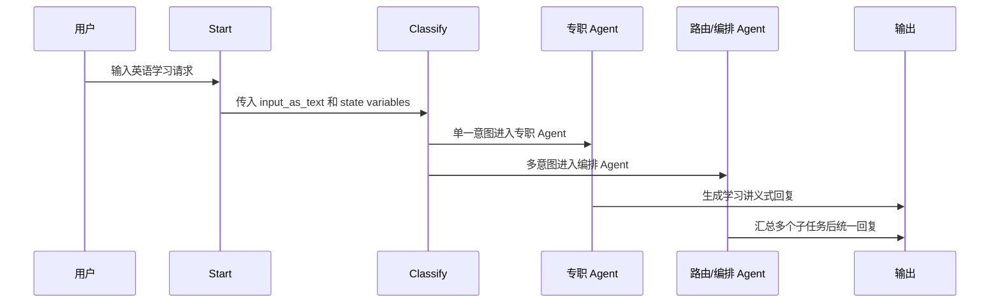

# Agent Builder Node reference 学习笔记

## 当前结论

`Node reference` 是 OpenAI Agent Builder 里各类节点的官方说明入口。它回答的是：

- 每种节点做什么。
- 节点接收什么输入。
- 节点输出什么结果。
- 哪些地方可以引用 `{{ variable }}`。
- 节点之间如何连接和传递状态。

官方文档：

- [OpenAI Agent Builder](https://platform.openai.com/docs/guides/agent-builder)
- [OpenAI Agent Builder Node reference](https://platform.openai.com/docs/guides/node-reference)

## 节点分组总览

Agent Builder 的节点大体分为 `Core`、`Tools`、`Logic`、`Data` 四类。PEAI 第一版不需要全部用上，但学习资料里需要完整覆盖，避免后续做复杂 workflow 时概念断层。

### Core nodes

| 节点 | 中文理解 | 典型用途 | PEAI 映射 |
| --- | --- | --- | --- |
| `Start` | 工作流入口 | 定义用户输入和状态变量；聊天工作流会把用户输入追加到对话历史，并暴露 `input_as_text` | 接收 `input_as_text`、`study_stage`、`assistant_mode` |
| `Agent` | 模型执行节点 | 配置 instructions、tools、model、evaluations，执行具体任务 | 语法、单词、润色、翻译、评分、追问、作文教练等专职 Agent |
| `Classify` | 分类 / 路由 | 把用户输入归到一个类别，并按类别走不同边 | 识别 `sentence_structure`、`vocab`、`polish`、`multi_intent` 等 |
| `End` | 工作流结束 | 返回最终输出，结束当前 workflow | 汇总并返回用户可见答案 |
| `Note` | 画布注释 | 给团队留下说明；不参与执行流 | 标注“这里是多意图分支”“这里后续接 File search”等设计说明 |

### Tool nodes

| 节点 | 中文理解 | 典型用途 | PEAI 映射 |
| --- | --- | --- | --- |
| `File search` | 知识库检索 | 从 OpenAI vector store 检索文档片段；查询可引用变量 | 按需加载考试标准、rubric、题型说明、范文规则 |
| `Guardrails` | 安全检查 / 输入输出监控 | 检查 PII、越狱、滥用或其他不希望的输入输出；失败后可结束或回到上一步 | 拦截非英语学习请求、敏感个人信息、明显越权请求 |
| `MCP` | 外部工具 / 连接器 | 调用第三方工具或服务，例如 Gmail、Zapier，或自建 MCP server | 后续接 PEAI 后端工具、用户画像服务、题库服务、学习记录服务 |

### Logic nodes

| 节点 | 中文理解 | 典型用途 | PEAI 映射 |
| --- | --- | --- | --- |
| `If / else` | 条件分支 | 用 CEL 表达式按变量或节点结果选择路径 | 按 `assistant_mode` 区分考试模式 / 日常讲解模式 |
| `While` | 循环 | 用 CEL 表达式判断是否继续循环 | 多轮迭代改写、批量处理多个句子；第一版不建议使用 |
| `User approval` / `Human approval` | 用户确认 | 在执行有副作用或需要确认的步骤前让用户批准 | 发布题单、保存学习计划、发送邮件、写入长期画像前确认 |

### Data nodes

| 节点 | 中文理解 | 典型用途 | PEAI 映射 |
| --- | --- | --- | --- |
| `Transform` | 数据转换 | 改变节点输出形状，例如 object 转 array，或把输出整理成下游 schema | 把分类结果、检索结果或多个 Agent 输出转成统一 payload |
| `Set state` | 设置全局状态 | 定义或更新 workflow state variables，供后续节点复用 | 保存 `target_exam`、`task_type`、上下文摘要、检索到的 rubric id |

## PEAI 第一版建议使用的节点

第一版不要追求节点全用上。学习助手当前更适合保持简单：

```text
Start -> Classify -> Agent
```

| 阶段 | 建议节点 | 原因 |
| --- | --- | --- |
| P0 | `Start`、`Classify`、`Agent` | 足够完成单意图和多意图路由 |
| P0 可选 | `End`、`Note` | 用于显式结束和解释画布设计 |
| P1 | `File search`、`Guardrails` | 按需加载考试标准，并加强安全边界 |
| P1 | `Set state`、`Transform` | 当需要多个节点共用同一份上下文时再加 |
| P2 | `If / else`、`User approval`、`MCP` | 当要接真实工具、保存学习计划或写入画像时再加 |
| 暂缓 | `While` | 容易增加不可控循环，先不要放进主链路 |

## 变量设计口径

Agent Builder 允许在节点配置中引用变量，例如：

```md
学段：{{ study_stage }}
助手模式：{{ assistant_mode }}
目标考试：{{ target_exam }}
```

PEAI 应区分两类内容：

| 类型 | 应该放哪里 | 示例 |
| --- | --- | --- |
| 稳定规则 | Agent instructions | 角色、职责、边界、输出格式 |
| 运行时上下文 | Start state / user message / 上游节点输出 | 学段、考试类型、用户画像摘要、当前输入 |

建议不要把完整用户输入长期写死在所有 Agent 的 `instructions` 里。更稳妥的方式是：

- `instructions` 说明如何使用运行时上下文。
- 当前用户输入通过 workflow input 或 chat history 进入 Agent。
- 考试标准、rubric、题型说明后续用 `File search` 或 tool 按需加载。

## PEAI 当前分类设计

| Category | 中文意思 | 目标节点 |
| --- | --- | --- |
| `sentence_structure` | 句子结构、语法结构、长难句分析 | 语法 Agent |
| `vocab` | 单词、短语、搭配、词义辨析 | 单词 Agent |
| `polish` | 润色、改写、表达升级 | 润色 Agent |
| `translation` | 中英互译、译文解释 | 翻译 Agent |
| `scoring` | 作文评分、评价、纠错、诊断 | 评分 Agent |
| `multi_intent` | 多意图组合任务 | 路由 / 编排 Agent |
| `out_of_scope` | 非英语学习请求 | 追问 Agent |
| `clarify` | 缺少必要输入，需要追问 | 追问 Agent |

## 当前 PEAI 工作流



## 后续学习主题

- `Start` 节点字段设计：哪些是 input variables，哪些是 state variables。
- `Classify` 分类器：类别命名、示例写法、multi-intent 处理。
- `Agent` instructions：专职 Agent 是否需要共享 Markdown 规范。
- `File search`：考试标准和评分 rubric 的渐进式加载。
- `Set state`：是否保存当前任务、目标考试、用户画像摘要。
- `Evaluate`：如何用样例验证 Agent Builder 草图稳定性。
