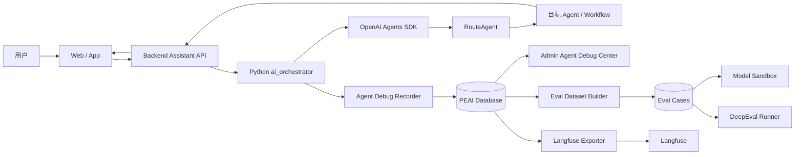
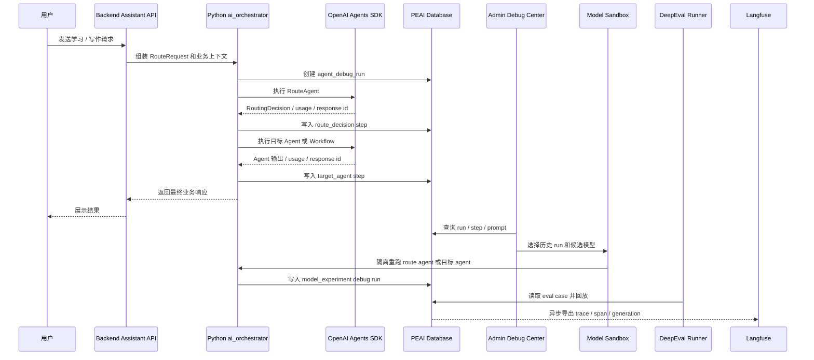
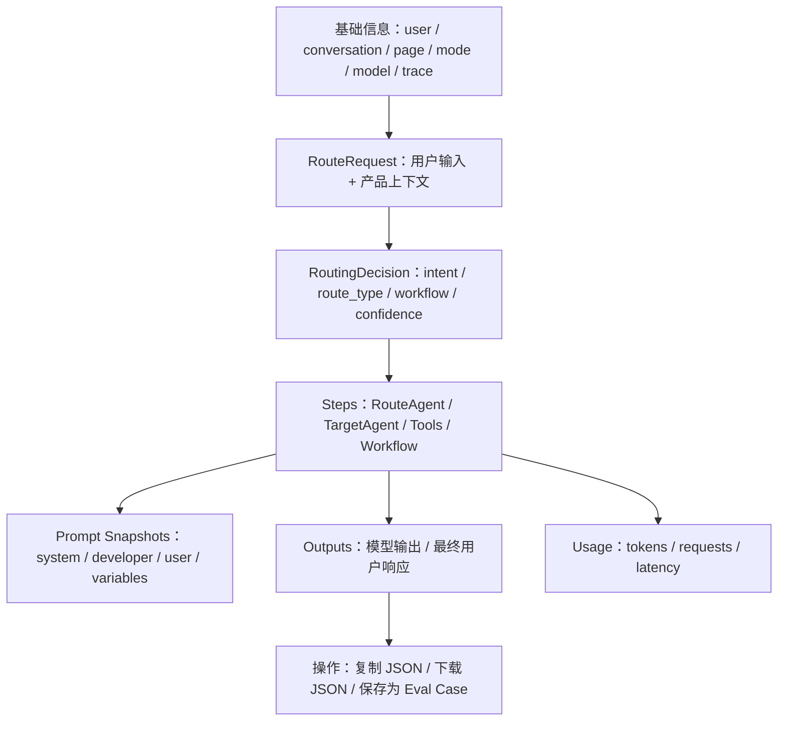
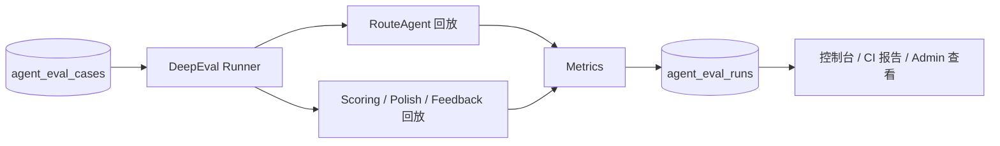

# Agent 可观测性与调试中心

## 当前结论

PEAI 先建设自己的 Agent Debug Recorder 和管理员端 Agent Debug Center，把每次 Agent 请求的输入 JSON、Prompt、模型输出、usage、路由结果和 OpenAI trace 关联起来。

DeepEval、Model Sandbox 和 Langfuse 不直接接管业务链路，而是作为二级能力接入：Model Sandbox 用于模型迁移前的隔离试跑，DeepEval 用于本地和 CI 评测，Langfuse 用于更完整的 LLM tracing、prompt 管理和实验分析。



## 背景

当前 Agent 工作流已经能在 OpenAI Platform Traces 中看到调用链路，但仍有几个问题：

- OpenAI Traces 偏运行时观测，不是 PEAI 自己的业务调试后台。
- 学段、模式、题目、作文、路由输入、路由输出、模型名称和最终回复分散在不同层，不方便按业务维度排查。
- 真实用户请求不能直接沉淀为 eval case，后续很难判断改 Prompt、换模型、调整 agent 编排后是否退化。
- 缺少隔离的模型试跑能力，无法在不影响用户会话的情况下比较候选模型。
- Langfuse、DeepEval、Phoenix、Braintrust 都有价值，但如果一开始让业务代码直接依赖这些平台，后续切换和数据权限会变复杂。

因此第一阶段目标不是“接入所有观测平台”，而是先建立 PEAI 自己稳定的数据口径。

## 范围

本文覆盖：

- Agent Debug Recorder：保存每次 Agent 请求全过程。
- 管理员端 Agent Debug Center：查看请求、Prompt、模型输入输出、usage、路由结果和错误。
- Eval Dataset Builder：从真实请求中挑选样本，转成 eval case。
- Model Sandbox：用历史 run 或 eval case 对比不同模型、Prompt 或 Agent 目标的表现。
- DeepEval：在本地或 CI 中评测路由、评分、反馈质量。
- Langfuse：作为外部 tracing / prompt / eval 平台的异步导出目标。

本文不覆盖：

- 重新设计 Agent SDK 运行时。
- 立即替换现有 OpenAI Platform Traces。
- Phoenix、Braintrust、LangSmith 的首期接入。
- 自动微调、自动改 Prompt、自动上线模型。
- 复杂的用户画像和长期记忆系统。

## 分期

| 优先级 | 能力 | 目标 | 交付形态 |
| --- | --- | --- | --- |
| P0 | Agent Debug Recorder | 每次请求都能回放关键 JSON、Prompt、模型输出和 usage | 数据库记录 + Python 记录器 |
| P0 | Admin Agent Debug Center | 管理员可以按业务维度排查 Agent 请求 | 后台列表页 + 详情页 |
| P1 | Eval Dataset Builder | 从真实请求沉淀 eval case | 后台保存样本 + eval 数据表 |
| P1 | Model Sandbox | 使用同一输入对比不同模型表现 | 后台模型试跑 + 对比结果 |
| P1 | DeepEval | 自动评测路由、评分、反馈是否退化 | 本地脚本 + CI 可选 |
| P2 | Langfuse | 外部可观测性、Prompt 管理、实验分析 | 异步 exporter |

## 组件职责

| 组件 | 职责 | 依赖 | 首期优先级 |
| --- | --- | --- | --- |
| Python ai_orchestrator | 执行 RouteAgent、目标 Agent 和 workflow，生成调试事件 | OpenAI Agents SDK | P0 |
| Agent Debug Recorder | 标准化采集 route request、routing decision、prompt snapshot、model IO、usage | Python runtime / Backend API | P0 |
| Backend Admin API | 查询 debug run、step、prompt、eval case，提供权限控制 | Database / Auth | P0 |
| Admin Agent Debug Center | 展示请求列表、请求详情、Prompt、模型输出、usage、trace 链接 | Backend Admin API | P0 |
| Eval Dataset Builder | 把真实请求转成可复用 eval case | Debug tables | P1 |
| Model Sandbox | 对历史 run 或 eval case 使用候选模型重跑，比较输出、路由、tokens 和 latency | Debug tables / Python workflow | P1 |
| DeepEval Runner | 执行 eval case，输出 pass/fail、指标和失败原因 | Eval cases / Python workflow | P1 |
| Langfuse Exporter | 把内部 debug run 异步同步到 Langfuse | Langfuse API | P2 |

## 总体数据流



## 核心设计原则

### 1. 内部 Debug Recorder 是唯一事实来源

PEAI 自己的数据库记录是主口径。OpenAI Traces、Langfuse、DeepEval 都是辅助视角。

- 原因：真实业务排查需要 userId、conversationId、学段、题目、作文、页面、模式等 PEAI 字段。
- 代价：需要自己设计数据表和后台页面。
- 替代方案：只用 Langfuse 或 OpenAI Traces。问题是业务字段和权限控制不完全由 PEAI 掌控。

### 2. 记录“可调试输入”，不只记录最终回答

每次请求至少要能看到：

- 用户原始 message。
- 后端组装后的 RouteRequest。
- RouteAgent 的 RoutingDecision。
- 目标 Agent 名称、模型、Prompt key、Prompt 版本或 hash。
- 模型输入、模型输出、usage、response id、trace id。
- 最终返回给用户的内容。

### 3. 业务链路不能依赖观测平台成功

Recorder、Langfuse、DeepEval 失败时，不应该阻断用户请求。

- P0 Recorder 数据库写入失败：记录服务端 warning，用户请求继续。
- Langfuse 导出失败：标记 export 状态，异步重试。
- DeepEval：只在本地、CI 或管理员手动触发时运行，不进入用户请求主链路。

### 4. Prompt 必须可追踪

调试时不能只看到“模型说了什么”，还要知道“模型为什么这么说”。

Prompt 记录至少包含：

- `prompt_key`：例如 `route_decision`、`scoring`、`polish`。
- `prompt_version`：人工维护版本或 git commit。
- `prompt_hash`：渲染后 Prompt 的 hash。
- `system_prompt` / `developer_prompt` / `user_prompt`。
- 运行时注入的关键变量。

## 数据模型草案

### agent_debug_runs

记录一次完整 Agent 请求。

| 字段 | 类型 | 说明 |
| --- | --- | --- |
| id | string | PEAI 内部 run id |
| trace_id | string | OpenAI trace id，可为空 |
| user_id | string | 用户 id |
| conversation_id | string | 会话 id |
| entrypoint | string | 请求入口，例如 `/assistant/run` |
| status | string | `running` / `completed` / `failed` |
| mode | string | 学习助手模式、写作模式等 |
| stage | string | 学段 |
| target_exam | string | 目标考试 |
| current_page | string | 前端页面 |
| user_message | text | 用户输入 |
| route_request_json | json | 后端传给 RouteAgent 的结构化输入 |
| routing_decision_json | json | RouteAgent 输出 |
| selected_workflow | string | 选中的 workflow |
| selected_agent | string | 选中的目标 agent |
| final_output_json | json | 返回给用户前的结构化结果 |
| final_output_text | text | 返回给用户的文本 |
| total_input_tokens | integer | 总输入 tokens |
| total_output_tokens | integer | 总输出 tokens |
| total_cached_input_tokens | integer | 总缓存输入 tokens |
| total_requests | integer | OpenAI 请求次数 |
| latency_ms | integer | 总耗时 |
| error_message | text | 失败原因 |
| created_at | datetime | 创建时间 |
| completed_at | datetime | 完成时间 |

### agent_debug_steps

记录一次 run 内的每个关键步骤。

| 字段 | 类型 | 说明 |
| --- | --- | --- |
| id | string | step id |
| run_id | string | 关联 `agent_debug_runs.id` |
| parent_step_id | string | 父 step，可为空 |
| step_order | integer | 执行顺序 |
| step_type | string | `route_decision` / `target_agent` / `tool_call` / `workflow` / `export` |
| agent_name | string | Agent 名称 |
| tool_name | string | Tool 名称 |
| workflow_name | string | Workflow 名称 |
| model | string | 使用的模型 |
| prompt_key | string | Prompt key |
| prompt_hash | string | Prompt hash |
| input_json | json | 传入模型或工具的输入 |
| output_json | json | 模型或工具输出 |
| output_text | text | 可读输出 |
| usage_json | json | usage 原始数据 |
| response_id | string | OpenAI response id |
| span_id | string | OpenAI trace span id |
| latency_ms | integer | 当前步骤耗时 |
| status | string | `completed` / `failed` |
| error_message | text | 失败原因 |
| created_at | datetime | 创建时间 |

### agent_prompt_snapshots

记录每次调用时实际使用的 Prompt。

| 字段 | 类型 | 说明 |
| --- | --- | --- |
| id | string | prompt snapshot id |
| run_id | string | 关联 run |
| step_id | string | 关联 step |
| prompt_key | string | Prompt key |
| prompt_version | string | Prompt 版本 |
| prompt_hash | string | 渲染后 hash |
| model | string | 目标模型 |
| system_prompt | text | system 指令 |
| developer_prompt | text | developer 指令 |
| user_prompt | text | user 内容 |
| variables_json | json | 注入变量 |
| created_at | datetime | 创建时间 |

### agent_eval_cases

从真实请求或人工样本沉淀 eval case。

| 字段 | 类型 | 说明 |
| --- | --- | --- |
| id | string | eval case id |
| source_run_id | string | 来源 debug run，可为空 |
| case_type | string | `route_eval` / `scoring_eval` / `feedback_eval` / `out_of_scope_eval` |
| title | string | case 标题 |
| input_json | json | 回放输入 |
| expected_json | json | 期望结果 |
| tags_json | json | 标签，例如 `postgrad`、`writing`、`edge_case` |
| status | string | `active` / `archived` |
| created_by | string | 创建人 |
| created_at | datetime | 创建时间 |
| updated_at | datetime | 更新时间 |

### agent_eval_runs

记录一次 eval 执行结果。

| 字段 | 类型 | 说明 |
| --- | --- | --- |
| id | string | eval run id |
| case_id | string | eval case id |
| runner | string | `deepeval` / `manual` |
| model | string | 被测模型 |
| prompt_version | string | 被测 Prompt 版本 |
| actual_json | json | 实际输出 |
| score_json | json | 指标结果 |
| passed | boolean | 是否通过 |
| failure_reason | text | 失败原因 |
| created_at | datetime | 创建时间 |

### agent_external_exports

记录外部平台导出状态。

| 字段 | 类型 | 说明 |
| --- | --- | --- |
| id | string | export id |
| run_id | string | debug run id |
| provider | string | `langfuse` |
| external_trace_id | string | 外部 trace id |
| status | string | `pending` / `exported` / `failed` |
| retry_count | integer | 重试次数 |
| error_message | text | 失败原因 |
| created_at | datetime | 创建时间 |
| updated_at | datetime | 更新时间 |

## Debug Run JSON 契约

管理员端和导出器统一读取以下形状，不直接依赖 OpenAI SDK 内部对象。

```json
{
  "runId": "agent_run_01H...",
  "traceId": "trace_...",
  "conversationId": "conv_123",
  "userId": "user_123",
  "entrypoint": "/assistant/run",
  "status": "completed",
  "mode": "daily_learning",
  "stage": "postgrad",
  "targetExam": "postgrad",
  "currentPage": "learning_assistant",
  "userMessage": "帮我润色这句话",
  "routeRequest": {
    "message": "帮我润色这句话",
    "mode": "daily_learning",
    "stage": "postgrad",
    "target_exam": "postgrad"
  },
  "routingDecision": {
    "intent": "polish",
    "route_type": "run_workflow",
    "workflow": "polish_text",
    "target_agent": "Polish Agent",
    "confidence": 0.93,
    "missing_inputs": []
  },
  "selectedWorkflow": "polish_text",
  "selectedAgent": "Polish Agent",
  "promptKeys": ["route_decision", "polish_text"],
  "responseIds": ["resp_..."],
  "usage": {
    "total_tokens": 1798,
    "input_tokens": 1709,
    "cached_input_tokens": 1280,
    "output_tokens": 89,
    "requests": 1
  },
  "openaiTraceUrl": "https://platform.openai.com/traces/trace_...",
  "createdAt": "2026-05-14T15:18:00+08:00"
}
```

## Admin Agent Debug Center

### 列表页

列表页用于快速定位问题请求。

筛选条件：

- 时间范围。
- 用户。
- 会话。
- 请求入口。
- 学段。
- 当前页面。
- intent。
- route type。
- workflow。
- target agent。
- model。
- status。
- confidence 区间。
- token 区间。
- 是否有错误。

列表字段：

| 字段 | 说明 |
| --- | --- |
| 创建时间 | 请求发生时间 |
| 用户 | userId 或脱敏昵称 |
| message 摘要 | 用户输入前 80 个字符 |
| intent | RouteAgent 判断的意图 |
| workflow / agent | 实际进入的工作流或 Agent |
| model | 主要模型 |
| tokens | 总 token 用量 |
| latency | 总耗时 |
| status | 成功或失败 |
| trace | OpenAI trace 链接 |

### 详情页

详情页用于完整排查一次请求。



核心操作：

- 复制完整 debug JSON。
- 下载脱敏 debug JSON。
- 打开 OpenAI trace。
- 保存为 eval case。
- 标记问题类型，例如 `wrong_route`、`bad_feedback`、`score_unstable`。

## Eval Dataset Builder

Eval Dataset Builder 从真实请求中挑样本，避免靠少量手写 case 判断模型质量。

### case 类型

| 类型 | 用途 | 典型期望 |
| --- | --- | --- |
| route_eval | 判断 RouteAgent 是否选对路由 | intent、route_type、workflow、target_agent |
| scoring_eval | 判断评分是否稳定 | 总分范围、维度分范围、评分理由必须覆盖 |
| feedback_eval | 判断反馈质量 | 是否指出关键问题、是否给出可执行建议 |
| out_of_scope_eval | 判断非学习请求处理 | 是否拒绝或转为轻量直接回答 |

### route_eval 示例

```json
{
  "caseType": "route_eval",
  "input": {
    "message": "帮我把这句话写得更自然：I very like this book.",
    "mode": "daily_learning",
    "stage": "postgrad",
    "target_exam": "postgrad",
    "has_selected_text": true
  },
  "expected": {
    "intent": "polish",
    "route_type": "run_workflow",
    "workflow": "polish_text",
    "target_agent": "Polish Agent",
    "missing_inputs": []
  }
}
```

### scoring_eval 示例

```json
{
  "caseType": "scoring_eval",
  "input": {
    "topic_prompt": "Some people think mobile phones should be banned in schools...",
    "essay_text": "In my opinion, mobile phones are useful but should be controlled...",
    "stage": "postgrad",
    "rubric": "postgrad_writing"
  },
  "expected": {
    "score_min": 68,
    "score_max": 78,
    "must_mention": ["论点展开", "例证不足", "连接词"],
    "forbidden_claims": ["完全跑题", "无法评分"]
  }
}
```

## DeepEval 接入方案

DeepEval 用来做本地和 CI 自动评测，不进入用户请求链路。



首批指标：

| 指标 | 适用 case | 通过标准 |
| --- | --- | --- |
| intent match | route_eval | 实际 intent 等于 expected intent |
| route_type match | route_eval | 实际 route_type 等于 expected route_type |
| target agent match | route_eval | 实际 target_agent 等于 expected target_agent |
| missing inputs match | route_eval | 缺失输入字段一致 |
| score range | scoring_eval | 实际分数在 expected 区间内 |
| required issue coverage | feedback_eval / scoring_eval | 必须提到的关键问题被覆盖 |
| forbidden claim check | feedback_eval / scoring_eval | 不出现禁止判断 |
| JSON schema valid | 所有结构化输出 | 输出符合 schema |

建议命令形态：

```powershell
cd python
python -m evals.run_agent_evals --case-type route_eval
python -m evals.run_agent_evals --case-type scoring_eval --model gpt-5.4-mini
```

CI 首期只跑小样本 smoke eval，避免每次提交成本过高。完整 eval 可以手动触发。

## Langfuse 接入方案

Langfuse 作为外部可观测平台，不替代内部 Debug Recorder。

### 导出映射

| PEAI 内部对象 | Langfuse 对象 | 说明 |
| --- | --- | --- |
| agent_debug_runs | trace | 一次用户请求 |
| agent_debug_steps | span / generation | Agent step、tool call、model generation |
| agent_prompt_snapshots | prompt metadata | Prompt key、version、hash |
| agent_eval_cases | dataset item | 可选同步 |
| agent_eval_runs | score | eval 结果 |

### 环境变量

```text
LANGFUSE_ENABLED=false
LANGFUSE_PUBLIC_KEY=
LANGFUSE_SECRET_KEY=
LANGFUSE_BASE_URL=https://cloud.langfuse.com
```

默认关闭 Langfuse。只有环境变量完整且 `LANGFUSE_ENABLED=true` 时才启动异步导出。
兼容旧配置名 `LANGFUSE_HOST`；如果未设置 `LANGFUSE_BASE_URL`，Python orchestrator 会把 `LANGFUSE_HOST` 映射为 `LANGFUSE_BASE_URL`。
当前接入方式使用 Langfuse 官方文档推荐的 `openinference-instrumentation-openai-agents`，在应用启动时对 OpenAI Agents SDK 自动埋点，同时保留 OpenAI Platform Traces。

### 失败策略

| 场景 | 系统行为 |
| --- | --- |
| Langfuse 未配置 | 不导出，不影响请求 |
| Langfuse 网络失败 | 标记 `agent_external_exports.status=failed` |
| Langfuse 鉴权失败 | 停止重试并记录错误 |
| 导出字段过大 | 截断或脱敏后导出，内部库保留完整权限数据 |

## 安全与隐私

必须脱敏或禁止保存：

- OpenAI API key、Langfuse secret、后端鉴权 token。
- 请求 header 中的 cookie、authorization。
- 用户密码、手机号、邮箱等敏感字段。

生产环境建议策略：

- 管理员端只允许高权限账号访问。
- 默认隐藏完整作文和选中文本，需要二次点击查看。
- 下载 JSON 默认脱敏。
- Debug 数据设置保留周期，例如 30 或 90 天。
- Eval case 一旦用于长期评测，需要人工确认是否包含用户隐私。

## 失败模式

| 故障 | 用户影响 | 系统行为 | 处理方式 |
| --- | --- | --- | --- |
| Recorder 创建 run 失败 | 理论上不影响用户请求 | 继续执行 Agent，记录 warning | 查看服务端日志 |
| step 写入失败 | 管理员端缺少部分步骤 | 主请求继续，run 标记 `partial` | 后续补偿或忽略 |
| OpenAI trace 延迟出现 | 管理员端短时看不到 trace 链接 | 保留 response id，稍后刷新 | 手动刷新详情页 |
| DeepEval 失败 | 不影响线上用户 | CI 或本地命令失败 | 查看 eval 报告 |
| Langfuse 导出失败 | 不影响线上用户 | export 状态 failed | 重试或关闭导出 |

## 实施顺序

第一阶段只做 P0：

1. 定义 debug run / step / prompt snapshot 数据结构。
2. 在 Python ai_orchestrator 增加 DebugRecorder 接口。
3. 捕获 RouteAgent 的输入、输出、模型、usage、response id。
4. 捕获目标 Agent 或 workflow 的输入、输出、模型、usage、response id。
5. 后端提供管理员查询 API。
6. 管理员端实现 run 列表页和详情页。
7. 验收真实请求是否能看到完整 JSON、Prompt、模型输出和 usage。

第二阶段做 P1：

1. 在详情页增加“保存为 eval case”。
2. 支持编辑 expected JSON 和 tags。
3. 增加 DeepEval 本地 runner。
4. 先覆盖 RouteAgent eval，再覆盖 scoring 和 feedback eval。
5. 评估是否接入 CI smoke eval。

第三阶段做 P2：

1. 增加 Langfuse exporter。
2. 支持按环境变量开启。
3. 同步 trace、span、generation 和 usage。
4. 将 eval case 和 eval result 可选同步到 Langfuse dataset / score。

## 验收标准

P0 首期页面路径：

- 业务管理员端继续使用 `/admin/*`。
- Agent 调试端使用 `/ops/agent/*`。
- 当前只有项目 owner 使用，首期不新增细粒度权限字段，仍复用现有管理员登录校验。
- 后续多人协作时再补 `admin.agent_debug.read`、`admin.agent_debug.export`、`admin.eval.manage`、`admin.prompt_debug.read` 等权限。

P0 通过标准：

- 每次学习助手请求至少生成一条 `agent_debug_runs`。
- RouteAgent 输入 JSON、RoutingDecision JSON、模型名称、usage 可以在管理员端看到。
- 目标 Agent 的输入、输出、Prompt key、模型名称、usage 可以在管理员端看到。
- 管理员可以复制或下载完整 debug JSON。
- Recorder 写入失败不会导致用户请求失败。
- OpenAI trace 链接可从详情页打开。

P1 通过标准：

- 管理员可以从 debug run 保存 eval case。
- route_eval 可以本地批量运行。
- eval 结果保存到 `agent_eval_runs`。
- 改动 RouteAgent Prompt 后，可以通过 eval 判断是否出现路由退化。

P2 通过标准：

- 开启 Langfuse 环境变量后，新请求能异步导出 trace。
- 关闭 Langfuse 后，业务请求和内部 Debug Center 不受影响。
- Langfuse 导出失败有状态记录和错误原因。

## 设计取舍

| 方案 | 优点 | 问题 | 结论 |
| --- | --- | --- | --- |
| 只用 OpenAI Traces | 接入成本最低 | 缺少 PEAI 业务字段和后台筛选 | 不够 |
| 直接上 Langfuse | 功能完整 | 数据口径和平台绑定过早 | P2 接入 |
| 自建 Debug Recorder | 业务字段可控，方便沉淀 eval | 需要自己开发后台和数据表 | P0 必做 |
| 先做 DeepEval | 很快有测试价值 | 没有真实样本时 case 质量低 | P1 做 |
| 同时接 Phoenix / Braintrust / LangSmith | 视角多 | 复杂度高，首期收益不稳定 | 暂不做 |

## 与现有 Agent 工作流的关系

这个方案不改变现有 Agent 编排方式。

现有链路仍然是：

```text
用户输入 + 产品上下文
-> RouteRequest
-> RouteAgent
-> RoutingDecision
-> Backend workflow runner
-> 目标 workflow / capability agent
-> 最终响应
```

新增的是旁路记录能力：

```text
每个关键节点
-> DebugRecorder.capture(...)
-> agent_debug_runs / agent_debug_steps / agent_prompt_snapshots
-> Admin Debug Center / Eval Dataset / Langfuse Exporter
```

因此它不会把 PEAI 从 OpenAI Agents SDK 改成自研 agent 框架，也不会要求一开始重做记忆、用户画像或长期上下文管理。

## 相关资料

- [路由 Agent](./路由agent.md)
- [OpenAI Agents SDK 中文学习笔记](./openai-agents-sdk-study-notes.md)
- [OpenAI Agents 请求架构](../ai/openai-agents-request-architecture.md)
- [OpenAI Agents SDK Tracing 官方文档](https://openai.github.io/openai-agents-python/tracing/)
