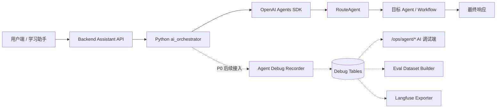
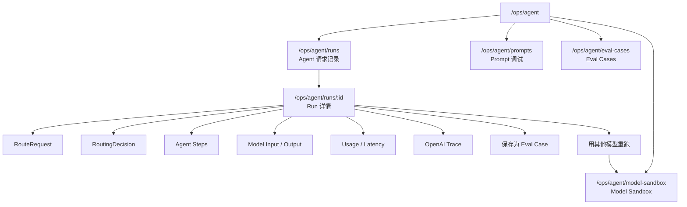

# AI 调试端设计

## 当前结论

AI 调试端是 PEAI 的 AI workflow observability / AI Ops 控制台，首期路径为 `/ops/agent/*`。

它不等同于业务管理员端。业务管理员端关注用户、作文、题库、Rubric 和审计；AI 调试端关注 Agent 请求、Prompt、路由决策、模型输入输出、usage、trace 和 eval case。

首期只有项目 owner 使用，因此暂不新增细粒度权限，先复用现有管理员登录校验。

## 设计原则

AI 调试端第一优先级不是管理 Prompt，而是回答一次 Agent 请求到底发生了什么。

因此默认入口应从 `Agent Runs` 开始，而不是从 `Prompt 调试` 开始。Prompt、usage、路由决策、模型输出和 eval case 都应该挂在某一次真实 run 下面，形成可追溯链路。

```text
一次用户请求
-> 一个 Agent Run
-> 多个 Agent Step
-> 多个 Prompt Snapshot / Model IO / Tool Call / Handoff
-> 可沉淀为 Eval Case
```

首期目标是先跑通“真实请求可记录、可查看、可复盘”的最小闭环，再把真实请求沉淀成 eval case，并提供 Model Sandbox 用于模型迁移前的对比试跑。DeepEval 用于 P1 自动评测，Langfuse 作为 P2 外部观测和 prompt 实验平台。

## OpenAI Agents SDK 对齐口径

AI 调试端需要贴合 OpenAI Agents SDK 的运行模型，而不是重新发明一套抽象。

| OpenAI Agents SDK 概念 | PEAI 调试端概念 | 说明 |
| --- | --- | --- |
| Trace | `agent_debug_run` | 一次完整 Agent workflow，对应一次用户请求或一次后端触发任务 |
| Span | `agent_debug_step` | workflow 内的单个步骤，例如 agent run、model generation、tool call、handoff |
| Generation span | Model IO | 一次模型调用的输入、输出、response id、模型名和 usage |
| Function span | Tool Call | Agent 调用的工具、参数、结果和错误 |
| Handoff span | Handoff Step | 一个 Agent 把任务移交给另一个 Agent 的过程 |
| Guardrail span | Guardrail Step | 输入或输出校验过程，首期可先预留字段 |
| Usage | Usage Panel | tokens、requests、cached tokens、latency、成本估算 |
| Agent evals / Datasets | Eval Cases | 从真实 run 中挑选样本，形成长期回归集 |
| Model experiment | Model Sandbox | 同一输入在不同模型、Prompt 或 Agent 目标下重跑并对比 |

这意味着前端详情页不应该只展示一段最终回复，而要把一次 run 拆成可检查的结构：`RouteRequest`、`RoutingDecision`、`steps`、`prompt snapshots`、`model input/output`、`usage`、`error`。

## OpenAI Platform 先行可观测

在 PEAI 自己的 AI 调试端完全成熟前，OpenAI Platform Traces 是第一阶段的官方观测入口。当前工作流需要把短 metadata 写入 OpenAI trace，便于先在 OpenAI Platform 中搜索、过滤和定位问题。

OpenAI metadata 只放索引字段，不放大文本和敏感信息：

| 字段 | 用途 |
| --- | --- |
| `app` / `environment` | 区分 PEAI 和运行环境 |
| `component` | 区分 assistant workflow、target agent、legacy chat |
| `run_type` | 区分 live、replay、model_experiment |
| `run_id` / `trace_id` | 关联 PEAI 本地 debug run |
| `conversation_id` / `client_message_id` | 定位用户会话和消息 |
| `model` | 查看当前模型 |
| `mode` / `intent` / `scope` | 定位学习助手请求类型 |
| `study_stage` / `target_exam` / `source_page` | 业务排查维度 |
| `route_type` / `workflow` / `target_agent` / `route_confidence` | 路由排查维度 |

不要写入 OpenAI metadata 的内容：

- 完整作文、完整 prompt、完整 RouteRequest 大 JSON。
- access token、refresh token、Authorization、Cookie。
- 用户隐私文本或可识别个人信息。

完整复盘仍以 PEAI 自己的 `agent_debug_run`、`agent_debug_step` 和 `agent_prompt_snapshot` 为主口径。

## 端的边界

| 端 | 路径 | 主要用户 | 关注对象 | 首期权限 |
| --- | --- | --- | --- | --- |
| 业务管理员端 | `/admin/*` | 内容管理员、产品经理、教研、运营 | 用户、作文、题库、Rubric、审计、数据看板 | 现有 admin roles |
| AI 调试端 | `/ops/agent/*` | 开发者、AI 运营、项目 owner | Agent run、Prompt、RoutingDecision、模型输出、usage、eval case | 复用管理员登录 |

简单理解：

```text
业务管理员端 = 业务运营后台
AI 调试端 = AI 内核控制台
```

## 总体架构



AI 调试端已经从空壳页面进入 P0 数据闭环阶段：首期先记录并展示真实 run，后续再补更完整的 prompt 捕获、Eval Case Builder、Model Sandbox、DeepEval 和外部平台集成。

当前实现状态：

- 已新增 `agent_debug_run`、`agent_debug_step`、`agent_prompt_snapshot` 三张 P0 表。
- 已新增 `/api/ops/agent/runs`、`/api/ops/agent/runs/{runId}`、`/api/ops/agent/prompts` 等只读 API。
- Python `/assistant/run` 和 `/assistant/run/stream` 已返回可持久化的 run metadata。
- `/ops/agent/runs` 和 `/ops/agent/runs/:id` 已接入真实 API。
- Prompt Snapshot 页面已接入查询 API，但真实 prompt 捕获仍依赖后续更细粒度的 SDK prompt snapshot 采集。

## 首期页面

| 页面 | 路由 | 用途 | 当前状态 |
| --- | --- | --- | --- |
| 请求记录 | `/ops/agent/runs` | 查看每次 Agent 请求列表 | 已接真实 API |
| Run 详情 | `/ops/agent/runs/:id` | 查看单次请求的 RouteRequest、RoutingDecision、steps、Prompt 和输出 | 已接真实 API |
| Prompt 调试 | `/ops/agent/prompts` | 查看实际渲染后的 Prompt snapshot、prompt key、版本和 hash | 已接查询 API |
| Eval Cases | `/ops/agent/eval-cases` | 管理从真实请求沉淀出的 eval case | 空壳页面 |
| Model Sandbox | `/ops/agent/model-sandbox` | 使用历史 run 或手工输入对比不同模型表现 | 设计中 |

首期入口：

- 直接访问：`/ops/agent/runs`
- 业务管理员端侧边栏：`AI Ops`
- AI 调试端内可返回：`/admin/dashboard` 和 `/app`

导航建议：

| 菜单 | 路由 | 优先级 | 说明 |
| --- | --- | --- | --- |
| 请求记录 | `/ops/agent/runs` | P0 | 默认入口，查看真实 Agent run |
| Prompt 调试 | `/ops/agent/prompts` | P0 | 查看真实渲染后的 prompt snapshot |
| Eval Cases | `/ops/agent/eval-cases` | P1 | 从真实 run 沉淀测试集 |
| Model Sandbox | `/ops/agent/model-sandbox` | P1 | 对同一输入使用不同模型重跑并比较 |
| 模型用量 | `/ops/agent/usage` | P1 | 聚合 token、latency、成本趋势 |
| 错误日志 | `/ops/agent/errors` | P1 | 聚合失败 run、异常栈和超时 |

首期先实现前三个页面。`模型用量` 和 `错误日志` 可以先不建独立页面，先在 Run 详情中展示对应信息。`Model Sandbox` 可以和 `Eval Cases` 并行推进，但不能进入真实用户会话主链路。

## 功能优先级

| 优先级 | 功能 | 目标 |
| --- | --- | --- |
| P0 | Agent Runs 列表 | 每次真实请求都能被找到 |
| P0 | Run 详情页 | 一次请求的输入、路由、执行步骤、输出、usage 和错误都能复盘 |
| P0 | 路由决策面板 | 看清 `RouteRequest`、`RoutingDecision`、`target_agent` 和置信度 |
| P0 | Prompt Snapshot | 看清实际发送给模型的 system、developer、user prompt 和变量 |
| P0 | Usage / 延迟 | 看清 tokens、requests、cached tokens、latency |
| P1 | 错误与失败分析 | 聚合 failed、partial、timeout 和工具异常 |
| P1 | Eval Case Builder | 从真实 run 一键保存为 route/scoring/feedback eval case |
| P1 | Model Sandbox | 使用历史 run 对比不同模型、Prompt 或 Agent 目标的表现 |
| P1 | DeepEval Runner | 在本地或 CI 中跑自动化 eval |
| P2 | Langfuse Exporter | 把本地 recorder 数据同步到外部 observability 平台 |

## P0 最小闭环

P0 不追求完整平台化，先完成一条能真实排查问题的链路：

```text
用户发学习助手消息
-> Python Agent 执行
-> 生成 agent_debug_run
-> 记录 RouteRequest / RoutingDecision / target_agent / model / usage / status
-> /ops/agent/runs 看到新记录
-> /ops/agent/runs/:id 看到完整 JSON 和执行链路
```

用于验收的最小测试消息：

```text
帮我润色这句话：I very like English.
```

验收时必须能看到：

| 检查项 | 期望 |
| --- | --- |
| Runs 列表 | 出现一条新 run |
| 原始输入 | 能看到用户原始 message |
| RouteRequest | 能看到后端传给 RouteAgent 的完整结构 |
| RoutingDecision | 能看到 intent、route_type、workflow、target_agent、confidence |
| 模型字段 | 能看到本次 route agent 和目标 agent 实际使用的模型 |
| Prompt Snapshot | 能看到渲染后的 system/developer/user prompt |
| Usage | 能看到 input tokens、cached input tokens、output tokens、requests |
| 状态 | completed、failed、partial 至少一种状态准确展示 |
| 错误 | 失败时保留完整错误摘要和原始异常 JSON |

## 页面信息架构



## 视觉与交互原则

AI 调试端不是营销页，也不是普通内容后台。它应更接近工程调试控制台：

- 信息密度高，优先表格、JSON、日志、详情抽屉。
- 页面文案直接，避免解释性装饰。
- 优先展示可排查字段：run id、trace id、user id、conversation id、intent、workflow、target agent、model、tokens、latency、status。
- JSON 支持复制和下载。
- 错误信息要完整保留，不能只显示“请求失败”。
- 首期不做复杂图表，避免在没有真实数据前误导判断。

## 第一版使用目标

V1 的目标是“先能看清楚”，不是先做 Prompt 编辑器或复杂实验平台。第一版需要让项目 owner 能快速判断：

- 当前请求是否真的进入了 Python Agent。
- RouteAgent 实际收到了什么输入。
- RoutingDecision 是否符合预期。
- 目标 Agent、模型、usage、latency 是否可追踪。
- 失败时到底是后端 API、数据库、Python runtime、OpenAI 调用还是 recorder 写入失败。
- 这条真实请求是否值得保存为 eval case。
- 这条请求能否用其他模型重跑，辅助判断模型迁移风险。

第一版不允许 Model Sandbox 改写真实用户会话、用户画像、学习记录或正式 assistant message。

## 请求记录页设计

### 筛选项

后续接入真实数据时，请求记录页至少支持：

| 筛选项 | 说明 |
| --- | --- |
| 时间范围 | 最近 1 小时、今天、最近 7 天、自定义 |
| 用户 | user id、email、nickname |
| 会话 | conversation id |
| intent | RouteAgent 判断的意图 |
| workflow | 进入的 workflow |
| target agent | 目标 Agent |
| model | 实际使用模型 |
| status | completed、failed、partial |
| confidence | 路由置信度区间 |
| token range | total tokens 区间 |
| has error | 是否存在错误 |

### 列表字段

| 字段 | 说明 |
| --- | --- |
| 创建时间 | run 创建时间 |
| 用户输入 | message 摘要 |
| Intent | 路由意图 |
| Workflow / Agent | 实际执行目标 |
| 模型 | 主要模型 |
| Tokens | 总 token 用量 |
| Latency | 总耗时 |
| 状态 | completed、failed、partial |

### 错误和空状态

请求记录页不能只显示 `Request failed with status code 500`。错误状态必须可诊断：

| 状态 | 展示内容 | 操作 |
| --- | --- | --- |
| 未登录 | 管理员登录已失效 | 跳转登录 |
| 403 | 当前账号没有管理员权限 | 返回业务后台 |
| 500 | 接口、状态码、错误摘要、可能原因 | 复制错误、重试 |
| 空数据 | 暂无 Agent run | 提示先发送学习助手测试消息 |
| 表缺失 | debug table missing 或 SQL 错误摘要 | 提示运行迁移脚本 |

常见 500 诊断方向：

```text
debug 表未创建
SQL 字段和本地数据库 schema 不一致
recorder 写入 JSON 字段格式不兼容
管理员鉴权上下文缺失
后端连接的数据库不是当前预期库
```

## Run 详情页设计

Run 详情页应按排查顺序组织，而不是按数据库表组织：

1. 基础信息：run id、trace id、用户、会话、页面、模式、学段、模型。
2. RouteRequest：后端传给 RouteAgent 的完整结构化输入。
3. RoutingDecision：RouteAgent 输出的 intent、route_type、workflow、target_agent、confidence、missing_inputs。
4. Steps：RouteAgent、目标 Agent、tool call、workflow 的执行链路。
5. Prompt Snapshots：system、developer、user、variables、prompt hash。
6. Model IO：模型输入、模型输出、response id。
7. Usage：input tokens、cached input tokens、output tokens、requests、latency。
8. 操作：复制 JSON、下载脱敏 JSON、保存为 eval case、打开 OpenAI Trace。

## Prompt 调试页设计

Prompt 调试页用于回答三个问题：

- 这次到底用了哪个 Prompt？
- 运行时注入了哪些变量？
- 换模型或改 Prompt 后，输出是否退化？

首期字段：

| 字段 | 说明 |
| --- | --- |
| prompt_key | 业务 Prompt key，例如 `route_decision` |
| prompt_version | 人工版本或 git commit |
| prompt_hash | 渲染后 hash |
| agent_name | 使用该 Prompt 的 Agent |
| model | 目标模型 |
| system_prompt | system 指令 |
| developer_prompt | developer 指令 |
| user_prompt | 用户上下文 |
| variables_json | 注入变量 |

## Eval Cases 页设计

Eval Cases 是从真实请求中沉淀测试集，后续给 DeepEval 或本地 eval runner 使用。

首期 case 类型：

| 类型 | 用途 | 关键断言 |
| --- | --- | --- |
| route_eval | 判断路由是否正确 | intent、route_type、workflow、target_agent |
| scoring_eval | 判断评分是否稳定 | 分数区间、维度覆盖、禁止结论 |
| feedback_eval | 判断反馈质量 | 是否指出关键问题、是否给出可执行建议 |
| out_of_scope_eval | 判断越界请求 | 是否拒绝或轻量回答 |

从 Run 详情保存为 eval case 时，需要人工确认：

- 是否包含用户隐私。
- expected JSON 是否合理。
- case 标签是否准确。
- 是否适合进入长期回归集。

首期不追求自动生成完美 expected。系统可以从 `RoutingDecision` 预填 `intent`、`route_type`、`workflow`、`target_agent`，但必须由人工确认后保存。

## Model Sandbox 设计

Model Sandbox 是模型试跑台，用于在不影响真实用户会话的前提下，对同一输入使用不同模型、Prompt 或 Agent 目标进行重跑和比较。

它解决的问题是：

```text
同一条真实请求
-> 使用当前生产模型得到结果 A
-> 使用候选模型得到结果 B
-> 对比路由、输出质量、tokens、latency、错误
-> 判断是否适合迁移模型或调整 Prompt
```

它和 Eval Case Builder 是并行能力：

```text
Eval Case Builder = 从真实请求里攒测试题
Model Sandbox = 用不同模型做同一套题
DeepEval = 自动判分
```

### 入口

| 入口 | 用途 |
| --- | --- |
| Run 详情页：用其他模型重跑 | 基于历史真实 run 创建模型试跑 |
| `/ops/agent/model-sandbox` | 手工选择 run、模型和测试范围 |
| Eval Case 详情：运行模型对比 | 后续批量实验入口 |

### 测试范围

第一版只做小范围试跑，优先级如下：

| 范围 | 说明 | 优先级 |
| --- | --- | --- |
| RouteAgent only | 只重跑路由，比较 `RoutingDecision` | P1 |
| TargetAgent only | 固定路由结果，只重跑目标 Agent | P1 |
| Full workflow | 从路由到目标 Agent 全链路重跑 | P1.5 |

第一版建议先实现 `RouteAgent only`，因为它能直接验证换模型后路由是否稳定。

### 对比字段

| 字段 | 说明 |
| --- | --- |
| model | 本次试跑模型 |
| scope | route_agent、target_agent、full_workflow |
| sourceRunId | 原始 run |
| intent | 新路由意图 |
| targetAgent | 新目标 Agent |
| outputSummary | 输出摘要 |
| inputTokens / outputTokens | token 用量 |
| latencyMs | 耗时 |
| status / error | 执行状态和错误 |
| humanRating | 人工好坏标记，后续可选 |

### 安全边界

Model Sandbox 必须满足：

- 不写入正式 assistant message。
- 不修改用户画像、长期记忆、学习计划或作文记录。
- 不触发对用户可见的通知。
- 可以写入内部 debug run，`run_type` 标记为 `model_experiment`。
- 可以计入内部 token 用量，但不计入用户订阅额度。

### 数据建模

第一版可复用 `agent_debug_run`，增加或预留字段：

```json
{
  "runType": "live | replay | model_experiment",
  "sourceRunId": "run_xxx",
  "experimentScope": "route_agent",
  "model": "gpt-5.4-mini"
}
```

如果后续实验能力复杂，再拆出：

```text
agent_model_experiment
agent_model_experiment_result
```

第一版不建议一开始拆新表，避免在 recorder 尚未稳定时增加数据复杂度。

## 权限策略

首期：

- 复用现有管理员登录校验。
- 不新增 `admin.agent_debug.read` 等权限字段。
- 原因：当前只有项目 owner 使用，过早拆权限会增加实现成本。

后续多人协作时再补：

| 权限 | 用途 |
| --- | --- |
| `admin.agent_debug.read` | 查看 Agent 请求和详情 |
| `admin.agent_debug.export` | 导出 debug JSON |
| `admin.eval.manage` | 创建、编辑、归档 eval case |
| `admin.prompt_debug.read` | 查看 Prompt snapshot |

## 与 Agent Debug Recorder 的关系

AI 调试端是前端控制台，Agent Debug Recorder 是数据来源。

```text
Agent Debug Recorder
-> agent_debug_runs
-> agent_debug_steps
-> agent_prompt_snapshots
-> agent_eval_cases
-> /ops/agent/* 展示
```

当前页面是空壳，后续 P0 数据接入顺序建议：

1. 先接 `agent_debug_runs` 列表。
2. 再接 `agent_debug_steps` 详情。
3. 再接 `agent_prompt_snapshots`。
4. 最后接 Eval Dataset Builder。

## 下一步实现顺序

从工程实现看，建议按数据闭环推进，而不是先堆页面：

| 顺序 | 模块 | 产出 |
| --- | --- | --- |
| 1 | 数据表 | `agent_debug_runs`、`agent_debug_steps`、`agent_prompt_snapshots`，必要时预留 `agent_eval_cases` |
| 2 | 后端 API | `GET /api/ops/agent/runs`、`GET /api/ops/agent/runs/{id}`、`GET /api/ops/agent/runs/{id}/steps`、`GET /api/ops/agent/runs/{id}/prompts` |
| 3 | Python Debug Recorder | 在 route agent 和目标 agent 执行时写入 run、step、prompt、usage、error |
| 4 | Runs 列表接真实数据 | 替换空壳状态，支持基础筛选和分页 |
| 5 | Run 详情接真实数据 | 展示 RouteRequest、RoutingDecision、steps、Prompt Snapshot、Model IO、Usage |
| 6 | Prompt 调试页 | 按 prompt key、agent、model、hash 查询真实 prompt snapshot |
| 7 | Eval Case Builder | 从 Run 详情人工保存 eval case |
| 8 | Model Sandbox | 从 Run 详情选择模型重跑，先支持 RouteAgent only |
| 9 | DeepEval Runner | 读取 eval cases，本地或 CI 自动评测 |
| 10 | Langfuse Exporter | 异步导出内部 debug run |

这条顺序的关键点是：先让每次请求留下结构化记录，再做页面展示。否则前端即使完成，也只能展示静态占位数据，无法帮助排查“为什么路由错了、为什么换模型后效果差了、为什么看不到学段和模型字段”这些真实问题。

## 非范围

首期不做：

- Langfuse UI 嵌入。
- DeepEval 在线运行。
- 多租户权限隔离。
- 复杂细粒度权限。
- 独立模型成本大盘。
- Prompt 版本管理平台。
- 自动 Prompt 优化。
- 自动模型选择。
- 自动根据 eval 结果改 Prompt。
- 用户画像与长期记忆调试。

## 验收标准

首期空壳验收：

- 登录管理员账号后可以访问 `/ops/agent/runs`。
- `/ops/agent/runs`、`/ops/agent/runs/:id`、`/ops/agent/prompts`、`/ops/agent/eval-cases` 都能正常渲染。
- `/admin/dashboard` 可以跳转到 AI Ops。
- AI Ops 可以返回业务管理员端。
- 不影响现有 `/admin/*` 业务后台。
- `web` 构建通过。
- 文档站构建通过。

后续真实数据验收：

- 请求列表能看到真实 Agent run。
- Run 详情能看到 RouteRequest、RoutingDecision、steps、Prompt、模型输出和 usage。
- RouteRequest 和 RoutingDecision 中能看到学段、当前模式、用户输入、目标 agent、模型、confidence。
- Prompt 调试页展示的是真实渲染后的 prompt snapshot，而不是静态占位文案。
- 能复制或下载完整 debug JSON。
- 能从真实 run 保存为 eval case。
- 能从真实 run 使用其他模型重跑 RouteAgent，并展示新旧 RoutingDecision 对比。

## 相关资料

- [Agent 可观测性与调试中心](./agent-observability-center.md)
- [路由 Agent](./路由agent.md)
- [OpenAI Agents SDK 中文学习笔记](./openai-agents-sdk-study-notes.md)
- [Agent Debug API](../api/agent-debug.md)
- [OpenAI Agents SDK Tracing](https://openai.github.io/openai-agents-python/tracing/)
- [OpenAI Agents SDK Usage](https://openai.github.io/openai-agents-python/usage/)
- [OpenAI Agents SDK Handoffs](https://openai.github.io/openai-agents-python/handoffs/)
- [OpenAI Agent Evals](https://platform.openai.com/docs/guides/agent-evals)
