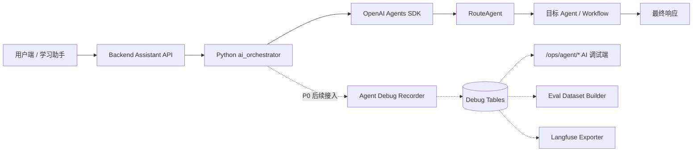
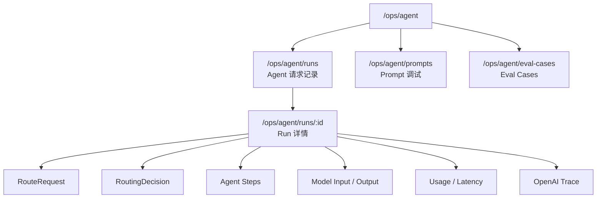

# AI 调试端设计

## 当前结论

AI 调试端是 PEAI 的 AI workflow observability / AI Ops 控制台，首期路径为 `/ops/agent/*`。

它不等同于业务管理员端。业务管理员端关注用户、作文、题库、Rubric 和审计；AI 调试端关注 Agent 请求、Prompt、路由决策、模型输入输出、usage、trace 和 eval case。

首期只有项目 owner 使用，因此暂不新增细粒度权限，先复用现有管理员登录校验。

## 端的边界

| 端 | 路径 | 主要用户 | 关注对象 | 首期权限 |
| --- | --- | --- | --- | --- |
| 业务管理员端 | `/admin/*` | 内容管理员、产品经理、教研、运营 | 用户、作文、题库、Rubric、审计、数据看板 | 现有 admin roles |
| AI 调试端 | `/ops/agent/*` | 开发者、AI 运营、项目 owner | Agent run、Prompt、RoutingDecision、模型输出、usage、eval case | 复用管理员登录 |

简单理解：

```text
业务管理员端 = 业务运营后台
AI 调试端 = AI 内核控制台
```

## 总体架构



AI 调试端当前先做页面结构，不直接实现 Debug Recorder。这样前端信息架构可以先稳定下来，后续再接数据库和真实 API。

## 首期页面

| 页面 | 路由 | 用途 | 当前状态 |
| --- | --- | --- | --- |
| 请求记录 | `/ops/agent/runs` | 查看每次 Agent 请求列表 | 空壳页面 |
| Run 详情 | `/ops/agent/runs/:id` | 查看单次请求的 RouteRequest、RoutingDecision、steps、Prompt 和输出 | 空壳页面 |
| Prompt 调试 | `/ops/agent/prompts` | 查看实际渲染后的 Prompt snapshot、prompt key、版本和 hash | 空壳页面 |
| Eval Cases | `/ops/agent/eval-cases` | 管理从真实请求沉淀出的 eval case | 空壳页面 |

首期入口：

- 直接访问：`/ops/agent/runs`
- 业务管理员端侧边栏：`AI Ops`
- AI 调试端内可返回：`/admin/dashboard` 和 `/app`

## 页面信息架构



## 视觉与交互原则

AI 调试端不是营销页，也不是普通内容后台。它应更接近工程调试控制台：

- 信息密度高，优先表格、JSON、日志、详情抽屉。
- 页面文案直接，避免解释性装饰。
- 优先展示可排查字段：run id、trace id、user id、conversation id、intent、workflow、target agent、model、tokens、latency、status。
- JSON 支持复制和下载。
- 错误信息要完整保留，不能只显示“请求失败”。
- 首期不做复杂图表，避免在没有真实数据前误导判断。

## 请求记录页设计

### 筛选项

后续接入真实数据时，请求记录页至少支持：

| 筛选项 | 说明 |
| --- | --- |
| 时间范围 | 最近 1 小时、今天、最近 7 天、自定义 |
| 用户 | user id、email、nickname |
| 会话 | conversation id |
| intent | RouteAgent 判断的意图 |
| workflow | 进入的 workflow |
| target agent | 目标 Agent |
| model | 实际使用模型 |
| status | completed、failed、partial |
| confidence | 路由置信度区间 |
| token range | total tokens 区间 |
| has error | 是否存在错误 |

### 列表字段

| 字段 | 说明 |
| --- | --- |
| 创建时间 | run 创建时间 |
| 用户输入 | message 摘要 |
| Intent | 路由意图 |
| Workflow / Agent | 实际执行目标 |
| 模型 | 主要模型 |
| Tokens | 总 token 用量 |
| Latency | 总耗时 |
| 状态 | completed、failed、partial |

## Run 详情页设计

Run 详情页应按排查顺序组织，而不是按数据库表组织：

1. 基础信息：run id、trace id、用户、会话、页面、模式、学段、模型。
2. RouteRequest：后端传给 RouteAgent 的完整结构化输入。
3. RoutingDecision：RouteAgent 输出的 intent、route_type、workflow、target_agent、confidence、missing_inputs。
4. Steps：RouteAgent、目标 Agent、tool call、workflow 的执行链路。
5. Prompt Snapshots：system、developer、user、variables、prompt hash。
6. Model IO：模型输入、模型输出、response id。
7. Usage：input tokens、cached input tokens、output tokens、requests、latency。
8. 操作：复制 JSON、下载脱敏 JSON、保存为 eval case、打开 OpenAI Trace。

## Prompt 调试页设计

Prompt 调试页用于回答三个问题：

- 这次到底用了哪个 Prompt？
- 运行时注入了哪些变量？
- 换模型或改 Prompt 后，输出是否退化？

首期字段：

| 字段 | 说明 |
| --- | --- |
| prompt_key | 业务 Prompt key，例如 `route_decision` |
| prompt_version | 人工版本或 git commit |
| prompt_hash | 渲染后 hash |
| agent_name | 使用该 Prompt 的 Agent |
| model | 目标模型 |
| system_prompt | system 指令 |
| developer_prompt | developer 指令 |
| user_prompt | 用户上下文 |
| variables_json | 注入变量 |

## Eval Cases 页设计

Eval Cases 是从真实请求中沉淀测试集，后续给 DeepEval 或本地 eval runner 使用。

首期 case 类型：

| 类型 | 用途 | 关键断言 |
| --- | --- | --- |
| route_eval | 判断路由是否正确 | intent、route_type、workflow、target_agent |
| scoring_eval | 判断评分是否稳定 | 分数区间、维度覆盖、禁止结论 |
| feedback_eval | 判断反馈质量 | 是否指出关键问题、是否给出可执行建议 |
| out_of_scope_eval | 判断越界请求 | 是否拒绝或轻量回答 |

从 Run 详情保存为 eval case 时，需要人工确认：

- 是否包含用户隐私。
- expected JSON 是否合理。
- case 标签是否准确。
- 是否适合进入长期回归集。

## 权限策略

首期：

- 复用现有管理员登录校验。
- 不新增 `admin.agent_debug.read` 等权限字段。
- 原因：当前只有项目 owner 使用，过早拆权限会增加实现成本。

后续多人协作时再补：

| 权限 | 用途 |
| --- | --- |
| `admin.agent_debug.read` | 查看 Agent 请求和详情 |
| `admin.agent_debug.export` | 导出 debug JSON |
| `admin.eval.manage` | 创建、编辑、归档 eval case |
| `admin.prompt_debug.read` | 查看 Prompt snapshot |

## 与 Agent Debug Recorder 的关系

AI 调试端是前端控制台，Agent Debug Recorder 是数据来源。

```text
Agent Debug Recorder
-> agent_debug_runs
-> agent_debug_steps
-> agent_prompt_snapshots
-> agent_eval_cases
-> /ops/agent/* 展示
```

当前页面是空壳，后续 P0 数据接入顺序建议：

1. 先接 `agent_debug_runs` 列表。
2. 再接 `agent_debug_steps` 详情。
3. 再接 `agent_prompt_snapshots`。
4. 最后接 Eval Dataset Builder。

## 非范围

首期不做：

- Langfuse UI 嵌入。
- DeepEval 在线运行。
- 多租户权限隔离。
- 自动 Prompt 优化。
- 自动模型选择。
- 用户画像与长期记忆调试。

## 验收标准

首期空壳验收：

- 登录管理员账号后可以访问 `/ops/agent/runs`。
- `/ops/agent/runs`、`/ops/agent/runs/:id`、`/ops/agent/prompts`、`/ops/agent/eval-cases` 都能正常渲染。
- `/admin/dashboard` 可以跳转到 AI Ops。
- AI Ops 可以返回业务管理员端。
- 不影响现有 `/admin/*` 业务后台。
- `web` 构建通过。
- 文档站构建通过。

后续真实数据验收：

- 请求列表能看到真实 Agent run。
- Run 详情能看到 RouteRequest、RoutingDecision、steps、Prompt、模型输出和 usage。
- 能复制或下载完整 debug JSON。
- 能从真实 run 保存为 eval case。

## 相关资料

- [Agent 可观测性与调试中心](./agent-observability-center.md)
- [路由 Agent](./路由agent.md)
- [OpenAI Agents SDK 中文学习笔记](./openai-agents-sdk-study-notes.md)
