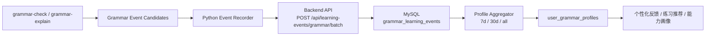

# Grammar Learning Events 持久化方案 v2

## 目标

将 `grammar-check` 和 `grammar-explain` 产生的学习事件持久化到 MySQL，用于后续用户画像、能力画像、个性化练习和学习报告。

v2 的核心增强：

- 补分母：新增 `grammar_sample_checked`。
- 补来源：新增 `content_origin`。
- 补画像资格：新增 `profile_eligible`。
- 补版本：记录 schema、skill、taxonomy、prompt、model 版本。
- 补 batch：使用批量事件 API。
- 改画像主键：支持 `7d` / `30d` / `all` 多窗口。

整体链路：

```text
Python Orchestrator
-> 生成 grammar learning events
-> 调 Backend Learning Event Batch API
-> Backend 校验 user/session 权限
-> 写入 MySQL event table
-> 聚合任务生成多窗口用户画像
```

## 总体架构



## 为什么不建议 Python 直接写 MySQL

推荐：

```text
Python Orchestrator -> Backend API -> MySQL
```

原因：

- `user_id` 权限校验应该在后端统一处理。
- 后端已经负责用户体系、会话、学习记录和画像。
- 数据库连接池、事务、重试、审计统一放后端更稳。
- Python agent 侧保持轻量，只负责生成事件。
- 以后迁移表结构或改数据策略，不需要改 agent runtime。

## MySQL 事件表 v2

```sql
CREATE TABLE grammar_learning_events (
  id BIGINT PRIMARY KEY AUTO_INCREMENT,
  event_id VARCHAR(128) NOT NULL UNIQUE,

  user_id BIGINT NOT NULL,
  conversation_id VARCHAR(64) NULL,
  message_id VARCHAR(64) NULL,

  event_type VARCHAR(64) NOT NULL,
  occurred_at DATETIME(3) NOT NULL,

  study_stage VARCHAR(32) NULL,
  assistant_mode VARCHAR(32) NULL,
  source_agent VARCHAR(64) NULL,
  task_type VARCHAR(64) NULL,

  content_origin VARCHAR(32) NOT NULL DEFAULT 'user_input',
  profile_eligible TINYINT(1) NOT NULL DEFAULT 1,
  confidence DECIMAL(4,3) NULL,

  schema_version VARCHAR(32) NULL,
  skill_version VARCHAR(32) NULL,
  taxonomy_version VARCHAR(32) NULL,
  prompt_version VARCHAR(32) NULL,
  model_version VARCHAR(64) NULL,

  grammar_question_type VARCHAR(64) NULL,
  grammar_error_type VARCHAR(64) NULL,
  style_issue_type VARCHAR(64) NULL,
  severity VARCHAR(16) NULL,
  sentence_hash VARCHAR(128) NULL,

  payload_json JSON NOT NULL,

  created_at_db DATETIME(3) NOT NULL DEFAULT CURRENT_TIMESTAMP(3),

  INDEX idx_user_type_time (user_id, event_type, occurred_at),
  INDEX idx_user_profile_time (user_id, profile_eligible, occurred_at),
  INDEX idx_conversation_message (conversation_id, message_id),
  INDEX idx_sentence_error (user_id, sentence_hash, grammar_error_type),
  INDEX idx_created_at_db (created_at_db)
);
```

### 字段说明

| 字段 | 说明 |
| --- | --- |
| `event_id` | 幂等键，确定性生成，避免重复写入 |
| `user_id` | 用户 ID，全链路使用 `BIGINT` / Python `int` |
| `conversation_id` | 会话 ID |
| `message_id` | 消息 ID |
| `event_type` | 四类 grammar learning event |
| `occurred_at` | 事件发生时间 |
| `study_stage` | 当前学段 |
| `assistant_mode` | 当前助手模式 |
| `source_agent` | 来源 agent，例如 `polish` / `grammar-check` |
| `task_type` | 当前任务类型 |
| `content_origin` | 文本来源 |
| `profile_eligible` | 是否默认进入画像聚合 |
| `confidence` | 事件置信度 |
| `schema_version` | 事件 schema 版本 |
| `skill_version` | skill 版本 |
| `taxonomy_version` | taxonomy 版本 |
| `prompt_version` | prompt 版本 |
| `model_version` | 模型版本 |
| `grammar_question_type` | 可索引的语法提问类型 |
| `grammar_error_type` | 可索引的语法错误类型 |
| `style_issue_type` | 可索引的表达优化类型 |
| `severity` | 错误严重程度 |
| `sentence_hash` | 句子 hash，用于分母统计和聚合去重 |
| `payload_json` | 事件完整细节 |
| `created_at_db` | 数据库写入时间 |

## 事件类型

v2 使用 4 类事件：

| event_type | 含义 | 是否影响画像 |
| --- | --- | --- |
| `grammar_sample_checked` | 检查过一个句子/样本，是计算错误率的分母 | 是 |
| `grammar_question_asked` | 用户主动询问语法点 | 是 |
| `grammar_error_detected` | 检测到明确语法错误 | 是 |
| `style_suggestion_detected` | 表达可优化，但不算语法错误 | 是，但不影响语法准确性 |

## content_origin

建议枚举：

- `user_input`
- `user_submission`
- `assistant_draft`
- `quoted_text`
- `exercise_prompt`

进入画像的默认口径：

```text
content_origin IN ('user_input', 'user_submission')
```

其他来源可以落库，但默认 `profile_eligible = 0`。

## Payload 设计

### grammar_sample_checked

```json
{
  "sentenceHash": "sha256:abc...",
  "hasGrammarIssue": true
}
```

### grammar_question_asked

```json
{
  "grammarQuestionType": "relative_clause",
  "topicLabel": "定语从句",
  "sourceText": "which 和 that 有什么区别？"
}
```

### grammar_error_detected

```json
{
  "grammarErrorType": "subject_verb_agreement",
  "severity": "medium",
  "span": "He go",
  "correction": "He goes",
  "sentenceHash": "sha256:abc..."
}
```

### style_suggestion_detected

```json
{
  "styleIssueType": "academic_tone",
  "span": "a lot of",
  "suggestion": "a significant number of",
  "reason": "TOEFL 写作中更正式",
  "sentenceHash": "sha256:abc..."
}
```

## 确定性 event_id

`event_id` 必须确定性生成，不能使用随机 UUID。

建议规则：

```text
event_id = sha256(user_id + "|" + message_id + "|" + event_type + "|" + logical_key)
```

`logical_key`：

| 事件类型 | logical_key |
| --- | --- |
| `grammar_sample_checked` | `sentence_hash` |
| `grammar_question_asked` | `grammar_question_type` |
| `grammar_error_detected` | `sentence_hash + "|" + grammar_error_type` |
| `style_suggestion_detected` | `sentence_hash + "|" + style_issue_type + "|" + span` |

这样 Python 重试时会生成同一个 `event_id`，后端可以幂等写入。

## Backend API

### Endpoint

```http
POST /api/learning-events/grammar/batch
```

鉴权口径：

- Python Orchestrator 调用时转发用户请求中的 `Authorization: Bearer ...`。
- Backend 从 JWT 解析当前用户，作为事件写入的权威 `user_id`。
- Request 中的 `userId` 仅用于幂等和调试校验；如果存在，必须与 JWT 用户一致。

### Request

```json
{
  "userId": 123,
  "conversationId": "conv_abc",
  "messageId": "msg_abc",
  "events": [
    {
      "eventId": "evt_grammar_xxx",
      "eventType": "grammar_sample_checked",
      "occurredAt": "2026-04-25T10:05:00.000Z",
      "studyStage": "toefl",
      "assistantMode": "writing",
      "sourceAgent": "polish",
      "taskType": "sentence_polish",
      "contentOrigin": "user_submission",
      "profileEligible": true,
      "confidence": 0.95,
      "schemaVersion": "grammar-event@v2",
      "skillVersion": "grammar-check@v1.2",
      "taxonomyVersion": "grammar-taxonomy@v1",
      "promptVersion": "grammar-check-prompt@v3",
      "modelVersion": "gpt-5-mini",
      "payload": {
        "sentenceHash": "sha256:abc",
        "hasGrammarIssue": true
      }
    },
    {
      "eventId": "evt_grammar_yyy",
      "eventType": "grammar_error_detected",
      "occurredAt": "2026-04-25T10:05:00.000Z",
      "studyStage": "toefl",
      "assistantMode": "writing",
      "sourceAgent": "polish",
      "taskType": "sentence_polish",
      "contentOrigin": "user_submission",
      "profileEligible": true,
      "confidence": 0.92,
      "schemaVersion": "grammar-event@v2",
      "skillVersion": "grammar-check@v1.2",
      "taxonomyVersion": "grammar-taxonomy@v1",
      "promptVersion": "grammar-check-prompt@v3",
      "modelVersion": "gpt-5-mini",
      "payload": {
        "grammarErrorType": "subject_verb_agreement",
        "severity": "medium",
        "span": "He go",
        "correction": "He goes",
        "sentenceHash": "sha256:abc"
      }
    }
  ]
}
```

### Response

```json
{
  "success": true,
  "acceptedCount": 2,
  "deduplicatedCount": 0,
  "rejectedCount": 0,
  "results": [
    {"eventId": "evt_grammar_xxx", "status": "accepted"},
    {"eventId": "evt_grammar_yyy", "status": "accepted"}
  ]
}
```

## Python Orchestrator 侧职责

Python 侧不直接写数据库，只负责：

1. 从 skill / agent 结构化结果中生成事件候选。
2. 补齐上下文。
3. 生成确定性 `event_id`。
4. 调后端 batch API。

```python
class GrammarLearningEventContext(BaseModel):
    user_id: int
    conversation_id: str
    message_id: str
    study_stage: str | None
    assistant_mode: str | None
    source_agent: str
    task_type: str
```

发送策略：

- API 调用失败不阻塞用户回复。
- 失败要记录日志。
- 后续可以加本地 retry queue。
- 低置信事件也可以发送，但默认 `profile_eligible = 0`。

## 画像表 v2

```sql
CREATE TABLE user_grammar_profiles (
  user_id BIGINT NOT NULL,
  profile_scope VARCHAR(16) NOT NULL,
  aggregation_version VARCHAR(32) NOT NULL,
  source_max_occurred_at DATETIME(3) NULL,
  source_event_count INT NOT NULL DEFAULT 0,
  profile_json JSON NOT NULL,
  updated_at DATETIME(3) NOT NULL,
  PRIMARY KEY (user_id, profile_scope)
);
```

`profile_scope` 第一批支持：

- `7d`
- `30d`
- `all`

Agent 个性化默认读取 `7d` + `30d`，年度总结或长期报告可读 `all` 或年度快照。

## 画像 JSON v2

```json
{
  "grammar_interest_profile": {
    "top_topics": [
      {
        "type": "relative_clause",
        "label": "定语从句",
        "count": 8,
        "last_seen": "2026-04-25T10:00:00Z"
      }
    ]
  },
  "grammar_error_profile": {
    "top_errors": [
      {
        "type": "article",
        "count": 12,
        "weighted_score": 23,
        "last_seen": "2026-04-24T18:20:00Z"
      }
    ],
    "repeated_errors": ["article", "preposition"],
    "checked_sentence_count": 120,
    "error_sentence_count": 34,
    "clean_sentence_rate": 0.7167
  },
  "style_profile": {
    "top_style_suggestions": [
      {
        "type": "academic_tone",
        "count": 6,
        "last_seen": "2026-04-25T10:00:00Z"
      }
    ]
  }
}
```

## 聚合规则

进入画像：

```text
profile_eligible = 1
AND confidence >= 0.7
AND content_origin IN ('user_input', 'user_submission')
```

语法错误分数：

```text
weighted_score = severity_weight * confidence_weight
```

其中：

- `high = 3`
- `medium = 2`
- `low = 1`
- `0.7 <= confidence < 0.8 -> 0.8`
- `0.8 <= confidence < 0.9 -> 0.9`
- `confidence >= 0.9 -> 1.0`

去重：

- 写入层：只按 `event_id` 幂等。
- 聚合层：`grammar_error_detected` 在同一消息内按 `user_id + message_id + sentence_hash + grammar_error_type` 折叠成一次。

风格建议：

- `style_suggestion_detected` 只影响表达成熟度。
- 不进入语法准确性扣分。

## 第一批上线范围

事件层：

- `grammar_sample_checked`
- `grammar_question_asked`
- `grammar_error_detected`
- `style_suggestion_detected`

存储层：

- 事件表 v2
- batch API
- 幂等写入
- 版本字段
- `content_origin`
- `profile_eligible`

聚合层：

- `7d` / `30d` / `all`
- `top_topics`
- `top_errors`
- `repeated_errors`
- `top_style_suggestions`
- `checked_sentence_count`
- `clean_sentence_rate`

暂不做：

- 用户是否采纳修改。
- 纠错后的改善趋势。
- 复杂推荐策略。
- 实时回写画像。
- `gap_profile`。

## 最终推荐

采用：

```text
Python Orchestrator
-> Backend Batch API
-> MySQL grammar_learning_events
-> 多窗口 user_grammar_profiles
```

不要先做 SQLite。该需求已经明确服务用户画像和能力画像，直接 MySQL 更合适。
