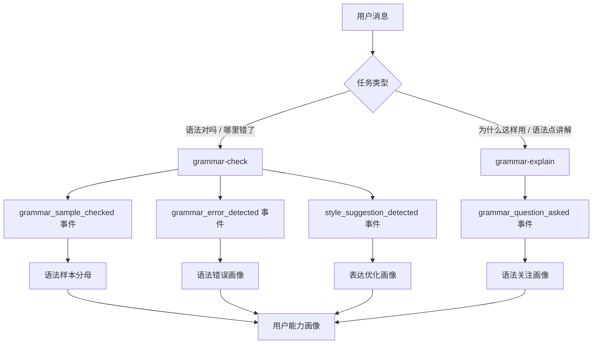
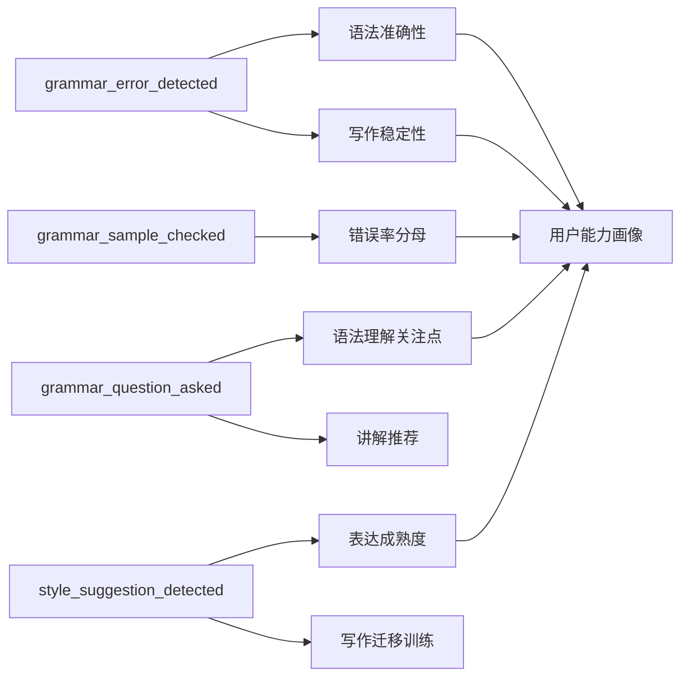

# Grammar Skills 与用户画像统计设计

本文说明 `grammar-check` 与 `grammar-explain` 两个 Skill 的职责边界，以及它们如何影响用户画像和用户能力评估。

## Skill 边界

| Skill | 解决的问题 | 典型用户输入 | 不负责 |
| --- | --- | --- | --- |
| `grammar-check` | 检查英文表达是否有明确语法错误，并给出最小修正 | “这句话语法对吗？”、“哪里错了？”、“帮我改语法” | 风格润色、作文评分、多版本改写 |
| `grammar-explain` | 讲清楚某个语法点是什么、怎么用、和其他结构有什么区别 | “which 和 that 有什么区别？”、“这里为什么用完成时？”、“这个从句是什么？” | 检错、评分、多版本润色 |

二者必须分开统计：

- `grammar-check` 反映用户**实际写作错误模式**。
- `grammar-explain` 反映用户**主动关注或理解薄弱的语法主题**。

不要把“用户问过某语法点”直接等同于“用户犯了这个语法错误”。

## 数据流



## 事件层字段

事件层记录原始、可聚合的数据。字段应尽量稳定，避免只保存自然语言回答。

### 1. 语法提问事件

来源：`grammar-explain`

```json
{
  "event_type": "grammar_question_asked",
  "user_id": 123,
  "conversation_id": "c_001",
  "message_id": "m_001",
  "occurred_at": "2026-04-25T10:00:00Z",
  "study_stage": "toefl",
  "assistant_mode": "chat",
  "content_origin": "user_input",
  "profile_eligible": true,
  "grammar_question_type": "relative_clause",
  "topic_label": "定语从句",
  "source_text": "which 和 that 有什么区别？",
  "confidence": 0.92
}
```

统计口径：

- `grammar_question_type` 使用稳定枚举，例如 `relative_clause`、`tense`、`non_finite_verb`。
- `topic_label` 用于中文展示，不作为聚合主键。
- `confidence < 0.7` 的事件只进入日志，不进入画像聚合。
- `content_origin` 必须是 `user_input` 或 `user_submission` 才默认进入画像。
- `profile_eligible = false` 的事件保留日志，但不进入画像聚合。
- 同一用户短时间内重复追问同一语法点，可以合并为一次 session-level 关注。

画像影响：

- 高频提问主题进入 `grammar_interest_profile`。
- 最近高频提问主题可作为复习推荐和讲解深度调节依据。
- 只表示“关注/疑惑”，不直接表示“写作错误”。

### 2. 语法样本检查事件

来源：`grammar-check`，每检查一个用户输入句子或样本，都应产生一个轻量分母事件。

```json
{
  "event_type": "grammar_sample_checked",
  "user_id": 123,
  "conversation_id": "c_002",
  "message_id": "m_009",
  "occurred_at": "2026-04-25T10:05:00Z",
  "study_stage": "toefl",
  "assistant_mode": "writing",
  "source_agent": "polish",
  "task_type": "sentence_polish",
  "content_origin": "user_submission",
  "profile_eligible": true,
  "sentence_hash": "sha256:...",
  "has_grammar_issue": true,
  "confidence": 0.95
}
```

统计口径：

- 用于计算 `checked_sentence_count`、`error_sentence_count`、`clean_sentence_rate`。
- 同一消息内同一句样本只计一次，使用 `message_id + sentence_hash` 去重。
- 只统计用户自己的输入或提交文本，不统计助手改写稿、题目文本或引用文本。

画像影响：

- 提供错误率分母，避免只看错误次数。
- 支持判断“最近是否改善”，例如错误次数下降但检查样本也下降时不能误判。

### 3. 语法错误事件

来源：`grammar-check`，以及后续 Polish / Scoring 调用 grammar-check 后产生的结构化结果。

```json
{
  "event_type": "grammar_error_detected",
  "user_id": 123,
  "conversation_id": "c_002",
  "message_id": "m_009",
  "occurred_at": "2026-04-25T10:05:00Z",
  "study_stage": "toefl",
  "assistant_mode": "writing",
  "source_agent": "polish",
  "task_type": "sentence_polish",
  "content_origin": "user_submission",
  "profile_eligible": true,
  "grammar_error_type": "subject_verb_agreement",
  "severity": "medium",
  "span": "He go",
  "correction": "He goes",
  "sentence_hash": "sha256:...",
  "confidence": 0.88
}
```

统计口径：

- `grammar_error_type` 必须枚举化，不能自由文本。
- `severity` 用于加权：`high=3`、`medium=2`、`low=1`。
- `confidence < 0.7` 不进入能力画像。
- 同一消息内同一句同一错误类型只计一次，使用 `message_id + sentence_hash + grammar_error_type` 去重。
- `span` 用于短期复盘；长期画像可以只保留类型、计数、权重和最近出现时间。

画像影响：

- 高频错误进入 `grammar_error_profile.top_errors`。
- 加权分高的错误进入能力短板。
- 连续多次出现同类错误时，标记为 repeated error。

### 4. 表达优化事件

来源：`grammar-check` 对“非语法错误”的判断，或 Polish Agent 的表达优化结果。

```json
{
  "event_type": "style_suggestion_detected",
  "user_id": 123,
  "occurred_at": "2026-04-25T10:10:00Z",
  "study_stage": "toefl",
  "source_agent": "polish",
  "content_origin": "user_submission",
  "profile_eligible": true,
  "style_issue_type": "informal_expression",
  "span": "a lot of",
  "suggestion": "a significant number of",
  "reason": "TOEFL 写作中更正式",
  "confidence": 0.84
}
```

统计口径：

- 表达不够高级、不够自然、不够正式，不能计入 `grammar_error_detected`。
- 只进入表达优化画像，不降低语法准确性能力分。
- `style_issue_type` 可先保持小集合，例如 `informal_expression`、`word_choice`、`cohesion`、`academic_tone`。

画像影响：

- 用于判断用户是否需要表达升级训练。
- 可影响推荐内容，例如“学术表达替换”“连接词训练”“观点句模板”。
- 不作为语法错误扣分依据。

## 画像层字段

画像层是事件聚合后的稳定结果，不保留过多原文。

```json
{
  "user_id": 123,
  "profile_scope": "30d",
  "grammar_interest_profile": {
    "top_topics": [
      {
        "type": "relative_clause",
        "label": "定语从句",
        "count": 8,
        "last_seen": "2026-04-25T10:00:00Z"
      }
    ]
  },
  "grammar_error_profile": {
    "top_errors": [
      {
        "type": "article",
        "count": 12,
        "weighted_score": 23,
        "last_seen": "2026-04-24T18:20:00Z"
      }
    ],
    "repeated_errors": ["article", "preposition"],
    "checked_sentence_count": 120,
    "error_sentence_count": 34,
    "clean_sentence_rate": 0.7167
  },
  "style_profile": {
    "top_style_suggestions": [
      {
        "type": "academic_tone",
        "count": 6,
        "last_seen": "2026-04-25T10:00:00Z"
      }
    ]
  }
}
```

## 能力影响口径



### 语法准确性

主要由 `grammar_error_detected` 影响。

建议计算：

```text
grammar_accuracy_risk_30d =
  sum(error_count_by_type * severity_weight * confidence_weight)
```

其中：

- `severity_weight`: high=3, medium=2, low=1
- `confidence_weight`: 0.7-0.8 = 0.8, 0.8-0.9 = 0.9, >0.9 = 1.0
- 近 7 天权重可高于 30 天历史

例子：

```text
article: 5 次 medium, confidence 平均 0.9
preposition: 3 次 high, confidence 平均 0.85

article score = 5 * 2 * 0.9 = 9
preposition score = 3 * 3 * 0.9 = 8.1
```

画像结论：

```text
用户近期语法准确性主要短板是冠词和介词。
```

### 语法样本质量

主要由 `grammar_sample_checked` 和 `grammar_error_detected` 共同影响。

建议计算：

```text
clean_sentence_rate =
  checked_sentence_count == 0
    ? null
    : (checked_sentence_count - error_sentence_count) / checked_sentence_count
```

例子：

```text
checked_sentence_count: 120
error_sentence_count: 34
clean_sentence_rate: 0.7167
```

画像结论：

```text
用户最近 30 天约 72% 的提交句子没有明确语法错误，主要问题集中在冠词和介词。
```

### 语法理解关注点

主要由 `grammar_question_asked` 影响。

建议计算：

```text
grammar_interest_score =
  count + recent_bonus + follow_up_bonus
```

其中：

- `count`: 当前 `profile_scope` 内该语法点提问次数。
- `recent_bonus`: 最近 7 天出现加权更高。
- `follow_up_bonus`: 同一会话连续追问同一语法点，说明疑惑更强。

例子：

```text
relative_clause: 8 次，其中 4 次在最近 7 天
tense: 5 次，其中 1 次在最近 7 天
```

画像结论：

```text
用户近期高度关注定语从句，应优先提供定语从句的分层讲解和迁移练习。
```

### 表达成熟度

主要由 `style_suggestion_detected` 影响。

建议单独计算，不与语法错误混合：

```text
style_development_need =
  count(style_suggestion_type) * stage_weight
```

例子：

```text
academic_tone: 6 次
cohesion: 4 次
word_choice: 3 次
```

画像结论：

```text
用户语法问题不一定严重，但 TOEFL 写作表达需要提升正式度和衔接。
```

## 示例

### 示例 A：语法检错影响画像

用户输入：

```text
He go to school every day.
```

`grammar-check` 输出事件：

```json
{
  "event_type": "grammar_error_detected",
  "grammar_error_type": "subject_verb_agreement",
  "severity": "medium",
  "span": "He go",
  "correction": "He goes",
  "confidence": 0.95
}
```

画像影响：

- `checked_sentence_count += 1`
- `error_sentence_count += 1`
- `subject_verb_agreement.count += 1`
- `subject_verb_agreement.weighted_score += 2 * 1.0`
- 如果 30 天内多次出现，加入 `repeated_errors`

### 示例 B：语法讲解影响画像

用户输入：

```text
which 和 that 有什么区别？
```

`grammar-explain` 输出事件：

```json
{
  "event_type": "grammar_question_asked",
  "grammar_question_type": "relative_clause",
  "topic_label": "定语从句",
  "confidence": 0.92
}
```

画像影响：

- `relative_clause.count += 1`
- 更新 `relative_clause.last_seen`
- 不增加任何语法错误计数

### 示例 C：表达优化不影响语法错误

用户输入：

```text
Reading books is good for students.
```

如果系统建议：

```text
Reading plays an important role in broadening students' knowledge.
```

这只能产生：

```json
{
  "event_type": "style_suggestion_detected",
  "style_issue_type": "academic_tone",
  "confidence": 0.86
}
```

画像影响：

- 增加表达成熟度相关统计。
- 不增加语法错误。
- 不降低语法准确性能力评估。

## 落地建议

第一阶段只记录事件，不急着生成复杂画像。

建议优先落地：

1. `grammar_question_asked`
2. `grammar_sample_checked`
3. `grammar_error_detected`
4. `style_suggestion_detected`

第二阶段再做 7 天、30 天、全部历史三个窗口的聚合。

第三阶段把画像用于：

- 学段化讲解深度调整。
- 个性化练习推荐。
- 润色理由侧重。
- 评分反馈中的高频错误提醒。
