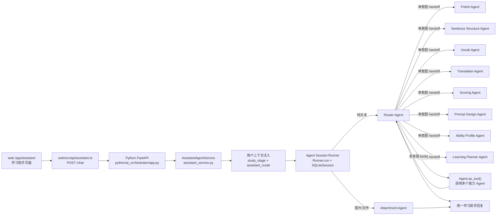

# 学习助手 Agent 架构

## 当前目标

学习助手页面通过 Python Agents SDK 提供多 Agent 编排能力。前端负责聊天体验、会话本地持久化、同浏览器附件恢复、学段传递、对话模式选择和图片/文件上传；Python orchestrator 负责加载 prompt、注入用户上下文、维护文本会话 session。纯文本消息通过 Router Agent 在 8 个英语学习能力 Agent 之间路由和组合结果；带附件消息直接交给多模态 `Attachment Agent`，避免图片或文件在 handoff 链路中丢失。工程命名继续保留 `Router Agent`，但 prompt 职责定位为 `PEAI Learning Orchestrator`：它兼具 intent routing、multi-agent tool orchestration 和统一回复汇总能力。

## 总体架构



## Agent 组成

| Agent | 职责 |
| --- | --- |
| Router Agent | 工程名保留 Router；职责定位为 PEAI Learning Orchestrator，负责标准 intent 判断、单意图 handoff、多意图调用 tool-agent 并汇总 |
| Attachment Agent | 处理带图片、截图和文件的英语学习请求；直接读取附件内容并完成翻译、评分、润色、句子分析、词汇解释或练习设计 |
| Polish Agent | 润色、改写、表达升级，保留原意并解释关键修改 |
| Sentence Structure Agent | 句子结构、语法结构、从句、长难句和可读性分析 |
| Vocab Agent | 单词、短语、搭配、词义辨析、常见误用 |
| Translation Agent | 中英互译、译文质量解释、表达差异 |
| Scoring Agent | 作文/段落/句子评分、问题诊断、优先改进建议 |
| Prompt Design Agent | 出题、练习生成、训练任务设计 |
| Ability Profile Agent | 能力画像解读；第一版只基于当前上下文和学段谨慎判断 |
| Learning Planner Agent | 学习路径、阶段目标、短期学习计划；第一版不持久化 |

8 个纯文本能力 Agent 都有独立 prompt 文件、`handoff_description`、tool name 和 tool description。Router 同时挂载 handoff 与 `Agent.as_tool()`，但不会向用户暴露内部 agent、tool、intent、reason 或 confidence。`Attachment Agent` 不挂载 handoff 或 tool，带附件消息由它直接完成，避免多模态输入在转交过程中丢失。

## 路由策略

单一明确任务使用 handoff：

- 润色、改写、表达升级 -> `Polish Agent`
- 句子结构、语法结构、长难句 -> `Sentence Structure Agent`
- 单词、短语、搭配、词义辨析 -> `Vocab Agent`
- 中英互译、译文质量解释 -> `Translation Agent`
- 评分、评价、纠错、问题诊断 -> `Scoring Agent`
- 出题、练习、训练任务设计 -> `Prompt Design Agent`
- 当前能力、优势弱点、画像解读 -> `Ability Profile Agent`
- 学习路径、阶段目标、复习安排 -> `Learning Planner Agent`

多意图请求使用 agents-as-tools，由 Router 汇总：

- “翻译并润色” -> `Translation Agent` tool + `Polish Agent` tool
- “评价并给高级改写” -> `Scoring Agent` tool + `Polish Agent` tool
- “讲这个词并出几道练习” -> `Vocab Agent` tool + `Prompt Design Agent` tool
- “分析句子结构并翻译” -> `Sentence Structure Agent` tool + `Translation Agent` tool

非英语学习请求会简短收口，并引导用户改成英语学习任务。

## 学段与画像

前端传入的 `study_stage` 会被标准化为中文标签并注入到 Agent 输入中。所有 Agent 必须将其作为个性化依据，但不能复述「用户画像上下文」这个内部标签。

Python 侧按学段注入独立输出标准，而不是只注入一段共享泛化原则。学段标准作为统一 prompt 资产维护在 `python/ai_orchestrator/prompts/shared/stage_output_standards.md`，运行时只选择当前学段对应段落。小学、初中、高中分别控制解释深度、词汇难度、句子长度、反馈颗粒度、修改幅度和练习难度；四级、六级、考研、雅思、托福分别按对应考试目标控制回答难度和评分口径。小学到高中例句风格贴近校内教材和《新概念英语》难度；四级到托福例句风格贴近真题、外刊和杂志表达。所有例句默认生成原创文本，不复制或声称来自真实教材、真题、《经济学人》或其他杂志。

前端也可以传入 `assistant_mode`。第一版支持：

- `default`：普通学习助手模式，不额外改变输出导向。
- `exam`：考试模式。Agent 输入会注入「对话模式上下文」，要求回答以考试目标为导向，优先关注评分口径、答题策略、提分表达和训练建议。

`study_stage` 和 `assistant_mode` 是两类不同上下文：学段决定难度与口径，考试模式决定输出目标和风格。两者可以叠加，例如「雅思 + 考试模式」。

`Ability Profile Agent` 当前不直接读写 Java 后端画像数据。后续接入方向是将画像能力下沉为结构化 tool，例如：

- `get_user_profile`
- `get_stage_policy`
- `get_ability_profile`
- `update_ability_profile`

## 接口与状态

`POST /chat` 的前端契约保持向后兼容：

- 请求由 `message`、`conversation_id`、可选 `study_stage`、可选 `assistant_mode` 和 `files[]` 组成。
- 响应仍为 `reply`、`conversationId`、`agentName`。
- 路由 metadata 只进入 Python 日志和测试，不进入前端 API。

文本对话使用 `SQLiteSession`。带附件对话使用 Responses input items 并直接调用 `Attachment Agent`，当前不同时使用 session。

## 图片与文件上传

学习助手第一版上传能力是临时上下文输入，不是文件资产管理：

- `+` 菜单用于从电脑选择照片和文件。
- 对话输入框支持粘贴截图或复制来的图片。
- 对话输入框支持拖拽图片。
- 前端有附件时使用 `multipart/form-data` 调用 Java 后端；纯文本消息继续使用 JSON。
- Java 后端在同一路径按 `Content-Type` 区分 JSON 与 multipart，校验后把文件转发给 Python `/chat`。
- Python `/chat` 将图片转成 `input_image`，将 PDF/TXT/DOC/DOCX 转成 `input_file`。
- 带附件消息不走 Router handoff 链，直接交给 `Attachment Agent` 读取图片或文件内容后回答。
- 附件文件本身不写入后端数据库；前端使用 `localStorage` 保存附件 metadata，使用 IndexedDB 保存 Blob，以支持同一浏览器内刷新和重新打开后的历史附件预览。

第一版限制：

- 最多 5 个项目。
- 单个文件最大 10MB。
- 图片支持 PNG、JPG/JPEG、WebP。
- 文件支持 PDF、TXT、DOC、DOCX。
- 粘贴和拖拽只接收图片；`+` 菜单接收图片和上述文件。
- 附件不写入数据库，不做账号级云端同步，不在分享页展示。
- 同一台电脑、同一浏览器内支持刷新和重新打开后恢复附件预览；换电脑、换浏览器或清除站点数据后附件可消失。

## 验证

Python 侧路由结构由以下测试覆盖：

- Router 挂载 8 个 handoff。
- Router 暴露 8 个 tool-agent。
- 每个 Agent 有 handoff 和 tool 描述。
- 每个 prompt 文件可加载。
- 路由回归样例覆盖单意图、多意图和非英语学习收口。

推荐验证命令：

```bash
.\python\.venv\Scripts\python.exe -m unittest discover -s python\ai_orchestrator\tests
```

## 后续演进

- 将 Java 后端已有的能力画像接入 Python orchestrator。
- 将学习规划从建议型回复升级为可保存、可跟踪的学习计划。
- 为 scoring、polish、vocab 等核心能力补结构化输出 schema。
- 增加线上路由日志分析和 prompt 回归集。
