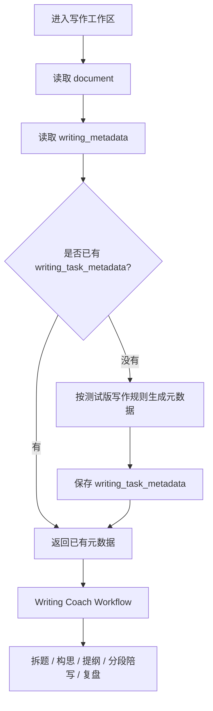

# Writing Task Metadata 设计

`WritingTaskMetadata` 是写作助教工作流的题目任务标准层。它回答一个问题：

> 这篇作文应该围绕什么中心来写，才能符合当前题目和阶段要求？

它不是用户草稿，也不是写作教练进度。

```text
Document
用户当前作文正文、版本和提交记录

WritingMetadata
写作会话题目快照、学段、模式、附件、来源

WritingTaskMetadata
这篇题目的中心任务、必答点、写作重点、风险点和推荐结构

WritingCoachWorkflowState
用户当前进行到写作助教的哪一步
```

## 数据流



## 当前 v1 范围

当前版本先用测试版规则生成，不调用 LLM，也不声明等同于正式考试评分标准。

版本标记：

```text
metadata_version = writing-task-metadata@test-v1
rubric_source = writing-coach-stage-policy@test-v1
```

后续 `writing_rubric_standards.md` 完成后，可以替换生成策略，但表结构和工作流依赖关系不需要推翻。

## 字段口径

| 字段 | 说明 |
| --- | --- |
| `document_id` | 内部文档 ID |
| `document_public_id` | 前端使用的文档 ID |
| `user_id` | 文档所有者 |
| `study_stage` | 当前学段 |
| `assistant_mode` | 写作模式，例如 `exam` |
| `prompt_text` | 当前题目/写作要求快照 |
| `task_type` | 测试版题型，例如 `argumentative` / `chart_description` / `general_essay` |
| `central_task` | 本篇作文的中心写作任务 |
| `must_answer_points_json` | 必须回应的要点 |
| `writing_focus_json` | 写作过程中的关注重点 |
| `risk_points_json` | 容易跑题或扣分的风险 |
| `recommended_structure_json` | 推荐段落结构 |
| `rubric_focus_json` | 后续 review 重点 |
| `metadata_version` | 元数据生成版本 |
| `rubric_source` | 当前规则来源 |

## API

写作工作区进入时调用：

```http
POST /api/docs/{docId}/writing-task-metadata
```

语义是 `ensure`：

- 如果已经存在，直接返回。
- 如果不存在，根据 `documents` 和 `writing_metadata` 生成并保存。
- 当前用户必须是文档所有者。

返回示例：

```json
{
  "documentId": "doc_abc",
  "studyStage": "ielts",
  "assistantMode": "exam",
  "promptText": "Is Online Learning Better Than Traditional Learning?",
  "taskType": "argumentative",
  "centralTask": "围绕题目建立清晰中心观点，并用理由、例子和段落逻辑证明这个观点。",
  "mustAnswerPoints": [
    "明确回答题目核心问题",
    "给出清晰立场或中心判断"
  ],
  "recommendedStructure": {
    "intro": "背景引入 + 改写题目 + 明确中心观点",
    "body_1": "第一个理由/要点 + 解释 + 例子",
    "body_2": "第二个理由/要点 + 对比或补充说明",
    "conclusion": "总结判断 + 回扣题目"
  },
  "metadataVersion": "writing-task-metadata@test-v1",
  "rubricSource": "writing-coach-stage-policy@test-v1"
}
```

## 与写作助教工作流的关系

Writing Coach 的每一步都应注入这份元数据：

```text
0. Intake 收集任务：确认题目和任务信息
1. Prompt Analysis 拆题：基于 central_task / must_answer_points
2. Idea Generation 生成思路：不能偏离 central_task
3. Position Selection 确定观点：必须覆盖 must_answer_points
4. Outline Building 搭提纲：围绕 recommended_structure
5. Paragraph Drafting 分段陪写：每段服务 outline 和 central_task
6. Draft Assembly 合成初稿：检查段落是否衔接
7. Rubric Review 按标准检查：使用 rubric_focus
8. Targeted Revision 定向修改：优先处理 risk_points
9. Final Delivery 输出终稿：回到题目中心
10. Reflection 复盘沉淀：总结可复用模板
```

原则：写作助教可以调整表达和写法，但不能擅自改变 `WritingTaskMetadata` 对题目中心任务的定义。
