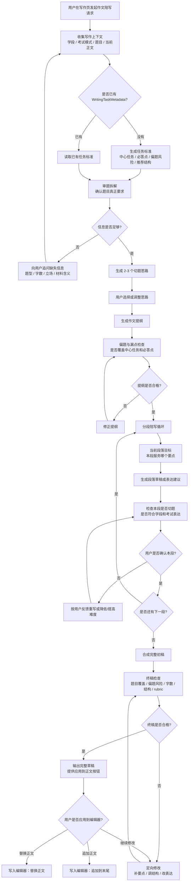

# 写作教练 Agent 设计

## 定位

Writing Coach Agent 是 PEAI 写作页的从零到一作文陪写 Agent。它不是普通代写助手，也不是单次范文生成器，而是围绕当前题目、学段、考试模式和评分标准，陪用户多轮完成审题、构思、提纲、分段写作、草稿合成和偏题检查。

产品交互上，Writing Coach 应按 **Cursor for Essay Writing** 设计：左侧是作文编辑器，右侧是 Agent Composer / 写作教练面板，Agent 能读取正文、理解选区、提出修改、生成 patch，并在用户确认后安全应用到正文。

核心产品公式：

```text
PEAI Writing Coach =
Essay Editor + Agent Composer + Writing Plan Context + Safe Apply
```

核心目标：

- 帮用户理解题目要求，而不是直接跳到完整作文。
- 在考试模式下严格对齐学段、考试标准、rubric、字数和题型。
- 在自由写作模式下仍参考学段，但允许更开放的表达和内容探索。
- 每一轮输出都要服务当前题目的中心任务，避免跑题、漏点和结构失衡。
- AI 建议必须可审阅、可应用、可撤销，不允许自动覆盖用户正文。

与 Cursor 的产品映射：

| Cursor | PEAI 写作页 |
| --- | --- |
| 代码编辑器 | 作文编辑器 |
| Chat / Composer | 写作教练 Agent Composer |
| 选中代码提问 | 选中句子或段落问“是否跑题 / 怎么改” |
| Apply patch | 应用到正文、替换选区、插入下一段 |
| Inline edit | 局部润色、扩写、降低难度、考试化表达 |
| Project context | 题目、学段、rubric、当前作文、WritingTaskMetadata |
| Diagnostics | 偏题提醒、语法问题、评分短板 |
| Plan mode | 审题、提纲、分段陪写 |

## 适用场景

Writing Coach Agent 主要承接 `first_draft_coach` 类请求，例如：

- 这个题目第一段应该怎么开头？
- 帮我搭一个作文提纲。
- 我下一段该写什么？
- 我不知道这篇作文怎么写，你一步步带我写。
- 根据这个题目，从零开始帮我完成一篇作文。
- 这段内容是否偏离题目？下一步怎么补回来？

不属于 Writing Coach Agent 的场景：

- 正式评分、分数诊断、rubric 打分：交给 Scoring Agent。
- 单句语法、句子结构、长难句分析：交给 Sentence Structure Agent。
- 生成作文题、训练任务、题单：交给 Prompt Design Agent。
- 单纯润色改写：交给 Polish Agent。

与 Prompt Design Agent 的边界：

- Prompt Design Agent 负责“生成新题目、设计训练任务、生成题单、设计练习要求”。
- Writing Coach Agent 负责“围绕已有题目陪用户完成作文”。
- 如果用户的题目分析是为了进入写作流程，例如“这个题怎么写、怎么立意、怎么搭提纲”，应归 Writing Coach Agent。
- 如果用户的题目分析是为了生成或改造练习题，例如“帮我设计一个类似题目、出 3 道训练题”，应归 Prompt Design Agent。

## 上下文输入

Agents SDK 的本地 `context` 不会自动进入模型上下文。Writing Coach Agent 需要显式接收写作页和后端装配出的上下文。

| 字段 | 来源 | 用途 |
| --- | --- | --- |
| `studyStage` | 用户学习阶段 / 目标考试 | 控制语言难度、讲解深度、句型复杂度和评分口径。 |
| `writingMode` | 写作页模式 | 区分自由写作和考试写作。 |
| `taskPrompt` | 当前作文题目 | 审题、立意、提纲、偏题检查的核心依据。 |
| `draftText` | 当前编辑器正文 | 判断用户已经写到哪一步，以及是否需要续写、修正或合成。 |
| `taskType` | 写作题型 | 影响结构，例如书信、议论文、图表作文、材料作文。 |
| `wordRange` | 题目或考试要求 | 控制段落长度、完整草稿字数和是否达标。 |
| `rubricKey` | 当前评分标准版本 | 让 trace、调试和回归能定位本次使用的标准。 |
| `rubricText` | 当前评分标准文本 | 在考试模式下约束任务完成度、结构、词汇、语法和档位目标。 |
| `WritingTaskMetadata` | 写作任务标准层 | 提供中心任务、必答点、偏题风险、推荐结构和 rubric 关注点。 |

建议输入渲染为受控数据块：

```text
[写作上下文]
- 写作模式: exam
- 学段/目标: 考研
- 当前题目: ...
- 当前正文: ...
- 题型: ...
- 字数要求: ...

[写作任务标准]
- 中心任务: ...
- 必答点: ...
- 偏题风险: ...
- 推荐结构: ...
- rubric 关注点: ...
```

## 多轮工作流

Writing Coach Agent 应按阶段推进，而不是每轮都重新生成一篇作文。每个阶段都允许用户确认、修改或回退。



## 最小多轮状态

v1 不新增复杂持久化状态机，但必须有最小状态口径，避免每轮对话都从审题重新开始。该状态可以先沉淀在 active task summary、对话摘要或前端写作上下文中，后续再升级为 `WritingCoachWorkflowState`。

建议最小状态：

| 字段 | 含义 | 示例 |
| --- | --- | --- |
| `currentStage` | 当前陪写阶段 | `prompt_analysis` / `idea_selection` / `outline_building` / `paragraph_drafting` / `draft_assembly` / `revision` |
| `analysisConfirmed` | 用户是否确认审题结果 | `true` / `false` |
| `selectedIdea` | 用户确认的立意或观点 | `online learning is helpful but needs discipline` |
| `outlineConfirmed` | 用户是否确认提纲 | `true` / `false` |
| `outlineSummary` | 当前提纲摘要 | 开头、主体段、结尾的短摘要。 |
| `currentParagraphIndex` | 当前正在陪写第几段 | `1` / `2` / `3` |
| `confirmedParagraphs` | 已确认段落摘要或文本 | 已完成的开头段、主体段等。 |
| `draftAssembled` | 是否已经生成完整初稿 | `true` / `false` |
| `lastRelevanceStatus` | 最近一次偏题检查状态 | `aligned` / `risk` / `off_topic` |

阶段推进原则：

- 用户确认审题后，才能进入立意或提纲。
- 用户确认提纲后，才能进入稳定的分段陪写。
- 每段确认后更新 `confirmedParagraphs` 和 `currentParagraphIndex`。
- 生成完整草稿前必须已有已确认提纲，或者用户明确要求跳过陪写直接生成。
- 如果 `check_topic_relevance` 返回 `risk` 或 `off_topic`，优先进入 `revision`，不要继续润色。

## 偏题控制

偏题判断不是评分阶段才做的事情。Writing Coach Agent 必须在多轮陪写过程中持续检查题目对齐。

检查点：

- 审题阶段：确认题目中心任务、必答点和限制条件。
- 立意阶段：确认用户选择的观点能直接回应题目。
- 提纲阶段：确认每段都服务中心任务，没有遗漏必答点。
- 分段阶段：确认当前段落不是只写相关话题，而是真正推进题目要求。
- 草稿阶段：检查字数、结构、内容覆盖和 rubric 关注点。
- 修改阶段：优先修正偏题、漏点和任务完成度问题，再提升表达。

偏题检查建议逐步工具化：

- v1 可以使用 `WritingTaskMetadata` 和 prompt 规则做受控判断。
- 后续可以新增 `check_topic_relevance` function tool，输入题目、中心任务、草稿或段落，输出偏题风险、漏点和修正建议。

## Agent / Tool / Handoff 关系

Writing Coach Agent 是作文陪写主控，但不应吞并其他专业能力。

| 能力 | 关系 | 说明 |
| --- | --- | --- |
| Router / Route Agent | 上游入口 | 将 `first_draft_coach` 路由到 Writing Coach Agent。 |
| Writing Coach Agent | 主控 Agent | 负责多轮陪写、阶段推进、草稿合成和偏题控制。 |
| Scoring Agent | 下游能力 | 用于正式评分、rubric 诊断和提交后的完整评价。 |
| Sentence Structure Agent | 下游能力 | 用于句子级结构解释、局部表达反馈。 |
| Prompt Design Agent | 并列能力 | 负责出题、训练任务和题单设计，不再兼任作文陪写。 |
| Polish Agent | 下游能力 | 用于用户明确要求润色或表达升级时。 |

推荐策略：

- 单一明确陪写请求：Route Agent 直接选择 Writing Coach Agent。
- 多任务混合请求：Router Agent 作为 manager 调用相关 Agent tools 后统一回答。
- Writing Coach Agent 内部需要正式评分时，不自行打分，应提示进入评分流程或调用 Scoring Agent 能力。
- Writing Coach Agent 内部需要润色时，优先把 Polish Agent 作为 `Agent.as_tool()` 调用，不使用 handoff，避免润色 Agent 接管多轮陪写流程。

## 工具设计

Writing Coach Agent 的工具分为两类：确定性业务工具和 Agent tools。

确定性业务工具负责加载标准、检查约束和生成可验证的中间结果。Agent tools 负责调用已有 specialist agent 的垂直能力，但最终回答仍由 Writing Coach Agent 组织。

| 工具 | 类型 | 优先级 | 用途 | 使用边界 |
| --- | --- | --- | --- | --- |
| `get_writing_task_metadata` | function tool | 必须 | 读取或生成中心任务、必答点、偏题风险、推荐结构。 | 审题、提纲、段落和终稿检查都应参考。 |
| `get_exam_rubric` | function tool | 必须 | 根据学段、考试模式、题型加载考试标准和 rubric。 | exam 模式必须加载；free 模式可降级为学段写作标准。 |
| `check_topic_relevance` | function tool | 必须 | 判断立意、提纲、段落或草稿是否偏题、漏点。 | 润色和合成草稿前必须先检查。 |
| `polish_text` | Agent as tool | 推荐 | 调用 Polish Agent 优化段落或终稿表达。 | 只在内容切题且用户确认写作方向后调用。 |
| `analyze_sentence_structure` | Agent as tool | 可选 | 调用 Sentence Structure Agent 解释句子结构或局部表达问题。 | 用户追问某句为什么不自然、怎么改时调用。 |
| `score_english` | Agent as tool | 谨慎 | 调用 Scoring Agent 做最终检查或正式评分。 | 不在每段陪写时频繁调用；正式评分仍应走 Scoring Agent 主流程。 |

调用顺序原则：

```text
先判断写什么是否正确
-> 再判断结构是否完整
-> 再判断是否符合考试标准
-> 最后才调用 polish_text 提升表达
```

因此 Polish Agent 可以放入 Writing Coach Agent 作为 `Agent.as_tool()`，但不能放在偏题检查之前。否则会出现“语言更高级，但内容仍然跑题”的问题。

`score_english` 使用限制：

- Writing Coach Agent 中的 `score_english` 只允许用于最终自查、模拟检查或解释“这篇草稿距离高分标准还差什么”。
- `score_english` 不应在每个段落陪写时调用，避免成本高、反馈噪声大、打断写作节奏。
- `score_english` 的结果不能作为正式评分结果保存，也不能覆盖写作页正式评分链路。
- 用户点击提交评分、要求正式分数或需要历史评分记录时，必须走 Scoring Agent 主流程。

推荐结构：

```text
Writing Coach Agent
├─ function tools
│  ├─ get_writing_task_metadata
│  ├─ get_exam_rubric
│  └─ check_topic_relevance
└─ agent tools
   ├─ polish_text
   ├─ analyze_sentence_structure
   └─ score_english
```

### Tool Schema 草案

实现前应固定工具输入输出，避免 prompt、前端和后端各自理解不同。

`get_writing_task_metadata`

```text
input:
  documentId?: string
  studyStage?: string
  writingMode: "free" | "exam"
  taskPrompt: string
  taskType?: string
  draftText?: string

output:
  metadataVersion: string
  centralTask: string
  mustAnswerPoints: string[]
  riskPoints: string[]
  recommendedStructure: {
    intro?: string
    body?: string[]
    conclusion?: string
  }
  rubricFocus: string[]
```

`get_exam_rubric`

```text
input:
  studyStage?: string
  writingMode: "free" | "exam"
  taskType?: string
  targetExam?: string

output:
  rubricKey: string
  rubricText: string
  dimensions: Array<{
    key: string
    name: string
    description: string
  }>
  wordPolicy?: {
    minWords?: number
    recommendedMaxWords?: number
    penaltyNote?: string
  }
```

`check_topic_relevance`

```text
input:
  taskPrompt: string
  centralTask: string
  mustAnswerPoints: string[]
  riskPoints?: string[]
  contentType: "idea" | "outline" | "paragraph" | "draft"
  content: string

output:
  status: "aligned" | "risk" | "off_topic"
  missingPoints: string[]
  offTopicRisks: string[]
  revisionAdvice: string[]
  shouldProceed: boolean
```

约束：

- `status=off_topic` 时不得继续合成或润色，应先给纠偏建议。
- `status=risk` 时可以继续讨论，但需要明确指出风险和补救方式。
- `status=aligned` 且 `shouldProceed=true` 后，才适合进入下一阶段或调用 `polish_text`。

## 前端交互

Writing Coach Agent 首期复用写作页右侧区域，但该区域不应再被定义为普通 AI Chat，而应定义为 **Agent Composer**。写作页保持左侧正文编辑器、右侧写作 Agent 的 IDE 式布局：左边用于用户持续写正文，右边用于审题、提纲、分段陪写、偏题提醒、草稿合成和安全应用。

推荐布局：

```text
┌───────────────────────────────┬───────────────────────────────┐
│ 作文编辑器                     │ 写作教练 Agent Composer        │
│                               │                               │
│ 用户正文                       │ 顶部：阶段 / 状态 / 写作计划    │
│                               │                               │
│ 选中段落                       │ 中部：对话与解释                │
│ ┌───────────────────────────┐ │                               │
│ │ Inline actions            │ │ AI：这一段切题，但例子不够具体 │
│ │ 检查跑题 / 润色 / 扩写      │ │ 用户：帮我改得像四级作文        │
│ └───────────────────────────┘ │                               │
│                               │ 底部：Agent 输入框              │
└───────────────────────────────┴───────────────────────────────┘
```

交互要求：

- 写作页每次请求应传入当前题目、正文、学段和写作模式。
- 右侧面板的标题和初始提示应从通用 `AI Chat` / `Send an instruction and I will rewrite it.` 调整为写作教练语义，例如“写作教练”和“我可以帮你审题、搭提纲、分段完成作文”。
- 审题、提纲、偏题风险和当前段落计划不应埋在聊天历史里，应进入可折叠的“写作计划”上下文区。
- 默认状态下，对话区应占据右侧主要空间；写作计划以顶部状态、抽屉或弹层方式查看，避免长期压缩对话区。
- 用户选中正文中的句子或段落时，编辑器应提供 inline actions，例如“检查跑题”“润色”“扩写”“降低难度”“替换建议”。
- AI 对正文的修改应以 patch / suggestion 的形式出现，用户确认后再应用。
- AI 输出完整草稿时，前端识别草稿块并展示“应用到正文”动作。
- 正文为空时，用户点击后可直接写入编辑器。
- 正文非空时，用户应明确选择“替换正文”或“追加到末尾”。
- 不允许 Agent 自动覆盖用户正文。

### Safe Apply 规则

Safe Apply 是 Writing Coach 交互的核心，所有 AI 写入正文的行为都必须可控。

| 应用范围 | 触发方式 | 规则 |
| --- | --- | --- |
| 选区替换 | 用户选中句子或段落后点击“应用” | 只替换当前选区，不影响其他正文。 |
| 段落替换 | AI 针对某段生成建议 | 用户确认后替换对应段落，需要保留撤销入口。 |
| 插入下一段 | 分段陪写生成下一段 | 插入到当前光标或指定段落后，不自动覆盖已有内容。 |
| 全文替换 | 完整草稿应用到正文 | 正文非空时必须二次确认。 |
| 追加到末尾 | 完整草稿或新增段落 | 明确展示将追加的位置。 |

v1 可以先实现最小 Safe Apply：

- `replace_selection`
- `insert_after_cursor`
- `replace_full_draft`
- `append_to_draft`

后续再扩展 diff 预览、版本对比和 AI 修改历史。

建议完整草稿使用稳定标记，方便前端解析：

````text
```essay-draft
完整英文作文内容
```
````

## 验证要求

实现 Writing Coach Agent 时至少覆盖以下验证：

| 类型 | 验证点 |
| --- | --- |
| 路由 | “第一段怎么写”“帮我搭提纲”“下一段写什么”“从零写作文”路由到 `first_draft_coach` / Writing Coach Agent。 |
| 上下文 | `studyStage`、`writingMode`、`taskPrompt`、`draftText`、`WritingTaskMetadata` 能进入模型输入或工具结果。 |
| 考试模式 | exam 模式下输出围绕题目、字数、rubric 和考试表达，不发散创作。 |
| 自由模式 | free 模式下仍按学段控制难度，但不强制套用考试 rubric。 |
| 偏题检查 | 提纲、段落和完整草稿均能识别漏点或偏题风险。 |
| 多轮继续 | 用户确认、修改、回退、要求更简单或更高级时，能延续当前陪写阶段。 |
| 前端应用 | `essay-draft` 草稿块能触发“应用到正文”，并覆盖正文为空、替换、追加三种场景。 |
| 选区操作 | 用户选中句子或段落后，可以触发检查跑题、润色、扩写等局部操作。 |
| Safe Apply | AI 修改必须由用户确认后应用，且替换范围不能越过选区、段落或全文边界。 |

## v1 约束

- v1 先使用现有对话历史、写作上下文和 `WritingTaskMetadata` 维持多轮状态。
- v1 不先新增复杂 `WritingCoachWorkflowState` 持久化状态机。
- v1 先把本地 prompt 和文档作为权威源，OpenAI Dashboard 只用于调试发布后的 prompt 版本。
- v1 不改变 Scoring Agent 的正式评分职责。
- v1 不做完整 Canvas 版本管理和复杂 diff 历史，先实现右侧 Agent Composer、写作计划抽屉、选区操作和最小 Safe Apply。
