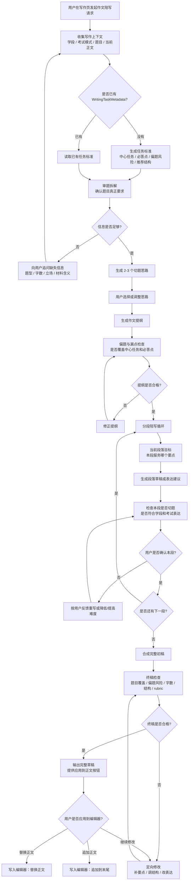

# 写作教练 Agent 设计

## 定位

Writing Coach Agent 是 PEAI 写作页的从零到一作文陪写 Agent。它不是普通代写助手，也不是单次范文生成器，而是围绕当前题目、学段、考试模式和评分标准，陪用户多轮完成审题、构思、提纲、分段写作、草稿合成和偏题检查。

产品交互上，Writing Coach 应按 **Cursor for Essay Writing** 设计：左侧是作文编辑器，右侧是 Agent Composer / 写作教练面板，Agent 能读取正文、理解选区、提出修改、生成 patch，并在用户确认后安全应用到正文。

核心产品公式：

```text
PEAI Writing Coach =
Essay Editor + Agent Composer + Writing Plan Context + Safe Apply
```

核心目标：

- 帮用户理解题目要求，而不是直接跳到完整作文。
- 在考试模式下严格对齐学段、考试标准、rubric、字数和题型。
- 在自由写作模式下仍参考学段，但允许更开放的表达和内容探索。
- 每一轮输出都要服务当前题目的中心任务，避免跑题、漏点和结构失衡。
- AI 建议必须可审阅、可应用、可撤销，不允许自动覆盖用户正文。

与 Cursor 的产品映射：

| Cursor | PEAI 写作页 |
| --- | --- |
| 代码编辑器 | 作文编辑器 |
| Chat / Composer | 写作教练 Agent Composer |
| 选中代码提问 | 选中句子或段落问“是否跑题 / 怎么改” |
| Apply patch | 应用到正文、替换选区、插入下一段 |
| Inline edit | 局部润色、扩写、降低难度、考试化表达 |
| Project context | 题目、学段、rubric、当前作文、WritingTaskMetadata |
| Diagnostics | 偏题提醒、语法问题、评分短板 |
| Plan mode | 审题、提纲、分段陪写 |

## 适用场景

Writing Coach Agent 主要承接 `first_draft_coach` 类请求，例如：

- 这个题目第一段应该怎么开头？
- 帮我搭一个作文提纲。
- 我下一段该写什么？
- 我不知道这篇作文怎么写，你一步步带我写。
- 根据这个题目，从零开始帮我完成一篇作文。
- 这段内容是否偏离题目？下一步怎么补回来？

不属于 Writing Coach Agent 的场景：

- 正式评分、分数诊断、rubric 打分：交给 Scoring Agent。
- 单句语法、句子结构、长难句分析：交给 Sentence Structure Agent。
- 生成作文题、训练任务、题单：交给 Prompt Design Agent。
- 单纯润色改写：交给 Polish Agent。

与 Prompt Design Agent 的边界：

- Prompt Design Agent 负责“生成新题目、设计训练任务、生成题单、设计练习要求”。
- Writing Coach Agent 负责“围绕已有题目陪用户完成作文”。
- 如果用户的题目分析是为了进入写作流程，例如“这个题怎么写、怎么立意、怎么搭提纲”，应归 Writing Coach Agent。
- 如果用户的题目分析是为了生成或改造练习题，例如“帮我设计一个类似题目、出 3 道训练题”，应归 Prompt Design Agent。

## 上下文输入

Agents SDK 的本地 `context` 不会自动进入模型上下文。Writing Coach Agent 需要显式接收写作页和后端装配出的上下文。

| 字段 | 来源 | 用途 |
| --- | --- | --- |
| `studyStage` | 用户学习阶段 / 目标考试 | 控制语言难度、讲解深度、句型复杂度和评分口径。 |
| `writingMode` | 写作页模式 | 区分自由写作和考试写作。 |
| `taskPrompt` | 当前作文题目 | 审题、立意、提纲、偏题检查的核心依据。 |
| `draftText` | 当前编辑器正文 | 判断用户已经写到哪一步，以及是否需要续写、修正或合成。 |
| `taskType` | 写作题型 | 影响结构，例如书信、议论文、图表作文、材料作文。 |
| `wordRange` | 题目或考试要求 | 控制段落长度、完整草稿字数和是否达标。 |
| `rubricKey` | 当前评分标准版本 | 让 trace、调试和回归能定位本次使用的标准。 |
| `rubricText` | 当前评分标准文本 | 在考试模式下约束任务完成度、结构、词汇、语法和档位目标。 |
| `WritingTaskMetadata` | 写作任务标准层 | 提供中心任务、必答点、偏题风险、推荐结构和 rubric 关注点。 |

建议输入渲染为受控数据块：

```text
[写作上下文]
- 写作模式: exam
- 学段/目标: 考研
- 当前题目: ...
- 当前正文: ...
- 题型: ...
- 字数要求: ...

[写作任务标准]
- 中心任务: ...
- 必答点: ...
- 偏题风险: ...
- 推荐结构: ...
- rubric 关注点: ...
```

## 多轮工作流

Writing Coach Agent 应按阶段推进，而不是每轮都重新生成一篇作文。每个阶段都允许用户确认、修改或回退。



## 最小多轮状态

v1 不新增复杂持久化状态机，但必须有最小状态口径，避免每轮对话都从审题重新开始。该状态可以先沉淀在 active task summary、对话摘要或前端写作上下文中，后续再升级为 `WritingCoachWorkflowState`。

## 阶段级 Structured Outputs

当前 v1 主链路使用本地 Python orchestrator。前端写作教练按钮通过 `writingCoachContext.action` 传入阶段，后端在 `AssistantAgentService` 中优先识别本地结构化阶段，并选择对应的阶段 Agent，而不是继续复用通用 Prompt Design Agent。

```text
前端按钮
  -> writingCoachContext.action
  -> AssistantService 识别结构化阶段
  -> 对应 Writing Coach 阶段 Agent
  -> 阶段级 Pydantic Schema
  -> 渲染为面向用户的 Markdown
```

阶段与输出契约：

| action | Agent | output_type | 用途 |
| --- | --- | --- | --- |
| `analyze` | `Writing Coach Topic Analysis Agent` | `WritingCoachTopicAnalysisOutput` | 输出题目主旨、中心任务、必答点、偏题风险、推荐结构和下一步建议。 |
| `outline` | `Writing Coach Outline Agent` | `WritingCoachOutlineOutput` | 输出中心论点、段落结构、主题句、支撑点、衔接提醒和下一步建议。 |
| `next` | `Writing Coach Next Section Agent` | `WritingCoachNextSectionOutput` | 输出下一段的段落角色、段落目标、服务要点、参考草稿和切题检查。 |
| `topic` | `Writing Coach Topic Relevance Agent` | `WritingCoachTopicRelevanceOutput` | 输出偏题状态、覆盖情况、缺失要点、风险点和修改方案。 |
| `polish` | `Writing Coach Polish Agent` | `WritingCoachPolishOutput` | 输出保留原意的润色文本、修改点和保持题目方向的说明。 |
| `draft` | `Writing Coach Final Draft Agent` | `WritingCoachFinalDraftOutput` | 输出完整草稿、题目覆盖检查、字数建议和终稿提醒。 |

这些阶段的内部输出必须先是结构化对象，再由 `to_markdown()` 渲染成用户可读内容。这样可以同时满足：

- 后端和后续 workflow 能稳定读取字段。
- 前端当前聊天面板仍能直接展示 Markdown。
- 后续保存 `WritingCoachWorkflowState` 时，不需要再从自然语言中反解析审题和提纲。

建议最小状态：

| 字段 | 含义 | 示例 |
| --- | --- | --- |
| `currentStage` | 当前陪写阶段 | `prompt_analysis` / `idea_selection` / `outline_building` / `paragraph_drafting` / `draft_assembly` / `revision` |
| `analysisConfirmed` | 用户是否确认审题结果 | `true` / `false` |
| `selectedIdea` | 用户确认的立意或观点 | `online learning is helpful but needs discipline` |
| `outlineConfirmed` | 用户是否确认提纲 | `true` / `false` |
| `outlineSummary` | 当前提纲摘要 | 开头、主体段、结尾的短摘要。 |
| `currentParagraphIndex` | 当前正在陪写第几段 | `1` / `2` / `3` |
| `confirmedParagraphs` | 已确认段落摘要或文本 | 已完成的开头段、主体段等。 |
| `draftAssembled` | 是否已经生成完整初稿 | `true` / `false` |
| `lastRelevanceStatus` | 最近一次偏题检查状态 | `aligned` / `risk` / `off_topic` |

阶段推进原则：

- 用户确认审题后，才能进入立意或提纲。
- 用户确认提纲后，才能进入稳定的分段陪写。
- 每段确认后更新 `confirmedParagraphs` 和 `currentParagraphIndex`。
- 生成完整草稿前必须已有已确认提纲，或者用户明确要求跳过陪写直接生成。
- 如果 `check_topic_relevance` 返回 `risk` 或 `off_topic`，优先进入 `revision`，不要继续润色。

## 偏题控制

偏题判断不是评分阶段才做的事情。Writing Coach Agent 必须在多轮陪写过程中持续检查题目对齐。

检查点：

- 审题阶段：确认题目中心任务、必答点和限制条件。
- 立意阶段：确认用户选择的观点能直接回应题目。
- 提纲阶段：确认每段都服务中心任务，没有遗漏必答点。
- 分段阶段：确认当前段落不是只写相关话题，而是真正推进题目要求。
- 草稿阶段：检查字数、结构、内容覆盖和 rubric 关注点。
- 修改阶段：优先修正偏题、漏点和任务完成度问题，再提升表达。

偏题检查建议逐步工具化：

- v1 可以使用 `WritingTaskMetadata` 和 prompt 规则做受控判断。
- 后续可以新增 `check_topic_relevance` function tool，输入题目、中心任务、草稿或段落，输出偏题风险、漏点和修正建议。

## Agent / Tool / Handoff 关系

Writing Coach Agent 是作文陪写主控，但不应吞并其他专业能力。

| 能力 | 关系 | 说明 |
| --- | --- | --- |
| Router / Route Agent | 上游入口 | 将 `first_draft_coach` 路由到 Writing Coach Agent。 |
| Writing Coach Agent | 主控 Agent | 负责多轮陪写、阶段推进、草稿合成和偏题控制。 |
| Scoring Agent | 下游能力 | 用于正式评分、rubric 诊断和提交后的完整评价。 |
| Sentence Structure Agent | 下游能力 | 用于句子级结构解释、局部表达反馈。 |
| Prompt Design Agent | 并列能力 | 负责出题、训练任务和题单设计，不再兼任作文陪写。 |
| Polish Agent | 下游能力 | 用于用户明确要求润色或表达升级时。 |

推荐策略：

- 单一明确陪写请求：Route Agent 直接选择 Writing Coach Agent。
- 多任务混合请求：Router Agent 作为 manager 调用相关 Agent tools 后统一回答。
- Writing Coach Agent 内部需要正式评分时，不自行打分，应提示进入评分流程或调用 Scoring Agent 能力。
- Writing Coach Agent 内部需要润色时，优先把 Polish Agent 作为 `Agent.as_tool()` 调用，不使用 handoff，避免润色 Agent 接管多轮陪写流程。

## 工具设计

Writing Coach Agent 的工具分为两类：确定性业务工具和 Agent tools。

确定性业务工具负责加载标准、检查约束和生成可验证的中间结果。Agent tools 负责调用已有 specialist agent 的垂直能力，但最终回答仍由 Writing Coach Agent 组织。

| 工具 | 类型 | 优先级 | 用途 | 使用边界 |
| --- | --- | --- | --- | --- |
| `get_writing_task_metadata` | function tool | 必须 | 读取或生成中心任务、必答点、偏题风险、推荐结构。 | 审题、提纲、段落和终稿检查都应参考。 |
| `get_exam_rubric` | function tool | 必须 | 根据学段、考试模式、题型加载考试标准和 rubric。 | exam 模式必须加载；free 模式可降级为学段写作标准。 |
| `check_topic_relevance` | function tool | 必须 | 判断立意、提纲、段落或草稿是否偏题、漏点。 | 润色和合成草稿前必须先检查。 |
| `polish_text` | Agent as tool | 推荐 | 调用 Polish Agent 优化段落或终稿表达。 | 只在内容切题且用户确认写作方向后调用。 |
| `analyze_sentence_structure` | Agent as tool | 可选 | 调用 Sentence Structure Agent 解释句子结构或局部表达问题。 | 用户追问某句为什么不自然、怎么改时调用。 |
| `score_english` | Agent as tool | 谨慎 | 调用 Scoring Agent 做最终检查或正式评分。 | 不在每段陪写时频繁调用；正式评分仍应走 Scoring Agent 主流程。 |

调用顺序原则：

```text
先判断写什么是否正确
-> 再判断结构是否完整
-> 再判断是否符合考试标准
-> 最后才调用 polish_text 提升表达
```

因此 Polish Agent 可以放入 Writing Coach Agent 作为 `Agent.as_tool()`，但不能放在偏题检查之前。否则会出现“语言更高级，但内容仍然跑题”的问题。

`score_english` 使用限制：

- Writing Coach Agent 中的 `score_english` 只允许用于最终自查、模拟检查或解释“这篇草稿距离高分标准还差什么”。
- `score_english` 不应在每个段落陪写时调用，避免成本高、反馈噪声大、打断写作节奏。
- `score_english` 的结果不能作为正式评分结果保存，也不能覆盖写作页正式评分链路。
- 用户点击提交评分、要求正式分数或需要历史评分记录时，必须走 Scoring Agent 主流程。

推荐结构：

```text
Writing Coach Agent
├─ function tools
│  ├─ get_writing_task_metadata
│  ├─ get_exam_rubric
│  └─ check_topic_relevance
└─ agent tools
   ├─ polish_text
   ├─ analyze_sentence_structure
   └─ score_english
```

### Function Tool JSON Schema

本节给出 Agent Builder / OpenAI API 可使用的 Function tool schema。OpenAI function calling 使用 JSON Schema 描述工具参数；开启 strict structured outputs 时，schema 应使用 `additionalProperties: false`，并让所有参数出现在 `required` 中。可选语义不要使用 `undefined` 或省略字段，统一用空字符串、空数组、`false`、`0` 或 nullable 字段表达。参考 OpenAI 官方文档：[Function calling](https://platform.openai.com/docs/guides/function-calling)。

Agent Builder 的 Function 弹窗里，`Definition` 输入框要粘贴的是完整函数定义，不能只粘贴 `parameters` 里的 JSON Schema。正确结构如下：

```json
{
  "name": "function_name",
  "description": "说明这个函数什么时候被调用，以及它做什么。",
  "parameters": {
    "type": "object",
    "additionalProperties": false,
    "properties": {},
    "required": []
  },
  "strict": true
}
```

如果通过 OpenAI API 的 `tools` 参数传入，则需要外层工具包装：

```json
{
  "type": "function",
  "name": "function_name",
  "description": "说明这个函数什么时候被调用，以及它做什么。",
  "parameters": {
    "type": "object",
    "additionalProperties": false,
    "properties": {},
    "required": []
  },
  "strict": true
}
```

下面 9 个工具均按 Agent Builder 可直接粘贴的 `Definition` 格式书写。

v1 为了让前端稳定消费，8 个写作阶段都可以做成 function tools。它们仍由一个 `writing_coach_agent` 编排，不拆成 8 个 Agent。

#### 通用输入约定

`writing_context` 不是某一个工具本身，而是写作页每轮调用 Agent 时的统一状态对象。它应该放在 workflow input / state 中，由 `writing_coach_agent` 读取后决定是否调用具体 function tool。

不要把所有字段都无差别塞进每个工具。正确分层是：

- Start input：本轮用户输入和前端触发来源。
- State：题目、正文、选区、审题结果、流程阶段。
- Function tool parameters：只放该工具完成任务所需的最小字段。

v1 建议前端每轮都传 `writing_context`，其中空值使用空字符串、空数组、`false` 或 `0`，不要传 `undefined`。

注意：下面这段 `writing_context` 只是 workflow/state 的结构说明，不是 Function 弹窗的 `Definition` 内容，不能直接粘贴到 Agent Builder 的 Function 输入框。

```json
{
  "type": "object",
  "additionalProperties": false,
  "properties": {
    "inputAsText": {
      "type": "string",
      "description": "用户本轮在右侧写作教练输入框中的原始输入。"
    },
    "action": {
      "type": "string",
      "enum": ["chat", "analyze", "outline", "next", "topic", "polish", "draft"],
      "description": "前端或路由识别出的本轮动作。chat 表示普通对话，不推进写作流程。"
    },
    "triggerSource": {
      "type": "string",
      "enum": ["chat_input", "toolbar_button", "workflow_card", "selection_menu", "auto_check"],
      "description": "本轮请求由哪里触发，用于区分用户自由输入、按钮点击、选区菜单和自动检查。"
    },
    "sessionId": {
      "type": "string",
      "description": "当前写作会话 ID。没有持久化会话时为空字符串。"
    },
    "documentId": {
      "type": "string",
      "description": "当前作文文档 ID。没有文档 ID 时为空字符串。"
    },
    "taskId": {
      "type": "string",
      "description": "当前写作题目或练习任务 ID。自由写作或临时题目时为空字符串。"
    },
    "studyStage": {
      "type": "string",
      "description": "用户学段，例如小学、初中、高中、大学四六级、雅思、托福等。"
    },
    "writingMode": {
      "type": "string",
      "enum": ["free", "exam"],
      "description": "写作模式。free 表示自由写作，exam 表示考试写作。"
    },
    "taskPrompt": {
      "type": "string",
      "description": "聚合后的作文题目与写作要求。考试写作模式下必须提供；自由写作模式下可以为空字符串。"
    },
    "essayQuestion": {
      "type": "string",
      "description": "考试题目原文。与 taskPrompt 的区别是：essayQuestion 保留原题文本，不做聚合改写。"
    },
    "questionMaterials": {
      "type": "string",
      "description": "题目材料、提示语、图表描述、续写材料或附加要求。没有材料时为空字符串。"
    },
    "promptTitle": {
      "type": "string",
      "description": "题目标题。如果没有标题，可以为空字符串。"
    },
    "taskType": {
      "type": "string",
      "enum": ["unknown", "advantages_disadvantages", "opinion", "discussion", "problem_solution", "cause_effect", "compare_contrast", "letter_request", "letter_advice", "letter_apology", "chart_summary", "picture_description", "story_continuation", "application", "custom"],
      "description": "更细的作文任务类型。"
    },
    "examType": {
      "type": "string",
      "enum": ["none", "primary", "middle_school", "high_school", "zhongkao", "gaokao", "cet4", "cet6", "postgraduate_exam", "ielts", "toefl", "custom"],
      "description": "考试类型。none 表示非考试写作；custom 表示暂未覆盖的自定义考试类型。"
    },
    "genre": {
      "type": "string",
      "enum": ["unknown", "argumentative", "expository", "narrative", "descriptive", "letter", "email", "notice", "announcement", "speech", "proposal", "report", "chart_description", "picture_description", "continuation_writing", "application", "review", "custom"],
      "description": "作文文体或任务形式。"
    },
    "audience": {
      "type": "string",
      "description": "目标读者或收件人，例如 teacher、classmates、editor、friend、public audience。没有明确对象时为空字符串。"
    },
    "purpose": {
      "type": "string",
      "description": "写作目的，例如 persuade、explain、inform、request、apologize、summarize。没有明确目的时为空字符串。"
    },
    "stanceRequirement": {
      "type": "string",
      "description": "题目是否要求明确立场，例如 agree、disagree、balanced、not_required。没有明确要求时为空字符串。"
    },
    "minWords": {
      "type": "integer",
      "description": "作文最小字数要求。如果没有明确要求，可以为 0。"
    },
    "maxWords": {
      "type": "integer",
      "description": "作文最大字数或推荐上限。如果没有明确上限，可以为 0。"
    },
    "rubricKey": {
      "type": "string",
      "description": "评分标准标识。如果当前没有明确评分标准，可以为空字符串。"
    },
    "rubricVersion": {
      "type": "string",
      "description": "评分标准版本。如果没有版本管理，可以为空字符串。"
    },
    "targetScore": {
      "type": "string",
      "description": "用户目标分数、目标等级或目标档位，例如 CET-4 high score、IELTS 6.5。没有目标时为空字符串。"
    },
    "timeLimitMinutes": {
      "type": "integer",
      "description": "考试限时分钟数。自由写作或未知时为 0。"
    },
    "draftText": {
      "type": "string",
      "description": "当前作文正文。刚开始写作时可以为空字符串。"
    },
    "selectedText": {
      "type": "string",
      "description": "用户当前选中的正文片段。没有选区时为空字符串。"
    },
    "selectionStart": {
      "type": "integer",
      "description": "选区在正文中的起始位置。没有选区时为 0。"
    },
    "selectionEnd": {
      "type": "integer",
      "description": "选区在正文中的结束位置。没有选区时为 0。"
    },
    "includeDraft": {
      "type": "boolean",
      "description": "本轮请求是否引用完整作文正文。"
    },
    "currentParagraphIndex": {
      "type": "integer",
      "description": "当前正在陪写的段落序号，从 1 开始。未知或未进入分段陪写时为 0。"
    },
    "workflowMode": {
      "type": "string",
      "enum": ["general_chat", "writing_workflow"],
      "description": "当前是否进入写作工作流。普通问答时为 general_chat。"
    },
    "currentStage": {
      "type": "string",
      "enum": ["none", "task_analysis", "idea_generation", "material_activation", "outline_building", "section_drafting", "structure_revision", "language_polishing", "final_check"],
      "description": "当前工作流阶段。没有进入流程时为 none。"
    },
    "completedStages": {
      "type": "array",
      "description": "已经完成的写作阶段。",
      "items": {
        "type": "string",
        "enum": ["task_analysis", "idea_generation", "material_activation", "outline_building", "section_drafting", "structure_revision", "language_polishing", "final_check"]
      }
    },
    "hasTaskAnalysis": {
      "type": "boolean",
      "description": "是否已经完成审题。"
    },
    "hasConfirmedIdea": {
      "type": "boolean",
      "description": "用户是否已经确认立意。"
    },
    "hasOutline": {
      "type": "boolean",
      "description": "是否已经形成可用提纲。"
    },
    "hasFullDraft": {
      "type": "boolean",
      "description": "是否已经生成或写出完整草稿。"
    },
    "selectedIdea": {
      "type": "string",
      "description": "用户当前确认或正在讨论的立意。没有时为空字符串。"
    },
    "outlineText": {
      "type": "string",
      "description": "当前提纲文本。没有提纲时为空字符串。"
    },
    "lastTopicStatus": {
      "type": "string",
      "enum": ["unknown", "aligned", "risk", "off_topic"],
      "description": "最近一次偏题检查结果。"
    },
    "lastAssistantSummary": {
      "type": "string",
      "description": "上一轮 Agent 对当前任务状态的简短摘要，用于多轮连续性。没有时为空字符串。"
    },
    "language": {
      "type": "string",
      "enum": ["zh", "en", "mixed"],
      "description": "用户输入语言。"
    },
    "responseLanguage": {
      "type": "string",
      "enum": ["zh", "en", "mixed"],
      "description": "Agent 回复语言。默认中文讲解，英文用于作文内容。"
    }
  },
  "required": ["inputAsText", "action", "triggerSource", "sessionId", "documentId", "taskId", "studyStage", "writingMode", "taskPrompt", "essayQuestion", "questionMaterials", "promptTitle", "taskType", "examType", "genre", "audience", "purpose", "stanceRequirement", "minWords", "maxWords", "rubricKey", "rubricVersion", "targetScore", "timeLimitMinutes", "draftText", "selectedText", "selectionStart", "selectionEnd", "includeDraft", "currentParagraphIndex", "workflowMode", "currentStage", "completedStages", "hasTaskAnalysis", "hasConfirmedIdea", "hasOutline", "hasFullDraft", "selectedIdea", "outlineText", "lastTopicStatus", "lastAssistantSummary", "language", "responseLanguage"]
}
```

`writingTaskMetadata` 是审题后生成的任务元数据。除 `analyze_writing_task` 外，其他阶段工具都应接收它。如果审题尚未完成，`writing_coach_agent` 应先调用 `analyze_writing_task`，不要让下游工具重复审题。

```json
{
  "type": "object",
  "additionalProperties": false,
  "properties": {
    "centralTask": {
      "type": "string",
      "description": "题目中心任务：这道作文真正要求用户完成什么。"
    },
    "topicFocus": {
      "type": "string",
      "description": "题目关键词和讨论边界，说明哪些内容属于题内、哪些容易跑偏。"
    },
    "taskType": {
      "type": "string",
      "description": "审题后识别出的任务类型。"
    },
    "genre": {
      "type": "string",
      "description": "审题后确认的文体或任务形式。"
    },
    "audience": {
      "type": "string",
      "description": "目标读者或收件人。没有时为空字符串。"
    },
    "purpose": {
      "type": "string",
      "description": "写作目的。"
    },
    "stanceRequirement": {
      "type": "string",
      "description": "是否要求明确立场及立场要求。"
    },
    "mustAnswerPoints": {
      "type": "array",
      "description": "作文必须回答或覆盖的要点。",
      "items": { "type": "string" }
    },
    "offTopicRisks": {
      "type": "array",
      "description": "常见偏题风险。",
      "items": { "type": "string" }
    },
    "missingInfo": {
      "type": "array",
      "description": "继续写作前仍缺少的信息。",
      "items": { "type": "string" }
    },
    "recommendedStructure": {
      "type": "array",
      "description": "推荐作文结构。",
      "items": { "type": "string" }
    },
    "paragraphGoals": {
      "type": "array",
      "description": "推荐每段承担的任务。",
      "items": { "type": "string" }
    },
    "rubricFocus": {
      "type": "array",
      "description": "本题评分时最需要关注的维度。",
      "items": { "type": "string" }
    },
    "wordPolicy": {
      "type": "string",
      "description": "字数策略，例如低于最小字数的风险、建议控制范围。"
    },
    "languageLevelGuidance": {
      "type": "string",
      "description": "结合学段和考试类型给出的语言难度建议。"
    },
    "clarifyingQuestions": {
      "type": "array",
      "description": "如果题目信息不足，需要追问用户的问题。",
      "items": { "type": "string" }
    },
    "confidence": {
      "type": "string",
      "enum": ["unknown", "high", "medium", "low"],
      "description": "审题结果置信度。"
    }
  },
  "required": ["centralTask", "topicFocus", "taskType", "genre", "audience", "purpose", "stanceRequirement", "mustAnswerPoints", "offTopicRisks", "missingInfo", "recommendedStructure", "paragraphGoals", "rubricFocus", "wordPolicy", "languageLevelGuidance", "clarifyingQuestions", "confidence"]
}
```

工具返回值不是 OpenAI function schema 的一部分，但实现层必须保持稳定返回契约，供前端渲染：

```json
{
  "stage": "task_analysis",
  "summary": "给用户展示的简短中文总结",
  "details": {},
  "topicCheck": null,
  "safeApply": null,
  "conversationStatePatch": {
    "mode": "writing_workflow",
    "workflowStage": "task_analysis",
    "currentStep": 1,
    "completedStages": ["task_analysis"]
  }
}
```

#### 1. analyze_writing_task

审题理解工具。第一次进入写作流程、题目变化、用户明确要求审题时调用。返回结果应写入 `state.writing_task_metadata`。

```json
{
  "name": "analyze_writing_task",
  "description": "分析英语作文题目，生成中心任务、必答点、偏题风险、推荐结构和评分关注点。",
  "strict": true,
  "parameters": {
    "type": "object",
    "additionalProperties": false,
    "properties": {
      "inputAsText": { "type": "string", "description": "用户本轮原始输入，例如“帮我审题”“这个题怎么写”。" },
      "studyStage": { "type": "string", "description": "用户学段。" },
      "writingMode": { "type": "string", "enum": ["free", "exam"], "description": "写作模式。" },
      "taskPrompt": { "type": "string", "description": "聚合后的作文题目与写作要求。" },
      "essayQuestion": { "type": "string", "description": "考试题目原文。自由写作或无原题时为空字符串。" },
      "questionMaterials": { "type": "string", "description": "题目材料、提示语、图表描述、续写材料或附加要求。没有时为空字符串。" },
      "promptTitle": { "type": "string", "description": "题目标题。没有时为空字符串。" },
      "taskType": { "type": "string", "enum": ["unknown", "advantages_disadvantages", "opinion", "discussion", "problem_solution", "cause_effect", "compare_contrast", "letter_request", "letter_advice", "letter_apology", "chart_summary", "picture_description", "story_continuation", "application", "custom"], "description": "作文任务类型。" },
      "examType": { "type": "string", "enum": ["none", "primary", "middle_school", "high_school", "zhongkao", "gaokao", "cet4", "cet6", "postgraduate_exam", "ielts", "toefl", "custom"], "description": "考试类型。" },
      "genre": { "type": "string", "enum": ["unknown", "argumentative", "expository", "narrative", "descriptive", "letter", "email", "notice", "announcement", "speech", "proposal", "report", "chart_description", "picture_description", "continuation_writing", "application", "review", "custom"], "description": "文体或任务形式。" },
      "audience": { "type": "string", "description": "目标读者或收件人。没有明确对象时为空字符串。" },
      "purpose": { "type": "string", "description": "写作目的。没有明确目的时为空字符串。" },
      "stanceRequirement": { "type": "string", "description": "题目是否要求明确立场。没有明确要求时为空字符串。" },
      "minWords": { "type": "integer", "description": "最小字数要求。没有时为 0。" },
      "maxWords": { "type": "integer", "description": "最大字数或推荐上限。没有时为 0。" },
      "rubricKey": { "type": "string", "description": "评分标准标识。没有时为空字符串。" },
      "targetScore": { "type": "string", "description": "用户目标分数、目标等级或目标档位。没有时为空字符串。" },
      "timeLimitMinutes": { "type": "integer", "description": "考试限时分钟数。自由写作或未知时为 0。" },
      "draftText": { "type": "string", "description": "当前作文正文。刚开始写作时为空字符串。" },
      "language": { "type": "string", "enum": ["zh", "en", "mixed"], "description": "用户输入语言。" }
    },
    "required": ["inputAsText", "studyStage", "writingMode", "taskPrompt", "essayQuestion", "questionMaterials", "promptTitle", "taskType", "examType", "genre", "audience", "purpose", "stanceRequirement", "minWords", "maxWords", "rubricKey", "targetScore", "timeLimitMinutes", "draftText", "language"]
  }
}
```

#### 2. generate_writing_ideas

立意构思工具。用户要求确定观点、选择立场、生成写作思路或比较不同观点时调用。

```json
{
  "name": "generate_writing_ideas",
  "description": "基于题目中心任务生成 2 到 3 个切题立意，并说明每个立意的优缺点和适用场景。",
  "strict": true,
  "parameters": {
    "type": "object",
    "additionalProperties": false,
    "properties": {
      "taskPrompt": {
        "type": "string",
        "description": "作文题目原文或写作要求。"
      },
      "centralTask": {
        "type": "string",
        "description": "题目中心任务。"
      },
      "mustAnswerPoints": {
        "type": "array",
        "items": { "type": "string" },
        "description": "作文必须回答或覆盖的要点。"
      },
      "offTopicRisks": {
        "type": "array",
        "items": { "type": "string" },
        "description": "已知偏题风险。"
      },
      "studyStage": {
        "type": "string",
        "description": "用户学段。"
      },
      "writingMode": {
        "type": "string",
        "enum": ["free", "exam"],
        "description": "写作模式。"
      },
      "genre": {
        "type": "string",
        "enum": ["unknown", "argumentative", "expository", "narrative", "descriptive", "letter", "email", "notice", "announcement", "speech", "proposal", "report", "chart_description", "picture_description", "continuation_writing", "application", "review", "custom"],
        "description": "文体或任务形式。"
      },
      "ideaPreference": {
        "type": "string",
        "description": "用户对立意的偏好，例如简单、稳妥、高分、个人经历、批判性。没有偏好时为空字符串。"
      }
    },
    "required": ["taskPrompt", "centralTask", "mustAnswerPoints", "offTopicRisks", "studyStage", "writingMode", "genre", "ideaPreference"]
  }
}
```

#### 3. activate_writing_materials

素材激活工具。用户要求找理由、例子、表达素材、论据或补充内容时调用。

```json
{
  "name": "activate_writing_materials",
  "description": "根据题目、立意和学段生成切题理由、例子、表达素材和可用句式。",
  "strict": true,
  "parameters": {
    "type": "object",
    "additionalProperties": false,
    "properties": {
      "centralTask": { "type": "string", "description": "题目中心任务。" },
      "mustAnswerPoints": { "type": "array", "items": { "type": "string" }, "description": "必须覆盖的要点。" },
      "selectedIdea": { "type": "string", "description": "用户已选择或当前倾向的立意。没有时为空字符串。" },
      "studyStage": { "type": "string", "description": "用户学段。" },
      "genre": { "type": "string", "enum": ["unknown", "argumentative", "expository", "narrative", "descriptive", "letter", "email", "notice", "announcement", "speech", "proposal", "report", "chart_description", "picture_description", "continuation_writing", "application", "review", "custom"], "description": "文体或任务形式。" },
      "materialNeed": { "type": "string", "description": "素材需求，例如理由、例子、连接词、开头素材、论证素材。没有明确需求时为空字符串。" }
    },
    "required": ["centralTask", "mustAnswerPoints", "selectedIdea", "studyStage", "genre", "materialNeed"]
  }
}
```

#### 4. build_writing_outline

组织提纲工具。用户要求搭提纲、安排段落、规划结构或确定每段写什么时调用。

```json
{
  "name": "build_writing_outline",
  "description": "根据题目中心任务、必答点、立意和文体生成作文提纲，明确每段目标和要点覆盖。",
  "strict": true,
  "parameters": {
    "type": "object",
    "additionalProperties": false,
    "properties": {
      "taskPrompt": { "type": "string", "description": "作文题目原文或写作要求。" },
      "centralTask": { "type": "string", "description": "题目中心任务。" },
      "mustAnswerPoints": { "type": "array", "items": { "type": "string" }, "description": "必须覆盖的要点。" },
      "selectedIdea": { "type": "string", "description": "用户确认或当前推荐的立意。没有时为空字符串。" },
      "genre": { "type": "string", "enum": ["unknown", "argumentative", "expository", "narrative", "descriptive", "letter", "email", "notice", "announcement", "speech", "proposal", "report", "chart_description", "picture_description", "continuation_writing", "application", "review", "custom"], "description": "文体或任务形式。" },
      "minWords": { "type": "integer", "description": "最小字数。" },
      "maxWords": { "type": "integer", "description": "最大字数或推荐上限。" },
      "studyStage": { "type": "string", "description": "用户学段。" }
    },
    "required": ["taskPrompt", "centralTask", "mustAnswerPoints", "selectedIdea", "genre", "minWords", "maxWords", "studyStage"]
  }
}
```

#### 5. draft_writing_section

起草写作工具。用户要求写开头、主体段、结尾、下一段或从零起草时调用。该工具只能返回草稿建议，不能直接覆盖正文。

```json
{
  "name": "draft_writing_section",
  "description": "根据题目、提纲和当前正文起草指定段落或完整草稿片段，并返回需要用户确认的 safe apply 建议。",
  "strict": true,
  "parameters": {
    "type": "object",
    "additionalProperties": false,
    "properties": {
      "taskPrompt": { "type": "string", "description": "作文题目原文或写作要求。" },
      "centralTask": { "type": "string", "description": "题目中心任务。" },
      "mustAnswerPoints": { "type": "array", "items": { "type": "string" }, "description": "必须覆盖的要点。" },
      "outline": { "type": "array", "items": { "type": "string" }, "description": "当前提纲。没有提纲时为空数组。" },
      "draftText": { "type": "string", "description": "当前作文正文。" },
      "sectionType": { "type": "string", "enum": ["opening", "body", "conclusion", "next_paragraph", "full_draft"], "description": "本次起草范围。" },
      "currentParagraphIndex": { "type": "integer", "description": "当前段落序号。未知时为 0。" },
      "studyStage": { "type": "string", "description": "用户学段。" },
      "genre": { "type": "string", "enum": ["unknown", "argumentative", "expository", "narrative", "descriptive", "letter", "email", "notice", "announcement", "speech", "proposal", "report", "chart_description", "picture_description", "continuation_writing", "application", "review", "custom"], "description": "文体或任务形式。" }
    },
    "required": ["taskPrompt", "centralTask", "mustAnswerPoints", "outline", "draftText", "sectionType", "currentParagraphIndex", "studyStage", "genre"]
  }
}
```

#### 6. revise_writing_structure

修改重构工具。用户要求重写、调整逻辑、改结构、补要点或删除无关内容时调用。结构修改应优先修正偏题和漏点，再考虑语言。

```json
{
  "name": "revise_writing_structure",
  "description": "检查并重构作文内容、段落逻辑和要点覆盖，输出结构修改建议和可确认的正文编辑方案。",
  "strict": true,
  "parameters": {
    "type": "object",
    "additionalProperties": false,
    "properties": {
      "taskPrompt": { "type": "string", "description": "作文题目原文或写作要求。" },
      "centralTask": { "type": "string", "description": "题目中心任务。" },
      "mustAnswerPoints": { "type": "array", "items": { "type": "string" }, "description": "必须覆盖的要点。" },
      "offTopicRisks": { "type": "array", "items": { "type": "string" }, "description": "偏题风险。" },
      "draftText": { "type": "string", "description": "当前作文正文。" },
      "selectedText": { "type": "string", "description": "用户选中的正文片段。没有选区时为空字符串。" },
      "revisionGoal": { "type": "string", "description": "修改目标，例如补要点、调结构、删无关内容、加强逻辑。没有明确目标时为空字符串。" },
      "studyStage": { "type": "string", "description": "用户学段。" },
      "genre": { "type": "string", "enum": ["unknown", "argumentative", "expository", "narrative", "descriptive", "letter", "email", "notice", "announcement", "speech", "proposal", "report", "chart_description", "picture_description", "continuation_writing", "application", "review", "custom"], "description": "文体或任务形式。" }
    },
    "required": ["taskPrompt", "centralTask", "mustAnswerPoints", "offTopicRisks", "draftText", "selectedText", "revisionGoal", "studyStage", "genre"]
  }
}
```

#### 7. polish_writing_language

语言润色工具。用户要求润色、优化表达、改句子、提高语言质量、降低或提高难度时调用。只允许润色 `selectedText` 或明确范围，不能改变原意、立场、事实和题目方向。

```json
{
  "name": "polish_writing_language",
  "description": "在不改变原意和题目方向的前提下，润色用户选中的英文表达，并返回可确认的替换建议。",
  "strict": true,
  "parameters": {
    "type": "object",
    "additionalProperties": false,
    "properties": {
      "textToPolish": { "type": "string", "description": "需要润色的文本。通常来自 selectedText。" },
      "taskPrompt": { "type": "string", "description": "作文题目原文或写作要求。" },
      "centralTask": { "type": "string", "description": "题目中心任务。" },
      "mustAnswerPoints": { "type": "array", "items": { "type": "string" }, "description": "必须覆盖的要点。" },
      "studyStage": { "type": "string", "description": "用户学段。" },
      "genre": { "type": "string", "enum": ["unknown", "argumentative", "expository", "narrative", "descriptive", "letter", "email", "notice", "announcement", "speech", "proposal", "report", "chart_description", "picture_description", "continuation_writing", "application", "review", "custom"], "description": "文体或任务形式。" },
      "polishLevel": { "type": "string", "enum": ["light", "standard", "advanced"], "description": "润色强度。" },
      "preserveMeaning": { "type": "boolean", "description": "是否必须保持原意。应始终为 true。" }
    },
    "required": ["textToPolish", "taskPrompt", "centralTask", "mustAnswerPoints", "studyStage", "genre", "polishLevel", "preserveMeaning"]
  }
}
```

#### 8. check_final_draft

终稿检查工具。用户要求最终检查、检查全文、检查字数、完整性、切题性或是否可以提交时调用。它只做自查，不替代 Scoring Agent 正式评分。

```json
{
  "name": "check_final_draft",
  "description": "对完整作文进行终稿自查，检查切题、必答点覆盖、结构完整性、字数和 rubric 风险，但不产生正式评分。",
  "strict": true,
  "parameters": {
    "type": "object",
    "additionalProperties": false,
    "properties": {
      "taskPrompt": { "type": "string", "description": "作文题目原文或写作要求。" },
      "centralTask": { "type": "string", "description": "题目中心任务。" },
      "mustAnswerPoints": { "type": "array", "items": { "type": "string" }, "description": "必须覆盖的要点。" },
      "offTopicRisks": { "type": "array", "items": { "type": "string" }, "description": "偏题风险。" },
      "rubricFocus": { "type": "array", "items": { "type": "string" }, "description": "评分关注点。" },
      "draftText": { "type": "string", "description": "完整作文正文。" },
      "minWords": { "type": "integer", "description": "最小字数。" },
      "maxWords": { "type": "integer", "description": "最大字数或推荐上限。" },
      "studyStage": { "type": "string", "description": "用户学段。" },
      "writingMode": { "type": "string", "enum": ["free", "exam"], "description": "写作模式。" },
      "rubricKey": { "type": "string", "description": "评分标准标识。" }
    },
    "required": ["taskPrompt", "centralTask", "mustAnswerPoints", "offTopicRisks", "rubricFocus", "draftText", "minWords", "maxWords", "studyStage", "writingMode", "rubricKey"]
  }
}
```

#### 9. check_topic_relevance

偏题检查工具。用户要求检查是否跑题、检查立意、检查提纲、检查某段或检查终稿切题性时调用。它可以被其他阶段工具前置调用，也可以作为独立阶段响应用户。

```json
{
  "name": "check_topic_relevance",
  "description": "检查用户的立意、提纲、段落或完整草稿是否紧扣作文题目，返回偏题状态、缺失要点和修改建议。",
  "strict": true,
  "parameters": {
    "type": "object",
    "additionalProperties": false,
    "properties": {
      "taskPrompt": { "type": "string", "description": "作文题目原文或写作要求。" },
      "centralTask": { "type": "string", "description": "题目中心任务。" },
      "mustAnswerPoints": { "type": "array", "items": { "type": "string" }, "description": "必须覆盖的要点。" },
      "offTopicRisks": { "type": "array", "items": { "type": "string" }, "description": "已知偏题风险。" },
      "textToCheck": { "type": "string", "description": "需要检查的文本，可以是立意、提纲、段落或完整草稿。" },
      "checkScope": { "type": "string", "enum": ["idea", "outline", "paragraph", "full_draft"], "description": "检查范围。" },
      "studyStage": { "type": "string", "description": "用户学段。" },
      "writingMode": { "type": "string", "enum": ["free", "exam"], "description": "写作模式。" },
      "rubricKey": { "type": "string", "description": "评分标准标识。没有时为空字符串。" }
    },
    "required": ["taskPrompt", "centralTask", "mustAnswerPoints", "offTopicRisks", "textToCheck", "checkScope", "studyStage", "writingMode", "rubricKey"]
  }
}
```

约束：

- 8 个阶段工具是稳定前端输出的结构化能力，不代表要拆成 8 个 Agent。
- `writing_coach_agent` 默认处于 `general_chat`，只有用户明确命中 8 个写作阶段之一时才调用对应工具并推进流程。
- `analyze_writing_task` 产出的 `writing_task_metadata` 是后续工具的统一依据。
- `check_topic_relevance` 不产生正式分数，只判断是否对齐题目中心任务和必答点。
- `polish_writing_language` 不得在偏题内容上直接润色；如果文本偏题，应先纠偏。
- 所有写入正文的内容必须通过 `safeApply` 返回，并要求用户确认。

## 前端交互

Writing Coach Agent 首期复用写作页右侧区域，但该区域不应再被定义为普通 AI Chat，而应定义为 **Agent Composer**。写作页保持左侧正文编辑器、右侧写作 Agent 的 IDE 式布局：左边用于用户持续写正文，右边用于审题、提纲、分段陪写、偏题提醒、草稿合成和安全应用。

推荐布局：

```text
┌───────────────────────────────┬───────────────────────────────┐
│ 作文编辑器                     │ 写作教练 Agent Composer        │
│                               │                               │
│ 用户正文                       │ 顶部：阶段 / 状态 / 写作计划    │
│                               │                               │
│ 选中段落                       │ 中部：对话与解释                │
│ ┌───────────────────────────┐ │                               │
│ │ Inline actions            │ │ AI：这一段切题，但例子不够具体 │
│ │ 检查跑题 / 润色 / 扩写      │ │ 用户：帮我改得像四级作文        │
│ └───────────────────────────┘ │                               │
│                               │ 底部：Agent 输入框              │
└───────────────────────────────┴───────────────────────────────┘
```

交互要求：

- 写作页每次请求应传入当前题目、正文、学段和写作模式。
- 右侧面板的标题和初始提示应从通用 `AI Chat` / `Send an instruction and I will rewrite it.` 调整为写作教练语义，例如“写作教练”和“我可以帮你审题、搭提纲、分段完成作文”。
- v1 主链路使用本地 Python orchestrator 和 `/assistant/run/stream`，由后端代理 OpenAI 调用，不把 OpenAI API Key 暴露给浏览器。
- ChatKit / Agent Builder 只作为实验、演示或备用方案，不作为 v1 写作教练主链路。
- 由于用户正文和选区会持续变化，前端每轮请求应通过 `writingCoachContext` 和 message input 显式注入最新题目、正文、选区、学段和考试模式。
- 审题、提纲、偏题风险和当前段落计划不应埋在聊天历史里，应进入可折叠的“写作计划”上下文区。
- 默认状态下，对话区应占据右侧主要空间；写作计划以顶部状态、抽屉或弹层方式查看，避免长期压缩对话区。
- 用户选中正文中的句子或段落时，编辑器应提供 inline actions，例如“检查跑题”“润色”“扩写”“降低难度”“替换建议”。
- AI 对正文的修改应以 patch / suggestion 的形式出现，用户确认后再应用。
- AI 输出完整草稿时，前端识别草稿块并展示“应用到正文”动作。
- 正文为空时，用户点击后可直接写入编辑器。
- 正文非空时，用户应明确选择“替换正文”或“追加到末尾”。
- 不允许 Agent 自动覆盖用户正文。

### Safe Apply 规则

Safe Apply 是 Writing Coach 交互的核心，所有 AI 写入正文的行为都必须可控。

| 应用范围 | 触发方式 | 规则 |
| --- | --- | --- |
| 选区替换 | 用户选中句子或段落后点击“应用” | 只替换当前选区，不影响其他正文。 |
| 段落替换 | AI 针对某段生成建议 | 用户确认后替换对应段落，需要保留撤销入口。 |
| 插入下一段 | 分段陪写生成下一段 | 插入到当前光标或指定段落后，不自动覆盖已有内容。 |
| 全文替换 | 完整草稿应用到正文 | 正文非空时必须二次确认。 |
| 追加到末尾 | 完整草稿或新增段落 | 明确展示将追加的位置。 |

v1 可以先实现最小 Safe Apply：

- `replace_selection`
- `insert_after_cursor`
- `replace_full_draft`
- `append_to_draft`

后续再扩展 diff 预览、版本对比和 AI 修改历史。

建议完整草稿使用稳定标记，方便前端解析：

````text
```essay-draft
完整英文作文内容
```
````

## 验证要求

实现 Writing Coach Agent 时至少覆盖以下验证：

| 类型 | 验证点 |
| --- | --- |
| 路由 | “第一段怎么写”“帮我搭提纲”“下一段写什么”“从零写作文”路由到 `first_draft_coach` / Writing Coach Agent。 |
| 上下文 | `studyStage`、`writingMode`、`taskPrompt`、`draftText`、`WritingTaskMetadata` 能进入模型输入或工具结果。 |
| 考试模式 | exam 模式下输出围绕题目、字数、rubric 和考试表达，不发散创作。 |
| 自由模式 | free 模式下仍按学段控制难度，但不强制套用考试 rubric。 |
| 偏题检查 | 提纲、段落和完整草稿均能识别漏点或偏题风险。 |
| 多轮继续 | 用户确认、修改、回退、要求更简单或更高级时，能延续当前陪写阶段。 |
| 前端应用 | `essay-draft` 草稿块能触发“应用到正文”，并覆盖正文为空、替换、追加三种场景。 |
| 选区操作 | 用户选中句子或段落后，可以触发检查跑题、润色、扩写等局部操作。 |
| Safe Apply | AI 修改必须由用户确认后应用，且替换范围不能越过选区、段落或全文边界。 |

## v1 约束

- v1 先使用本地 Python orchestrator、现有对话历史、写作上下文和 `WritingTaskMetadata` 维持多轮状态。
- v1 不先新增复杂 `WritingCoachWorkflowState` 持久化状态机。
- v1 先把本地 prompt 和文档作为权威源，OpenAI Dashboard 只用于调试发布后的 prompt 版本。
- ChatKit / Agent Builder 只作为实验、演示或备用方案，不作为 v1 写作教练主链路。
- v1 不改变 Scoring Agent 的正式评分职责。
- v1 不做完整 Canvas 版本管理和复杂 diff 历史，先实现右侧 Agent Composer、写作计划抽屉、选区操作和最小 Safe Apply。
