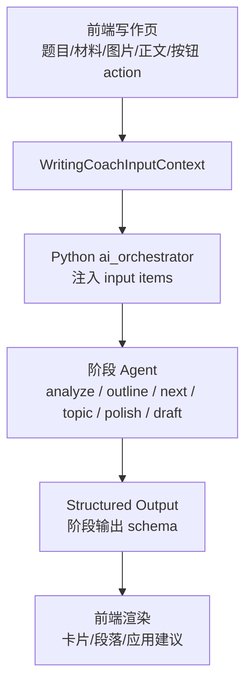

# 写作教练 Schema 设计

本文专门定义写作教练工作流的输入上下文 schema 和阶段输出 schema。目标是让“审题 -> 提纲 -> 下一段 -> 偏题检查 -> 润色 -> 终稿”使用同一套题目锚点，避免每个阶段重新猜题。

## 当前结论

- `input schema` 负责把题目、材料、图片、学段、题型、字数、rubric 和当前正文传给写作教练。
- `output schema` 负责约束某个阶段的结构化结果，例如审题结果、提纲结果。
- 审题阶段必须接收题目、材料、图片描述和当前学段/rubric，否则只能生成泛化建议。
- 提纲阶段必须复用审题输出中的 `mustAnswerPoints.pointId`，不要重新解释题意。
- Pydantic 是代码里的源头；JSON Schema 应由 Pydantic 生成或与 Pydantic 保持同步。

OpenAI Structured Outputs 的核心约束是：模型输出会按你提供的 JSON Schema 生成，但前提是你已经把任务上下文通过 input/context/tool 提供给模型。Structured Outputs 不会自动读取题目、图片或 rubric。参考：[OpenAI Structured Outputs](https://platform.openai.com/docs/guides/structured-outputs)。

## 总体数据流



## Input Schema

`WritingCoachInputContext` 是写作教练每一轮调用都应该携带的结构化上下文。它不是模型最终输出，而是进入模型前的受控输入。

### Pydantic 建议

```python
from typing import Literal

from pydantic import BaseModel, ConfigDict, Field


class StrictBaseModel(BaseModel):
    model_config = ConfigDict(populate_by_name=True, extra="forbid")


class WritingCoachAttachmentRef(StrictBaseModel):
    attachment_id: str = Field(alias="attachmentId")
    attachment_type: Literal["image", "pdf", "text"] = Field(alias="attachmentType")
    url: str = ""
    description: str = ""
    extracted_text: str = Field(default="", alias="extractedText")


class WritingCoachRubricContext(StrictBaseModel):
    rubric_key: str = Field(default="", alias="rubricKey")
    rubric_version: str = Field(default="", alias="rubricVersion")
    rubric_text: str = Field(default="", alias="rubricText")
    rubric_focus: list[str] = Field(default_factory=list, alias="rubricFocus")


class WritingCoachInputContext(StrictBaseModel):
    schema_version: Literal["writing_coach_input_v1"] = Field(alias="schemaVersion")
    action: Literal["coach", "analyze", "outline", "next", "topic", "polish", "draft"]
    writing_mode: Literal["free", "exam"] = Field(alias="writingMode")
    study_stage: str = Field(default="", alias="studyStage")
    task_type: str = Field(default="", alias="taskType")
    essay_genre: str = Field(default="", alias="essayGenre")
    essay_question: str = Field(default="", alias="essayQuestion")
    question_materials: str = Field(default="", alias="questionMaterials")
    image_descriptions: list[str] = Field(default_factory=list, alias="imageDescriptions")
    attachments: list[WritingCoachAttachmentRef] = Field(default_factory=list)
    min_words: int | None = Field(default=None, alias="minWords")
    max_words: int | None = Field(default=None, alias="maxWords")
    draft_text: str = Field(default="", alias="draftText")
    selected_text: str = Field(default="", alias="selectedText")
    include_draft: bool = Field(default=False, alias="includeDraft")
    topic_analysis_done: bool = Field(default=False, alias="topicAnalysisDone")
    topic_brief: str = Field(default="", alias="topicBrief")
    central_task: str = Field(default="", alias="centralTask")
    must_answer_points: list[str] = Field(default_factory=list, alias="mustAnswerPoints")
    risk_points: list[str] = Field(default_factory=list, alias="riskPoints")
    recommended_structure: list[str] = Field(default_factory=list, alias="recommendedStructure")
    rubric: WritingCoachRubricContext = Field(default_factory=WritingCoachRubricContext)
```

### Input 字段字典

| JSON 字段 | 类型 | 中文解释 | 传入要求 |
| --- | --- | --- | --- |
| `schemaVersion` | string enum | 输入上下文版本，固定为 `writing_coach_input_v1`。 | 必传 |
| `action` | string enum | 当前用户触发的能力，例如 `analyze`、`outline`。 | 必传 |
| `writingMode` | string enum | 写作模式，`free` 或 `exam`。 | 必传 |
| `studyStage` | string | 当前学段或考试目标，例如 `ielts`、`toefl`、`postgrad`。 | 建议必传 |
| `taskType` | string | 任务类型，例如 IELTS 的 `task1` / `task2`。 | 考试模式建议必传 |
| `essayGenre` | string | 文体，例如议论文、报告、书信、图表描述。 | 有则传 |
| `essayQuestion` | string | 作文题目正文。 | 审题阶段必须 |
| `questionMaterials` | string | 题目附带材料、背景说明、图表文字、OCR 结果等。 | 有材料必须 |
| `imageDescriptions` | string[] | 图片、图表或截图的视觉描述。 | 图片题必须 |
| `attachments` | object[] | 图片、PDF、文本附件引用。 | 有附件必须 |
| `minWords` | integer/null | 最低字数要求。 | 有则传 |
| `maxWords` | integer/null | 推荐或最高字数要求。 | 有则传 |
| `draftText` | string | 当前作文全文。 | `includeDraft=true` 时传 |
| `selectedText` | string | 用户当前选中的正文片段。 | 润色、解释、替换时传 |
| `includeDraft` | boolean | 本轮是否允许模型参考全文。 | 必传 |
| `topicAnalysisDone` | boolean | 是否已有稳定审题结果。 | 必传 |
| `topicBrief` | string | 已确认的题目主旨。 | 审题后传给后续阶段 |
| `centralTask` | string | 已确认的中心任务。 | 审题后传给后续阶段 |
| `mustAnswerPoints` | string[] | 已确认必答点。 | 审题后传给后续阶段 |
| `riskPoints` | string[] | 已确认偏题风险。 | 审题后传给后续阶段 |
| `recommendedStructure` | string[] | 已确认推荐结构。 | 审题后传给后续阶段 |
| `rubric` | object | 当前学段/考试/题型对应的评分口径。 | 考试模式建议必传 |

### Attachment 字段字典

| JSON 字段 | 类型 | 中文解释 |
| --- | --- | --- |
| `attachmentId` | string | 附件 ID，用于追踪和调试。 |
| `attachmentType` | string enum | 附件类型：`image`、`pdf`、`text`。 |
| `url` | string | 附件可访问地址，没有则为空字符串。 |
| `description` | string | 图片或附件的人类可读描述。 |
| `extractedText` | string | OCR、PDF 解析或识别后的文本。 |

### Rubric 字段字典

| JSON 字段 | 类型 | 中文解释 |
| --- | --- | --- |
| `rubricKey` | string | 当前评分标准标识，例如 `ielts-writing-v1`。 |
| `rubricVersion` | string | 当前评分标准版本。 |
| `rubricText` | string | 精简后的评分标准文本。不要无节制塞入整份长 rubric。 |
| `rubricFocus` | string[] | 本题最需要关注的评分维度，例如 task response、coherence、lexical resource、grammar range。 |

## 审题 Output Schema

审题阶段只做题目理解和约束确认，不写正文，不生成完整提纲。

### Pydantic 建议

```python
class MustAnswerPoint(StrictBaseModel):
    point_id: str = Field(alias="pointId")
    point: str
    why_required: str = Field(alias="whyRequired")
    evidence_from_prompt: str = Field(alias="evidenceFromPrompt")


class TaskConstraint(StrictBaseModel):
    constraint_type: Literal["word_count", "audience", "format", "stance", "material", "time", "other"] = Field(alias="constraintType")
    value: str
    impact: str


class OffTopicRisk(StrictBaseModel):
    risk: str
    reason: str
    prevention: str


class RecommendedStructureStep(StrictBaseModel):
    step: str
    purpose: str


class RubricFocusItem(StrictBaseModel):
    dimension: str
    focus: str
    why_it_matters: str = Field(alias="whyItMatters")


class WritingCoachTopicAnalysisOutput(StrictBaseModel):
    schema_version: Literal["writing_topic_analysis_v1"] = Field(alias="schemaVersion")
    stage: Literal["analyze"]
    topic_brief: str = Field(alias="topicBrief")
    central_task: str = Field(alias="centralTask")
    task_type: str = Field(alias="taskType")
    genre: str
    stance_requirement: str = Field(alias="stanceRequirement")
    must_answer_points: list[MustAnswerPoint] = Field(alias="mustAnswerPoints")
    task_constraints: list[TaskConstraint] = Field(alias="taskConstraints")
    off_topic_risks: list[OffTopicRisk] = Field(alias="offTopicRisks")
    recommended_structure: list[RecommendedStructureStep] = Field(alias="recommendedStructure")
    rubric_focus: list[RubricFocusItem] = Field(alias="rubricFocus")
    missing_info: list[str] = Field(alias="missingInfo")
    confidence: Literal["high", "medium", "low"]
    next_step_suggestion: str = Field(alias="nextStepSuggestion")
```

### 审题字段字典

| JSON 字段 | 类型 | 中文解释 |
| --- | --- | --- |
| `schemaVersion` | string enum | 审题输出版本，固定为 `writing_topic_analysis_v1`。 |
| `stage` | string enum | 当前阶段，固定为 `analyze`。 |
| `topicBrief` | string | 用一句话概括题目主旨。 |
| `centralTask` | string | 这篇作文真正要完成的核心任务。 |
| `taskType` | string | 识别出的任务类型，例如 `task1`、`task2`、discussion、letter。 |
| `genre` | string | 文体或任务形式，例如议论文、报告、图表描述、书信。 |
| `stanceRequirement` | string | 是否要求表态，以及应如何处理立场。 |
| `mustAnswerPoints` | object[] | 必答点列表，每个点应有稳定 `pointId`。 |
| `taskConstraints` | object[] | 字数、对象、格式、材料、立场等限制。 |
| `offTopicRisks` | object[] | 最容易偏题的写法和预防方式。 |
| `recommendedStructure` | object[] | 推荐写作结构，只给方向，不展开完整提纲。 |
| `rubricFocus` | object[] | 当前题目最重要的评分关注点。 |
| `missingInfo` | string[] | 审题所缺失的信息。题目完整时为空数组。 |
| `confidence` | string enum | 审题置信度：`high`、`medium`、`low`。 |
| `nextStepSuggestion` | string | 下一步建议，通常是确认审题后进入提纲。 |

## 提纲 Output Schema

提纲阶段只做段落组织，必须复用审题阶段的题目理解。

### Pydantic 建议

```python
class OutlineParagraph(StrictBaseModel):
    paragraph_id: str = Field(alias="paragraphId")
    paragraph_role: Literal["introduction", "overview", "body_1", "body_2", "body_3", "conclusion"] = Field(alias="paragraphRole")
    paragraph_goal: str = Field(alias="paragraphGoal")
    topic_sentence: str = Field(alias="topicSentence")
    must_answer_point_ids: list[str] = Field(alias="mustAnswerPointIds")
    key_content: list[str] = Field(alias="keyContent")
    evidence_or_examples: list[str] = Field(alias="evidenceOrExamples")
    coherence_device: str = Field(alias="coherenceDevice")
    avoid: list[str]
    target_word_count: str = Field(alias="targetWordCount")


class CoverageCheckItem(StrictBaseModel):
    point_id: str = Field(alias="pointId")
    covered_by: list[str] = Field(alias="coveredBy")
    coverage_note: str = Field(alias="coverageNote")


class RubricAlignmentItem(StrictBaseModel):
    dimension: str
    alignment: str


class WritingCoachOutlineOutput(StrictBaseModel):
    schema_version: Literal["writing_outline_v1"] = Field(alias="schemaVersion")
    stage: Literal["outline"]
    based_on_analysis: str = Field(alias="basedOnAnalysis")
    controlling_idea: str = Field(alias="controllingIdea")
    outline_mode: Literal["argumentative", "report", "letter", "narrative", "general"] = Field(alias="outlineMode")
    paragraph_plan: list[OutlineParagraph] = Field(alias="paragraphPlan")
    coverage_check: list[CoverageCheckItem] = Field(alias="coverageCheck")
    transition_plan: list[str] = Field(alias="transitionPlan")
    rubric_alignment: list[RubricAlignmentItem] = Field(alias="rubricAlignment")
    writing_tips: list[str] = Field(alias="writingTips")
    next_step_suggestion: str = Field(alias="nextStepSuggestion")
```

### 提纲字段字典

| JSON 字段 | 类型 | 中文解释 |
| --- | --- | --- |
| `schemaVersion` | string enum | 提纲输出版本，固定为 `writing_outline_v1`。 |
| `stage` | string enum | 当前阶段，固定为 `outline`。 |
| `basedOnAnalysis` | string | 本提纲基于哪份审题结果。 |
| `controllingIdea` | string | 中心论点、总体趋势或核心表达方向。 |
| `outlineMode` | string enum | 提纲模式，例如议论文、报告、书信、叙事、通用。 |
| `paragraphPlan` | object[] | 段落计划，前端主要展示内容。 |
| `coverageCheck` | object[] | 每个必答点是否被段落覆盖。 |
| `transitionPlan` | string[] | 段落之间的衔接安排。 |
| `rubricAlignment` | object[] | 说明该提纲如何对齐评分标准。 |
| `writingTips` | string[] | 写段落时的提醒。 |
| `nextStepSuggestion` | string | 下一步建议，通常进入下一段陪写。 |

### 段落字段字典

| JSON 字段 | 类型 | 中文解释 |
| --- | --- | --- |
| `paragraphId` | string | 段落 ID，例如 `P1`、`B1`。 |
| `paragraphRole` | string enum | 段落角色，例如开头、概述、主体段、结尾。 |
| `paragraphGoal` | string | 本段要完成什么任务。 |
| `topicSentence` | string | 本段主题句建议。 |
| `mustAnswerPointIds` | string[] | 本段覆盖的审题必答点 ID。 |
| `keyContent` | string[] | 本段应该写的核心内容。 |
| `evidenceOrExamples` | string[] | 可使用的数据、例子、理由或材料。 |
| `coherenceDevice` | string | 本段主要衔接方式，例如对比、递进、因果。 |
| `avoid` | string[] | 本段不要写的内容。 |
| `targetWordCount` | string | 建议字数范围，例如 `35-45 words`。 |

## Pydantic 规范

| 规范 | 说明 |
| --- | --- |
| 使用 `BaseModel` 定义结构 | 不使用裸 `dict[str, Any]` 表达关键输出。 |
| 使用 `ConfigDict(populate_by_name=True, extra="forbid")` | 支持 Python 字段名和 JSON alias，同时禁止额外字段。 |
| Python 字段使用 `snake_case` | 例如 `topic_brief`。 |
| JSON 字段使用 `camelCase` alias | 例如 `topicBrief`，方便前端使用。 |
| 阶段、状态、角色使用 `Literal` | 防止模型生成未知值。 |
| 没有内容时优先用空数组或空字符串 | 降低 optional 带来的渲染分支。 |
| 嵌套结构拆成子模型 | 让字段字典、测试和前端渲染都更清楚。 |

## JSON Schema 规范

OpenAI Structured Outputs 支持 JSON Schema 的子集。用于严格结构化输出时，建议遵守以下规则：

| 规范 | 说明 |
| --- | --- |
| `strict: true` | 开启严格 schema adherence。 |
| 每个 object 设置 `additionalProperties: false` | 不允许模型输出未定义字段。 |
| 对象内字段尽量全部列入 `required` | 输出更稳定，前端更少空判断。 |
| 使用 `enum` 固定阶段和状态 | 例如 `stage=["analyze"]`。 |
| 不使用复杂组合关键字 | 避免 `allOf`、`not`、`if/then/else` 等不稳定特性。 |
| 优先从 Pydantic 生成 JSON Schema | 避免类型定义和 schema 分叉。 |

示例：

```json
{
  "name": "writing_topic_analysis",
  "strict": true,
  "schema": {
    "type": "object",
    "additionalProperties": false,
    "properties": {
      "schemaVersion": {
        "type": "string",
        "enum": ["writing_topic_analysis_v1"],
        "description": "审题输出 schema 版本。"
      },
      "stage": {
        "type": "string",
        "enum": ["analyze"],
        "description": "当前阶段。"
      },
      "topicBrief": {
        "type": "string",
        "description": "题目主旨短摘要。"
      }
    },
    "required": ["schemaVersion", "stage", "topicBrief"]
  }
}
```

## 缺失输入处理

| 缺失项 | 处理方式 |
| --- | --- |
| 没有题目 | 审题输出 `confidence=low`，`missingInfo` 写明“缺少作文题目”。 |
| 没有图片描述 | 图片题不要猜图表内容，`missingInfo` 写明需要图片或图片描述。 |
| 没有 taskType | 考试模式下提醒先确认任务类型，例如 IELTS Task 1 / Task 2。 |
| 没有 rubric | 使用学段通用标准，但在 `rubricFocus` 中说明“未加载具体 rubric”。 |
| 没有正文 | 审题和提纲可以继续；偏题检查、润色、终稿应提示需要正文。 |

## 实现建议

1. 前端 `WritingCoachContext` 增加 `schemaVersion`、`imageDescriptions`、`attachments`、`draftText`、`selectedText` 和 `rubric`。
2. 后端或 Python orchestrator 根据 `studyStage + writingMode + taskType` 加载 active rubric。
3. Python `AssistantWritingCoachContext` 对齐本文 input schema。
4. `openai_input_items.py` 注入完整上下文，明确区分题目、材料、图片、rubric 和正文。
5. 审题输出保存为后续阶段的题目锚点，提纲、偏题检查、下一段都复用它。
