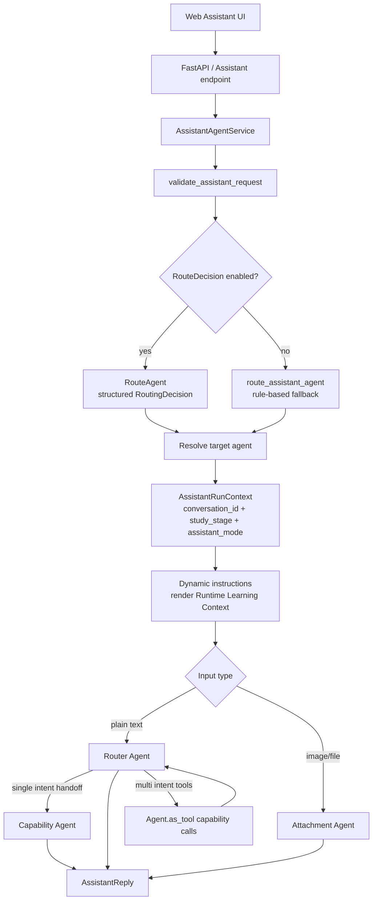
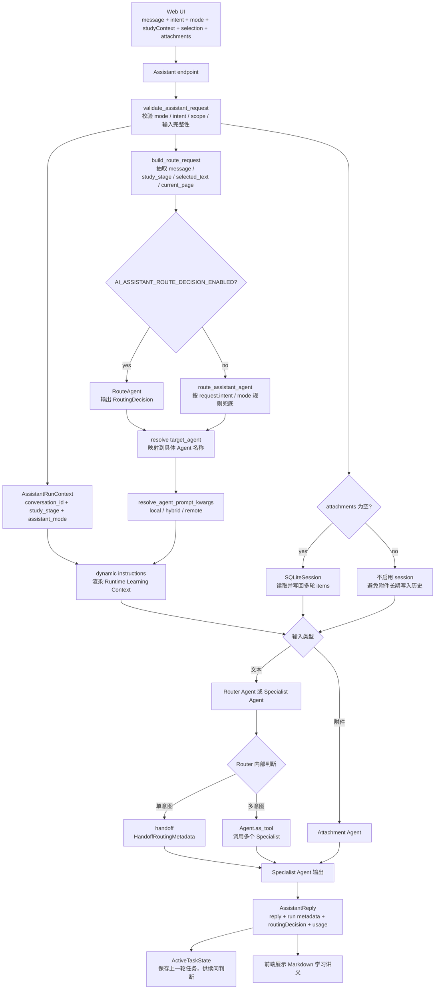
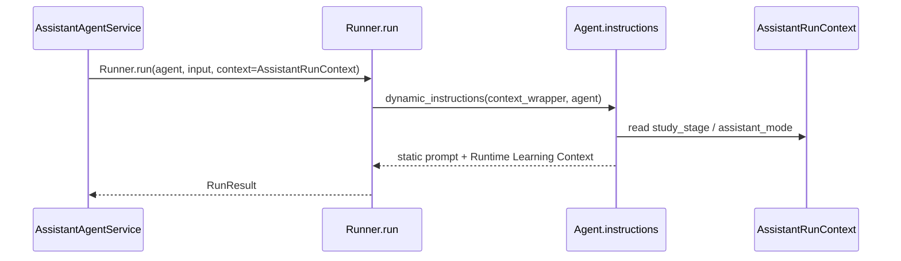

# 学习助手 Agent 编排架构

## 当前结论

PEAI 学习助手已经采用 OpenAI Agents SDK 的业务编排模式：`AssistantAgentService` 负责入口编排，`Router Agent` 负责学习任务路由与多能力汇总，8 个 capability agent 负责垂直英语学习能力，`Attachment Agent` 独立处理多模态输入，题单设计页使用 Chat Agent + Canvas Tool 的结构化工作流。

当前实现已经具备：

- handoff：单意图任务可以转交给专职 Agent。
- agents as tools：多意图任务可以由 Router 调用多个能力 Agent 并汇总。
- dynamic instructions：本地 prompt 模式下会按运行时 `AssistantRunContext` 注入学段和考试模式上下文。
- function tool：题单 Chat Agent 通过 `generate_prompt_sheet_canvas` 调用 Canvas Agent 生成结构化题单。
- remote prompt fallback：OpenAI 远程 Prompt 可通过环境变量启用，本地 Markdown 仍是权威源。

当前尚未具备完整的检索式上下文加载和平台级 eval 闭环。因此它可以支撑 P0/P1 业务验证，但还不能视为高稳定生产级 agent 工作流。

## 官方模式对齐

OpenAI Agents SDK 的 `Agent` 是由 instructions、tools、handoffs、guardrails 和结构化输出等能力组成的执行单元。SDK 文档将多 agent 协作分为两类常见模式：manager 使用 `Agent.as_tool()` 调用专家，handoff 则让专职 Agent 接管后续对话。PEAI 当前同时使用这两种模式：单意图偏 handoff，多意图偏 manager。

SDK 的 `context` 是本地运行对象，默认不会自动发送给模型；如果模型需要看见上下文，必须通过 dynamic instructions、用户输入片段或工具结果显式渲染。PEAI 当前通过 dynamic instructions 把 `study_stage` 和 `assistant_mode` 渲染为 `Runtime Learning Context`。

参考：

- [OpenAI Agents SDK - Agents](https://openai.github.io/openai-agents-python/agents/)
- [OpenAI Agents SDK - Context management](https://openai.github.io/openai-agents-python/context/)
- [OpenAI Agents SDK - Handoffs](https://openai.github.io/openai-agents-python/handoffs/)
- [OpenAI Agents SDK - Tools](https://openai.github.io/openai-agents-python/tools/)

## 组件职责

| 组件 | 职责 | 当前实现 |
| --- | --- | --- |
| `AssistantAgentService` | 请求校验、路由决策、Agent 选择、运行上下文、trace metadata、结果封装 | `python/ai_orchestrator/assistant_service.py` |
| `RouteAgent` | 结构化路由决策，输出 `RoutingDecision` | `agents/route_decision.py` |
| `Router Agent` | 学习任务编排，单意图 handoff，多意图调用 agent tools 并汇总 | `agents/router.py` |
| capability agents | 润色、句构、词汇、翻译、评分、出题、画像、规划 | `agents/specialists.py` |
| `Attachment Agent` | 图片、截图、文件等多模态英语学习请求 | `agents/attachment.py` |
| `PromptSheetWorkflowService` | 题单设计页 Chat + Canvas 结构化工作流 | `services/prompt_sheet_workflow.py` |
| `AgentSessionRunner` | 统一调用 `Runner.run` / `Runner.run_streamed`，管理 session、usage、run items | `services/agent_session_runner.py` |
| prompt resolver | 本地 prompt、动态 instructions、远程 Prompt ID 的切换 | `prompts/resolver.py` |

## 当前流程



## 已实现的 Agent 编排任务

| 编排任务 | 实现方式 | 稳定性判断 |
| --- | --- | --- |
| 单意图纯文本学习请求 | Router 挂载 8 个 `handoff()` | 可用，但依赖 Router prompt 路由质量 |
| 多意图请求 | Router 挂载 8 个 `Agent.as_tool()` | 可用，仍缺少结构化中间结果契约 |
| 带附件请求 | 直接调用 `Attachment Agent`，跳过 Router handoff | 可用，避免多模态内容在 handoff 链路丢失 |
| 结构化路由 | `RouteAgent` 输出 `RoutingDecision` | 可用，适合后端选择目标 Agent |
| 续问处理 | `ContinuationClassifier` + `ActiveTaskState` | 可用，仍需更多回归样例 |
| 学段/考试模式注入 | `AssistantRunContext` + dynamic instructions | 已接入，后续应改为按 intent 渐进加载 |
| 文本多轮记忆 | `SQLiteSession(appConversationId, AI_ASSISTANT_SESSION_DB_PATH)` | 已接入，附件链路暂不启用 |
| 题单设计聊天 | Chat Agent 使用 function tool 调用 Canvas Agent | 可用，结构化输出约束较清晰 |
| 远程 Prompt 发布 | `AI_ASSISTANT_PROMPT_SOURCE` + `Agent.prompt` | 可用，但远程版本需要人工发布和固定 |

## 编排字段字典

本节只记录 Agent 编排会直接使用、路由会依赖、或会进入 instructions / trace / session 的字段。纯展示字段、数据库字段和非编排业务字段不在这里重复展开。

### 入口请求 `AssistantRequest`

| 字段 | 是否必填 | 中文意思 | 编排用途 |
| --- | --- | --- | --- |
| `appConversationId` | 否 | App 侧会话 ID | 作为 Agents SDK session key；为空时使用 `clientMessageId` 兜底 |
| `clientMessageId` | 是 | 前端消息 ID | 幂等、日志、无会话 ID 时作为临时 conversation id |
| `idempotencyKey` | 否 | 幂等键 | 预留给重复提交保护 |
| `mode` | 是 | 学习模式 | 影响路由兜底、dynamic instructions 和 trace |
| `intent` | 是 | 前端声明的粗意图 | 规则路由 fallback 使用；RouteDecision 会重新做结构化判断 |
| `scope` | 否 | 输入范围 | 校验请求是否包含对应输入，如选中文本、附件 |
| `message.text` | 否 | 用户本轮文本 | 进入 RouteRequest 和最终 Agent input |
| `selection` | 否 | 用户选中的文本 | 进入 RouteRequestContext.selected_text，也可进入模型输入 |
| `attachments` | 否 | 上传附件列表 | 有附件时优先走 Attachment Agent，且暂不启用 SDK session |
| `studyContext` | 否 | 学习画像上下文 | 生成 `AssistantRunContext.study_stage`，进入 dynamic instructions |
| `clientMeta` | 否 | 前端来源信息 | 进入路由上下文和 trace metadata |

`mode` 可选项：

| 值 | 中文意思 | 当前处理 |
| --- | --- | --- |
| `daily_explain` | 日常讲解模式 | 默认学习助手模式 |
| `exam_boost` | 考试强化模式 | 会被 Runtime Learning Context 归一为考试模式 `exam` |

`intent` 可选项：

| 值 | 中文意思 | 当前路由含义 |
| --- | --- | --- |
| `free_chat` | 自由学习问答 | 通常进入 Router Agent |
| `explain` | 解释说明 | 通常进入 Router Agent 再判断具体能力 |
| `translate` | 翻译 | 规则 fallback 指向 Translation Agent |
| `polish` | 润色 | 规则 fallback 指向 Polish Agent |
| `summarize` | 总结 | 当前无独立 specialist，通常由 Router Agent 处理 |
| `grade_writing` | 作文评分 | 规则 fallback 指向 Scoring Agent |
| `generate_examples` | 生成例句 | 当前无独立 specialist，通常由 Router Agent 处理 |
| `analyze_question` | 分析题目 | 规则 fallback 指向 Prompt Design Agent |

`scope` 可选项：

| 值 | 中文意思 |
| --- | --- |
| `message_only` | 只有用户消息 |
| `selection` | 只有选中文本 |
| `attachments` | 只有附件 |
| `selection_and_message` | 选中文本 + 用户消息 |
| `attachments_and_message` | 附件 + 用户消息 |
| `selection_attachments_and_message` | 选中文本 + 附件 + 用户消息 |

### 选区、附件和学习上下文字段

`selection.source` 可选项：

| 值 | 中文意思 |
| --- | --- |
| `assistant_message` | 来自助手历史消息 |
| `writing_editor` | 来自写作编辑器 |
| `page_selection` | 来自页面普通选区 |
| `uploaded_image_ocr` | 来自上传图片 OCR |

`attachments` 相关枚举：

| 字段 | 可选项 | 中文意思 |
| --- | --- | --- |
| `provider` | `app_storage` / `openai_files` / `external_url` | App 存储 / OpenAI 文件 / 外部 URL |
| `kind` | `image` / `pdf` / `txt` / `docx` / `doc` / `other` | 图片 / PDF / 文本 / Word / 旧 Word / 其他 |
| `processing.status` | `uploaded` / `processing` / `ready` / `failed` | 已上传 / 处理中 / 可用 / 失败 |
| `modelInput.preferredPart` | `input_image` / `input_file` / `input_text` | 优先按图片 / 文件 / 文本送入模型 |
| `modelInput.imageDetail` | `low` / `high` / `auto` | 图片理解精度：低 / 高 / 自动 |

`studyContext` 字段：

| 字段 | 可选项 | 中文意思 | 当前处理 |
| --- | --- | --- | --- |
| `studyStage` | 非严格枚举；当前识别 `primary`、`junior`、`senior`、`highschool`、`cet4`、`cet6`、`postgrad`、`ielts`、`toefl`、`1`、`2`、`3`、`4` | 学段或考试阶段 | 归一为中文学段，写入 Runtime Learning Context |
| `cefrLevel` | `A1` / `A2` / `B1` / `B2` / `C1` / `C2` | CEFR 等级 | 当前只作为请求上下文保留，尚未进入 dynamic instructions |
| `targetExam` | 任意字符串 | 目标考试 | 进入 trace metadata，后续可用于检索考试标准 |
| `locale` | `zh-CN` / `en-US` | 用户区域语言 | 当前只作为请求上下文保留 |
| `responseLanguage` | `zh-CN` / `en-US` / `mixed` | 期望回复语言 | 当前只作为请求上下文保留 |

`studyStage` 数字兼容值：

| 值 | 中文意思 |
| --- | --- |
| `1` | 高中 |
| `2` | 四级 |
| `3` | 六级 |
| `4` | 考研 |

### 运行时上下文 `AssistantRunContext`

| 字段 | 是否必填 | 中文意思 | 是否自动给模型看见 |
| --- | --- | --- | --- |
| `conversation_id` | 是 | 当前会话 ID | 否；主要用于日志、handoff 记录、session key |
| `study_stage` | 否 | 学段或考试阶段 | 是；本地 prompt 模式下会被 dynamic instructions 渲染 |
| `assistant_mode` | 否 | 助手模式 | 是；`exam_boost` 会渲染为考试模式要求 |

注意：Agents SDK 的 `context` 是本地对象，不会天然进入模型上下文。当前项目通过 `load_dynamic_agent_instructions()` 显式把 `study_stage` 和 `assistant_mode` 渲染到 instructions。

### 路由请求 `RouteRequest`

| 字段 | 是否必填 | 中文意思 | 来源 |
| --- | --- | --- | --- |
| `message` | 是 | 用户本轮文本 | `AssistantRequest.message.text` |
| `conversation_id` | 否 | 会话 ID | `AssistantRequest.appConversationId` |
| `user_id` | 否 | 用户 ID | 适配层预留 |
| `study_stage` | 否 | 学段 | `AssistantRequest.studyContext.studyStage` |
| `assistant_mode` | 否 | 助手模式 | `AssistantRequest.mode` |
| `context.essay_text` | 否 | 作文正文 | 当前适配层预留 |
| `context.topic_prompt` | 否 | 作文题目 | 当前适配层预留 |
| `context.selected_text` | 否 | 选中文本 | `AssistantRequest.selection.text` |
| `context.current_page` | 否 | 当前页面 | `AssistantRequest.clientMeta.sourcePage` |
| `context.active_task` | 否 | 当前活跃任务状态 | 当前适配层预留 |

### 路由结果 `RoutingDecision`

| 字段 | 是否必填 | 中文意思 | 规则 |
| --- | --- | --- | --- |
| `intent` | 是 | 标准化后的路由意图 | 必须是 `RouteDecisionIntent` |
| `route_type` | 是 | 路由动作类型 | 决定是否运行 workflow、追问、直接答复或拒绝 |
| `workflow` | 条件必填 | 工作流名称 | `route_type=run_workflow` 时必填 |
| `target_agent` | 条件必填 | 目标 Agent | `route_type=run_workflow` 时必填 |
| `confidence` | 是 | 路由置信度 | `0.0` 到 `1.0` |
| `required_inputs` | 否 | 完成任务需要的输入 | 例如作文正文、题目、选中文本 |
| `missing_inputs` | 否 | 当前缺失的输入 | `route_type=ask_clarification` 时必须非空 |
| `normalized_inputs` | 否 | 归一化后的输入状态 | 包含是否有作文、题目、选区、页面 |
| `reason` | 是 | 路由理由 | 只用于内部日志和调试，不暴露给用户 |

`RouteDecisionIntent` 可选项：

| 值 | 中文意思 |
| --- | --- |
| `writing_evaluation` | 作文评分和诊断 |
| `first_draft_coach` | 首稿写作指导或题目拆解 |
| `realtime_sentence_feedback` | 实时句子反馈 |
| `polish` | 润色 |
| `sentence_structure` | 句子结构分析 |
| `vocab` | 词汇、短语、搭配讲解 |
| `translation` | 翻译 |
| `scoring` | 评分和评价 |
| `practice_design` | 练习或题目设计 |
| `ability_profile` | 能力画像解读 |
| `learning_planner` | 学习规划 |
| `free_chat` | 英语学习自由问答 |
| `out_of_scope` | 非英语学习范围 |

`route_type` 可选项：

| 值 | 中文意思 | 当前处理 |
| --- | --- | --- |
| `run_workflow` | 运行目标工作流 | 必须有 `workflow` 和 `target_agent` |
| `ask_clarification` | 追问补充信息 | 必须有 `missing_inputs` |
| `answer_direct` | 直接轻答 | 当前主要用于简单学习问题 |
| `out_of_scope` | 范围外拒答 | `intent` 必须是 `out_of_scope` |

`workflow` 可选项：

| 值 | 中文意思 |
| --- | --- |
| `writing_evaluation` | 作文评分工作流 |
| `first_draft_coach` | 首稿教练工作流 |
| `realtime_sentence_feedback` | 实时句子反馈工作流 |
| `specialist_single_turn` | 单轮专职 Agent 工作流 |

`target_agent` 可选项：

| 值 | 中文意思 | 最终 Agent |
| --- | --- | --- |
| `writing_evaluation` | 作文评分目标 | Scoring Agent |
| `first_draft_coach` | 首稿写作目标 | Prompt Design Agent |
| `realtime_sentence_feedback` | 句子反馈目标 | Sentence Structure Agent |
| `polish` | 润色目标 | Polish Agent |
| `sentence_structure` | 句构目标 | Sentence Structure Agent |
| `vocab` | 词汇目标 | Vocab Agent |
| `translation` | 翻译目标 | Translation Agent |
| `scoring` | 评分目标 | Scoring Agent |
| `practice_design` | 出题目标 | Prompt Design Agent |
| `ability_profile` | 能力画像目标 | Ability Profile Agent |
| `learning_planner` | 学习规划目标 | Learning Planner Agent |

### Router Handoff Metadata

Router Agent 单意图 handoff 时，会把以下结构作为 handoff 输入：

| 字段 | 是否必填 | 中文意思 | 可选项 |
| --- | --- | --- | --- |
| `intent` | 是 | Router 选择的标准意图 | `polish`、`sentence_structure`、`vocab`、`translation`、`scoring`、`practice_design`、`ability_profile`、`learning_planner` |
| `reason` | 是 | 转交理由 | 自然语言短句 |
| `confidence` | 是 | 转交置信度 | `0.0` 到 `1.0` |

### Specialist Agents

| `prompt_key` | Agent 名称 | 中文职责 | tool 名称 |
| --- | --- | --- | --- |
| `polish` | `Polish Agent` | 润色、改写、表达升级 | `polish_text` |
| `sentence_structure` | `Sentence Structure Agent` | 句子结构、语法结构、从句和长难句分析 | `analyze_sentence_structure` |
| `vocab` | `Vocab Agent` | 单词、短语、搭配、语义差异和误用 | `explain_vocab` |
| `translation` | `Translation Agent` | 中英互译和译文质量解释 | `translate_text` |
| `scoring` | `Scoring Agent` | 作文评分、评价、诊断和改进建议 | `score_english` |
| `prompt_design` | `Prompt Design Agent` | 出题、练习生成、写作任务设计 | `design_practice_prompt` |
| `ability_profile` | `Ability Profile Agent` | 能力画像、优势弱点、当前水平解释 | `explain_ability_profile` |
| `learning_planner` | `Learning Planner Agent` | 学习路径、阶段目标、短期训练计划 | `plan_learning_path` |

### 续问状态 `ActiveTaskState`

| 字段 | 是否必填 | 中文意思 |
| --- | --- | --- |
| `conversation_id` | 是 | 会话 ID |
| `active_intent` | 是 | 上一轮活跃任务意图 |
| `active_agent` | 是 | 上一轮承接任务的 Agent |
| `task_title` | 是 | 任务标题 |
| `task_summary` | 是 | 上一轮用户任务摘要 |
| `user_goal` | 否 | 用户目标 |
| `last_user_message` | 是 | 上一轮用户消息 |
| `last_assistant_summary` | 否 | 上一轮助手输出摘要 |
| `last_output_type` | 是 | 上一轮输出类型 |
| `continuation_capabilities` | 否 | 允许的续问动作 |
| `status` | 是 | 活跃任务状态 |
| `turn_id` | 是 | 最近一轮 response 或内部 turn id |
| `updated_at` | 是 | 更新时间 |
| `expires_at` | 否 | 过期时间 |

`ContinuationRelation` 可选项：

| 值 | 中文意思 |
| --- | --- |
| `new_task` | 新任务 |
| `continue_previous_task` | 继续上一轮任务 |
| `modify_previous_output` | 修改上一轮输出 |
| `clarify_previous_task` | 追问上一轮任务细节 |
| `switch_task` | 切换任务 |
| `out_of_scope` | 范围外 |
| `ambiguous` | 意图不明确 |

`ContinuationAction` 可选项：

| 值 | 中文意思 |
| --- | --- |
| `more_options` | 多给几个方案 |
| `expand_detail` | 展开讲细一点 |
| `simplify` | 简化 |
| `make_harder` | 提高难度 |
| `rewrite_variant` | 换一种表达或改写 |
| `continue_sequence` | 按序继续 |
| `compare_options` | 对比多个方案 |
| `generate_practice` | 生成练习 |
| `none` | 无续问动作 |

`TaskOutputType` 可选项：

| 值 | 中文意思 |
| --- | --- |
| `plan` | 学习计划 |
| `polished_text` | 润色文本 |
| `translation` | 翻译结果 |
| `score_feedback` | 评分反馈 |
| `vocab_explanation` | 词汇讲解 |
| `sentence_analysis` | 句子分析 |
| `practice_set` | 练习集合 |
| `ability_profile` | 能力画像 |
| `mixed_result` | 混合结果 |

### Prompt Resolver 配置字段

| 字段 | 可选项 | 中文意思 | 当前处理 |
| --- | --- | --- | --- |
| `AI_ASSISTANT_PROMPT_SOURCE` | `local` / `hybrid` / `remote` | Prompt 来源 | 默认 `local` |
| `AI_ASSISTANT_REMOTE_PROMPT_STRICT` | `true` / `false` 等布尔写法 | 远程 Prompt 严格模式 | 开启后缺少远程配置会报错 |
| `OPENAI_BASE_URL` / `AI_PROVIDER_OPENAI_BASE_URL` | OpenAI Platform URL | OpenAI API 地址 | 远程 Prompt 只允许 `api.openai.com` |
| `AI_PROMPT_<AGENT>_ID` | Prompt ID | 远程 Prompt ID | 存在时返回 `Agent.prompt` |
| `AI_PROMPT_<AGENT>_VERSION` | 版本号 | 远程 Prompt 版本 | 建议固定版本 |
| `AI_PROMPT_<AGENT>_VARIABLES_JSON` | JSON object | 远程 Prompt 变量 | 必须是 JSON 对象 |

`AI_ASSISTANT_PROMPT_SOURCE` 语义：

| 值 | 中文意思 | 行为 |
| --- | --- | --- |
| `local` | 只用本地 Markdown prompt | 返回 `instructions` 或 dynamic `instructions` |
| `hybrid` | 优先远程，失败回本地 | 远程配置可用时返回 `prompt`，否则回本地 |
| `remote` | 只用 OpenAI 远程 Prompt | 缺配置或 base URL 不合法时直接报错 |

### 题单工作流字段

题单工作流不是普通学习助手的主路由，但也属于当前 Agent 编排。Chat Agent 会根据用户消息决定是否调用 Canvas Tool，Canvas Agent 再返回结构化题单。

| 字段 | 可选项 | 中文意思 |
| --- | --- | --- |
| `promptType` | `general` / `material` / `chart` / `comic` | 通用题 / 材料题 / 图表题 / 漫画或图片题 |
| `action` | `chat_only` / `ask_clarification` / `propose_patch` / `create_prompt_sheet` / `update_prompt_sheet` / `replace_prompt_sheet` | 只聊天 / 追问 / 建议补丁 / 创建题单 / 更新题单 / 替换题单 |
| `chartSpec.displayType` | `table` / `chart` | 表格 / 图表 |
| `sourceType` | `ai_generated` | AI 生成 |
| `attachmentType` | `none` / `material` / `visual` | 无附件 / 材料附件 / 视觉附件 |
| `visualKind` | `image` / `comic` / `chart` / `table` | 图片 / 漫画 / 图表 / 表格 |

## 字段流转流程图



## Dynamic Instructions

本地 prompt 模式下，Agent 创建时使用 `resolve_agent_prompt_kwargs(..., dynamic=True)`。Resolver 返回一个 callable `instructions`，运行时从 `RunContextWrapper.context` 读取 `AssistantRunContext`，并把学段和考试模式渲染到系统指令末尾。



设计原则：

- 静态 prompt 只写角色、边界、工具使用和输出约束。
- 运行时 context 只放本轮需要的轻量状态，例如学段、模式、会话 ID。
- 模型需要看见的上下文必须显式渲染；不能假设 `Runner.run(context=...)` 会自动进入模型上下文。
- 远程 Prompt 模式保持 `Agent(prompt={id, version})`，不混用本地 dynamic instructions。

## Prompt 与标准注入

当前有两条上下文注入路径：

| 路径 | 当前行为 | 风险 |
| --- | --- | --- |
| 普通学习助手 | `study_stage` 和 `assistant_mode` 会进入用户输入，也会进入 dynamic instructions | 可能重复注入学段标准，后续应收敛到单一渲染层 |
| 题单工作流 | `examPromptStandard`、`promptTypeStandard`、`examStyleReference` 按请求动态注入 Canvas Agent 输入 | 较稳定，但仍是规则型加载，不是检索型加载 |

下一步建议把上下文加载收敛成 `RuntimeContextBuilder`：


## 多轮记忆策略

正式 `AssistantRequest` 链路已经对无附件文本请求启用 Agents SDK session：

```text
appConversationId
-> SQLiteSession(appConversationId, AI_ASSISTANT_SESSION_DB_PATH)
-> Runner.run / Runner.run_streamed
-> SDK 自动读取并写回本会话历史 items
```

这样第二轮文本追问可以复用上一轮用户输入、Assistant 输出、工具调用和 handoff 结果，不需要业务层手写完整 history 拼接。

当前限制：

- 带附件请求暂时不启用 session，避免把文件输入、临时 URL 或过大的附件内容写进长期历史。
- RouteDecision 前置路由本身仍是单轮判断；如果第二轮追问依赖强上下文，最终目标 Agent 可以通过 session 恢复上下文，但前置路由仍需要后续接入 active task 或 session 摘要。
- Session 是 SDK 侧记忆，不等同于 OpenAI Platform Conversations；平台 Logs 中 Conversations 是否出现，取决于是否使用 `OpenAIConversationsSession` 或 server-managed `conversation_id`。

推荐策略：

- metadata always：`studyStage`、`assistantMode`、`intent` 等轻量字段每轮可传。
- standard snippets when relevant：评分、润色、出题、考试策略时加载相关片段。
- full standards only when asked：用户明确问考试标准时才加载完整标准正文。

## 稳定性评估

当前工作流对 P0 验证是可用的，但稳定性主要取决于以下边界：

| 风险 | 现状 | 建议 |
| --- | --- | --- |
| Router prompt 同时承担路由和汇总 | 容易变长，且 intent 边界会继续膨胀 | 继续让 `RouteAgent` 负责结构化路由，Router 更偏 manager |
| handoff 与 agents-as-tools 同时存在 | 单意图/多意图语义需要非常清楚 | 保持 prompt 明确区分，补充 trace/eval |
| capability agent 输出多为自然语言 | 多意图汇总时不够稳定 | 为 scoring、polish、translation 等补结构化输出 schema |
| 上下文注入路径重复 | 学段标准同时可能出现在 input 和 dynamic instructions | 引入统一 `RuntimeContextBuilder` 后逐步去重 |
| 远程 Prompt 与本地 prompt 不自动同步 | Dashboard 版本可能落后本地 | 本地为权威源，远程发布必须固定 version |
| 缺少 retrieval / file search | 标准增长后只能靠本地 key 加载 | 标准文档变多后再接 OpenAI File Search 或本地检索 |
| 当前 SDK trace API 有版本差异 | 测试中可见 `flush_traces` 不存在 | 对 trace flush 做版本兼容封装 |
| 缺少正式 eval harness | 主要依赖单测和 prompt 断言 | 增加 agent eval cases，覆盖路由、工具调用、输出结构 |

## 已知缺陷

1. `RouteAgent` 与 `Router Agent` 的职责仍有重叠。前者做结构化路由，后者也在 prompt 中做 intent 判断；后续应让前者成为主路由来源，后者负责执行和汇总。
2. 学段标准目前还没有按 intent 精细控制加载，简单词义问题也可能拿到较重的学段上下文。
3. 多意图工具调用缺少强结构化中间结果，Router 汇总时仍依赖自然语言。
4. 远程 Prompt 不会自动读取本地 Markdown，存在版本漂移风险。
5. 还没有 File Search / Retrieval；当考试标准和 rubric 变多时，本地规则加载会变得难维护。
6. trace flush 与当前安装的 Agents SDK 版本存在兼容问题，需要单独收敛。

## 验证

当前与编排相关的重点测试包括：

```powershell
python\.venv\Scripts\python.exe -m unittest `
  python.ai_orchestrator.tests.test_prompt_resolver `
  python.ai_orchestrator.tests.test_user_context `
  python.ai_orchestrator.tests.test_assistant_output_format_prompt `
  python.ai_orchestrator.tests.test_route_agent_structure `
  python.ai_orchestrator.tests.test_agent_session_runner
```

动态 instructions 关键验证点：

- 本地模式下 `Agent.instructions` 是 callable。
- 运行时 `AssistantRunContext` 能携带 `study_stage` 和 `assistant_mode`。
- `exam_boost` 会归一为考试模式。
- 结构化 Agent 不注入 Markdown 学习讲义规范。
- 远程 Prompt 配置存在时仍返回 `Agent.prompt`，不走本地 dynamic instructions。

## 后续路线

优先级建议：

1. 抽出 `RuntimeContextBuilder`，统一普通学习助手和题单工作流的上下文注入策略。
2. 将 `RouteAgent` 的结构化结果作为 Router 执行依据，减少 Router prompt 中的路由负担。
3. 为核心 capability agent 补结构化输出 schema。
4. 增加本地 eval harness，覆盖单意图、多意图、续问、附件、标准询问和非英语学习收口。
5. 给 trace flush 增加 SDK 版本兼容。
6. 标准资产增长后，再评估接入 OpenAI File Search 或本地检索层。
