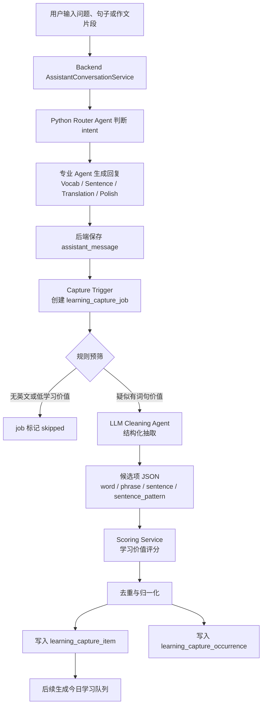
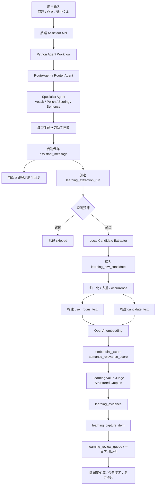

# 对话词句采集清洗方案

## 1. 产品目标

对话词句采集的目标不是把模型回复里的所有英文内容直接塞进单词本，而是从用户真实学习对话中沉淀可复用的个人学习资产。

第一版先完成后端底座：

- 从助手回复中自动发现单词、短语、句子和句型候选项。
- 通过异步清洗和评分判断候选项是否值得学习。
- 把高价值内容落到数据库，保留来源、置信度、评分和状态。
- 为后续单词模块、讲解模块和今日学习队列提供稳定数据源。

不在第一版直接做完整前端学习页，也不把所有采集结果无差别展示给用户。

## 2. Agent 工作流程



### 2.1 聊天主链路

用户对话仍走现有助手链路：后端接收请求，Python Router Agent 判断 intent，再交给词汇、句子结构、翻译、润色等专业 Agent 生成回复。后端保存 assistant message 后立即返回，不等待采集清洗完成。

### 2.2 采集清洗链路

助手回复保存成功后，后端创建 `learning_capture_job`。异步任务先做规则预筛，只有疑似包含学习价值的回复才进入 LLM 清洗。Cleaning Agent 只负责信息抽取，不负责决定第二天用户学什么。

### 2.3 评分入库链路

清洗结果进入评分服务。评分服务结合用户输入、助手回复结构、重复出现、难度匹配和写作考试价值，产出优先级。高价值内容写入主表，并记录每次出现的来源。

## 3. 详细实现步骤与规则

本节把流程图里的每个节点拆成可实现的后端步骤。第一版要求所有步骤都可重试、可跳过、可排查，任何采集失败都不能影响聊天消息保存。

### 3.1 Step 1：助手回复保存后触发采集

触发点：

- `sendAgentMessage`：Python 返回完整回复，后端保存 assistant message 后触发。
- `writeAgentMessageStream`：流式回复结束，后端保存 assistant message 后触发。
- 只处理 `role = assistant` 且 `status = done` 的消息。

输入：

| 字段 | 来源 |
| --- | --- |
| `user_id` | 当前登录用户 |
| `conversation_uid` | 当前助手对话 |
| `message_uid` | 刚保存的 assistant message |
| `raw_content` | assistant message content |
| `run_id` / `trace_id` | Python run metadata |
| `source_agent` | `run.agentName` |
| `source_intent` | `run.intent` 或 routing decision intent |
| `source_model` | `run.model` |

处理规则：

- 如果 `raw_content` 为空，直接不创建 job。
- 如果同一个 `message_uid` 已经创建过 job，不重复创建。
- 创建 job 时 `status = pending`、`attempt_count = 0`。
- job 创建失败只记录 warn 日志，不回滚 assistant message。

输出：

- 新增一条 `learning_capture_job`。
- 记录日志：`userId`、`conversationUid`、`messageUid`、`sourceAgent`、`sourceIntent`、`rawContentLength`。

### 3.2 Step 2：规则预筛

规则预筛是 LLM 清洗前的低成本过滤器。它只回答一个问题：这条 assistant 回复是否值得送去 LLM 清洗。

输入：

- `learning_capture_job.raw_content`
- `source_agent`
- `source_intent`
- 用户原始问题摘要，可从同一对话上一条 user message 或 run debug 记录中读取。

输出：

- `should_clean = true`：进入 LLM 清洗。
- `should_clean = false`：job 标记 `skipped`。
- `skip_reason`：跳过原因，写入 `error_message` 或独立字段。

必须跳过的规则：

| 规则 | 建议阈值 | skip_reason |
| --- | --- | --- |
| 内容为空或只有空白 | `raw_content.trim().isEmpty()` | `empty_content` |
| 回复过短 | 清洗后少于 20 个字符 | `too_short` |
| 英文字符太少 | 英文字母少于 10 个 | `low_english_signal` |
| 没有英文词块 | 找不到 `[A-Za-z]{2,}` | `no_english_token` |
| 明显错误提示 | 包含“暂时不可用”“请求失败”“请稍后再试”等 | `error_message` |
| 非学习 intent 且低英文信号 | intent 为 `free_chat` 且英文句子数为 0 | `non_learning_low_signal` |

建议进入清洗的正向信号：

| 信号 | 说明 |
| --- | --- |
| 学习相关 agent | `Vocab Agent`、`Sentence Structure Agent`、`Translation Agent`、`Polish Agent` |
| 学习相关 intent | `vocab`、`sentence_structure`、`explain`、`translate`、`polish`、`realtime_sentence_feedback` |
| 教学标题 | 含“重点表达”“同类表达”“你可以这样记”“练习一下”“句子结构”“常见误用” |
| 英文项目符号 | 多行 `- English phrase` 或 `* English sentence` |
| 句型公式 | 含 `+`、`...`、`sth`、`sb`、`名词`、`动词原形` 等模式说明 |
| 完整英文句 | 至少 1 个 6 个词以上、以句号或问号结尾的英文句子 |

第一版判定建议：

```text
should_clean =
  not must_skip
  AND (
    source_agent_or_intent_is_learning_related
    OR teaching_heading_count >= 1
    OR english_sentence_count >= 1
    OR english_bullet_count >= 2
    OR pattern_signal_count >= 1
  )
```

预筛不做的事情：

- 不决定最终是否进入单词本。
- 不给学习优先级。
- 不做复杂语义判断。
- 不调用 LLM。

### 3.3 Step 3：构造 LLM 清洗任务

进入清洗前，后端要把原始回复裁剪成适合抽取的输入，降低 token 成本。

输入组装：

| 字段 | 说明 |
| --- | --- |
| `assistantContent` | assistant 原始回复，最长建议 6000 字符 |
| `userFocus` | 用户上一条问题或选中文本摘要，最长建议 1000 字符 |
| `sourceIntent` | intent |
| `sourceAgent` | agent name |
| `studyStage` | 用户学段，能取到就传 |
| `existingItems` | 可选，近期已收录 normalized_text，避免重复推荐 |

裁剪规则：

- 优先保留含英文的段落。
- 优先保留教学标题附近的内容。
- 去掉纯中文长解释中没有英文的段落。
- 原文超过上限时保留开头、含教学标题段落、结尾练习段落。

模型选择：

- 第一版使用低成本小模型。
- 温度设为低值，例如 `temperature = 0` 或接近 0。
- 要求返回 JSON，不返回 Markdown。

### 3.4 Step 4：LLM Cleaning Agent 抽取规则

Cleaning Agent 的职责是抽取候选项，不做最终学习推荐。

系统要求：

- 只从 assistant 回复中抽取。
- 用户输入只用于判断上下文，不直接当作抽取来源。
- 不要创造回复中不存在的新单词、新短语、新句子。
- 每个候选项必须能在 `assistantContent` 中找到对应来源片段。
- 同一含义的重复项只保留最完整、最适合学习的一条。

类型判定规则：

| itemKind | 判定规则 |
| --- | --- |
| `word` | 单个英文词，通常是被解释、对比或强调的词 |
| `phrase` | 2 到 7 个英文词，表示短语、搭配、固定表达或同类表达 |
| `sentence` | 完整英文句子、练习句、用户可模仿的例句 |
| `sentence_pattern` | 句型公式、表达框架、可替换结构 |

不要抽取：

- 普通标题，如 `Examples`、`Practice`。
- 人名、产品名、文件名、URL。
- 太泛的功能词，如 `the`、`and`、`very`。
- 与英语学习无关的技术词，除非用户问题本身在学该表达。
- 超过 35 个英文词的长句，除非它明确是用户正在学习的原句。

置信度建议：

| confidence | 含义 | 后端处理 |
| --- | --- | --- |
| `>= 0.85` | 高可信，内容明确被讲解或练习 | 可进入主 item |
| `0.70 - 0.84` | 中可信，内容有学习价值但上下文弱 | 可进入主 item，但优先级较低 |
| `< 0.70` | 低可信 | 不进入主 item，只保留在 job result |

### 3.5 Step 5：结构化结果校验

LLM 返回后，后端必须先校验，不能直接入库。

校验规则：

| 校验项 | 规则 |
| --- | --- |
| JSON 格式 | 必须能解析为对象，且包含 `items` 数组 |
| 数量限制 | 单条回复最多保留 20 个候选项 |
| 类型枚举 | `itemKind` 必须是允许值 |
| 英文内容 | `text` 必须包含英文字母 |
| 来源片段 | `sourceExcerpt` 为空时用 `text` 补齐 |
| 置信度 | 缺失时默认 `0.70`，低于阈值不入主表 |
| 长度限制 | `word` 不超过 40 字符，`phrase` 不超过 120 字符，`sentence` 不超过 300 字符 |
| 重复项 | 同一结果内按 `itemKind + normalizedText` 去重 |

非法 JSON 处理：

- job `attempt_count + 1`。
- 如果未超过最大重试次数，状态回到 `pending`。
- 如果超过最大重试次数，状态标记 `failed`。
- 记录 `error_message = invalid_cleaning_json`。

### 3.6 Step 6：归一化与去重

归一化用于判断同一个用户是否已经收录过同一词句。

通用归一化：

- trim 首尾空白。
- 多空格合并为一个空格。
- 英文统一小写。
- 去掉外层引号、反引号、项目符号。
- 句末单个句号、问号、感叹号不参与短语去重。

按类型处理：

| itemKind | normalized_text 规则 |
| --- | --- |
| `word` | 小写 lemma 优先；没有 lemma 时用小写原词 |
| `phrase` | 小写、合并空格、去掉末尾标点 |
| `sentence` | 小写、合并空格、保留核心标点，避免不同句子误合并 |
| `sentence_pattern` | 小写、统一 `sb.` 为 `sb`、`sth.` 为 `sth`、合并 `+` 两侧空格 |

去重规则：

- 主表唯一键建议：`user_id + item_kind + normalized_text`。
- 已存在时不新增主 item。
- 已存在且本次评分更高时，可更新 `priority_score` 和解释字段。
- 每次命中都新增 occurrence。
- 主 item 的 `occurrence_count + 1`，`last_seen_at = now()`。

### 3.7 Step 7：学习价值评分

评分在入主表前执行，所有分值统一为 `0 - 100`。

输入：

- 清洗候选项。
- 用户上一条问题摘要。
- assistant 回复上下文。
- 来源 agent、intent、study stage。
- 历史出现次数。
- 用户已有掌握状态，第一版没有可忽略。

输出字段：

| 字段 | 说明 |
| --- | --- |
| `relevance_score` | 用户相关性 |
| `learning_value_score` | 学习价值 |
| `difficulty_score` | 难度匹配 |
| `repeat_score` | 重复出现价值 |
| `exam_value_score` | 写作/考试价值 |
| `priority_score` | 综合优先级 |

第一版规则评分：

| 信号 | 加分建议 |
| --- | --- |
| 候选项出现在用户问题或选中文本中 | `relevance +35` |
| 来源 intent 是词汇、拆句、翻译、润色 | `relevance +20` |
| 出现在“重点表达/同类表达/练习一下”等区域 | `learning_value +25` |
| itemKind 是 `phrase` 或 `sentence_pattern` | `learning_value +15` |
| 是完整可迁移句型 | `exam_value +20` |
| 近期出现 2 次以上 | `repeat +15` |
| 明显太简单 | `difficulty -20` |
| 明显过长或过难 | `difficulty -15` |

综合分：

```text
priority_score =
  relevance_score * 0.35
+ learning_value_score * 0.25
+ difficulty_score * 0.15
+ repeat_score * 0.15
+ exam_value_score * 0.10
```

入库阈值建议：

- `priority_score >= 55`：进入主 item。
- `40 <= priority_score < 55`：只保留在 job result，后续可离线复算。
- `< 40`：丢弃候选项，不进入主 item。

### 3.8 Step 8：写入数据库

写入顺序：

1. 锁定或查询主 item：`user_id + item_kind + normalized_text`。
2. 不存在则插入 `learning_capture_item`。
3. 存在则更新出现次数、最近出现时间和更高评分。
4. 插入 `learning_capture_occurrence`。
5. 全部候选处理完成后，job 标记 `completed`。

事务边界：

- 单个 job 的 item 和 occurrence 写入建议在一个事务内。
- 某个候选项失败时，可以跳过该候选项并记录 item-level error，不必让整个 job 失败。
- 数据库异常导致整体失败时，job 回到可重试状态。

状态变化：

```text
pending -> processing -> completed
pending -> skipped
pending -> processing -> pending
pending -> processing -> failed
```

### 3.9 Step 9：查询接口与后续消费

第一版至少提供后端查询接口，方便后续单词模块和讲解模块接入。

接口建议：

| 接口 | 用途 |
| --- | --- |
| `GET /api/learning/captures` | 分页查询用户学习项 |
| `GET /api/learning/captures/{captureUid}` | 查看单个学习项详情和来源 |
| `PATCH /api/learning/captures/{captureUid}` | 更新状态，如 ignored、saved、mastered |

查询过滤：

- `kind=word|phrase|sentence|sentence_pattern`
- `status=captured|saved|ignored|mastered`
- `minPriorityScore`
- `createdFrom` / `createdTo`

默认排序：

```text
priority_score DESC,
last_seen_at DESC,
occurrence_count DESC
```

### 3.10 Step 10：失败处理与观测

失败不能影响主聊天链路。

必须记录的日志：

- job 创建。
- 预筛 skipped 及原因。
- LLM 清洗调用耗时和模型。
- JSON 校验失败原因。
- 入库数量：候选数、入主表数、跳过数。
- job 最终状态。

重试规则：

- 最大重试 3 次。
- 非法 JSON 可重试。
- LLM 超时可重试。
- 预筛 skipped 不重试。
- 内容为空不重试。

建议监控指标：

- 每日创建 job 数。
- skipped 比例。
- LLM 清洗调用次数。
- 平均每条回复抽取 item 数。
- 入主表比例。
- failed job 数。
- 清洗 token 成本。

## 4. Eval / Evidence Builder 第一版规则

第一版可以先不让每日消费者模型直接读取所有聊天记录，也不每轮调用完整 LLM 清洗。更稳的做法是先建设 Eval / Evidence Builder：每轮对话结束后，后端规则负责从用户输入和 assistant 回复中粗提取候选项，深度学习能力负责语义相关性和学习价值判断，最后只把高价值 evidence 喂给消费者模型。

这里要明确职责边界：规则不是最终筛选器，只是候选生成器和低成本降噪层。候选项是否真正值得学习，需要 embedding 相似度和便宜模型共同判断。

```text
每轮对话
-> 并行触发 Local Extractor 和 DeepSeek Async Extractor
-> 两套结果写入 raw candidate 池
-> Candidate Comparator 对比重合、漏提、误提、类型冲突
-> 归一化、去重、计数、来源记录
-> 构建 user_focus_text 和 candidate_text
-> Embedding 相似度计算
-> 便宜模型判断学习价值与可迁移性
-> evidence 筛选与多维打分
-> evidence packet
-> Daily Extraction Agent / 消费者模型
-> 每日学习包
```

### 4.1 组件定位

| 组件 | 职责 | 是否调用模型 |
| --- | --- | --- |
| Local Candidate Extractor | 从每轮对话文本中粗提取英语词、短语、句子、句型候选项 | 否 |
| DeepSeek Async Extractor | 用便宜模型异步提取候选项，作为规则提取的对照组和补充召回 | 是，DeepSeek |
| Candidate Store | 保存全部本地候选项，保留来源和信号 | 否 |
| Candidate Comparator | 对比 local 与 deepseek 的重合、漏提、误提和类型冲突 | 否 |
| Embedding Scorer | 计算候选项与用户关注文本的语义相似度 | 是，embedding 模型 |
| Learning Value Judge | 用便宜模型判断学习价值、可迁移性和推荐理由 | 是，便宜 LLM |
| Evidence Selector | 汇总规则信号、embedding 分和模型判断，筛选高价值证据块 | 可选 |
| Daily Extraction Agent | 基于 evidence packet 生成每日学习内容 | 是 |

这里的 Eval / Evidence Builder 更像“数据集生产器 + 证据构建器 + 语义筛选器”。它不直接生成最终学习包，但需要把生产者 Agent 的大量文本压缩成消费者模型可用、可解释、低噪声的 evidence。

### 4.2 raw candidate 表建议

`learning_raw_candidate` 保存本地规则提取到的全部候选项。它是候选池，不代表用户一定需要学习。

| 字段 | 说明 |
| --- | --- |
| `candidate_uid` | 候选项唯一 ID |
| `user_id` | 用户 ID |
| `conversation_uid` | 来源对话 |
| `message_uid` | 来源消息 |
| `source_role` | `user` / `assistant` |
| `candidate_type` | `word` / `phrase` / `sentence` / `sentence_pattern` |
| `text` | 原始文本 |
| `normalized_text` | 归一化文本 |
| `extractor_type` | `local` / `deepseek` |
| `extraction_run_uid` | 来源提取任务 ID |
| `source_excerpt` | 来源片段 |
| `source_heading` | 命中的 Markdown 标题或段落标题 |
| `local_signals_json` | 本地规则命中的信号 |
| `model_confidence` | 模型提取置信度，本地提取可为空 |
| `comparison_status` | `overlap` / `local_only` / `deepseek_only` / `type_conflict` |
| `local_feature_json` | 本地提取的长度、位置、标题、重复次数等特征 |
| `local_prefilter_score` | 本地预筛分，只用于降噪，不作为最终学习价值 |
| `embedding_score` | 与用户关注文本的语义相似度 |
| `judge_score` | 便宜模型给出的学习价值分 |
| `final_candidate_score` | 汇总后的候选分 |
| `occurrence_count` | 出现次数 |
| `first_seen_at` / `last_seen_at` | 首次和最近出现时间 |

唯一键建议：

```text
user_id + candidate_type + normalized_text + extractor_type
```

如果同一候选项再次出现，不重复插入同来源主候选，只更新 `occurrence_count`、`last_seen_at`，并追加来源记录。跨来源的同一候选项通过 Candidate Comparator 标记为 `overlap`。

### 4.3 extraction run 表建议

`learning_extraction_run` 记录每次提取任务。local 和 deepseek 都写 run，便于对比成本、耗时和结果质量。

| 字段 | 说明 |
| --- | --- |
| `run_uid` | 提取任务 ID |
| `user_id` | 用户 ID |
| `conversation_uid` | 来源对话 |
| `message_uid` | 来源消息 |
| `extractor_type` | `local` / `deepseek` |
| `status` | `pending` / `processing` / `completed` / `failed` |
| `model` | 模型名称，local 可为空 |
| `input_token_count` | 输入 token，local 可为空 |
| `output_token_count` | 输出 token，local 可为空 |
| `result_json` | 原始提取结果 |
| `error_message` | 失败原因 |
| `created_at` / `updated_at` | 创建和更新时间 |

任务策略：

- local extractor 可同步执行，也可以用后台任务执行。
- deepseek extractor 必须异步执行，不阻塞聊天。
- deepseek 失败不影响 local candidate 保存。
- 同一 `message_uid + extractor_type` 不重复创建 run。

### 4.4 evidence 表建议

`learning_evidence` 保存准备喂给消费者模型的高价值证据。它来自 raw candidate，但比 raw candidate 更干净。

| 字段 | 说明 |
| --- | --- |
| `evidence_uid` | evidence 唯一 ID |
| `candidate_uid` | 来源候选项 |
| `user_id` | 用户 ID |
| `evidence_type` | `user_focus` / `key_expression` / `alternative_expression` / `sentence_pattern` / `practice_sentence` |
| `text` | evidence 文本 |
| `score` | evidence 分数 |
| `signals_json` | 支撑这个 evidence 的信号 |
| `model_judgement_json` | 模型判断结果，包含学习价值、可迁移性和理由 |
| `extractor_sources_json` | 来源提取器，例如 `["local", "deepseek"]` |
| `comparison_status` | 候选对比状态 |
| `source_message_ids_json` | 来源消息 ID 列表 |
| `status` | `pending` / `consumed` / `ignored` |
| `created_at` / `updated_at` | 创建和更新时间 |

消费者模型只读取 `status = pending` 且分数较高的 evidence。

### 4.5 双通道提取流程

每条 assistant message 保存后，触发两套候选提取：

```text
assistant_message
  -> Local Extractor
  -> DeepSeek Async Extractor
  -> Candidate Store
  -> Candidate Comparator
```

#### Local Extractor

职责：

- 低成本、稳定地抓取明显候选项。
- 适合召回项目符号短语、完整英文句、句型公式、标题附近表达。
- 输出本地 signals 和 local_prefilter_score。

#### DeepSeek Async Extractor

职责：

- 用便宜模型补充规则难以识别的语义候选项。
- 适合识别可迁移短语、隐含句型、模型重点讲解但格式不规整的内容。
- 输出 `model_confidence`、`sourceExcerpt`、`reason` 和候选类型。

DeepSeek 输出契约：

```json
{
  "items": [
    {
      "type": "phrase",
      "text": "global perceptions of",
      "normalizedText": "global perceptions of",
      "sourceExcerpt": "help change the global perception of Chinese manufacturing",
      "confidence": 0.88,
      "reason": "该短语出现在同类表达区域，可迁移到观点表达。"
    }
  ]
}
```

DeepSeek 约束：

- 只能从输入 message 中提取，不能新增回复里没有的内容。
- 每条 message 最多返回 20 个候选。
- 必须返回 `sourceExcerpt`。
- 不确定时降低 `confidence`，不要强行提取。

### 4.6 本地候选提取规则

本地提取不追求完美语义理解，只负责“先把可能有用的词句抓出来”。后续由 evidence 筛选和消费者模型继续压缩。

#### word 规则

提取条件：

- 匹配英文 token：`[A-Za-z][A-Za-z'-]{2,}`。
- 长度 3 到 30。
- 不在停用词表中。
- 不像 URL、邮箱、文件名、纯缩写噪声。

降权或跳过：

- 常见功能词：`the`、`and`、`for`、`with`、`that`。
- 普通常见动词：`make`、`get`、`have`，除非出现在重点讲解区域。
- 人名、品牌名、国家名，除非它本身是学习对象。

#### phrase 规则

提取条件：

- 连续 2 到 8 个英文词。
- 出现在项目符号、加粗、代码块、表格单元格或教学标题附近。
- 或包含常见搭配结构：`of`、`to`、`with`、`for`、`in terms of`、`contribute to`、`help improve`。

优先提取场景：

- `重点表达` 下的英文短语。
- `更自然的同类表达` 下的英文表达。
- `常见搭配`、`同义替换`、`高级表达` 下的英文块。
- 用户原句里被模型重复解释的短语。

跳过：

- 太泛的二元组合，如 `a good`、`the same`。
- 只由停用词组成的短语。
- 超过 8 个词但没有完整句子标点的长片段。

#### sentence 规则

提取条件：

- 至少 5 个英文词。
- 有句号、问号、感叹号，或是明确的填空练习句。
- 或出现在 `例句`、`练习一下`、`更自然表达` 等区域。

优先提取：

- 用户正在学习的原句。
- 模型给出的更自然改写句。
- 填空练习句。
- 可迁移到写作表达的例句。

跳过：

- 超过 35 个英文词的长句，除非它就是用户原句。
- 纯解释性英文段落。
- 含大量非英语符号或格式残缺的句子。

#### sentence_pattern 规则

提取条件：

- 含 `+` 连接符，例如 `help + 动词原形 + perceptions of + 名词`。
- 含 `sb`、`sth`、`...`、`名词`、`动词原形`、`从句` 等模板标记。
- 出现在 `你可以这样记`、`句型`、`结构`、`模板` 等标题附近。

跳过：

- 只有一个普通短语，没有可替换槽位。
- 不能迁移到其他主题的固定句。

### 4.7 Candidate Comparator 规则

Candidate Comparator 用来比较 local 和 deepseek 两套提取结果，帮助后续判断规则是否够用、模型是否值得花钱。

对比维度：

| 指标 | 说明 |
| --- | --- |
| `overlap_count` | local 和 deepseek 都提到的候选数 |
| `local_only_count` | local 有、deepseek 没有的候选数 |
| `deepseek_only_count` | deepseek 有、local 没有的候选数 |
| `type_conflict_count` | normalized_text 相同但 candidate_type 不同 |
| `confidence_gap` | 两边置信度或分数差异 |

匹配规则：

- exact match：`normalized_text` 完全一致。
- soft match：短语包含关系，例如 `global perception` 与 `global perceptions of`。
- sentence/pattern match：source excerpt 高度重合。

状态标记：

| comparison_status | 含义 | 后续处理 |
| --- | --- | --- |
| `overlap` | 两套提取都命中 | 高可信，优先进入语义筛选 |
| `local_only` | 只有本地规则命中 | 保留，低成本进入或按分数筛选 |
| `deepseek_only` | 只有模型命中 | 重点观察，通常进入语义筛选 |
| `type_conflict` | 文本相同但类型不同 | 交给 Learning Value Judge 或 eval 判断 |

对 Evidence Builder 的影响：

- `overlap`：提高 evidence_score 的可信度。
- `deepseek_only`：不直接高分，但优先进入 embedding 和 Learning Value Judge。
- `local_only`：如果本地信号强，也可进入语义筛选。
- `type_conflict`：不直接丢弃，保留双方来源和类型供后续判断。

### 4.8 本地信号标注

每个 candidate 都要记录本地信号，后续筛选和消费者模型用这些信号解释推荐原因。

| signal | 含义 |
| --- | --- |
| `from_user_message` | 来自用户输入 |
| `from_assistant_message` | 来自 assistant 回复 |
| `under_heading:key_expression` | 位于重点表达区域 |
| `under_heading:alternative_expression` | 位于同类表达区域 |
| `under_heading:practice` | 位于练习区域 |
| `under_heading:memory_note` | 位于“你可以这样记”区域 |
| `markdown_bullet` | 来自项目符号 |
| `markdown_bold` | 来自加粗文本 |
| `code_block` | 来自代码块或模板块 |
| `repeated` | 近期重复出现 |
| `matches_user_focus` | 与用户原句或问题有文本重合 |
| `learning_related_intent` | 来源 intent 是学习相关 |
| `learning_related_agent` | 来源 agent 是学习相关 |

### 4.9 语义筛选输入构建

规则粗提取之后，要先构建深度学习层的输入。这个步骤决定 embedding 和便宜模型能否判断“用户是否关心”。

#### user_focus_text

`user_focus_text` 代表用户当天真正关注的语义上下文，不等于所有用户输入拼接。

来源优先级：

1. 用户选中文本、原句、追问对象。
2. 最近一轮 user message。
3. 同一会话中被多次追问的英文句子或主题。
4. 学习相关 intent 下的用户输入摘要。

构建规则：

- 保留英文原句和关键中文意图。
- 删除寒暄、确认、无意义短句。
- 每个用户每天最多保留 20 个 focus block。
- 每个 focus block 保留 `messageId`、`text`、`signals`。

示例：

```json
{
  "focusId": "focus_001",
  "messageId": "msg-1",
  "text": "Chinese car exports have helped improve global perceptions of Chinese manufacturing",
  "signals": ["user_original_sentence", "asked_for_natural_expression"]
}
```

#### candidate_text

`candidate_text` 是候选项用于语义判断的文本。

构建规则：

- `word`：使用 `text + source_excerpt`，避免单词脱离上下文。
- `phrase`：使用 `text + source_heading + source_excerpt`。
- `sentence`：使用完整句子。
- `sentence_pattern`：使用 `pattern_text + source_excerpt`。

### 4.10 Embedding 相似度规则

Embedding 用来替代单纯的文本重合判断，解决“候选项与用户关注点语义相关，但字面不完全一致”的问题。

输入：

- `user_focus_text`
- `candidate_text`

处理：

- 分别生成 embedding。
- 计算 cosine similarity。
- 一个 candidate 可与多个 focus block 比较，取最高相似度作为 `embedding_score`。
- 记录命中的 `focusId`，用于后续 reason/evidence。

分数映射建议：

| cosine similarity | embedding_score | 说明 |
| --- | --- | --- |
| `>= 0.82` | `90 - 100` | 与用户关注点高度相关 |
| `0.72 - 0.81` | `75 - 89` | 相关，适合进入模型判断 |
| `0.62 - 0.71` | `55 - 74` | 弱相关，需要其他信号支撑 |
| `< 0.62` | `< 55` | 相关性不足，通常不进入 evidence |

注意：

- `sentence_pattern` 可能字面和用户原句差异较大，应结合 source excerpt 计算。
- `word` 单独 embedding 信息弱，必须带上下文。
- embedding 只判断语义相关性，不判断学习价值。
- embedding 不作为数据库唯一键。主去重仍使用 `user_id + candidate_type + normalized_text`，embedding 只辅助识别近似表达。

#### 4.10.1 OpenAI embedding 在本系统中的定位

在本方案中，OpenAI embedding 的定位是 **语义相关性判断器**，不是最终学习价值决策器。

它负责回答：

```text
这个候选词句，和用户这轮真正关注的问题、原句或主题是否相关？
```

它不负责判断：

- 这个表达是否语法正确。
- 这个词是否太难或太简单。
- 这个候选项是否应该进入单词本。
- 这个句型是否适合今日学习。
- 两个词是否是同一个 lemma。

这些仍需要词形归一化、学段规则、教学信号、Learning Value Judge 和业务状态共同决定。

#### 4.10.2 OpenAI embedding 可支持的能力

| 用途 | 说明 | 是否第一版必做 |
| --- | --- | --- |
| 候选词句相关性评分 | 计算 `candidate_text` 与 `user_focus_text` 的相似度，生成 `semantic_relevance_score` | 是 |
| 个人词句库语义搜索 | 用户忘记原表达时，用中文或近似描述找回历史表达 | 否 |
| 近似去重辅助 | 找出 `global perception of` 与 `global perceptions of` 等疑似相近表达，交给规则或人工策略确认 | 否 |
| 今日学习队列排序 | 根据当天用户关注主题优先选择相关 evidence | 否 |
| Agent 个性化 RAG | Vocab / Scoring / Planner Agent 检索用户近期高频词句和薄弱表达 | 否 |

第一版只建议实现第一项：**候选词句相关性评分**。其余能力依赖数据规模和用户反馈，后续再逐步接入。

#### 4.10.3 第一版 embedding 落地方式

第一版不需要做复杂向量数据库，先把 embedding 变成候选筛选链路中的稳定字段。

推荐流程：

```text
Local Candidate Extractor
-> normalized_text 去重
-> 构建 user_focus_text
-> 构建 candidate_text
-> 调用 OpenAI embedding
-> 计算 cosine similarity
-> 保存 embedding_score / matched_focus_id / embedding_model
-> 进入 Learning Value Judge 或 Evidence Selector
```

推荐字段：

| 字段 | 说明 |
| --- | --- |
| `embedding_model` | 使用的 embedding 模型，例如 `text-embedding-3-small` |
| `embedding_vector_id` | 如果向量单独存储，记录引用 ID |
| `embedding_score` | 与最佳 focus block 的相似度映射分 |
| `matched_focus_id` | 命中的 `user_focus_text` ID |
| `matched_focus_excerpt` | 可选，便于排查为什么相关 |

第一版可以用同步或后台任务计算相似度，但不能阻塞聊天主链路。embedding 调用失败时，保留 raw candidate，并使用规则信号临时代替 `semantic_relevance_score`。

#### 4.10.4 模型选择建议

| 模型 | 建议用途 |
| --- | --- |
| `text-embedding-3-small` | 第一版默认选择，成本低，够做相关性筛选 |
| `text-embedding-3-large` | 后续用于更高质量的精排、复杂语义搜索或评估集对比 |

如果数据库暂时没有向量索引，第一版可以不做在线向量检索，只在后台批量计算 `user_focus_text` 与本轮 candidates 的相似度。等 candidate 数量和查询需求稳定后，再考虑向量索引或专门向量库。

#### 4.10.5 与 Structured Outputs / Batch 的边界

OpenAI embedding 只输出向量，不输出结构化判断。需要字段稳定的地方应使用 Structured Outputs：

- DeepSeek / LLM Cleaning Agent 的候选抽取 JSON。
- Learning Value Judge 的 `isUseful`、`learningValueScore`、`reason`。
- Daily Extraction Agent 的学习包输出。

Batch API 更适合离线重算和历史数据回填：

- 给历史 raw candidate 批量补 embedding。
- 重新计算过期的 `embedding_score`。
- 批量跑 Learning Value Judge。
- 做抽取质量 eval 和成本统计。

在线聊天结束后的实时采集任务不应依赖 Batch 完成。

#### 4.10.6 与其他模型的配合方式

OpenAI embedding 不能把任意生成模型变成 embedding 模型。`gpt-*`、`o*`、DeepSeek 等文本生成模型不应直接用于生成向量；embedding 应使用专门的 embedding 模型。

但 embedding 可以服务其他模型：

```text
OpenAI embedding
-> 找出与用户关注点最相关的候选词句 evidence
-> 交给 Learning Value Judge / Vocab Agent / Scoring Agent / Learning Planner Agent
-> 由生成模型完成解释、筛选、讲解和学习包生成
```

推荐组合：

| 环节 | 推荐模型或能力 | 职责 |
| --- | --- | --- |
| 语义相关性 | `text-embedding-3-small` | 判断 candidate 与 user focus 是否相关 |
| 学习价值判断 | 便宜 LLM 或 Structured Outputs | 判断是否值得学、是否可迁移、是否匹配学段 |
| 最终讲解 / 学习包 | 主学习助手模型或专职 Agent | 生成面向用户的讲解、练习和复习内容 |

注意：同一个向量库里的向量应尽量由同一个 embedding 模型生成。不要把 OpenAI embedding 和其他厂商 embedding 混在同一向量空间里直接比较 cosine similarity；不同模型的向量空间不一致，相似度不可直接横向比较。

### 4.11 Learning Value Judge 规则

Learning Value Judge 使用便宜模型，对候选项进行语义筛选。它不是最终每日学习包模型，只判断 candidate 是否值得升级成 evidence。

输入：

```json
{
  "studyStage": "ielts",
  "userFocus": [
    {
      "focusId": "focus_001",
      "text": "Chinese car exports have helped improve global perceptions of Chinese manufacturing",
      "signals": ["user_original_sentence", "asked_for_natural_expression"]
    }
  ],
  "candidates": [
    {
      "candidateId": "cand_001",
      "type": "phrase",
      "text": "global perceptions of",
      "sourceExcerpt": "help change the global perception of Chinese manufacturing",
      "localSignals": ["under_heading:alternative_expression"],
      "embeddingScore": 86
    }
  ]
}
```

输出：

```json
{
  "judgements": [
    {
      "candidateId": "cand_001",
      "isUseful": true,
      "learningValueScore": 84,
      "reusabilityScore": 78,
      "difficultyFitScore": 72,
      "noiseRiskScore": 8,
      "targetModule": "vocabulary",
      "reason": "该短语与用户原句中的 global perceptions 主题一致，且出现在同类表达区域，可迁移到写作中的观点表达。",
      "evidence": [
        "与 focus_001 语义相关",
        "出现在 under_heading:alternative_expression",
        "sourceExcerpt 中包含 perception of Chinese manufacturing"
      ]
    }
  ]
}
```

模型约束：

- 只能评价输入 candidates，不能新增候选项。
- `reason` 必须引用输入中的 signal、focus 或 sourceExcerpt。
- 不确定时 `isUseful = false`，不要强行推荐。
- 每批 candidates 控制在 20 到 50 条，避免输出质量下降。

### 4.12 Evidence 多维评分

最终 evidence 分数不再使用简单加减分，而是多维归一化评分。规则信号、embedding 和模型判断都是特征来源。

```text
evidence_score =
  semantic_relevance_score * 0.30
+ learning_value_score * 0.25
+ teaching_focus_score * 0.15
+ reusability_score * 0.15
+ difficulty_fit_score * 0.10
+ repeat_score * 0.05
- noise_risk_score * 0.20
```

维度来源：

| 维度 | 来源 | 说明 |
| --- | --- |
| `semantic_relevance_score` | embedding | 候选项和用户关注点的语义相关性 |
| `learning_value_score` | Learning Value Judge | 是否值得学 |
| `teaching_focus_score` | 规则信号 + 模型判断 | 是否位于重点讲解区域 |
| `reusability_score` | Learning Value Judge | 是否可迁移到其他写作/表达场景 |
| `difficulty_fit_score` | 学段规则 + 模型判断 | 是否匹配用户阶段 |
| `repeat_score` | 本地统计 | 近期重复出现价值 |
| `noise_risk_score` | 规则信号 + 模型判断 | 停用词、专有名词、碎片化、过泛风险 |

升级阈值：

- `evidence_score >= 70`：进入 evidence。
- `55 <= evidence_score < 70`：保留 candidate，后续可复算。
- `< 55`：不进入 evidence。

兜底策略：

- 没有 embedding 服务时，`semantic_relevance_score` 用 `matches_user_focus`、标题信号和重复出现临时估算。
- 没有便宜模型时，只生成 raw candidate，不生成高置信 evidence。
- 任何模型调用失败都不影响原始 candidate 保存。

### 4.13 raw candidate 本地预筛分

本地预筛分仍保留，但只用于减少进入 embedding 和模型判断的噪声，不作为最终学习价值。

```text
local_prefilter_score =
  source_score
+ structure_score
+ teaching_signal_score
+ repetition_score
+ user_focus_text_overlap_score
- noise_penalty
```

建议规则：

| 规则 | 分值 |
| --- | --- |
| 来自用户输入 | `+20` |
| 来自 assistant 学习相关回复 | `+10` |
| 学习相关 intent / agent | `+10` |
| 位于重点表达、同类表达、练习、记忆区域 | `+20` |
| phrase 或 sentence_pattern | `+10` |
| 完整练习句或用户原句 | `+10` |
| 近期重复出现 | `+5` 到 `+15` |
| 太短、太泛、停用词密集 | `-30` |
| 疑似专有名词噪声 | `-20` |
| 超长且不可迁移 | `-20` |

进入语义筛选阈值：

- `local_prefilter_score >= 40`：进入 embedding 和 Learning Value Judge。
- `< 40`：只保留 raw candidate 或直接丢弃，按存储成本决定。

### 4.14 Evidence Selector 规则

Evidence Selector 从语义筛选后的 candidate 中选出当天值得给消费者模型看的内容。

筛选条件：

- `evidence_score >= 70`。
- `candidate_type` 属于 `phrase`、`sentence`、`sentence_pattern` 优先。
- 同一 `normalized_text` 只保留最高分候选。
- 同一来源消息最多取 5 个 evidence，避免单条长回复占满输入。
- 每个用户每天最多给消费者模型 30 到 80 个 evidence，具体按成本调。

evidence_type 映射：

| candidate 来源 | evidence_type |
| --- | --- |
| 用户原句或选中文本 | `user_focus` |
| 重点表达区域 | `key_expression` |
| 同类表达区域 | `alternative_expression` |
| 句型公式 | `sentence_pattern` |
| 练习句 | `practice_sentence` |

### 4.15 Evidence Packet 输入格式

消费者模型不读取原始聊天全文，只读取 evidence packet。

```json
{
  "date": "2026-05-17",
  "userId": 1003,
  "studyStage": "ielts",
  "dailyLimit": {
    "maxItems": 10,
    "wordOrPhrase": 6,
    "sentenceOrPattern": 4
  },
  "evidence": [
    {
      "evidenceId": "ev_001",
      "type": "key_expression",
      "text": "global perceptions of",
      "score": 82,
      "embeddingScore": 86,
      "learningValueScore": 84,
      "comparisonStatus": "overlap",
      "extractorSources": ["local", "deepseek"],
      "signals": [
        "under_heading:alternative_expression",
        "matches_user_focus",
        "learning_related_agent"
      ],
      "sourceMessageIds": ["msg-2", "msg-4"],
      "sourceExcerpts": [
        "help change the global perception of Chinese manufacturing"
      ],
      "modelReason": "该短语与用户原句主题一致，且出现在同类表达区域，可迁移到写作观点表达。"
    }
  ]
}
```

消费者模型输出每日学习包时，必须引用 `evidenceId` 和 `sourceMessageIds`，不能凭空推荐 evidence packet 之外的内容。

### 4.16 与后续 LLM 清洗方案的关系

Eval / Evidence Builder 可以作为第一版底座。规则负责粗提取，embedding 和便宜模型负责筛选。后续如果发现规则候选本身漏召回，再增加 LLM Cleaning Agent 做候选补充。

推荐演进：

```text
P1：Local + DeepSeek 双通道候选提取 + Candidate Comparator
P2：Embedding 相关性 + 便宜模型学习价值判断 + evidence 池
P3：消费者模型基于 evidence 生成每日学习包
P4：对低召回场景补 LLM Cleaning Agent
P5：SRS / 用户反馈闭环 / 自有学习价值预测模型
```

这样可以先把数据库和数据闭环跑起来，同时避免纯规则筛选不准的问题。

## 5. 清洗对象与边界

第一版只从 assistant 回复中抽取，不直接采集用户输入。用户输入作为评分上下文使用，用来判断候选项是否和用户显式关注相关。

支持的内容类型：

| item_kind | 说明 | 示例 |
| --- | --- | --- |
| `word` | 单个英文词 | `perception` |
| `phrase` | 短语、搭配、固定表达 | `global perceptions of` |
| `sentence` | 完整英文句子或练习句 | `Chinese technology exports have helped improve global perceptions of Chinese manufacturing.` |
| `sentence_pattern` | 可迁移句型或表达框架 | `help + 动词原形 + perceptions of + 名词` |

不采集：

- 纯中文解释。
- 没有明确教学价值的普通英文铺垫。
- 过长段落全文。
- 置信度过低、类型不清晰或无法归一化的候选项。

## 6. 数据库设计

### 6.1 `learning_capture_job`

保存一次待清洗任务，便于异步处理、重试和排查。

| 字段 | 说明 |
| --- | --- |
| `job_uid` | 采集任务唯一 ID |
| `user_id` | 用户 ID |
| `conversation_uid` | 来源对话 ID |
| `message_uid` | 来源 assistant message ID |
| `raw_content` | assistant 原始回复内容 |
| `status` | `pending` / `processing` / `completed` / `skipped` / `failed` |
| `attempt_count` | 尝试次数 |
| `model` | 清洗使用的模型 |
| `result_json` | LLM 清洗原始结构化结果 |
| `error_message` | 失败原因 |
| `created_at` / `updated_at` | 创建和更新时间 |

### 6.2 `learning_capture_item`

用户级学习资产主表。同一用户下按 `item_kind + normalized_text` 去重。

| 字段 | 说明 |
| --- | --- |
| `capture_uid` | 学习项唯一 ID |
| `user_id` | 用户 ID |
| `item_kind` | `word` / `phrase` / `sentence` / `sentence_pattern` |
| `text` | 原始英文内容 |
| `normalized_text` | 归一化文本，用于去重 |
| `translation_zh` | 中文释义或翻译 |
| `explanation_zh` | 中文讲解 |
| `pattern_text` | 句型公式，非句型项可为空 |
| `extraction_confidence` | 抽取置信度 |
| `difficulty_score` | 难度匹配分 |
| `relevance_score` | 用户相关性分 |
| `learning_value_score` | 学习价值分 |
| `exam_value_score` | 写作/考试价值分 |
| `priority_score` | 综合优先级分 |
| `status` | `captured` / `saved` / `ignored` / `mastered` |
| `occurrence_count` | 出现次数 |
| `first_seen_at` / `last_seen_at` | 首次和最近出现时间 |

### 6.3 `learning_capture_occurrence`

记录学习项每次出现的来源，避免主表丢失上下文。

| 字段 | 说明 |
| --- | --- |
| `id` | 自增主键 |
| `capture_uid` | 关联学习项 |
| `job_uid` | 来源清洗任务 |
| `conversation_uid` | 来源对话 |
| `message_uid` | 来源消息 |
| `source_excerpt` | 原回复中的来源片段 |
| `source_agent` | 来源 Agent |
| `source_intent` | 来源 intent |
| `source_model` | 来源模型 |
| `run_id` / `trace_id` | Agent run 追踪信息 |
| `created_at` | 记录时间 |

### 6.4 `learning_review_queue`

后续学习队列表。第一版可以不落地，但数据模型预留。

| 字段 | 说明 |
| --- | --- |
| `user_id` | 用户 ID |
| `capture_uid` | 学习项 ID |
| `review_date` | 推荐学习日期 |
| `queue_type` | `vocabulary` / `explanation` |
| `rank_score` | 当日排序分 |
| `review_status` | `pending` / `done` / `skipped` |

## 7. 清洗输出契约

Cleaning Agent 返回严格 JSON，不返回 Markdown。

```json
{
  "items": [
    {
      "itemKind": "phrase",
      "text": "global perceptions of Chinese manufacturing",
      "normalizedText": "global perceptions of chinese manufacturing",
      "translationZh": "全球对中国制造的看法",
      "explanationZh": "适合表达外界对某个产业或国家形象的整体看法。",
      "patternText": null,
      "sourceExcerpt": "global perceptions of Chinese manufacturing",
      "confidence": 0.92
    }
  ]
}
```

后端必须校验：

- `itemKind` 在允许枚举内。
- `text` 非空且包含英文字符。
- `confidence` 低于阈值时不进入主 item。
- `normalizedText` 为空时由后端补齐。
- JSON 非法时标记 job failed，可重试。

## 8. 评分逻辑

评分用于回答两个问题：

1. 这个候选项是不是用户关心的？
2. 它是否值得进入后续学习队列？

建议第一版采用规则评分，后续再引入 Scoring Agent。

```text
priority_score =
  relevance_score * 0.35
+ learning_value_score * 0.25
+ difficulty_score * 0.15
+ repeat_score * 0.15
+ exam_value_score * 0.10
```

### 8.1 用户相关性

高分信号：

- 候选项来自用户原句、选中文本或追问对象。
- 用户的问题意图是解释词、拆句、润色、翻译或同类表达。
- 候选项出现在助手的重点讲解区域。

低分信号：

- 只是模型顺手举例。
- 和用户输入主题弱相关。
- 没有被解释、练习或强调。

### 8.2 教学重点

候选项如果出现在以下结构附近，学习价值更高：

- `重点表达`
- `更自然的同类表达`
- `你可以这样记`
- `练习一下`
- `句子结构`
- `常见误用`

### 8.3 重复出现

同一用户近期多次出现同一表达，说明它可能是用户关注主题或薄弱点。重复出现不直接等于高价值，但应该提升优先级。

### 8.4 难度匹配

结合用户学段和能力画像判断：

- 太基础的词降低优先级。
- 明显超出当前能力太多的句子暂缓。
- 稍高于当前水平、可迁移到写作表达的内容优先。

### 8.5 写作与考试价值

短语和句型如果适合写作、考试、观点表达、因果论证、让步对比，应提升优先级。

## 9. 端到端流程与前端展示

这一节描述从用户输入学习请求，到模型生成答案，再到系统提取相关英文词句，最终在前端学习模块展示的完整链路。

核心原则：

- 用户聊天体验优先，采集清洗不能阻塞助手回复。
- 前端不直接展示所有候选项，只展示经过筛选、去重和评分后的学习资产。
- embedding 只用于相关性筛选，最终是否展示还要经过学习价值评分和业务状态过滤。



### 9.1 在线聊天链路

在线链路只负责让用户尽快拿到答案：

```text
用户输入
-> Agent 路由与回复
-> 保存 assistant_message
-> 前端展示回复
```

这一段不等待 embedding、Learning Value Judge 或 evidence 生成。即使采集任务失败，聊天回复也必须正常展示。

### 9.2 异步数据链路

异步链路负责把对话沉淀成学习资产：

```text
assistant_message
-> extraction_run
-> raw_candidate
-> embedding_score
-> evidence
-> capture_item
-> review_queue
```

前端学习模块只消费 `capture_item`、`evidence` 或 `review_queue`，不直接消费 raw candidate。

### 9.3 前端展示策略

第一版前端可以只展示经过筛选后的内容：

| 前端位置 | 数据来源 | 展示内容 |
| --- | --- | --- |
| 个人词句库 | `learning_capture_item` | 已捕获的高价值词、短语、句子、句型 |
| 今日学习 | `learning_review_queue` + `learning_evidence` | 当天最值得复习的 5 到 10 个学习项 |
| 对话详情侧栏 | `learning_capture_occurrence` | 本轮对话中沉淀出的重点表达 |
| 复习卡片 | `learning_capture_item` | 英文、中文解释、来源例句、练习入口 |

不要把 `learning_raw_candidate` 直接展示给用户。raw candidate 是候选池，包含噪声、重复项和低置信内容。

### 9.4 实际例子

#### 例子 1：用户要求润色作文句子

用户输入：

```text
润色这句话：Chinese car exports have helped improve global perceptions of Chinese manufacturing.
```

模型回复可能包含：

```text
更自然的表达：
- Chinese car exports have helped reshape global perceptions of Chinese manufacturing.
- Chinese automakers are gaining wider international recognition.
```

采集链路：

| 阶段 | 结果 |
| --- | --- |
| Local Extractor | 抽取 `reshape global perceptions of`、`gain wider international recognition` |
| user_focus_text | 用户原句中的 `global perceptions of Chinese manufacturing` |
| embedding | 判断 `reshape global perceptions of` 与用户关注点高度相关 |
| Learning Value Judge | 认为该短语适合写作观点表达，可迁移 |
| evidence | 生成 `key_expression` evidence |
| 前端展示 | 今日学习卡片展示 `reshape global perceptions of`，附来源句和改写例句 |

前端卡片示例：

```text
reshape global perceptions of
改变外界对……的整体看法
来源：Chinese car exports have helped reshape global perceptions of Chinese manufacturing.
适合：写作中表达产业、国家形象、品牌认知变化。
```

#### 例子 2：用户问词汇辨析

用户输入：

```text
important 和 significant 有什么区别？
```

模型回复可能包含：

```text
important 更强调主观或实际重要性。
significant 更强调影响、意义或可观察到的变化。

例句：
- This is an important decision for students.
- The policy led to a significant improvement in air quality.
```

采集链路：

| 阶段 | 结果 |
| --- | --- |
| Local Extractor | 抽取 `important`、`significant`、`significant improvement in` |
| user_focus_text | `important 和 significant 区别` |
| embedding | `significant improvement in` 与辨析主题相关，但比单词更可迁移 |
| Learning Value Judge | 提高 `significant improvement in` 的学习价值分 |
| capture_item | 收录短语 `significant improvement in`，单词可作为低优先级候选 |
| 前端展示 | 词句库优先展示搭配，而不是只展示单个 `significant` |

#### 例子 3：用户让助手分析句子结构

用户输入：

```text
分析这个句子结构：Although online learning is convenient, it may reduce face-to-face communication.
```

模型回复可能包含：

```text
句型结构：
Although + 从句, 主句

可复用句型：
Although + concession, main argument.
```

采集链路：

| 阶段 | 结果 |
| --- | --- |
| Local Extractor | 抽取 `Although + 从句, 主句` 和原英文句 |
| candidate_type | `sentence_pattern` |
| embedding | 与用户原句高度相关 |
| Learning Value Judge | 判断为可迁移让步句型，适合写作 |
| evidence | 生成 `sentence_pattern` evidence |
| 前端展示 | 讲解模块展示句型卡片，并提供替换练习 |

前端卡片示例：

```text
Although + 从句, 主句
用途：表达让步关系
例句：Although online learning is convenient, it may reduce face-to-face communication.
练习：用这个句型写一句关于 AI learning 的句子。
```

#### 例子 4：用户追问“还有类似表达吗？”

如果上一轮已经产生 session 和 active task，用户追问：

```text
还有类似表达吗？
```

模型可以基于会话上下文继续给出表达。数据链路仍然按新 assistant message 创建候选：

| 阶段 | 结果 |
| --- | --- |
| user_focus_text | 来自上一轮 active task / 原句摘要 |
| Local Extractor | 抽取新增同类表达 |
| embedding | 判断新表达是否仍和上一轮主题相关 |
| occurrence | 如果表达已出现过，只增加 occurrence，不重复建主 item |
| 前端展示 | 同一主题下合并展示多个同类表达 |

## 10. 一期范围

第一版做：

- assistant message 保存后创建采集任务。
- 规则粗提取候选项。
- Embedding 语义相关性计算。
- 便宜模型学习价值判断。
- raw candidate 池。
- evidence 筛选与打分。
- 给消费者模型的 evidence packet。
- 去重入库。
- 学习价值评分。
- 查询接口，供后续页面使用。

第一版不做：

- 完整前端学习页。
- 复杂记忆曲线。
- 用户每日学习队列 UI。
- Python Agent 结构化 `learningItems` 协议改造。
- 每轮对话都调用完整 LLM 清洗。
- 训练自有神经网络模型。

## 11. 后续演进

### 11.1 今日学习队列

每天从高优先级内容中挑选少量内容：

- 3 个高价值短语。
- 2 个可复用句型。
- 1 个近期重复出现但未掌握的表达。

### 11.2 单词模块

单词模块消费 `word`、`phrase` 类型内容，形成个人词库、短语库和复习队列。

### 11.3 讲解模块

讲解模块消费 `sentence`、`sentence_pattern` 类型内容，形成句型讲解、例句迁移和练习生成。

### 11.4 用户反馈闭环

用户的收藏、忽略、掌握、答题结果、重复追问，都应反向影响后续评分和推荐。

### 11.5 Python 结构化输出

如果 Markdown 清洗质量不够，可以让专业 Agent 在回复旁边额外返回 `learningItems`。后端优先使用结构化结果，缺失时再走 LLM 清洗。

## 12. 验收标准

- 用户完成一次词汇或句子讲解对话后，助手回复正常展示，不被采集任务阻塞。
- 后端能从每轮对话中本地提取 `word`、`phrase`、`sentence`、`sentence_pattern` 候选项。
- raw candidate 能保存来源消息、来源片段、本地信号、本地预筛分、embedding 分和模型判断结果。
- 重复出现的同一候选项不会重复创建，只增加出现次数和来源。
- 通过 embedding 和便宜模型筛选后的高分候选项能升级为 evidence。
- evidence packet 只包含筛选后的证据，不包含整段聊天全文。
- 消费者模型可以基于 evidence packet 生成每日学习包。
- 本地提取、筛选或消费者模型失败不会影响原聊天消息保存。
