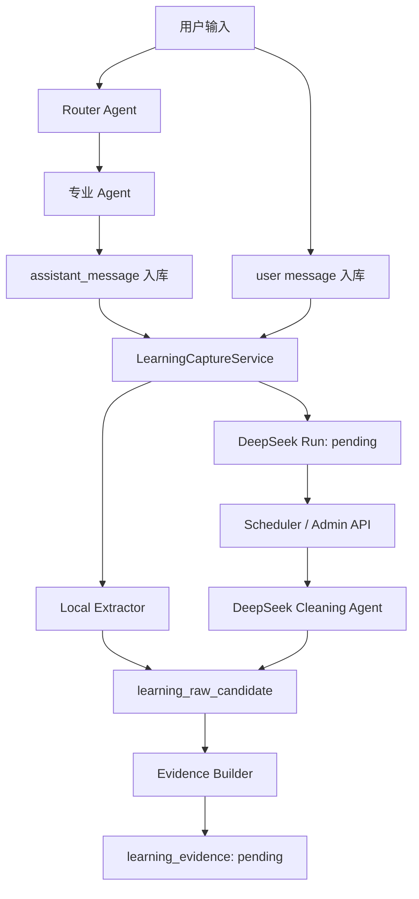

# 对话词句采集清洗方案

## 产品目标

从用户真实对话中沉淀个人词句学习资产：用户和助手每轮对话里出现的英语单词、短语、句子、句型，先进入候选池，再经过清洗、评分和去重，最终供单词模块、讲解模块和后续每日复习队列使用。

## 当前一期范围

当前后端先落地采集链路的数据基础和本地候选提取：

1. 用户消息和助手消息保存后，触发 `LearningCaptureService.captureMessage`。
2. 本地提取器 `LearningLocalCandidateExtractor` 同步提取候选词句。
3. 每条消息创建 `local` 提取 run，并写入 `learning_raw_candidate`。
4. 同时创建 `deepseek` 的 `pending` run，作为异步模型清洗消费者入口。
5. `LearningDeepseekCleaningScheduler` 可按配置定时消费 pending run。
6. 管理端 API 可手动触发 pending 批量、单消息、用户某天的 DeepSeek 清洗。
7. 本地或 DeepSeek 分数达到阈值的候选写入 `learning_evidence`，状态为 `pending`。

暂不在一期直接实现前端学习页，也不把 Embedding 排序、SRS 队列一次性合入。

## Agent 流程

## 数据库设计

### learning_extraction_run

记录一次提取任务，按 `message_uid + extractor_type` 去重。

- `extractor_type`: `local` 或 `deepseek`
- `status`: `pending`、`processing`、`completed`、`failed`
- `model`: 本地提取为 `local-regex-v1`，模型提取后续记录实际模型名
- `result_json`: 记录候选数量、来源角色等结果摘要

### learning_raw_candidate

记录原始候选池，按 `user_id + candidate_type + normalized_text + extractor_type` 去重，并累计 `occurrence_count`。

- `candidate_type`: `word`、`phrase`、`sentence`、`sentence_pattern`
- `local_signals_json`: 本地提取信号，如 `list_item`、`sentence_boundary`
- `local_prefilter_score`: 本地预筛分
- `final_candidate_score`: 当前候选总分，后续可合并模型分、embedding 分
- `comparison_status`: 后续用于标记 `overlap`、`local_only`、`deepseek_only`、`type_conflict`

### learning_evidence

记录给下游消费者模型或学习队列使用的证据项。

- `evidence_type`: `key_expression`、`practice_sentence`、`sentence_pattern` 等
- `status`: `pending`、`consumed`、`ignored`
- `source_message_ids_json`: 保留候选来源消息，便于回溯
- `extractor_sources_json`: 记录来自 `local`、`deepseek` 或两者重合

## 当前本地规则

本地提取不是最终学习价值判断，只承担低成本召回和基线对照：

- 从 Markdown 加粗、行内代码、列表项中提取短语。
- 从英文句号、问号、感叹号和换行边界中提取句子。
- 从 `help + 动词原形 + ...`、填空线等结构中提取句型。
- 从文本中提取英文单词，过滤常见停用词。
- 根据类型、出现次数、长度和来源信号生成 `local_prefilter_score`。

## DeepSeek 清洗入口

DeepSeek 清洗走 OpenAI-compatible provider：

- `AI_PROVIDER_DEEPSEEK_API_KEY` 或 `DEEPSEEK_API_KEY`
- `AI_PROVIDER_DEEPSEEK_BASE_URL` 或 `DEEPSEEK_BASE_URL`
- `AI_PROVIDER_DEEPSEEK_MODEL` 或 `DEEPSEEK_MODEL`
- `LEARNING_CAPTURE_DEEPSEEK_MODEL`

调度器默认关闭，避免未配置 key 时产生模型费用：

- `LEARNING_CAPTURE_DEEPSEEK_SCHEDULER_ENABLED=false`
- `LEARNING_CAPTURE_DEEPSEEK_SCHEDULER_FIXED_DELAY_MS=60000`
- `LEARNING_CAPTURE_DEEPSEEK_SCHEDULER_BATCH_SIZE=10`

管理端手动触发接口：

- `POST /api/admin/learning-capture/deepseek/pending?limit=10`
- `POST /api/admin/learning-capture/deepseek/messages/{messageUid}`
- `POST /api/admin/learning-capture/deepseek/users/{userId}/days/{date}?limit=20`

这些接口都要求管理员身份。它们只负责触发清洗，不直接给用户学习页返回词句列表。

## 后续演进

1. 对比 Local 和 DeepSeek 结果，补强 `comparison_status` 和融合分。
2. 引入 Embedding 相似度和轻量模型判断，提升 `final_candidate_score`。
3. 生成每日学习队列 `learning_review_queue`。
4. 单词模块和讲解模块读取 evidence/review queue，展示用户当天最值得学习的词句。
5. 用户收藏、忽略、掌握反馈回写评分模型，形成闭环。
