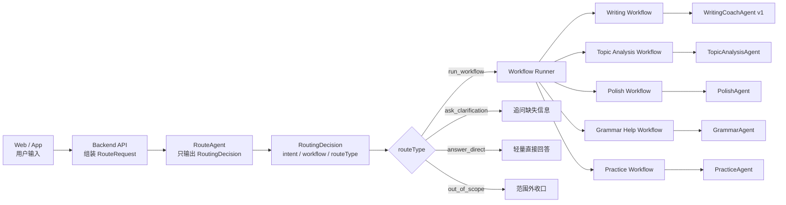
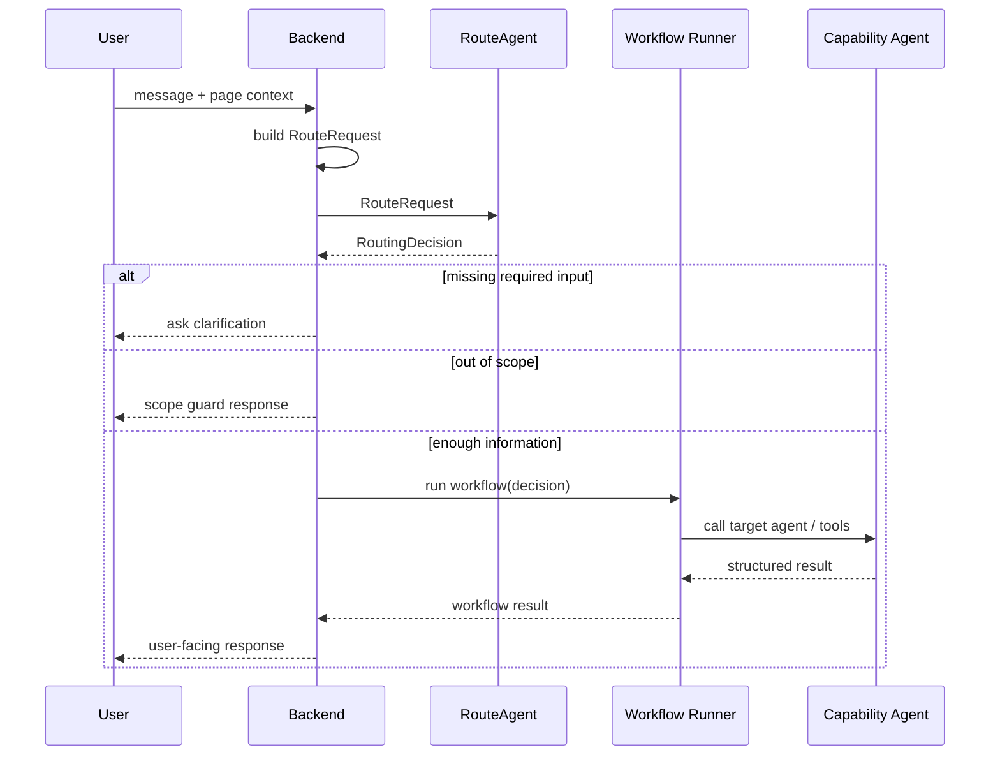
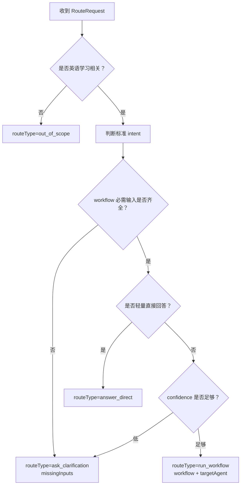
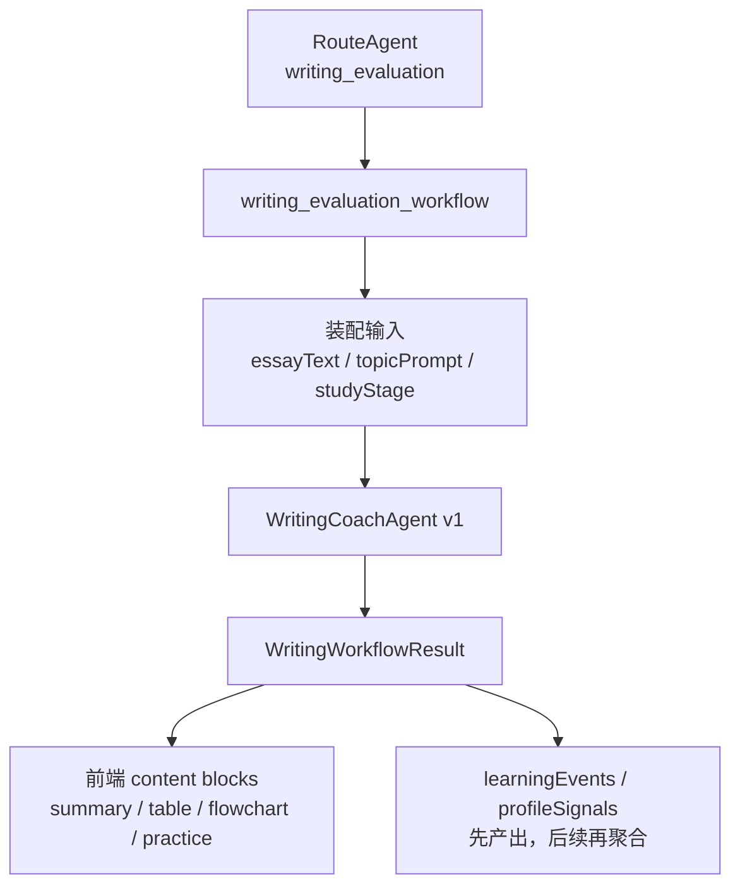

# 路由 Agent 设计

## 当前目标

路由 Agent 是 PEAI 多 Agent 写作与学习工作流的第一层决策器。

它的目标不是回答用户问题，而是把用户本轮输入转换成稳定、可验证、可被后端消费的结构化路由决策。

```text
用户输入 + 产品上下文
  -> RouteRequest
  -> RouteAgent
  -> RoutingDecision
  -> 后端 workflow runner
  -> 专门 workflow / capability agent
```

第一版只做路由决策，不做长期记忆、用户画像、评分、润色或学习建议生成。

## 总体架构



核心原则：

- RouteAgent 只负责“去哪儿”。
- Workflow 负责“怎么执行”。
- Capability Agent 负责“具体能力”。
- Runtime config 负责“用哪个模型”。

## 职责边界

| 模块 | 负责 | 不负责 |
| --- | --- | --- |
| RouteAgent | 意图识别、workflow 选择、缺失输入判断、路由置信度 | 评分、诊断、润色、直接教学、模型选择 |
| Workflow Runner | 根据 RoutingDecision 调用对应 workflow | 自己生成模型回答 |
| Workflow | 固定业务链路编排、中间结果传递、错误路径处理 | 自由决定全局路由 |
| Capability Agent | 单一垂直能力，如评分、润色、语法解释 | 自行互调其他 Agent |
| Tool | 确定性查询、校验、保存、检索 | 替代 Agent 做开放式生成 |

## 数据流



用户的 `message` 只出现在 RouteAgent 输入里，不应该被 RouteAgent 原样放进输出 JSON。

## RouteRequest

`RouteRequest` 是后端传给 RouteAgent 的输入对象。它表达用户本轮请求和产品上下文。

```json
{
  "message": "帮我看看这篇作文能得多少分",
  "conversationId": "conv_123",
  "userId": "user_001",
  "studyStage": "高中",
  "assistantMode": "exam",
  "context": {
    "selectedText": null,
    "essayText": null,
    "topicPrompt": null,
    "currentPage": "writing_editor",
    "activeTask": null
  }
}
```

字段说明：

| 字段 | 是否给模型 | 说明 |
| --- | --- | --- |
| `message` | 是 | 用户本轮输入文本 |
| `conversationId` | 否，默认只进运行上下文 | 产品侧会话 ID |
| `userId` | 否，默认只进运行上下文 | 用户 ID |
| `studyStage` | 是 | 学段，如小学、初中、高中、四级、雅思 |
| `assistantMode` | 是 | 对话模式，如 `default`、`exam` |
| `context.selectedText` | 是，如存在 | 用户选中的文本 |
| `context.essayText` | 是，如当前任务需要 | 当前作文正文 |
| `context.topicPrompt` | 是，如当前任务需要 | 当前作文题目 |
| `context.currentPage` | 可选 | 当前产品页面，用于辅助判断 |
| `context.activeTask` | 可选 | 上一轮未完成任务状态，第一版可以为空 |

## RoutingDecision

`RoutingDecision` 是 RouteAgent 的唯一输出。后端只根据这个对象决定下一步。

```json
{
  "intent": "writing_evaluation",
  "workflow": "writing_evaluation_workflow",
  "routeType": "ask_clarification",
  "targetAgent": "WritingCoachAgent",
  "confidence": 0.86,
  "requiredInputs": ["essayText", "studyStage"],
  "missingInputs": ["essayText"],
  "normalizedInputs": {
    "hasEssayText": false,
    "hasTopicPrompt": false,
    "hasSelectedText": false,
    "studyStage": "高中",
    "assistantMode": "exam",
    "currentPage": "writing_editor"
  },
  "reason": "用户要求作文评分，但没有提供作文正文"
}
```

字段说明：

| 字段 | 类型 | 说明 |
| --- | --- | --- |
| `intent` | enum | 标准化后的用户意图 |
| `workflow` | enum 或 null | 后续要进入的业务 workflow |
| `routeType` | enum | 本轮处理方式 |
| `targetAgent` | enum 或 null | 第一跳目标 Agent |
| `confidence` | number | 路由置信度，范围 0 到 1 |
| `requiredInputs` | string[] | 该 workflow 理论上需要的输入 |
| `missingInputs` | string[] | 当前缺失的关键输入 |
| `normalizedInputs` | object | 便于后端判断的输入摘要 |
| `reason` | string | 调试和日志用原因，不展示给用户 |

## 路由决策树



建议阈值：

| confidence | 处理 |
| --- | --- |
| `>= 0.75` | 可以执行路由 |
| `0.45 - 0.75` | 优先追问或降级到 `unknown` |
| `< 0.45` | 不进入高风险 workflow |

高置信度但缺关键输入时，也必须先追问。

## Intent 与 Workflow 映射

第一版 intent 不宜过多，先覆盖主链路。

| intent | workflow | targetAgent | 场景 |
| --- | --- | --- | --- |
| `writing_evaluation` | `writing_evaluation_workflow` | `WritingCoachAgent` | 作文评分、诊断、修改建议 |
| `writing_live_coach` | `writing_live_coach_workflow` | `WritingCoachAgent` | 写作中实时指导 |
| `topic_analysis` | `topic_analysis_workflow` | `TopicAnalysisAgent` | 审题、写作思路、跑题判断 |
| `polish` | `polish_workflow` | `PolishAgent` | 润色、改写、表达升级 |
| `grammar_help` | `grammar_help_workflow` | `GrammarAgent` | 语法解释、句子结构 |
| `vocab_help` | `vocab_help_workflow` | `VocabAgent` | 单词、短语、搭配 |
| `practice_generation` | `practice_generation_workflow` | `PracticeAgent` | 出题、练习生成 |
| `learning_plan` | `learning_plan_workflow` | `LearningPlannerAgent` | 学习计划、阶段目标 |
| `general_chat` | `general_chat_workflow` | `GeneralChatAgent` | 普通英语学习问答 |
| `unknown` | null | null | 不确定，需要追问 |

第一版可以先让多个写作相关 intent 指向同一个 `WritingCoachAgent`。等结构化输出稳定后，再拆 `ScoringAgent`、`ErrorDiagnosisAgent`、`RevisionPlanAgent`、`PolishAgent` 和 `PracticeAgent`。

## Pydantic Schema 建议

```python
from typing import Literal

from pydantic import BaseModel, Field


RoutingIntent = Literal[
    "writing_evaluation",
    "writing_live_coach",
    "topic_analysis",
    "polish",
    "grammar_help",
    "vocab_help",
    "practice_generation",
    "learning_plan",
    "general_chat",
    "unknown",
]

RouteType = Literal[
    "run_workflow",
    "ask_clarification",
    "answer_direct",
    "out_of_scope",
]

WorkflowName = Literal[
    "writing_evaluation_workflow",
    "writing_live_coach_workflow",
    "topic_analysis_workflow",
    "polish_workflow",
    "grammar_help_workflow",
    "vocab_help_workflow",
    "practice_generation_workflow",
    "learning_plan_workflow",
    "general_chat_workflow",
]

TargetAgent = Literal[
    "WritingCoachAgent",
    "TopicAnalysisAgent",
    "PolishAgent",
    "GrammarAgent",
    "VocabAgent",
    "PracticeAgent",
    "LearningPlannerAgent",
    "GeneralChatAgent",
]


class RoutingNormalizedInputs(BaseModel):
    has_essay_text: bool = False
    has_topic_prompt: bool = False
    has_selected_text: bool = False
    study_stage: str | None = None
    assistant_mode: str | None = None
    current_page: str | None = None


class RoutingDecision(BaseModel):
    intent: RoutingIntent
    workflow: WorkflowName | None = None
    route_type: RouteType
    target_agent: TargetAgent | None = None
    confidence: float = Field(ge=0.0, le=1.0)
    required_inputs: list[str] = Field(default_factory=list)
    missing_inputs: list[str] = Field(default_factory=list)
    normalized_inputs: RoutingNormalizedInputs
    reason: str
```

## Agents SDK 落位

RouteAgent 使用 OpenAI Agents SDK 的结构化输出能力。

```python
route_agent = Agent(
    name="RouteAgent",
    model=settings.ROUTE_MODEL,
    instructions=route_prompt,
    output_type=RoutingDecision,
)
```

后端运行后只读取 `final_output`：

```python
decision = route_result.final_output

if decision.route_type == "ask_clarification":
    return build_clarification_message(decision)

if decision.route_type == "out_of_scope":
    return build_out_of_scope_message()

if decision.workflow == "writing_evaluation_workflow":
    return run_writing_evaluation_workflow(request, decision)
```

RouteAgent 不应该调用 scoring、polish 或 profile tool。它可以在后续接入轻量 classifier 或 active task state，但仍然只输出路由决策。

## 当前接入方式

当前 RouteAgent 已接入 Python orchestrator 的新请求入口，并开始作为正式 run/stream 的第一层路由决策器。

现状：

- `POST /assistant/route/debug`：只运行 RouteAgent，直接返回 `RoutingDecision` JSON。
- `POST /assistant/run`：先运行 RouteAgent 生成 `RoutingDecision`，再优先按 `target_agent` 选择实际执行的 capability agent。
- `POST /assistant/run/stream`：与 run 相同，流式事件中的 `agentName` 应反映 RouteAgent 选出的目标 agent。
- `AI_ASSISTANT_ROUTE_DECISION_ENABLED=false` 可关闭正式 run/stream 的新路由决策，回退旧路由链路。

当前第一版 workflow runner 还未完整替代旧业务链路，所以 `writing_evaluation`、`first_draft_coach`、`realtime_sentence_feedback` 暂时映射到现有 capability agent 执行：评分类进入 Scoring Agent，起草指导进入 Prompt Design Agent，实时句子反馈进入 Sentence Structure Agent。后续补齐专门 workflow 后，再把这些 target 切到对应 workflow。

调试请求示例：

```bash
curl -X POST http://127.0.0.1:8011/assistant/route/debug \
  -H "Content-Type: application/json" \
  -d '{
    "appConversationId": "conv-route-1",
    "clientMessageId": "client-1",
    "mode": "exam_boost",
    "intent": "grade_writing",
    "scope": "message_only",
    "message": {
      "text": "帮我看看这篇作文是否跑题"
    }
  }'
```

## OpenAI Trace 可观测性

RouteAgent 的运行层需要显式设置 OpenAI Agents SDK 的 trace 信息，方便在 OpenAI Platform 的 Traces 页面看到本轮路由输入、模型结构化输出和最终执行 agent。

当前约定：

- `POST /assistant/route/debug` 的调试 trace 名称为 `PEAI RouteAgent`，只包含 RouteAgent。
- `POST /assistant/run` 和 `POST /assistant/run/stream` 的正式链路 trace 名称为 `PEAI Assistant Workflow`，外层 trace 包住 RouteAgent 和最终执行的 capability agent。
- `group_id` 使用 `conversation_id`，用于把同一会话的路由调用串起来。
- `trace_metadata` 只放筛选和排障字段，不重复塞完整作文正文。
- 完整 `RouteRequest` JSON 作为 `Runner.run()` input 进入 generation span。
- 完整 `RoutingDecision` JSON 作为模型 structured output 进入 generation span / final output。
- 开发验收可以保留 `trace_include_sensitive_data=True`，以便查看完整 JSON。
- RouteAgent 调试路径在 `Runner.run()` 完成后会主动 flush trace exporter。
- 正式 run/stream 路径会在外层 `PEAI Assistant Workflow` trace 结束后统一 flush，避免把 RouteAgent 和目标 agent 分散成两条互不相连的 trace。
- 生产环境如果要减少作文正文、题目和选中文本进入 trace，需要将 `trace_include_sensitive_data` 关闭或通过配置控制。

示例输入 JSON：

```json
{
  "message": "帮我看看这篇作文是否跑题",
  "conversation_id": "conv-route-1",
  "user_id": "user-1",
  "study_stage": "middle_school",
  "assistant_mode": "exam_boost",
  "context": {
    "essay_text": "Students should use phones carefully.",
    "topic_prompt": "Should students use phones at school?",
    "selected_text": null,
    "current_page": "writing_editor",
    "active_task": null,
    "has_essay_text": true,
    "has_topic_prompt": true,
    "has_selected_text": false
  }
}
```

示例输出 JSON：

```json
{
  "intent": "writing_evaluation",
  "route_type": "run_workflow",
  "workflow": "writing_evaluation",
  "target_agent": "writing_evaluation",
  "confidence": 0.92,
  "required_inputs": ["essay_text", "topic_prompt"],
  "missing_inputs": [],
  "normalized_inputs": {
    "has_essay_text": true,
    "has_topic_prompt": true,
    "has_selected_text": false,
    "current_page": "writing_editor"
  },
  "reason": "User asks to evaluate whether the essay matches the prompt."
}
```

验收正式学习助手链路时，在 OpenAI Platform Traces 中按 `PEAI Assistant Workflow` 搜索；验收纯路由调试接口时，按 `PEAI RouteAgent` 搜索。如果看不到 trace，优先检查：

- Python orchestrator 是否使用了带 OpenAI tracing 的 `OPENAI_API_KEY`。
- 是否设置了 `OPENAI_AGENTS_DISABLE_TRACING=1`。
- 是否设置了 `trace_include_sensitive_data=False`，导致 generation 输入输出被隐藏。
- 本轮请求是否已经真实走到 `RouteDecisionRunner`。
- `AI_ASSISTANT_ROUTE_DECISION_ENABLED` 是否被设置为 `false`。
- Python 服务是否已重启到包含外层 workflow trace 和 trace flush 的最新代码。

## 模型配置

当前模型不由 RouteAgent 决定。模型选择属于后端运行配置。

```text
ROUTE_MODEL=gpt-5.4-mini
WRITING_MODEL=gpt-5.4
SCORING_MODEL=gpt-5.4
POLISH_MODEL=gpt-5.4-mini
```

运行层按 Agent 或 workflow 选择模型：

```python
MODEL_BY_AGENT = {
    "RouteAgent": settings.ROUTE_MODEL,
    "WritingCoachAgent": settings.WRITING_MODEL,
    "TopicAnalysisAgent": settings.WRITING_MODEL,
    "PolishAgent": settings.POLISH_MODEL,
}
```

原则：

- RouteAgent 只决定 `intent`、`workflow`、`routeType` 和 `targetAgent`。
- 后端根据配置决定实际模型。
- 不让模型自己决定下一步使用哪个模型。
- 评分、审题、诊断这类高影响任务使用更强模型。

## 路由样例

### 作文评分但缺少正文

输入：

```text
帮我看看这篇作文能得多少分
```

输出：

```json
{
  "intent": "writing_evaluation",
  "workflow": "writing_evaluation_workflow",
  "routeType": "ask_clarification",
  "targetAgent": "WritingCoachAgent",
  "confidence": 0.86,
  "requiredInputs": ["essayText", "studyStage"],
  "missingInputs": ["essayText"],
  "normalizedInputs": {
    "hasEssayText": false,
    "hasTopicPrompt": false,
    "hasSelectedText": false,
    "studyStage": "高中",
    "assistantMode": "exam",
    "currentPage": "writing_editor"
  },
  "reason": "用户要求作文评分，但没有提供作文正文"
}
```

### 作文评分且上下文已有正文

输入：

```text
请帮我评分，并告诉我怎么改。
```

上下文：

```json
{
  "essayText": "Nowadays, many students use mobile phones every day...",
  "topicPrompt": "手机使用时间变化趋势图",
  "studyStage": "高中"
}
```

输出：

```json
{
  "intent": "writing_evaluation",
  "workflow": "writing_evaluation_workflow",
  "routeType": "run_workflow",
  "targetAgent": "WritingCoachAgent",
  "confidence": 0.93,
  "requiredInputs": ["essayText", "studyStage"],
  "missingInputs": [],
  "normalizedInputs": {
    "hasEssayText": true,
    "hasTopicPrompt": true,
    "hasSelectedText": false,
    "studyStage": "高中",
    "assistantMode": "exam",
    "currentPage": "writing_editor"
  },
  "reason": "用户要求对当前作文进行评分、诊断和修改建议，必要输入已具备"
}
```

### 审题与跑题判断

输入：

```text
这个题目应该从哪些方面写？会不会容易跑题？
```

输出：

```json
{
  "intent": "topic_analysis",
  "workflow": "topic_analysis_workflow",
  "routeType": "run_workflow",
  "targetAgent": "TopicAnalysisAgent",
  "confidence": 0.9,
  "requiredInputs": ["topicPrompt", "studyStage"],
  "missingInputs": [],
  "normalizedInputs": {
    "hasEssayText": false,
    "hasTopicPrompt": true,
    "hasSelectedText": false,
    "studyStage": "高中",
    "assistantMode": "exam",
    "currentPage": "writing_editor"
  },
  "reason": "用户询问题目理解、写作切入点和跑题风险"
}
```

### 润色选中文本

输入：

```text
帮我把这句话写得自然一点
```

上下文：

```json
{
  "selectedText": "I very like play basketball."
}
```

输出：

```json
{
  "intent": "polish",
  "workflow": "polish_workflow",
  "routeType": "run_workflow",
  "targetAgent": "PolishAgent",
  "confidence": 0.92,
  "requiredInputs": ["selectedText"],
  "missingInputs": [],
  "normalizedInputs": {
    "hasEssayText": false,
    "hasTopicPrompt": false,
    "hasSelectedText": true,
    "studyStage": "初中",
    "assistantMode": "default",
    "currentPage": "assistant"
  },
  "reason": "用户要求改写当前选中文本，使表达更自然"
}
```

## 与写作工作流的关系



第一版 `WritingCoachAgent v1` 可以一次性返回完整结构化结果。后续再拆成：

- `TopicAnalysisAgent`
- `ScoringAgent`
- `ErrorDiagnosisAgent`
- `RevisionPlanAgent`
- `PolishAgent`
- `PracticeAgent`

拆分条件：

- 有独立 prompt。
- 有独立输入输出 schema。
- 可以单独回归测试。
- 被多个 workflow 复用。
- 失败后可以单独重试。

## 验证要求

第一版至少覆盖：

- 作文评分缺正文时追问。
- 作文评分有正文时进入 `writing_evaluation_workflow`。
- 审题请求进入 `topic_analysis_workflow`。
- 润色选中文本进入 `polish_workflow`。
- 语法问题进入 `grammar_help_workflow`。
- 单词搭配问题进入 `vocab_help_workflow`。
- 出题请求进入 `practice_generation_workflow`。
- 非英语学习请求进入 `out_of_scope`。
- 低置信度请求进入 `ask_clarification`。
- 输出 JSON 能被 Pydantic schema 校验。
- `/assistant/route/debug` 的 RouteAgent trace 名称为 `PEAI RouteAgent`。
- `/assistant/run` 和 `/assistant/run/stream` 的正式链路 trace 名称为 `PEAI Assistant Workflow`，并能在同一条 trace 里看到 RouteAgent 与最终执行 agent。
- trace group 使用 `conversation_id`。
- trace metadata 包含 agent、component、study_stage、assistant_mode 和输入存在性标记。
- `/assistant/route/debug` 能直接返回 `RoutingDecision` JSON。
- `/assistant/run` 和 `/assistant/run/stream` 会优先使用 RouteAgent 的 `target_agent` 选择实际执行 agent；RouteAgent 失败或被配置关闭时才回退旧回复链路。

建议测试文件：

```text
python/ai_orchestrator/tests/test_route_agent_schema.py
python/ai_orchestrator/tests/test_route_decision_runner.py
python/ai_orchestrator/tests/test_assistant_run_endpoint.py
python/ai_orchestrator/tests/test_assistant_service.py
python/ai_orchestrator/tests/test_route_decision_policy.py
python/ai_orchestrator/tests/test_writing_workflow_routing.py
```

## 实施顺序

1. 定义 `RouteRequest` 和 `RoutingDecision` schema。
2. 写 RouteAgent prompt，要求只输出结构化决策。
3. 准备 20 到 30 条路由回归样例。
4. 用 fake client 或固定响应测试 schema 校验。
5. 接入 `writing_evaluation_workflow`。
6. 第一版只让 `writing_evaluation_workflow` 调用一个 `WritingCoachAgent`。
7. 跑通后再拆 `ScoringAgent`、`ErrorDiagnosisAgent`、`PolishAgent`、`PracticeAgent`。

## 后续演进

- 接入 `ActiveTaskState`，支持“继续”“换一种”“更详细”等续问继承。
- 加入 `outputMode`，辅助前端选择普通文本、表格、流程图或思维导图渲染。
- 加入 `riskLevel`，对评分、画像、长期计划等高影响任务做更严格校验。
- 接入 workflow 执行后的业务日志，把最终 route decision、workflow、target agent 记录到应用日志。
- 接入用户画像 tool，但不让 RouteAgent 自己实现记忆系统。
