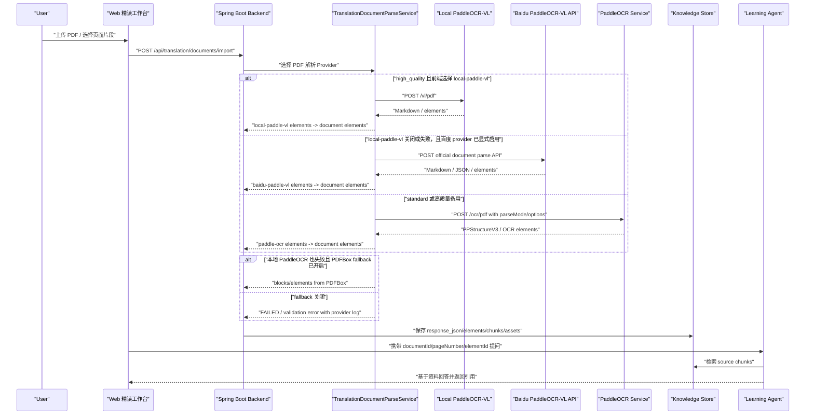

# PaddleOCR高质量文档解析方案

## 当前结论

文档学习闭环的第一优先级不是“把 PDF 页面看起来还原得很漂亮”，而是把 PDF、图片、公式、表格等资料元素提取成可定位、可诊断、可进入 Agent 问答的结构化知识。当前稳定解析阶段采用本地 PaddleOCR `PPStructureV3` 文档解析 pipeline 提供版面、表格和公式元素；本地 `PaddleOCR-VL` provider 保留为实验能力，默认不进入上传主流程。

第一阶段已经落地的目标是：统一 OCR 输出契约、保留 `elements`、保留 bbox/confidence/source/warnings、后端不再重复拼接 `page.text + blocks`，并让 parse snapshot 保存完整 OCR 原始响应。

第二阶段已经落地三件事：`high_quality` 模式接入 PaddleOCR `PPStructureV3` 适配层；前端 PDF 选区上下文开始携带 `documentId/pageNumber/elementId/bbox`，为后续 Agent source citation 做准备；后端增加本地 `local-paddle-vl` provider，但稳定解析阶段默认关闭。

## 背景

产品目标参考 NotebookLM 和 Acrobat AI：用户上传 PDF 后，可以围绕书本资料提问，回答要基于来源内容，并能定位到页码和片段。要做到这一点，Agent 不能只拿一坨 OCR 文本，至少需要：

- 页码和元素 ID。
- 文本块、公式、表格、图片说明等元素类型。
- bbox 或其他位置坐标。
- confidence 和质量 warning。
- 可进入 chunk、embedding、rerank、引用定位的结构化知识。

当前项目已经有 PDF 文本层提取、PaddleOCR 入口、精读工作台和知识切片，但 OCR 结果之前主要被压成纯文本，导致后续 Agent 无法稳定知道“用户当前选中的是哪个 PDF 元素”。

## 范围

本文覆盖：

- PaddleOCR 服务请求和响应契约。
- `standard` 与 `high_quality` 模式边界。
- OCR elements 到后端 `TranslationDocumentElementDto` 的映射。
- 质量诊断、降级策略和验收标准。
- Mac high_quality OCR 服务作为远程 provider 的部署方向。

本文不覆盖：

- 前端 PDF 选区到真实 Agent 问答 API 的完整闭环。
- embedding/rerank 的最终检索排序策略。
- Apple Silicon 上 PaddleOCR 模型安装细节。
- 商业 OCR API 的接入决策。

## 对标差距

| 能力 | 当前第一阶段 | NotebookLM / Acrobat 类目标 | 后续方向 |
| --- | --- | --- | --- |
| 文本提取 | PDFBox + PaddleOCR fallback | 多引擎文本层和 OCR 质量评估 | 增加 per-page quality gate |
| OCR | PaddleOCR 文本检测和识别 + high_quality PPStructureV3 适配层 + 可选本地 PaddleOCR-VL | OCR + 版面结构恢复 | 继续做真实样本调优 |
| 阅读顺序 | block 排序 | 接近真实阅读顺序 | 版面分区后排序 |
| 标题/段落 | 规则推断 | 章节、标题、段落、列表 | layout element type |
| 表格 | high_quality 适配 PPStructureV3 table element，缺模型时降级 | 表格结构识别 | 后续强化表格 HTML/Markdown 渲染 |
| 公式 | high_quality 适配 PPStructureV3 formula element，缺模型时降级 | 公式识别或视觉理解 | 后续强化公式展示和二次校验 |
| 图片/图表 | 暂未理解 | 图片说明、图表内容 | 后续视觉模型补图表摘要 |
| 引用定位 | pageNumber + elementId + bbox | inline citations | chunk 引用 sourceElementIds |
| 质量诊断 | confidence/warnings | 逐页质量评分和兜底策略 | 扩展乱码率、阅读顺序评分 |

## 模式定义

| 模式 | 运行位置 | 默认目标 | 默认能力 |
| --- | --- | --- | --- |
| `standard` | 当前 Docker CPU 或普通本机 | 保持稳定、低依赖、可在开发机跑通 | 文本 OCR、bbox、confidence、elements、基础 quality warning |
| `high_quality` | Docker 32GB、本机 venv、MacBook Pro M 系列、GPU 机器或独立 OCR 服务器 | 尽量提取版面、表格、公式和方向矫正 | 默认通过 PaddleOCR `PPStructureV3` 适配层提取 elements，不可用时返回 warning；可选启用本地 PaddleOCR-VL |

重要约束：

- 默认稳定选项只使用本地 `/ocr/pdf`，不调用收费 API。
- `local-paddle-vl` 保留为实验 provider，稳定解析阶段默认关闭；普通上传只使用本地 `/ocr/pdf`。
- 普通 PDF 导入不再因为存在可复制文本层而跳过本地模型；默认先用本地 PaddleOCR 解析前 10 页，进入工作台后后台继续按 10 页分批补齐。
- `standard` 不能因为 high_quality 功能不可用而失败。
- high_quality 不可用时必须显式返回 warning，并允许后端降级使用 standard 文本 OCR。

## OCR 接口契约

### Request

`POST /ocr/pdf` 或可选 `POST /vl/pdf`

| 字段 | 类型 | 默认值 | 说明 |
| --- | --- | --- | --- |
| `documentBase64` | string | 必填 | PDF 文件 base64 |
| `language` | string | `ch,eng` | PaddleOCR 识别语言 |
| `parseMode` | string | `standard` | `standard` 或 `high_quality` |
| `pageStart` | number | null | 起始页，1-based |
| `pageEnd` | number | null | 结束页，1-based |
| `maxPages` | number | 20 | 单次最多处理页数 |
| `dpi` | number | 220 | PDF 渲染 DPI |
| `enableTextOcr` | boolean | true | 是否启用文本 OCR |
| `enableLayout` | boolean/null | 模式决定 | 是否请求版面分析 |
| `enableTable` | boolean/null | 模式决定 | 是否请求表格识别 |
| `enableFormula` | boolean/null | 模式决定 | 是否请求公式识别 |
| `enableOrientation` | boolean/null | 模式决定 | 是否请求方向检测 |
| `enableUnwarping` | boolean/null | 模式决定 | 是否请求页面矫正 |

Web 上传接口 `POST /api/translation/documents/import` 额外传递 `parseProvider`：稳定解析阶段固定使用 `paddle-ocr`，即本地 `/ocr/pdf`。导入服务会通过 `pageStart/pageEnd/maxPages` 裁剪请求 PDF：首批默认 `pageStart=1,maxPages=10`，剩余页由后台线程分批继续解析并更新知识快照。`local-paddle-vl` 和百度云 provider 保持显式配置才会参与，不作为前端默认选项。

### Response

```json
{
  "status": "SUCCEEDED",
  "provider": "PaddleOCR",
  "pageCount": 1,
  "recognizedPageCount": 1,
  "metadata": {
    "parseMode": "standard",
    "maxPages": 20,
    "dpi": 220,
    "enableLayout": false,
    "enableTable": false,
    "enableFormula": false,
    "enableOrientation": true,
    "enableUnwarping": false
  },
  "pages": [
    {
      "pageNumber": 1,
      "text": "cleaned page text",
      "rawText": "raw page text",
      "cleanedText": "cleaned page text",
      "elements": [
        {
          "type": "paragraph",
          "text": "OCR text block",
          "bbox": [[0, 0], [100, 0], [100, 20], [0, 20]],
          "confidence": 0.98,
          "order": 1,
          "source": "paddle_ocr",
          "rawType": "text",
          "warnings": []
        }
      ],
      "blocks": [],
      "formulas": [],
      "confidence": 0.98,
      "qualityScore": 0.98,
      "layoutStatus": "NOT_REQUESTED",
      "tableStatus": "NOT_REQUESTED",
      "formulaStatus": "NOT_REQUESTED",
      "warnings": []
    }
  ]
}
```

## 数据字典

| 字段 | 所属对象 | 说明 |
| --- | --- | --- |
| `element.type` | OCR element | `paragraph`、`heading`、`table`、`formula`、`image` 等 |
| `element.bbox` | OCR element | 页面坐标，多边形点数组；后端保存为 JSON 字符串 |
| `element.order` | OCR element | 当前页或文档内阅读顺序 |
| `element.source` | OCR element | 产生该元素的来源，如 `paddle_ocr`、`paddle_ocr_formula` |
| `element.rawType` | OCR element | PaddleOCR 原始元素类型，便于排查映射 |
| `page.qualityScore` | OCR page | 0-1 质量分，第一阶段基于 confidence 和 warnings |
| `warnings` | page/document/element | 降级或质量问题，例如 `LOW_CONFIDENCE`、`TABLE_ENGINE_UNAVAILABLE` |
| `rawOcrResponse` | parse response | 后端保存的 OCR 原始响应，进入 parse snapshot 用于排查 |

## 数据流



## 后端映射规则

| OCR 响应 | 后端字段 | 说明 |
| --- | --- | --- |
| `pages[].elements[].text` | `TranslationDocumentElementDto.text` | 进入 chunk 和 Agent 上下文 |
| `pages[].elements[].bbox` | `TranslationDocumentElementDto.bbox` | 前端选区和引用定位 |
| `pages[].elements[].confidence` | `confidence` | 质量提示和排序信号 |
| `pages[].elements[].source` | `provider` + `metadata.source` | 区分 `paddle_ocr`、`paddle_ppstructure`、`paddle_vl`、公式等来源 |
| `pages[].elements[].rawType` | `metadata.rawType` | 排查原始类型映射 |
| OCR 原始响应 | `TranslationDocumentParseResponse.rawOcrResponse` | parse snapshot 保留完整原文 |

## 质量诊断

第一阶段使用轻量诊断：

- `EMPTY_PAGE`：页面没有文本块和文本。
- `LOW_CONFIDENCE`：文本块平均 confidence 低于阈值。
- `SPARSE_TEXT`：文本块过少但有文本，可能是封面、目录或低质量页。
- `LAYOUT_ENGINE_UNAVAILABLE`：请求版面分析但当前服务没有独立 layout engine。
- `TABLE_ENGINE_UNAVAILABLE`：请求表格识别但当前服务没有独立 table engine。
- `FORMULA_ENGINE_UNAVAILABLE`：请求公式识别但公式模型未加载。
- `PPSTRUCTURE_EMPTY_RESULT`：`PPStructureV3` 已调用但没有返回可用结构元素。

后续增强：

- 乱码率：统计 `�`、异常控制字符、异常中英混排。
- 阅读顺序评分：检测 bbox 顺序是否大面积反常。
- 重复页眉页脚比例：识别广告、水印、页眉页脚。
- source coverage：元素是否都有 pageNumber/bbox/source。

## 失败模式

| 故障 | 用户影响 | 系统行为 | 处理方式 |
| --- | --- | --- | --- |
| OCR 服务不可用 | 扫描 PDF 无法自动生成精读材料 | 后端返回 `NEEDS_OCR` 或降级提示 | 检查 `/health`、端口和防火墙 |
| 表格/公式模型不可用 | 表格/公式无法结构化 | 返回 warning，文本 OCR 继续 | 后续部署 high_quality 服务 |
| OCR 文本乱码 | Agent 回答质量下降 | quality/warnings 标记低质量 | 触发重扫或 high_quality |
| 长 PDF 超页数 | 只解析前 N 页 | 返回截断 warning | 调大 `maxPages` 或分批解析 |

## 验收标准

- `standard` 模式保持旧上传链路可用，旧字段 `text/blocks/formulas` 不破坏。
- `/ocr/pdf` 支持 `parseMode/maxPages/dpi/enableLayout/enableTable/enableFormula/enableOrientation/enableUnwarping`。
- 响应每页至少有 `elements`，普通 OCR 文本映射为 `paragraph` element。
- 请求表格、版面、公式但能力不可用时返回明确 warning，不阻塞文本 OCR。
- `high_quality` 在 `PPStructureV3` 可用时返回 `heading/table/formula` 等 elements，并设置 `layoutStatus/tableStatus/formulaStatus`。
- 本地测试允许前端选择 `local-paddle-vl`；选中后 `high_quality` 优先调用 `/vl/pdf`，失败后回退 `/ocr/pdf`。
- 前端 PDF 选区上下文包含 `documentId/pageNumber/elementId/bbox/text`。
- 后端请求 PaddleOCR 时传递配置字段。
- 后端不再重复拼接 `page.text + blocks`。
- OCR elements 可进入 `TranslationDocumentElementDto`，保留 `bbox/confidence/provider/metadata`。
- `TranslationDocumentKnowledgePipeline` 不覆盖 OCR 已提供的 elements。
- parse snapshot 保存完整 `TranslationDocumentParseResponse`，其中包含 `rawOcrResponse`。

## 验证命令

```powershell
cd services/paddle-ocr
python -m unittest discover -s tests

cd ../../web
npx tsx tests\translationSelectionContext.test.ts
npx tsx tests\pdfLearningCanvas.test.ts
npx tsx tests\translationWorkspacePage.test.ts

cd ../backend
.\mvnw.cmd -q "-Dtest=PaddleTranslationOcrServiceTest,TranslationDocumentParseServiceTest" test

cd ../docs
npm run build
```

## 下一阶段

- Agent 问答使用 source chunks，并在回答中返回引用定位。
- 增加扫描 PDF、乱码文本层 PDF、中英混排、表格、公式和长 PDF 的集成样本集。
- 在 Mac/M 系列机器上做真实 high_quality 模型环境验收和性能调优。
