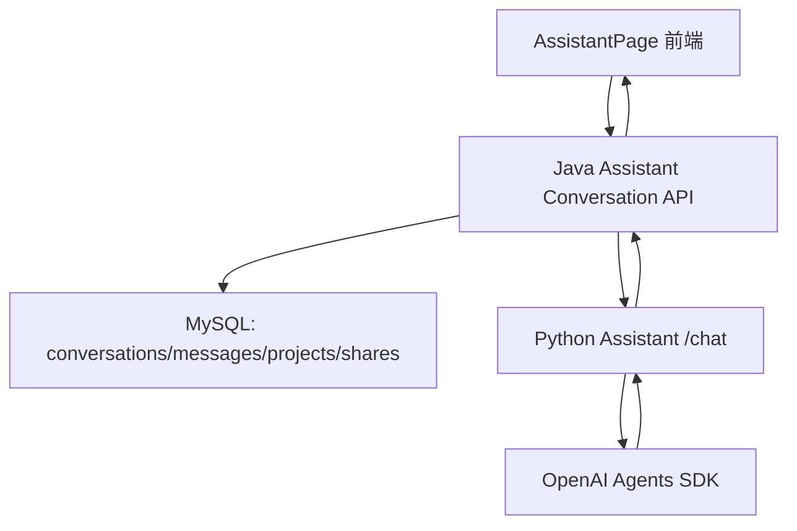
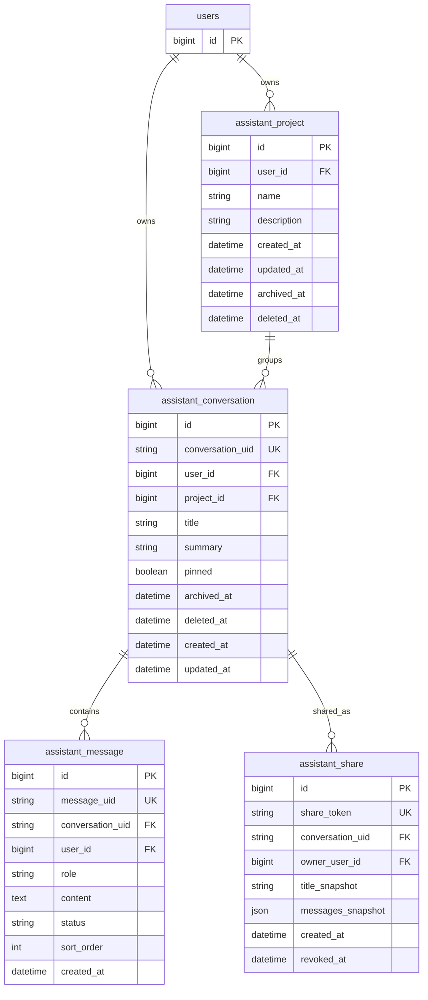
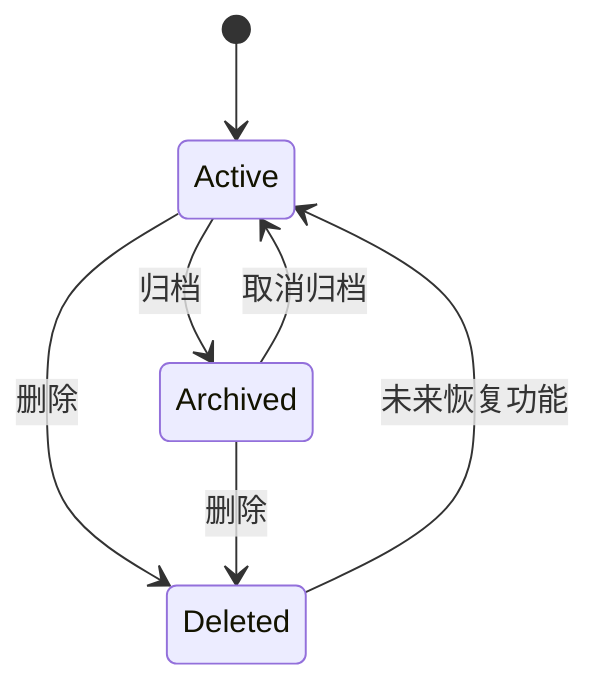
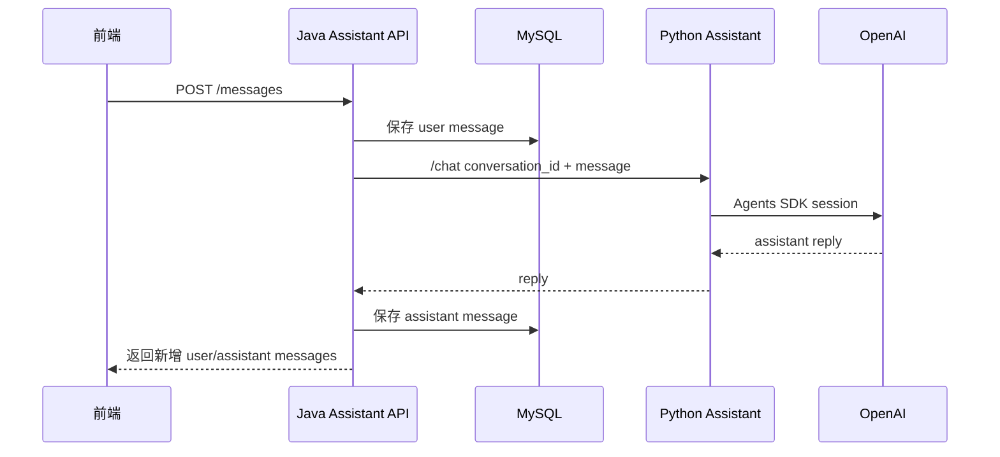
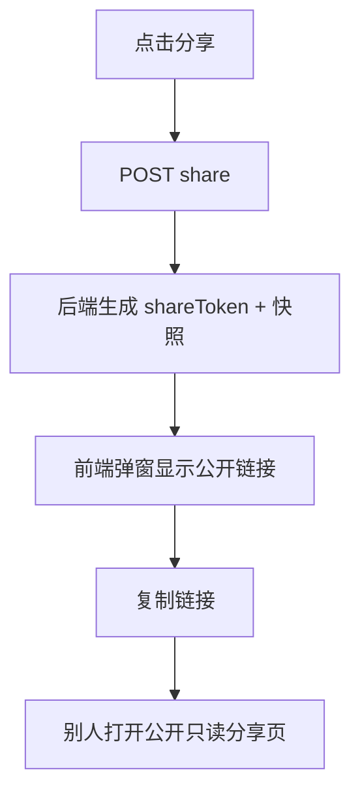

# 学习助手对话管理设计

## 1. 目标

为学习助手实现类似 GPT 的对话管理能力：

- 分享
- 重命名
- 删除
- 归档
- 置顶聊天
- 移动到项目

第一版采用后端持久化方案。Java 后端作为对话主状态，Python Assistant 只负责生成回复。

## 0. 当前实现状态

已按第一版方案落地：

- Java 后端新增对话、消息、项目、分享快照 4 类持久化模型。
- 前端学习助手打开时从 Java API 同步对话列表。
- 发送纯文本消息时，前端调用 Java API，Java 保存用户消息后代理到 Python `/chat`，再保存助手回复。
- 侧栏支持重命名、置顶、分享、移动到项目、归档、删除。
- 分享采用公开只读快照页：`/assistant/share/:shareToken`。
- 删除为软删除；归档从默认列表隐藏；分享快照不会随原对话后续消息自动变化。

当前限制：

- 第一版 Java 代理只支持纯文本聊天；附件消息仍保留在前端类型中，但不会通过 Java 代理发送到 Python。
- 归档列表已在状态层保存，当前 UI 入口先覆盖“归档”动作，后续可补归档管理页或筛选。

## 2. 已确认决策

| 决策项 | 选择 |
| --- | --- |
| 状态存储 | Java 后端 + MySQL 持久化 |
| 分享方式 | 公开只读快照链接 |
| 第一版功能 | 分享、重命名、删除、归档、置顶、移动到项目 |
| 项目类型 | 学习助手专用项目 |
| 删除语义 | 软删除 |
| 归档语义 | 从默认列表隐藏 |

## 3. 总体架构



核心调整：

- 当前学习助手对话列表主要存在前端 `localStorage`。
- 新方案中，Java 后端成为唯一对话状态真源。
- 前端打开学习助手时从 Java 后端加载会话列表。
- 前端发送消息时走 Java API。
- Java 保存用户消息，调用 Python `/chat` 获取回复，再保存助手消息。
- Python 不负责归档、删除、重命名、分享、项目管理。

这样可以把用户权限、订阅额度、日志、错误码、分享权限统一收口到 Java 后端。

## 4. 数据模型

第一版建议新增 5 张表：



### 4.1 assistant_project

学习助手专用项目/文件夹。

| 字段 | 含义 |
| --- | --- |
| `id` | 数据库自增主键 |
| `user_id` | 所属用户 |
| `name` | 项目名称 |
| `description` | 项目说明 |
| `archived_at` | 项目归档时间 |
| `deleted_at` | 项目软删除时间 |
| `created_at` | 创建时间 |
| `updated_at` | 更新时间 |

### 4.2 assistant_conversation

对话主表。

| 字段 | 含义 |
| --- | --- |
| `id` | 数据库自增主键 |
| `conversation_uid` | 对前端和 Python 暴露的稳定对话 ID |
| `user_id` | 所属用户 |
| `project_id` | 所属学习助手项目，可为空 |
| `title` | 对话标题 |
| `summary` | 对话列表摘要 |
| `pinned` | 是否置顶 |
| `archived_at` | 归档时间，非空表示已归档 |
| `deleted_at` | 软删除时间，非空表示已删除 |
| `created_at` | 创建时间 |
| `updated_at` | 更新时间 |

默认列表只显示：

```sql
deleted_at IS NULL
AND archived_at IS NULL
```

归档列表显示：

```sql
deleted_at IS NULL
AND archived_at IS NOT NULL
```

### 4.3 assistant_message

对话消息明细表。

| 字段 | 含义 |
| --- | --- |
| `id` | 数据库自增主键 |
| `message_uid` | 对前端暴露的稳定消息 ID |
| `conversation_uid` | 所属对话 ID |
| `user_id` | 所属用户 |
| `role` | 消息角色：`user` 或 `assistant` |
| `content` | 消息正文 |
| `status` | 消息状态，第一版主要使用 `done` |
| `sort_order` | 对话内排序 |
| `created_at` | 创建时间 |

### 4.4 assistant_share

分享快照表。

| 字段 | 含义 |
| --- | --- |
| `id` | 数据库自增主键 |
| `share_token` | 公开分享 token |
| `conversation_uid` | 来源对话 ID |
| `owner_user_id` | 分享创建者 |
| `title_snapshot` | 分享时的标题快照 |
| `messages_snapshot` | 分享时的消息快照 JSON |
| `created_at` | 创建时间 |
| `revoked_at` | 撤销时间，非空表示链接失效 |

分享采用快照语义：

- 分享生成后，复制当前对话标题和消息。
- 后续原对话继续修改，不影响已分享页面。
- 撤销分享只需要写入 `revoked_at`。

## 5. 状态流转



状态语义：

- Active：默认可见对话。
- Archived：从默认列表隐藏，进入归档列表。
- Deleted：软删除，默认和归档列表都不可见。
- Pinned：不是独立状态，而是 Active/Archived 上的排序标记；第一版建议只在默认列表展示置顶。

## 6. API 设计

### 6.1 对话 API

```text
GET    /api/assistant/conversations
POST   /api/assistant/conversations
GET    /api/assistant/conversations/{conversationUid}
PATCH  /api/assistant/conversations/{conversationUid}
DELETE /api/assistant/conversations/{conversationUid}
```

`PATCH /api/assistant/conversations/{conversationUid}` 支持：

- 重命名：`title`
- 更新摘要：`summary`

`DELETE` 为软删除，写入 `deleted_at`。

### 6.2 对话动作 API

```text
POST /api/assistant/conversations/{conversationUid}/archive
POST /api/assistant/conversations/{conversationUid}/unarchive
POST /api/assistant/conversations/{conversationUid}/pin
POST /api/assistant/conversations/{conversationUid}/unpin
POST /api/assistant/conversations/{conversationUid}/move
```

`move` 请求体：

```json
{
  "projectId": 123
}
```

移动出项目时：

```json
{
  "projectId": null
}
```

### 6.3 消息 API

```text
POST /api/assistant/conversations/{conversationUid}/messages
```

发送消息流程：



### 6.4 项目 API

```text
GET    /api/assistant/projects
POST   /api/assistant/projects
PATCH  /api/assistant/projects/{projectId}
DELETE /api/assistant/projects/{projectId}
```

删除项目第一版建议：

- 软删除项目。
- 项目内对话不删除。
- 项目内对话的 `project_id` 置空。

### 6.5 分享 API

```text
POST   /api/assistant/conversations/{conversationUid}/share
DELETE /api/assistant/shares/{shareToken}
GET    /api/public/assistant/shares/{shareToken}
```

分享流程：



公开分享页只读，不允许继续聊天，不展示用户其他对话。

## 7. 前端交互设计

会话列表每项右侧新增 `...` 菜单：

```text
分享
重命名
移动到项目 >
置顶聊天 / 取消置顶
归档
删除
```

列表分区：

```text
置顶
今天
最近 7 天
更早
```

侧边栏增加项目入口：

```text
项目
  考研写作
  语法学习
  + 新建项目
```

归档入口：

```text
更多 -> 已归档
```

### 7.1 重命名

- 点击菜单中的“重命名”。
- 对话标题进入行内编辑或弹出轻量弹窗。
- 保存后调用 `PATCH conversation`。
- 更新侧边栏标题。

### 7.2 删除

- 点击“删除”弹确认框。
- 确认后调用 `DELETE conversation`。
- 当前对话被删除时，自动切换到下一个可见对话。
- 如果没有可见对话，则创建或展示空对话。

### 7.3 归档

- 点击“归档”后从默认列表消失。
- 可以在“已归档”列表中查看。
- 已归档对话支持取消归档。

### 7.4 置顶

- 点击“置顶聊天”后，该对话进入列表顶部“置顶”分区。
- 再次点击变为“取消置顶”。

### 7.5 移动到项目

- 菜单中显示“移动到项目”子菜单。
- 可选择已有项目。
- 可选择“无项目”。
- 第一版不做项目成员、权限、共享项目。

### 7.6 分享

- 点击“分享”后调用分享 API。
- 后端返回公开链接。
- 前端弹窗展示链接和复制按钮。
- 分享内容是快照，不随原对话后续变化。

## 8. 本地历史迁移策略

当前前端已有 `localStorage` 对话。后端持久化上线后，需要避免用户已有本地历史直接消失。

建议第一版采用一次性导入：

1. 前端加载学习助手。
2. 请求后端对话列表。
3. 如果后端没有任何对话，但本地 `localStorage` 存在旧对话，则提示或静默执行一次导入。
4. 导入成功后写入标记：

```text
peai:assistant:migrated:v1
```

5. 导入失败不阻塞用户新建对话。

## 9. 权限与安全

用户私有 API：

- 所有 `/api/assistant/**` 接口都要求登录。
- 查询、修改、删除、归档、移动、分享时必须校验 `conversation.user_id == currentUserId`。
- 项目操作必须校验 `project.user_id == currentUserId`。

公开分享 API：

- `/api/public/assistant/shares/{shareToken}` 不要求登录。
- 只读取 `assistant_share` 快照。
- `revoked_at IS NOT NULL` 时返回 404 或分享已失效。
- 不返回 `owner_user_id` 以外的敏感信息。

分享 token：

- 使用高熵随机字符串。
- 不使用自增 ID。
- 不允许通过 conversationUid 直接公开访问。

## 10. 错误处理

建议错误码：

| 场景 | HTTP |
| --- | --- |
| 对话不存在或不属于当前用户 | 404 |
| 项目不存在或不属于当前用户 | 404 |
| 分享不存在或已撤销 | 404 |
| 标题为空或过长 | 400 |
| Python Assistant 调用失败 | 502 或 503 |
| 用户未登录 | 401 |

发送消息失败时：

- 用户消息已经保存。
- 如果 Python 回复失败，助手消息不保存或保存为 `failed`，两种都可以。
- 推荐第一版保存 `failed` 状态，便于前端重试和排查。

## 11. 测试计划

### 后端测试

- 创建对话。
- 发送消息保存 user/assistant 两条 message。
- 重命名对话。
- 归档 / 取消归档。
- 置顶 / 取消置顶。
- 移动到项目。
- 软删除后默认列表不可见。
- 创建分享后，公开接口可读。
- 撤销分享后，公开接口不可读。
- 用户 A 不能操作用户 B 的对话。
- 删除项目后，项目内对话不删除，`project_id` 置空。

### 前端测试

- 会话菜单展示完整动作。
- 重命名后列表更新。
- 归档后默认列表隐藏。
- 删除当前会话后自动切换。
- 置顶会话显示在置顶分组。
- 分享弹窗能复制公开链接。
- 移动到项目后列表归属更新。
- 后端没有对话但本地有旧对话时，迁移逻辑可运行。

### 验证命令

```powershell
cd F:\personalenglishai\backend
./mvnw.cmd -q test
```

```powershell
cd F:\personalenglishai\web
npm run build
```

如修改 Python Assistant 接口：

```powershell
cd F:\personalenglishai\python
.\.venv\Scripts\python.exe -m compileall ai_orchestrator\assistant_service.py ai_orchestrator\app.py
```

## 12. 分阶段实施建议

第一阶段：后端持久化基础

- 新增项目、对话、消息、分享表。
- 新增 Java API。
- Java 代理 Python `/chat`。
- 后端测试覆盖权限和状态流转。

第二阶段：前端接入

- 会话列表从后端加载。
- 发送消息走 Java API。
- 实现菜单动作。
- 实现项目列表和移动到项目。

第三阶段：分享页与迁移

- 实现公开分享页。
- 实现撤销分享。
- 实现 localStorage 一次性导入。

## 13. 暂不做

第一版暂不做：

- 项目多人协作。
- 项目分享。
- 对话恢复/回收站 UI。
- 分享访问密码。
- 分享过期时间。
- 对话全文搜索后端索引。
- 消息级删除或编辑。
