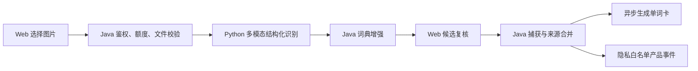

# 单词沉淀架构

## 当前结论

单词卡使用“Lexical Core JSON + Card Blocks JSON”的版本化模型。词典事实、卡片身份、主题定义和生成任务各自保持独立边界；图片识别先形成可复核候选，确认后才写入来源并排队生成。主题编辑只追加版本，不改写历史卡片；Blocks 失败也不会丢弃已经验证的 Lexical Core。

## 当前阶段范围

- 当前阶段支持 `manual`、`dictionary` 和 `ocr_image`：分别对应手动录入、词典收藏和用户确认后的图片识别候选。
- `ocr_image` 只保存安全来源元数据和逐词处理结果，不保存图片或完整识别原文。
- PDF、AI 对话、会话自动抽取、笔记同步和错题尚未接入；这些来源属于后续范围。

## 图片导入调用链



Python 无状态且不访问业务数据库。Java 生成 trace，掌握配额与公开错误契约。Web 负责取消过期请求、稳定去重和用户决策；未解决的 typo 会阻断整批提交。图片请求与候选状态只存在于当前页面内，最终捕获请求不得携带 `rawText` 或图片编码。

## 统一导入一致性

统一导入把文本、图片和混合输入收敛为同一个分析接口。Web 使用 `AbortController + requestId` 实现 latest-wins：输入变化立即取消旧请求，旧请求即使迟到也不能覆盖新状态。每次请求携带基于规范化文本、零字节分隔符和原始图片字节计算的 SHA-256 指纹；Java 在配额检查前独立重算。

候选结果只有在响应指纹、请求起始指纹和当前输入指纹三者一致时才进入 `ready`。输入变化后保留旧候选供用户查看，但状态切换为 `stale` 并禁止生成；重新分析成功后才恢复。Python 模型总预算为 45 秒，Java 调用上限为 55 秒，Web 硬超时为 60 秒，形成逐层递增的超时边界。

## 资产边界

- `dictionary_*` 是共享的词典内容，提供只读查词和补全来源；不保存某个用户的收藏、查询次数或卡片内容。
- `user_dictionary_word_state` 是用户维度的词典行为状态，保存查询次数和收藏开关；它不是单词卡，也不拥有卡片版本。
- `vocabulary_card`、`vocabulary_card_source` 和 `vocabulary_card_revision` 是用户拥有的单词卡、捕获来源和不可变版本。卡片按用户、语言和规范化词形保持唯一，删除是软删除。
- `vocabulary_generation_job` 是可恢复的异步生成队列。它只负责生成卡片候选内容和任务状态，不替代词典内容或用户词典状态。
- `vocabulary_theme` 保存系统或用户主题的当前元数据，`vocabulary_theme_revision` 保存不可变用途和 Prompt 策略快照，`user_vocabulary_theme_recent` 只保存用户最近使用关系。
- `vocabulary_card_revision.core_json` 保存稳定的 Lexical Core，`card_blocks_json` 保存按主题生成且可由用户持续编辑的 Card Blocks；两者分别用 `content_format_version` 和 `card_blocks_schema_version` 标识版本。`content_markdown` 与兼容字段 `content_json` 只用于历史卡片和旧 Java provider 回滚。

生成器向词典查询时只使用共享词典信息；不会把 `favorite` 或 `lookupCount` 写入生成内容。词典收藏和单词卡是两个独立的持久化边界。

## 数据库部署

Docker Compose 把 `backend/src/main/resources/db/schema.sql` 挂载为 MySQL 的 `001_schema.sql`。全新数据卷首次初始化只执行该全量脚本；脚本直接创建 3 张主题表、主题索引和系统主题种子，并在单词卡相关表中一次性定义 theme/core、Card Blocks、冲突候选、生成结果、warning 和 `generation_metadata_json` 列，不追加同表的第二套定义，也不再补跑下述 migration。

无论 Docker 或非 Docker，全新库只执行 `schema.sql`：

```powershell
mysql -u <user> -p <database> < backend/src/main/resources/db/schema.sql
```

全新库不执行任何历史增量，尤其不得执行 `migrate_add_vocabulary_review_semantics.sql`、`migrate_add_vocabulary_generation_metadata.sql` 或 `migrate_add_vocabulary_card_blocks.sql`。

历史旧表升级或租约迁移中断后，执行已有库租约迁移：

```powershell
mysql -u <user> -p <database> < backend/src/main/resources/db/migrate_add_vocabulary_generation_job_leases.sql
```

已有表随后执行精确身份迁移，将 `normalized_term` 改为 `utf8mb4_bin`。该列仍保存应用层规范化结果，但 MySQL 唯一键会区分重音不同的词形：

```powershell
mysql -u <user> -p <database> < backend/src/main/resources/db/migrate_make_vocabulary_identity_exact.sql
```

基础表存在后执行主题与 Markdown 卡片迁移。该迁移创建三张主题表，写入 Basic、Exam、Reading 系统主题，并为卡片、revision、任务和用户偏好补充主题字段：

```powershell
mysql -u <user> -p <database> < backend/src/main/resources/db/migrate_add_vocabulary_themes_and_markdown_cards.sql
```

历史库第四步执行审核语义增量，为已有表补充显式冲突候选和生成结果字段：

```powershell
mysql -u <user> -p <database> < backend/src/main/resources/db/migrate_add_vocabulary_review_semantics.sql
```

历史库第五步执行生成元数据迁移，为已有 `vocabulary_card_revision` 增加可空的 JSON 审计字段：

```powershell
mysql -u <user> -p <database> < backend/src/main/resources/db/migrate_add_vocabulary_generation_metadata.sql
```

历史库第六步创建产品漏斗事件表。脚本使用存在性检查和唯一键，可重复执行：

```powershell
mysql -u <user> -p <database> < backend/src/main/resources/db/migrate_create_vocabulary_product_events.sql
```

历史库第七步增加结构化主题内容列。脚本对两列分别使用 `information_schema.columns` 检查，可重复执行：

```powershell
mysql -u <user> -p <database> < backend/src/main/resources/db/migrate_add_vocabulary_card_blocks.sql
```

全新库只执行 `schema.sql`；历史库升级顺序是租约迁移、精确身份迁移、主题迁移、审核语义增量、生成元数据迁移、产品事件表迁移、Card Blocks 迁移。新库不得补跑已合入全量 schema 的历史增量，历史库不得省略任一增量。

迁移后必须从当前 `DATABASE()` 验证：`vocabulary_theme`、`vocabulary_theme_revision`、`user_vocabulary_theme_recent` 共 3 张表；`vocabulary_card_revision` 必须同时具备 `theme_uid`、`theme_version`、`core_json`、`content_markdown`、`content_format_version`、`generation_metadata_json`、`card_blocks_json`、`card_blocks_schema_version` 共 8 列，其中两个 JSON 扩展列均允许为空。验证只能在明确创建的 disposable schema 中执行，清理前再次精确核对 schema 名称，不得连接开发业务库后执行 `DROP DATABASE`。

### 生成元数据 MySQL 集成测试

`VocabularyGenerationMetadataMigrationMySqlTest` 使用以下环境变量连接可丢弃的 MySQL 8 实例：

```powershell
$env:VOCABULARY_MYSQL_INTEGRATION_URL='jdbc:mysql://127.0.0.1:3306/?useSSL=false&allowPublicKeyRetrieval=true'
$env:VOCABULARY_MYSQL_INTEGRATION_USERNAME='vocabulary_test'
$env:VOCABULARY_MYSQL_INTEGRATION_PASSWORD='<disposable-instance-password>'
```

测试账号必须具备 `CREATE DATABASE`、`CREATE TABLE`、`ALTER TABLE`、`INSERT`、`SELECT` 和 `DROP DATABASE` 权限。测试仅创建和删除 `peai_vocab_generation_metadata_` 前缀的随机 schema；连接 URL 必须指向隔离的 disposable MySQL，绝不能指向开发、测试或生产业务库。清理操作直接 `DROP DATABASE`，不执行 `USE mysql`，因此不需要访问 MySQL 系统库。密码只能从环境变量或密钥管理注入，不得写入仓库、命令历史或日志。

初始全量 schema 已包含新库所需的 `lease_token`、`lease_expires_at` 和索引，因此新库无需额外执行租约迁移；租约迁移只用于历史旧表或恢复中断升级。该脚本通过 `information_schema` 独立检查两列和 `idx_vocabulary_job_lease`，可重复执行；已存在的结构不会重复创建，缺失动作会继续完成，最后对租约到期时间为空的 `running` 任务执行幂等回填。迁移完成后再启动后端，避免调度器在不完整表结构上领取任务。

## 主题所有权与版本

- `vocabulary_theme.owner_type` 区分 `system` 和 `user`。系统主题只读，由后端注册表维护，UID 固定为 `theme_system_basic`、`theme_system_exam`、`theme_system_reading`；用户只能复制，不能编辑或删除系统主题。
- 用户只能管理自己的主题；用户主题属于单一 `user_id`。创建、复制和编辑都会写入新的 `vocabulary_theme_revision`；编辑推进 `current_version`，不会原地覆盖旧 revision。
- 捕获和 generation job 固化 `theme_uid + theme_version`。旧卡继续冻结在旧主题版本；只有用户确认“使用最新主题版本”后，重新生成任务才引用当前版本。
- 默认主题存于 `user_vocabulary_preference.default_theme_uid`，最近使用主题存于 `user_vocabulary_theme_recent`。停用或删除主题不会删除历史卡片的主题快照。

## Lexical Core 与 Card Blocks

Lexical Core Schema 2 固定 `schemaVersion`、`term`、带稳定 ID 的 `phonetics`、`senses` 和 `meanings`，保存单词身份、音标、词性和主要释义，用于列表摘要、搜索、引用和后续增量沉淀。生成器先读取共享词典，不读取 `favorite`、`lookupCount` 等用户状态；Python Core Agent 始终执行，用词典作为事实参考并生成适合学习的主要中英文释义。Java 要求 `term` 完全一致，并保留词典提供的音标和真实音频，但不要求 AI 原样复制词典释义文案。最终 Core 与 Blocks 都必须通过 Java 最终校验。历史 Core Schema 1 继续可读，不做后台重写。

Card Blocks Schema 1 是 AI 初次生成的有序主题内容，支持 `exampleList`、`collocationList`、`usageBoundary`、`contrastTable`、`memoryTip` 和 `note`。Block 使用稳定 ID，并通过 `meaningRefs` 引用 Core meaning ID，不能复制或修改核心词典事实。详情阅读态可直接渲染 Blocks；用户第一次进入编辑态时，前端按 `sortOrder` 将完整 Blocks 文档投影为一份 Markdown，AI 学习内容和个人笔记从此在同一文档中继续编辑。保存该编辑结果会创建 Markdown revision，不再同时提交 `cardBlocks`，原 Blocks revision 仍保留在历史中。Markdown 禁止原始 HTML，后续重新生成必须产生候选版本，不能静默覆盖用户 Markdown。

新生成 revision 保存 Core 2 + Blocks 1，`content_markdown` 为空。历史 revision 仍保留原 Markdown，API 在读取时将其投影为只读 `legacyMarkdown` Block，不执行数据库回填；前端继续使用严格 Markdown 渲染器展示历史内容。Core 有效但 Blocks 生成失败时仍保存 Core revision，标记 `partial`/`card_blocks_unavailable` 和 `needs_review`，用户可重新生成或手工补充主题内容。详细 Prompt、词典优先级和日志字段见[主题化单词卡 Prompt](../ai/vocabulary-theme-prompts.md)。

Legacy 模板到系统主题的固定映射是：

- `basic` -> `theme_system_basic`
- `exam` -> `theme_system_exam`
- `reading` -> `theme_system_reading`

## 生成任务与调度器

后端的 `VocabularyGenerationScheduler` 在每轮开始时处理过期的 `running` 租约，再领取 `pending` 任务。正常任务会按 `pending`、`running`、`succeeded` 或可重试/终态 `failed` 流转；租约令牌用于隔离过期工作者的迟到写入。

达到最大尝试次数的过期租约使用同一条 MySQL 多表更新：job 原子进入 `failed`，同时将没有 active revision 且仍为 `generating` 的 card 置为 `failed`。已有 active revision 的卡片保留可用内容，最新 job 状态单独暴露给列表和详情轮询。

默认配置在 `backend/src/main/resources/application.yml`：

```yaml
vocabulary:
  generation:
    scheduler:
      enabled: ${VOCABULARY_GENERATION_SCHEDULER_ENABLED:true}
      fixed-delay-ms: ${VOCABULARY_GENERATION_SCHEDULER_FIXED_DELAY_MS:5000}
      batch-size: ${VOCABULARY_GENERATION_SCHEDULER_BATCH_SIZE:5}
      lease-ms: ${VOCABULARY_GENERATION_SCHEDULER_LEASE_MS:300000}
```

本地启用时设置 `vocabulary.generation.scheduler.enabled=true`（或环境变量 `VOCABULARY_GENERATION_SCHEDULER_ENABLED=true`）。`lease-ms` 必须大于一次外部生成的最大端到端时间；需要暂停领取任务时仅将该开关设为 `false`，不要删除队列数据。

### Python generation provider

Java 负责词典、generation job、租约、revision、最终校验、冲突处理和持久化；Python 负责 Prompt、模型调用、缺失 Core 回填、Card Blocks 和 typed trace metadata。Python 是无状态内部服务：不读取或写入单词卡数据库，不领取 job，也不激活 revision。Java 会对 Python 返回的 Core 2 和 Blocks 1 做最终校验后才写入 revision。

`VOCABULARY_GENERATION_PROVIDER` 是唯一的 provider 选择开关，默认是 `python`，使新卡统一生成 Core 2 + Blocks 1。`java` 只作为显式旧 Markdown 回滚 provider；Python provider 绕过旧 Java 七天生成缓存。Python 失败时同一个 job attempt 内不允许静默回退到 `java`，错误继续走既有稳定错误码和 job 重试语义。

后端的 `VOCABULARY_GENERATION_PYTHON_TIMEOUT_MS=60000` 小于默认 `VOCABULARY_GENERATION_SCHEDULER_LEASE_MS=300000`，为 finalizer 和数据库写入保留时间。本地宿主机默认通过 `http://127.0.0.1:8011` 访问 Python；根 Compose 保留 orchestrator 既有容器端口，后端必须通过 `http://assistant-orchestrator:8002` 调用，不能使用容器自身的 `127.0.0.1`。两个容器必须注入同一个非空 `VOCABULARY_GENERATION_INTERNAL_TOKEN`；token 只能从 Secret 注入，不进入日志、文档示例或响应。

## 写入与版本契约

### 捕获与来源合并

`POST /api/vocabulary/captures` 接收用户捕获。调用方为同一次重试复用同一个 `clientRequestId`，以保证幂等；新请求会按规范化词形定位已有卡片，并把新来源写入 `vocabulary_card_source`。同一词形不会生成第二张卡，响应动作为 `source_merged`。

批量捕获只把已识别的逐词校验拒绝转换成 item `rejected`。数据库和基础设施异常必须向上抛出，由请求返回 5xx；前端在 HTTP 失败或响应包含 `rejected` 时保留输入草稿和原 `clientRequestId`，供用户修正后重试。

词典详情中的收藏仍先写入 `user_dictionary_word_state`。收藏会额外以 `dictionary` 来源捕获到卡片；取消收藏只更新词典收藏状态，不删除已经存在的单词卡。对已软删除的同一词再次捕获会恢复原卡片和原 `cardUid`，而不是创建新卡。

图片候选以同一个识别 trace 分批提交。批次来源 metadata 只允许 `recognitionTraceId`、安全文件名、provider、model 和 Prompt version；`itemSources` 与 `terms` 按零基索引一一对应，只允许逐词 `observedText`、`resolution` 和可选语境。重复词形继续复用现有卡片并追加 `ocr_image` 来源。

### 产品事件

浏览器记录识别开始/完成、候选确认和捕获提交；服务端在事务提交后记录卡片 ready。事件以 `eventUid` 幂等，属性按事件名精确白名单校验，模型值必须匹配部署的图片模型。事件不保存词条、文件名、上下文、识别全文、图片、base64、卡片 Markdown 或 Prompt。事件写入采用 best-effort，不得回滚业务捕获或卡片生成。

### 编辑与冲突

编辑使用 `PUT /api/vocabulary/cards/{cardUid}`，请求必须携带当前 `baseRevisionUid`。当前详情编辑器只编辑学习内容：结构化卡先在前端转换为统一 Markdown，再与当前 Core 一起提交；Core 只用于保持词条身份、音标、词性和简明词义，不向用户开放修改。API 仍保留完整 `cardBlocks` 写入能力供兼容客户端使用，但同一次请求不能同时提交 `cardBlocks` 与 Markdown。保存会创建新的用户 revision 并推进活跃版本；过期的 `baseRevisionUid` 返回版本冲突错误码 `409030`。

过期用户编辑仍是 append-only candidate revision。事务内先写 revision、尝试 guarded activation 并标记冲突候选；该事务正常提交后，外层再读取最新 card/revisions 构造 `409030`，因此构造冲突响应不会回滚用户候选版本。

生成候选或过期用户编辑与当前版本发生冲突时，使用 `POST /api/vocabulary/cards/{cardUid}/conflicts/{revisionUid}/resolve` 解决。只接受 revisions history 推导出的当前候选。`keep_current`、`use_ai` 和 `merge_fields` 都会追加新的 `system_merge` revision，再以当前 active revision 做 guard 激活；结构化合并只允许选择 Core 与整个 Card Blocks 文档，Blocks 必须对最终 Core 重新校验，`term` 始终由 card 的规范词形覆盖。

### 重新生成

`POST /api/vocabulary/cards/{cardUid}/regenerate` 接受可选 JSON body：

```json
{
  "themeUid": "theme_system_exam",
  "useLatestThemeVersion": true
}
```

主题化客户端发送 `themeUid`，并在用户确认后发送 `useLatestThemeVersion: true`。后端解析可见且启用的主题当前版本，并把主题 UID/version 与兼容 template key/version 一起固化到 generation job。为兼容旧客户端，仍接受 `templateKey` 为 `basic`、`exam` 或 `reading`；无 body 时继续使用卡片当前主题或 legacy 模板。非法客户端输入统一返回稳定的 HTTP 400/`400001`；数据库、存储 JSON 和其他基础设施错误不得映射为 400。

### 列表查询

`GET /api/vocabulary/cards` 保留 `keyword`、`status`、`sourceType`、`page` 和 `size`，并支持 `sort`：`sort=recent` 按最近沉淀排序，`sort=az` 按规范词形 A-Z 排序。搜索范围包括 display/normalized/original term；搜索同时覆盖 `core_json` 与 legacy `content_json`，新格式读取 `senses[*].meanings[*].definitionEn/definitionZh`，旧格式读取 active revision 的 `definitions`。

列表 summary 返回 `phonetic`、`coreDefinition`、`sourceCount`、`updatedAt`、`generationStatus`、`generationError`、`generationOutcome` 和 `warning`。其中 `generationStatus`/`generationError` 表示任务执行状态与错误，`generationOutcome` 和 `warning` 表示成功、partial 或冲突等稳定业务结果及可展示提示。来源类型与数量、最新 generation job 都按当前页批量加载。

## 前端路由

词典和卡片工作台入口是 `/app/vocabulary`。`/app/vocabulary/cards/:cardUid` 会按参数身份分流：持久化 `card_` UID 使用独立全页详情，只显示单词卡文档及其操作，不同时保留列表或批量录入区；不带 `card_` 前缀的旧关键词路径继续进入单词库，并用该参数填充 `keyword` 过滤条件，不请求持久化卡片详情。卡片列表可按来源类型筛选并切换最近/A-Z 排序，全页详情显示来源、最新任务状态、活跃版本和候选冲突状态。列表与详情仅在最新 job 为 `pending`/`running`（或兼容旧 `generating` 状态）时轮询，终态后停止。Inspector 只为合法 `http`/`https` 来源渲染外链；删除是软删除，再次收藏或录入可恢复。

主题库入口是 `/app/vocabulary/themes`。捕获区的主题 shelf 最多展示默认主题和最近使用主题；批量捕获显式发送本次选择的 `themeUid`。详情优先渲染 Core 2 + Blocks 1；编辑时把 Blocks 转为单栏所见即所得 Markdown，提供浮动格式工具、右侧章节目录、移动端目录抽屉和高级源码修复模式。一级阅读内容使用二级标题组织，易混辨析使用标题和列表而不是 Markdown 表格，避免编辑器解析时吞并后续章节。历史 Markdown 可直接进入同一编辑器，legacy `basic`、`exam`、`reading` 仍可读取，并可选择主题重新生成候选内容。

### 详情发音与连续浏览（阶段一）

从单词库列表进入详情时，前端把当前列表上下文写入 route query，并使用 `vc=1` 标记该详情具有可恢复的浏览序列。上下文包含 `keyword`、`status`、`source`、`sort`、`page` 和 `size`；解析时会校验状态和排序值，并限制合法页码与每页数量。直接打开不带 `vc=1` 的详情链接仍可阅读卡片，但不显示可能失真的前后顺序。返回单词库时，前端使用同一组 query 恢复筛选、排序和分页。

详情页优先在当前列表页计算上一张、下一张和全局位置；当前卡片位于页边界时只预取所需的相邻页，再把目标页码与目标 `cardUid` 一起写回路由。迟到的相邻页请求通过 request ID 丢弃，编辑、删除、重新生成、冲突处理或弹窗期间禁用卡片切换，避免丢失用户输入或展示错序结果。

发音阶段一复用 `VocabularyCoreContent.phonetics[].audioUrl`：有词典真实音频时使用该 URL，没有或播放失败时降级到浏览器 Web Speech API。点击头部单词、扬声器按钮或英美音标都复用同一个播放控制器；切换卡片、开始下一次播放或卸载组件时会停止并释放旧音频，旧播放事件不能覆盖当前状态。浏览器语音只作为免费兜底，不保证不同设备音色一致；Kokoro 模型、服务端音频生成与缓存属于阶段二，阶段一不增加对应 API、存储或部署依赖。

## 失败模式与恢复

| 故障 | 持久化结果 | 用户表现 | 恢复方式 |
| --- | --- | --- | --- |
| 词典查询异常 | job 保留失败码，不写无效 revision | 生成未完成 | 按 retryable 和最大 3 次规则重试 |
| 词典内容不足且 core fallback 失败 | 不激活新 revision | 生成未完成 | 修复模型/词典后重试 |
| Core 有效、Blocks 失败 | 保存 partial revision，状态 `needs_review` | 核心内容可见，主题内容待完善 | 重新生成或人工添加 Block |
| base revision 已变化 | AI revision 保留为候选 | 显示版本冲突 | `keep_current`、`use_ai` 或 `merge_fields` |
| worker lease 丢失 | 迟到结果不激活 | 当前卡不受影响 | 由持有新 lease 的 worker 完成 |
| 图片模型输出无效 | 不写卡片、不保存图片 | 显示识别失败 | 用户重试；最多一次结构重试 |
| 词典增强不可用 | 保留模型原始 typo 状态 | 显示词典不可用 warning | 用户按未核验建议复核 |
| 事件表不可用 | 业务结果照常提交 | 用户流程不受阻 | 修复迁移后恢复事件写入 |

## 发布与回滚

单词卡结构升级先对历史库执行 `migrate_add_vocabulary_card_blocks.sql`，再部署 Python、Java、Web；全新库只执行 `schema.sql`。图片能力的顺序仍是事件表迁移，再部署 Python，再部署 Java，最后部署 Web；Python 与 Java 必须共享完全相同的 `VOCABULARY_IMAGE_RECOGNITION_MODEL`，Java 还要配置 Python base URL、55 秒 timeout 和共享 internal token。Web 发布后保持 `VITE_VOCABULARY_IMAGE_RECOGNITION_ENABLED=false`，完成健康检查和真实冒烟后再开启。

迁移完成但前端尚未发布时，旧客户端仍通过 `content_json` 和 legacy template 字段读取兼容内容。新客户端读取历史卡时使用 API 投影，不修改历史 revision。全新库只执行 `schema.sql`，自动验收绝不对业务 schema 执行 migration。

回滚不删除主题表或新格式 revision。图片功能回滚先把 Web 开关恢复为 `false` 并重新发布前端；必要时再回退 Java 和 Python。不要删除事件表、OCR 来源或已生成 revision，也不要清理迁移数据。单词卡生成整体回滚仍先暂停 generation scheduler，再回退 Web，确认兼容投影可读后回退 Backend。恢复新版后重新启用 scheduler，并抽查 ready、needs_review、legacy 和 ocr_image 四类卡片。

## 验证

文档契约测试从后端模块运行：

```powershell
cd backend
.\mvnw.cmd -q -Dtest=VocabularyDepositionDocsTest test
```

提交前的代码级验证：

```powershell
cd backend
.\mvnw.cmd -q test

cd ..\web
npx tsx --test src/components/assistant/markdown.test.ts tests/vocabularyCaptureTerms.test.ts tests/vocabularyApiContract.test.ts tests/vocabularyMarkdownRenderer.test.ts tests/vocabularyCardSections.test.ts tests/vocabularyCardBlocks.test.ts tests/vocabularyLearningMarkdown.test.ts tests/vocabularyDepositionWorkspace.test.ts tests/vocabularyLearningPage.test.ts tests/vocabularyCardInspector.test.ts tests/vocabularyCoreSummary.test.ts
npm run build
$env:PLAYWRIGHT_BASE_URL='http://127.0.0.1:5177'
$env:E2E_MOCK_AUTH='1'
npx playwright test tests/vocabularyDepositionFlow.spec.ts --project=chromium

cd ..
git diff --check
```

数据库迁移和端到端 API/UI 验证需要连接一个可丢弃的 MySQL 实例后执行；仅运行上述构建和测试不会证明迁移已经在本地数据库实际执行。
