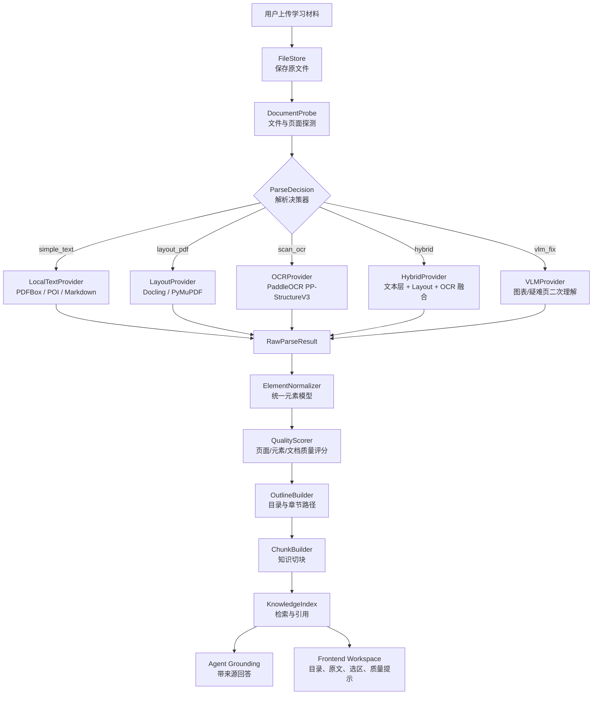
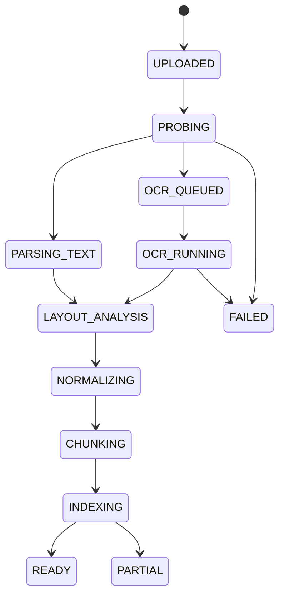

# 学习材料高质量解析总方案

## 1. 当前结论

当前解析质量低，不是因为某一个 OCR API 不够强，而是因为解析链路缺少完整策略。

之前的实现把 PDF 解析简化成：

```text
PDFTextStripper 能提取文字
  -> 认为解析成功
  -> 简单按换行拆 block
  -> 前端和 Agent 直接使用这些 block
```

这套逻辑只适合简单文本 PDF，不适合教材、扫描书、技术书、题库、论文、图文混排材料和代码/公式/表格材料。

新的解析目标必须升级为：

```text
原始学习材料
  -> 文件探测
  -> 多 Provider 解析
  -> 页面级质量评估
  -> 文本层 / OCR / 版面 / 视觉融合
  -> 统一 Document Model
  -> 目录大纲
  -> 元素定位
  -> 知识切块
  -> Agent source grounding
  -> 前端可验证展示
```

一句话：**不要再把 OCR 当成兜底识字工具，而要把整个模块当成 Document Intelligence Pipeline。**

## 2. 目标

本方案的目标是让 Personal English AI 能稳定解析绝大多数学习材料，包括：

- 普通文本层 PDF。
- 扫描版 PDF。
- 课本、教材、考试资料。
- 中英文混排材料。
- 技术书、代码书。
- 含图片、图表、表格、公式的 PDF。
- DOCX、MD、TXT、HTML 等非 PDF 材料。

最终输出不是一坨文本，而是一份可学习、可引用、可检索、可问答的结构化文档。

## 3. 非目标

以下目标不作为第一版硬性承诺：

- 100% 还原所有 PDF 原始版式。
- 所有图片都自动理解成准确自然语言。
- 所有复杂数学公式都转成完美 LaTeX。
- 所有表格都恢复成完全等价的 HTML。
- 对任意低质量扫描件都能无人工校正完成高质量解析。

第一版必须做到的是：**能判断质量、能降级、能保留证据、能让用户知道哪里不可靠，而不是把错误结果静默喂给 Agent。**

## 4. 设计原则

### 4.1 原文件永远保留

PDF 原貌是最终校验依据。无论解析多差，用户都必须能看到原文件。

```text
上传文件
  -> 保存原文件到磁盘或对象存储
  -> 数据库存 file metadata
  -> 前端通过 file API 使用 pdf.js 渲染原貌
```

### 4.2 解析结果必须可定位

所有被 Agent 使用的内容都必须尽量保留来源：

```text
documentId
pageNumber
elementId
bbox
sectionPath
chunkId
provider
confidence
qualityWarnings
```

如果没有这些定位信息，Agent 就不能可靠地回答“这句话来自书里哪里”。

### 4.3 不能用“有文字”判断解析成功

很多 PDF 有文本层，但文本顺序乱、乱码、缺图、缺公式、缺表格。

必须从以下维度判断：

- 文本覆盖率。
- 乱码率。
- 阅读顺序可信度。
- 页眉页脚污染率。
- 重复文本比例。
- 图片/表格/公式缺失率。
- 坐标覆盖率。
- OCR 置信度。
- 元素类型完整度。

### 4.4 解析块不等于目录

左侧目录给用户导航，解析块给系统定位。

```text
outline      给人看：第1章、1.1、1.1.1
elements     给系统定位：标题、段落、代码、表格、图片、公式
chunks       给 Agent 问答：合并后的上下文块
assets       给图片、表格、公式等非纯文本元素存储
```

### 4.5 多 Provider，不绑定单一工具

PaddleOCR 很重要，但它不应该成为唯一解析器。

合理职责是：

| Provider | 主要职责 |
| --- | --- |
| PDFBox / PyMuPDF | 读取 PDF 文本层、坐标、图片、内置目录 |
| PaddleOCR PP-StructureV3 | 扫描件 OCR、版面检测、表格、公式、图片区域 |
| Docling | 多格式文档转换、PDF 理解、阅读顺序、表格、代码、公式、DoclingDocument |
| Unstructured | 多格式 partition、元素类型、RAG 前处理兜底 |
| VLM / 多模态模型 | 图表理解、复杂图片解释、疑难页面二次解析 |

参考资料：

- PaddleOCR PP-StructureV3 官方文档说明该 pipeline 涵盖 layout、OCR、表格、公式、图表、阅读顺序和 Markdown 转换能力。
- Docling 官方文档说明其支持多格式解析、PDF layout、reading order、table structure、code、formulas、image classification、OCR 和 JSON/Markdown 导出。
- Unstructured 官方文档将文档 partition 成 `Title`、`NarrativeText`、`ListItem` 等元素，并支持 PDF `fast`、`hi_res`、`ocr_only` 等策略。

## 5. 总体架构



## 6. 解析决策器

解析决策器是新方案的核心。它不能只看文件类型，而要按页判断材料特征。

### 6.1 文件级探测

| 检查项 | 说明 | 输出字段 |
| --- | --- | --- |
| 文件类型 | PDF / DOCX / MD / TXT / HTML / image | `sourceType` |
| 页数 | PDF 页数或文档长度 | `pageCount` |
| 文件大小 | 用于异步任务、超时和分片 | `fileSize` |
| 是否加密 | 加密 PDF 不能直接解析 | `encrypted` |
| 是否有内置目录 | PDF outline/bookmarks | `hasNativeOutline` |
| 是否有文本层 | PDF 可提取文本 | `hasTextLayer` |
| 图片页比例 | 每页大图覆盖率 | `imagePageRatio` |
| 表格/公式/图片迹象 | 页面是否有复杂元素 | `complexElementHints` |

### 6.2 页面级探测

每页都要生成 `PageProbe`：

| 字段 | 类型 | 说明 |
| --- | --- | --- |
| `pageNumber` | int | PDF 页码，从 1 开始 |
| `textLayerCharCount` | int | 文本层字符数 |
| `textLayerGarbledRatio` | number | 乱码率 |
| `textLayerOrderScore` | number | 文本层阅读顺序可信度 |
| `imageCoverage` | number | 图片覆盖页面比例 |
| `hasLargeFigure` | boolean | 是否有大图/图表 |
| `hasTableHint` | boolean | 是否疑似有表格 |
| `hasFormulaHint` | boolean | 是否疑似有公式 |
| `hasCodeHint` | boolean | 是否疑似有代码 |
| `headerFooterRisk` | number | 页眉页脚污染风险 |
| `recommendedStrategy` | enum | `text_layer` / `layout` / `ocr` / `hybrid` / `vlm` |

### 6.3 策略选择

| 场景 | 策略 | 原因 |
| --- | --- | --- |
| TXT / MD | `simple_text` | 天然结构清晰 |
| DOCX | `office_structured` | 标题、段落、表格可从 Office 结构读取 |
| PDF 有内置目录且文本层质量高 | `text_layer_plus_layout` | 文本准确，补坐标和版面即可 |
| PDF 有文本层但顺序乱 | `hybrid` | 文本层可用，但需要 layout/OCR 重排 |
| 扫描 PDF | `scan_ocr` | 没有可信文本层 |
| 技术书/代码页 | `layout_code` | 需要识别 code block，不能按普通段落处理 |
| 公式/论文页 | `layout_formula` | 需要公式元素和截图 |
| 图表密集页 | `layout_figure_vlm` | 需要图片区域、图注、必要时 VLM 摘要 |
| 表格密集页 | `layout_table` | 需要表格结构 |
| 质量低且多引擎不一致 | `needs_review` | 不应静默进入 Agent |

## 7. 统一 Document Model

所有 Provider 的结果必须先归一化，前端和 Agent 只消费统一模型。

### 7.1 Document

| 字段 | 类型 | 说明 |
| --- | --- | --- |
| `documentId` | string | 文档 ID |
| `fileName` | string | 原文件名 |
| `sourceType` | enum | `PDF` / `DOCX` / `MD` / `TXT` / `HTML` / `IMAGE` |
| `fileUrl` | string | 原文件访问路径 |
| `pageCount` | int | 页数 |
| `parseStatus` | enum | `PENDING` / `SUCCEEDED` / `PARTIAL` / `NEEDS_REVIEW` / `FAILED` |
| `parseMode` | enum | `standard` / `high_quality` / `hybrid` |
| `providerPlan` | array | 每页或每阶段使用了哪些 provider |
| `quality` | object | 文档级质量报告 |
| `outline` | array | 目录大纲 |
| `pages` | array | 页面结构 |
| `elements` | array | 文档元素 |
| `chunks` | array | Agent 知识块 |
| `assets` | array | 图片、公式、表格、代码截图等资产 |
| `rawSnapshots` | object | Provider 原始响应索引 |

### 7.2 Page

| 字段 | 类型 | 说明 |
| --- | --- | --- |
| `pageNumber` | int | 页码 |
| `width` | number | 页面宽度 |
| `height` | number | 页面高度 |
| `rotation` | number | 页面方向 |
| `renderImageKey` | string | 页面渲染图片缓存 |
| `strategy` | enum | 本页使用的解析策略 |
| `qualityScore` | number | 0-1 |
| `warnings` | array | 本页质量问题 |
| `elementIds` | array | 本页元素 ID |

### 7.3 DocumentElement

`DocumentElement` 是最重要的数据结构。它不是目录，也不一定等于自然段，而是页面上可定位、可引用的内容单元。

| 字段 | 类型 | 说明 |
| --- | --- | --- |
| `elementId` | string | 元素 ID，例如 `p55-e12` |
| `type` | enum | `title` / `heading` / `paragraph` / `text_line` / `list` / `table` / `figure` / `caption` / `formula` / `code` / `header` / `footer` / `page_number` |
| `rawType` | string | Provider 原始类型 |
| `pageNumber` | int | 来源页码 |
| `bbox` | array | 页面坐标 |
| `order` | int | 文档阅读顺序 |
| `text` | string | 可读文本 |
| `html` | string | 表格或富文本结构 |
| `latex` | string | 公式 LaTeX |
| `assetId` | string | 图片/公式/表格截图资产 |
| `captionElementId` | string | 关联图注/表注 |
| `sectionPath` | array | 所属章节路径 |
| `provider` | string | 来源 provider |
| `confidence` | number | 识别置信度 |
| `qualityScore` | number | 元素质量 |
| `warnings` | array | 元素问题 |
| `metadata` | object | 额外信息 |

### 7.4 OutlineItem

左侧目录只消费 `OutlineItem`，不要再直接显示所有 elements。

| 字段 | 类型 | 说明 |
| --- | --- | --- |
| `outlineId` | string | 目录项 ID |
| `title` | string | 标题文本 |
| `level` | int | 层级，1/2/3 |
| `pageNumber` | int | 对应页码 |
| `elementId` | string | 对应标题元素 |
| `bbox` | array | 标题位置 |
| `source` | enum | `pdf_outline` / `toc_page` / `layout_heading` / `rule_heading` |
| `confidence` | number | 目录项可信度 |
| `children` | array | 子目录 |

### 7.5 KnowledgeChunk

`KnowledgeChunk` 是 Agent 使用的上下文，不等于单个 element。

| 字段 | 类型 | 说明 |
| --- | --- | --- |
| `chunkId` | string | 知识块 ID |
| `documentId` | string | 文档 ID |
| `chunkType` | enum | `section` / `paragraph_group` / `table` / `figure` / `formula` / `code` |
| `content` | string | 给模型看的主文本 |
| `summary` | string | 可选摘要 |
| `sourceElementIds` | array | 来源元素 |
| `pageNumbers` | array | 来源页码 |
| `sectionPath` | array | 所属章节 |
| `bboxRefs` | array | 位置引用 |
| `embeddingText` | string | 用于向量检索的文本 |
| `qualityScore` | number | 质量分 |
| `warnings` | array | 风险 |

### 7.6 DocumentAsset

| 字段 | 类型 | 说明 |
| --- | --- | --- |
| `assetId` | string | 资产 ID |
| `type` | enum | `figure` / `table_image` / `formula_image` / `page_image` |
| `documentId` | string | 文档 ID |
| `pageNumber` | int | 页码 |
| `bbox` | array | 位置 |
| `storageKey` | string | 文件存储位置 |
| `recognizedText` | string | OCR/识别文本 |
| `caption` | string | 图注或表注 |
| `description` | string | VLM 生成的图表解释 |
| `confidence` | number | 置信度 |
| `warnings` | array | 风险 |

## 8. PDF 解析策略

### 8.1 PDF 内置结构优先

优先读取 PDF 自带信息：

1. Metadata：标题、作者、创建时间。
2. Bookmarks / outline：内置目录。
3. Page labels：真实页码。
4. Text layer：文本与坐标。
5. Images：页面图片和嵌入图。

这一步适合使用 PDFBox / PyMuPDF。

### 8.2 文本层不能直接信任

文本层需要质量检测。

| 质量问题 | 判断信号 | 处理方式 |
| --- | --- | --- |
| 乱码 | `�`、异常符号、极端中英混杂 | 触发 OCR 或 hybrid |
| 顺序乱 | 文本坐标跳跃、页脚先于正文、列顺序错误 | 触发布局重排 |
| 页眉页脚污染 | 多页重复短文本 | 标记 header/footer 并过滤 |
| 断行严重 | 每行很短且没有标点 | 行合并 |
| 缺图表 | 页面图片覆盖率高但元素里没有 figure/table | 触发 layout |
| 缺公式 | 出现大量数学符号但无 formula element | 触发 formula |
| 缺代码结构 | 出现 `template`、`public`、`if`、缩进等 | 触发 code block 识别 |

### 8.3 页面分流

同一本 PDF 可以每页使用不同策略。

```text
封面页        -> layout + image
目录页        -> toc parser
普通正文页    -> text_layer_plus_layout
代码页        -> layout_code
图表页        -> layout_figure_vlm
扫描页        -> scan_ocr
公式页        -> layout_formula
表格页        -> layout_table
```

### 8.4 混合解析

教材 PDF 最常见的正确做法不是“只用文本层”或“只用 OCR”，而是融合：

```text
文本层负责：字符准确、可复制文本
layout 负责：区域类型、阅读顺序、标题/正文/代码/图表/表格边界
OCR 负责：扫描件、图片内文字、文本层缺失区域
VLM 负责：图表语义解释、复杂页面兜底
```

## 9. 扫描版 PDF 策略

扫描版 PDF 必须走 OCR，但 OCR 不是只返回字符串。

### 9.1 页面预处理

| 能力 | 目的 |
| --- | --- |
| DPI 渲染 | 控制清晰度和速度 |
| 方向检测 | 处理横向、倒置扫描 |
| 去弯曲/矫正 | 处理拍照书页 |
| 去噪/二值化 | 提升文字识别 |
| 裁边 | 去掉黑边、扫描边框 |
| 页面分割 | 双页扫描拆成单页 |

### 9.2 PaddleOCR high_quality

PaddleOCR 在本项目中的定位：

```text
standard:
  - 普通文本 OCR
  - bbox
  - confidence
  - 快速可用

high_quality:
  - PP-StructureV3
  - layout detection
  - reading order
  - table recognition
  - formula recognition
  - figure / caption / chart hints
  - Markdown / JSON structured output
```

### 9.3 OCR 结果落地要求

OCR 服务返回时必须包含：

```json
{
  "pageNumber": 55,
  "width": 1240,
  "height": 1754,
  "elements": [
    {
      "type": "heading",
      "text": "2.4.2 可扩充向量",
      "bbox": [120, 180, 520, 230],
      "confidence": 0.97,
      "order": 1,
      "source": "paddle_ppstructure"
    }
  ],
  "warnings": []
}
```

如果只能识别到文本行，也要返回 `text_line`，后端再做行合并。

## 10. 目录大纲策略

左侧目录要独立构建，不再直接展示 `P2/P3` 这种解析块。

### 10.1 目录来源优先级

```text
PDF 内置 outline
  -> 目录页解析
  -> layout heading
  -> 规则标题识别
  -> 页码 fallback
```

### 10.2 目录页解析

针对目录页识别：

```text
第1章 绪论 ................ 23
1.1 计算机与算法 .......... 25
1.1.1 古埃及人的绳索 ...... 28
```

输出：

```json
{
  "title": "1.1 计算机与算法",
  "level": 2,
  "pageNumber": 25,
  "source": "toc_page",
  "confidence": 0.9
}
```

### 10.3 标题识别规则

标题候选包括：

- 字号大、加粗、靠左或居中。
- 符合章节编号模式。
- 前后有较大空白。
- 出现在页首或段落开始。
- 被 layout 标记为 `title` / `paragraph title` / `heading`。

常见规则：

```text
第[一二三四五六七八九十0-9]+章
第[一二三四五六七八九十0-9]+节
\d+(\.\d+){0,3}\s+.+
§\s*\d+(\.\d+)*\s+.+
Chapter\s+\d+
Unit\s+\d+
```

### 10.4 目录验收

一份教材类 PDF 的目录质量至少满足：

- 左侧不再显示普通段落块。
- 能显示章、节、小节。
- 点击目录能跳转到对应页。
- 当前页能反查所属章节。
- 无目录时只展示 `Page` fallback。

## 11. 元素处理策略

### 11.1 段落

段落不是 OCR 行。段落生成要经过：

```text
text_line
  -> 同列排序
  -> 行距判断
  -> 缩进判断
  -> 断行修复
  -> 合并为 paragraph
```

### 11.2 代码块

代码书必须识别 code block。

信号：

- 等宽字体或代码区域。
- 行号。
- 大量 `{}`、`;`、`::`、`#include`、`template`、`public`。
- 缩进结构明显。

处理：

```text
code element:
  text: 保留换行和缩进
  language: cpp/java/python/unknown
  bbox: 代码区域
  do_not_merge_with_paragraph: true
```

### 11.3 图片和图表

图片不能只 OCR 里面的零散文字。

正确输出：

```text
figure element
  -> asset image crop
  -> caption
  -> OCR labels inside image
  -> optional VLM description
  -> linked to sectionPath
```

Agent 回答图表问题时，应拿到：

- 图本身截图。
- 图注。
- 图内文字。
- 前后正文。
- VLM 图表解释。

### 11.4 表格

表格输出要同时保留：

- 原图截图。
- HTML table。
- Markdown table。
- 单元格结构。
- 表标题。
- 表格摘要。

如果表格结构识别失败，至少保留 `table_image` asset 和 warning，不要把表格文字压成乱序段落。

### 11.5 公式

公式输出：

```text
formula element
  latex
  image crop
  inline/block
  confidence
  surrounding paragraph
```

如果 LaTeX 识别失败，保留公式图片，并标记 `NEEDS_FORMULA_RECOGNITION`。

### 11.6 页眉页脚

页眉页脚不应进入 Agent 主上下文。

处理策略：

- 多页重复文本识别为 `header` / `footer`。
- 页码识别为 `page_number`。
- 默认不进入 chunk。
- 仍可保留在 elements 里用于调试。

## 12. 质量评分

### 12.1 文档级质量

| 字段 | 说明 |
| --- | --- |
| `overallScore` | 总体质量 |
| `textCoverage` | 文本覆盖率 |
| `layoutCoverage` | 版面覆盖率 |
| `ocrConfidence` | OCR 平均置信度 |
| `orderScore` | 阅读顺序评分 |
| `garbledRatio` | 乱码率 |
| `assetCoverage` | 图片/表格/公式资产覆盖率 |
| `citationReadiness` | 是否支持引用定位 |
| `agentReadiness` | 是否可进入 Agent 问答 |

### 12.2 页面级状态

| 状态 | 含义 | 前端表现 |
| --- | --- | --- |
| `READY` | 可用于学习和问答 | 正常 |
| `PARTIAL` | 部分内容可靠 | 显示 warning |
| `LOW_QUALITY` | 质量较低 | 提醒用户重解析 |
| `NEEDS_OCR` | 需要 OCR | 触发 OCR 或提示 |
| `NEEDS_REVIEW` | 多引擎冲突或结构不可信 | 不自动喂给 Agent |
| `FAILED` | 解析失败 | 提示重新上传或换模式 |

### 12.3 低质量触发条件

任一条件满足就不能静默当作成功：

- `garbledRatio > 0.05`
- 文本层顺序评分低。
- 图片覆盖率高但无 figure/table/formula element。
- 代码页被识别成普通段落。
- OCR 平均置信度过低。
- 页内元素 bbox 大量缺失。
- 表格页没有 table 或 table_image。
- 扫描页没有 OCR 结果。

## 13. Agent 使用策略

Agent 不能直接读取整本 PDF，也不能直接读取 raw OCR 文本。

### 13.1 当前选区问答

用户选择页面内容时，前端发送：

```json
{
  "documentId": "doc_123",
  "pageNumber": 55,
  "elementId": "p55-e12",
  "selectedText": "可扩充向量...",
  "bbox": [120, 300, 850, 420]
}
```

后端组装上下文：

```text
当前 element
  + 前后相邻 elements
  + 所属 section summary
  + 相关 figure/table/formula assets
  + 用户历史问题
  + 学习画像
```

### 13.2 整本文档问答

流程：

```text
用户问题
  -> query rewrite
  -> hybrid search: embedding + keyword + section filter
  -> rerank
  -> source chunks
  -> Agent answer with citations
```

### 13.3 引用格式

Agent 输出必须带 source：

```json
{
  "answer": "这里讲的是动态数组扩容...",
  "citations": [
    {
      "documentId": "doc_123",
      "pageNumber": 55,
      "elementId": "p55-e12",
      "chunkId": "c55-2",
      "quote": "当当前数据区已满..."
    }
  ]
}
```

## 14. 前端展示策略

### 14.1 三栏职责

| 区域 | 显示内容 | 不应显示 |
| --- | --- | --- |
| 左侧 | 目录大纲、页码 fallback、质量提示 | 普通 `P2/P3` 解析块 |
| 中间 | PDF 原貌、选区、高亮、bbox overlay | 大段解析文本替代原文 |
| 右侧 | 当前选区、Agent 问答、学习笔记、引用 | 无来源的假解析结果 |

### 14.2 质量提示

页面质量低时要明确提示：

```text
当前页结构解析质量较低：代码块和图片尚未可靠识别。
可以继续看原 PDF，但 Agent 回答会优先引用可靠文本。
```

### 14.3 调试视图

开发环境需要一个解析调试面板：

- 当前页 elements。
- bbox overlay。
- provider。
- rawType。
- confidence。
- warnings。
- chunk 归属。
- outline 来源。

没有这个面板，就很难判断到底是 OCR、layout、后端合并还是前端展示出错。

## 15. 存储设计

### 15.1 原文件

原文件不进数据库，进文件存储：

```text
translation_document_file
  document_id
  file_name
  content_type
  file_size
  sha256
  storage_provider
  storage_key
```

### 15.2 快照

每次解析保存快照：

```text
translation_document_parse_snapshot
  document_id
  response_json
  diagnosis_json
  quality_json
  language_profile_json
  parse_job_json
  raw_provider_response_json
```

重复解析同一个 documentId 时替换旧快照。

### 15.3 元素表

```text
translation_document_element
  document_id
  element_id
  element_type
  element_order
  page_number
  text
  bbox
  provider
  confidence
  quality_score
  recognition_status
  metadata_json
```

### 15.4 知识块表

```text
translation_knowledge_chunk
  document_id
  chunk_id
  chunk_type
  content
  source_element_ids_json
  page_numbers_json
  section_path_json
  quality_score
```

### 15.5 资产表

建议新增：

```text
translation_document_asset
  document_id
  asset_id
  asset_type
  page_number
  bbox
  storage_key
  recognized_text
  caption
  description
  confidence
  metadata_json
```

## 16. 异步任务

高质量解析不能同步阻塞前端。

### 16.1 状态流



### 16.2 前端轮询

前端上传后不应假装已经解析完成，而是展示：

- 已保存原文件。
- 正在探测。
- 正在 OCR。
- 正在构建目录。
- 正在构建知识块。
- 可用页数。
- 低质量页数。

## 17. 实施路线

### P0：停止错误结果进入体验

目标：先防止低质量解析伤害用户信任。

- 左侧改为目录/页码，不再展示普通解析块。
- 增加页面级 quality warning。
- 文本层质量差时不要标记完全成功。
- Agent 上下文只使用质量达标 chunks。
- 增加解析调试视图。

### P1：解析决策器和统一模型

目标：从“简单提文字”升级到“可决策的解析管线”。

- 增加 `DocumentProbe`。
- 增加 `ParseDecision`。
- 定义 `DocumentModel`。
- 统一 `outline/elements/chunks/assets/quality`。
- 快照保存 provider 原始响应。

### P2：PDF high_quality provider

目标：处理教材、技术书、扫描版 PDF。

- 接入 PyMuPDF 坐标提取。
- 接入 PaddleOCR PP-StructureV3 high_quality。
- 支持 layout/table/formula/image/code/caption。
- 支持页面级混合解析。
- 支持 outline builder。

### P3：Agent source grounding

目标：让回答真正基于书。

- 构建 chunk index。
- 支持 embedding + keyword + rerank。
- 回答返回 citations。
- 当前选区联动 `elementId/pageNumber/bbox`。
- 学习笔记绑定 source。

### P4：图表和公式增强

目标：覆盖复杂学习资料。

- 图表裁剪。
- 图注绑定。
- VLM 图表解释。
- 公式 LaTeX 识别。
- 表格 HTML/Markdown 双表示。

### P5：质量评测集

目标：避免之后反复“感觉不行”。

建立固定样本集：

- 正常文本层 PDF。
- 扫描版教材。
- 中英混排资料。
- 技术书代码页。
- 表格密集 PDF。
- 公式密集 PDF。
- 图表密集 PDF。
- 双栏论文。
- 页眉页脚污染 PDF。
- 乱码文本层 PDF。
- 长 PDF。

每次改解析逻辑都跑评测。

## 18. 验收标准

### 18.1 普通 PDF

- 能打开原 PDF。
- 左侧显示目录或页码。
- 当前页能显示所属章节。
- 正文顺序基本正确。
- 页眉页脚不进入 Agent 主上下文。

### 18.2 扫描 PDF

- 能触发 OCR。
- OCR 后有 pageNumber、elementId、bbox。
- 低置信度页有 warning。
- 无法识别时不生成假答案。

### 18.3 技术书

- 标题能进入 outline。
- 代码块不混入普通段落。
- 图表至少保留 asset 和 caption。
- Agent 回答能引用页码和元素。

### 18.4 图表材料

- 图片区域有 `figure` element。
- 图注能绑定到 figure。
- 图内 OCR 文本不污染正文顺序。
- 图表解释没有时显示待识别，而不是乱拼文字。

### 18.5 表格材料

- 表格不被拆成乱序段落。
- 至少保留表格截图。
- 能生成 markdown/html 表格时优先使用结构化表格。

### 18.6 Agent

- 当前选区提问时，Agent 能拿到当前 element。
- 整本文档提问时，Agent 使用 source chunks。
- 回答必须返回 citations。
- 低质量来源要提示不确定性。

## 19. 当前项目需要调整的关键点

### 19.1 后端

当前最需要改的是：

```text
TranslationDocumentParseService
  不能再用 hasUsableTextLayer 直接判定成功
  需要引入 DocumentProbe + ParseDecision
```

新增建议：

- `DocumentParseOrchestrator`
- `DocumentProbeService`
- `ParseDecisionService`
- `DocumentElementNormalizer`
- `DocumentOutlineBuilder`
- `DocumentQualityScorer`
- `DocumentAssetService`
- `DocumentChunkBuilder`

### 19.2 OCR 服务

当前 PaddleOCR 服务要从“文本 OCR 服务”升级为“文档解析 provider”。

必须输出：

- page size。
- element type。
- bbox。
- rawType。
- confidence。
- layout warnings。
- table/formula/figure/caption/code。

### 19.3 前端

当前前端要停止把解析块当目录。

改成：

```text
左侧：outline + page fallback
中间：PDF 原貌 + bbox overlay
右侧：当前选区 + Agent + citations + quality warnings
调试：elements/chunks/provider/warnings
```

## 20. 风险和取舍

| 风险 | 说明 | 处理 |
| --- | --- | --- |
| 高质量解析慢 | OCR/layout/VLM 成本高 | 异步任务 + 页面分片 |
| 不同 Provider 输出不一致 | 同页解析结果冲突 | 质量评分 + provenance |
| PaddleOCR 环境复杂 | Mac/GPU/Windows 差异 | OCR 独立服务 |
| 图表理解成本高 | VLM 调用成本高 | 先 asset 占位，按需理解 |
| 用户上传长 PDF | 同步处理不可接受 | 队列 + 增量解析 |
| 错误解析影响 Agent | Agent 产生错误解释 | 低质量页禁止静默问答 |

## 21. 推荐技术组合

第一阶段推荐组合：

```text
PDF 原貌渲染：pdf.js
PDF 文本/目录/图片/坐标：PDFBox + PyMuPDF
扫描 OCR：PaddleOCR
高质量版面：PaddleOCR PP-StructureV3
多格式解析备选：Docling / Unstructured
存储：本地文件存储，后续换对象存储
检索：MySQL metadata + 向量库/embedding 后续接入
Agent：只读取 chunks，不直接读取 raw parse
```

## 22. 最终判断

这个功能不是不能做，而是不能继续按“提取文本 -> 简单分段 -> 直接给 Agent”的路线做。

要覆盖绝大多数学习材料，必须承认 PDF 解析是一个独立的文档智能系统。它至少要包含：

- 原文件保存。
- 多 Provider 解析。
- 页面级策略决策。
- OCR/layout/table/formula/figure/code 支持。
- 统一 Document Model。
- 目录大纲。
- 元素定位。
- 质量评分。
- 知识切块。
- Agent 引用。
- 前端调试和质量提示。

只有这样，用户在 PDF 上选一段内容时，右侧 Agent 才能真正知道：

```text
你选的是哪本书
哪一页
哪个章节
哪个元素
它前后上下文是什么
旁边有没有图、表格、公式、代码
这段内容是否可靠
回答应该引用哪里
```

这才是面向学习材料的长期可用解析方案。
