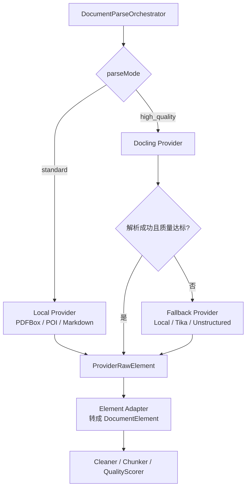
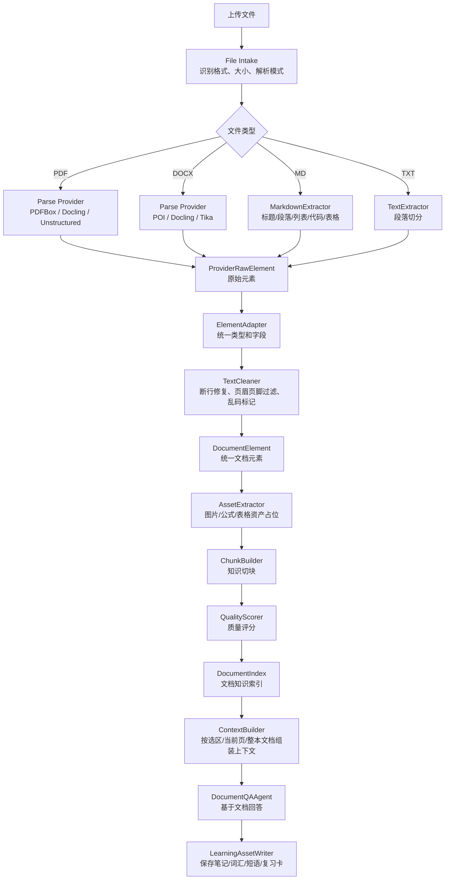
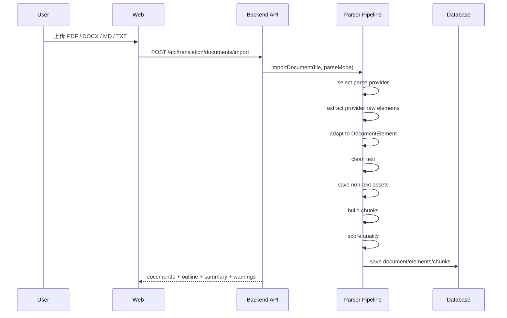
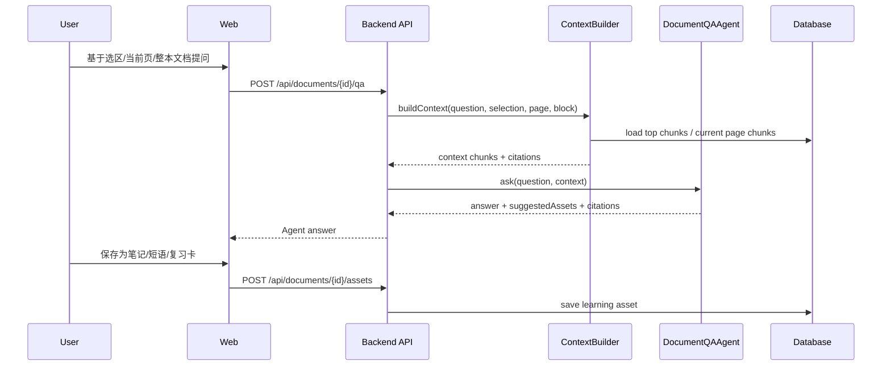
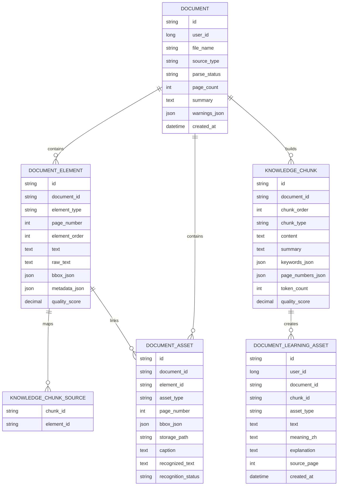

# 文档知识提取管线设计

## 1. 背景

AI 精读工作台的关键不只是打开 PDF、DOCX、Markdown 或 TXT 文件，而是把这些材料转成模型可以稳定使用的高质量学习上下文。

如果直接把原始 PDF 文本整段塞给模型，会出现几个问题：

- 页眉、页脚、页码、乱码和断行污染上下文。
- 模型不知道回答依据来自哪一页、哪一段。
- 用户无法从回答跳回原文位置。
- 生词、短语、句型、笔记和复习卡无法沉淀成长期学习资产。
- 文档越长，直接传全文越不可控，成本和效果都不好。

因此，本模块应被视为一条 **文档数据清洗管线**：

```text
原始文件
  -> 内容提取
  -> 文本清洗
  -> 结构化元素
  -> 知识切块
  -> 质量评分
  -> Agent 上下文
  -> 学习资产
```

## 2. 目标

第一阶段目标：

> 将 PDF / DOCX / MD / TXT 等常见文档格式，提取为干净、可定位、可检索、可引用、可喂给 Agent 的知识数据。

明确不追求：

- 高保真还原 PDF 版式。
- 完整 OCR 扫描件解析。
- 完美表格、公式、图片理解。
- 一次性支持所有文档格式。

第一阶段要追求：

- 有文本层 PDF 能稳定提取文本。
- DOCX / MD / TXT 能统一转成文档元素。
- 每个内容块能定位到页码或文档顺序。
- 文本经过基础清洗后再进入模型。
- Agent 回答能引用 Page / Block / Chunk。
- 用户能把回答沉淀成学习资产。

## 3. 主流方案判断

文档解析不建议完全自研。主流做法是：

```text
成熟开源解析器负责：文件解析、版面分析、表格识别、图片提取、坐标定位。
项目自身负责：统一数据模型、学习场景清洗、知识切块、质量评分、Agent 上下文、引用回跳。
```

因此本项目采用 **开源解析器优先，自研管线兜底** 的策略：

1. PDF、DOCX、HTML 等复杂格式优先接入成熟解析 Provider。
2. 后端内部统一落到 `DocumentElement` / `KnowledgeChunk`，避免被某个解析库绑定。
3. 第一版仍保留本地 PDFBox / POI / Markdown 解析能力，作为轻量兜底。
4. 图片、公式、表格先保留结构和资产引用，不强制第一版全部识别成文本。
5. Agent 永远只依赖统一后的知识层，不直接依赖某个第三方解析库输出。

## 4. 开源解析器选型

| 工具 | 适合场景 | 优点 | 注意点 | 建议定位 |
| --- | --- | --- | --- | --- |
| Docling | PDF / DOCX / PPTX / HTML 等文档转结构化内容 | 面向 AI 文档转换，支持版面、表格、结构化表示，适合 RAG 前处理 | Python 生态，引入后需要后端通过服务或 CLI 调用 | P1 首选高质量解析 Provider |
| Unstructured | 多格式文档 partition，输出标题、段落、列表、表格等元素 | RAG 场景成熟，元素类型抽象清晰 | 高质量 PDF 解析可能依赖额外模型或系统组件 | P1 备选 Provider |
| PyMuPDF | PDF 文本、图片、坐标、页面块提取 | 轻量、速度快、坐标能力强 | 表格、标题语义需要自己补 | P0/P1 PDF 细粒度补充 |
| Apache Tika | 多文件格式文本和 metadata 提取 | Java 生态友好，格式覆盖广 | 更偏通用文本抽取，复杂版面理解较弱 | 通用兜底 Provider |
| PDFBox | Java PDF 文本层提取 | 当前后端已在使用，集成成本低 | 对复杂版面、表格、图片、公式能力有限 | P0 本地基础 Provider |
| Apache POI | DOCX 段落和表格提取 | 当前后端已在使用，处理 Word 合适 | 需要自己做标题、列表、表格规范化 | P0 DOCX 基础 Provider |

选型结论：

```text
P0：继续保留 PDFBox + POI + Markdown parser，先跑通文档学习闭环。
P1：新增 Docling Provider，作为 high_quality 解析模式的首选。
P1：根据效果评估是否接入 Unstructured 作为第二 Provider。
P2：对扫描 PDF、复杂公式、复杂表格再接 OCR / 多模态模型。
```

## 5. Provider 架构

解析层必须做成可替换 Provider，而不是把某个库写死在业务流程里。



### 5.1 Provider 输出要求

所有 Provider 不直接返回给前端，必须先转成统一中间结构：

| 字段 | 说明 |
| --- | --- |
| `provider` | `local_pdfbox` / `docling` / `unstructured` / `tika` |
| `sourceType` | `PDF` / `DOCX` / `MD` / `TXT` / `HTML` |
| `rawType` | Provider 原始元素类型 |
| `normalizedType` | 统一后的元素类型 |
| `text` | 文本内容 |
| `pageNumber` | 来源页码 |
| `bbox` | 页面坐标，能拿到就保存 |
| `assetRef` | 图片、公式、表格截图等资产引用 |
| `confidence` | Provider 置信度，没有则为空 |
| `metadata` | 原始额外信息 |

### 5.2 Provider 选择规则

| 条件 | 使用 Provider |
| --- | --- |
| 用户选择 `standard` | 本地解析 Provider |
| 用户选择 `high_quality` 且文件是 PDF / DOCX | Docling Provider |
| Docling 失败或超时 | 回退本地 Provider |
| 文件格式本地不支持 | Tika 或 Unstructured |
| 文本层太少 | 返回 `NEEDS_OCR`，不强行问答 |
| 表格/图片/公式存在但无法识别 | 保存 asset 占位和位置，标记 `needs_recognition` |

### 5.3 OCR Provider 决策

扫描版 PDF 的本地 OCR Provider 采用 PaddleOCR，不再把 Tesseract 作为主要识别方案。

原因：

- PaddleOCR 对中文、英文和中英混排教材更友好。
- 本地部署后用户资料不需要上传到第三方平台。
- 可独立 Docker 化，后端只通过 HTTP 契约调用，避免 Java 主服务绑定 Python OCR 依赖。
- 识别失败时仍保留 `NEEDS_OCR`、warning 和质量诊断，不强行进入问答。

当前后端 OCR 契约：

```text
TranslationDocumentParseService
  -> TranslationOcrService
  -> PaddleTranslationOcrService
  -> POST {APP_OCR_PADDLE_BASE_URL}{APP_OCR_PADDLE_ENDPOINT}
```

请求：

```json
{
  "documentBase64": "<PDF base64>",
  "language": "ch,eng"
}
```

响应：

```json
{
  "pages": [
    {
      "pageNumber": 1,
      "text": "识别后的页面文本"
    }
  ]
}
```

配置项：

| 配置 | 默认值 | 说明 |
| --- | --- | --- |
| `APP_OCR_PROVIDER` | `tesseract` | OCR 引擎，接入 PaddleOCR 时设为 `paddle` |
| `APP_OCR_PADDLE_BASE_URL` | `http://127.0.0.1:8090` | 本地 PaddleOCR 服务地址 |
| `APP_OCR_PADDLE_ENDPOINT` | `/ocr/pdf` | PDF OCR 接口路径 |
| `APP_OCR_PADDLE_LANGUAGE` | `ch,eng` | 识别语言 |
| `APP_OCR_PADDLE_TIMEOUT_MS` | `60000` | 调用超时时间 |

本地 PaddleOCR 服务职责：

1. 接收 PDF base64。
2. 按页渲染或解析页面图片。
3. 使用 PaddleOCR 执行中英文识别。
4. 返回按页文本，后端继续转成统一 `DocumentBlock`、`DocumentElement` 和 `KnowledgeChunk`。

## 6. 支持格式分期

| 阶段 | 格式 | 处理策略 | 目标 |
| --- | --- | --- | --- |
| P0 | PDF | 提取文本层，按页生成 block | 支持有文本层 PDF 精读问答 |
| P0 | DOCX | 提取标题、段落、列表、表格文本 | 支持 Word 学习材料 |
| P0 | MD | 提取标题、段落、列表、代码块、表格文本 | 支持 Markdown 文档精读 |
| P0 | TXT | 按段落提取纯文本 | 支持普通文章 |
| P1 | HTML | 提取正文、标题、列表、表格 | 支持网页导入 |
| P1 | 图片元素 | 提取占位、位置和缩略图 | 支持图文材料定位 |
| P1 | 表格 | 转为 markdown table 并生成摘要 | 支持表格问答 |
| P1 | 扫描 PDF | 接入本地 PaddleOCR Provider，必要时再接云端 OCR 兜底 | 支持无文本层 PDF |
| P2 | 公式 | 提取公式图片或 LaTeX，生成解释 | 支持论文/理科材料 |

## 7. 总体流程



## 8. 模块职责

| 模块 | 职责 | 第一版建议落位 |
| --- | --- | --- |
| File Intake | 校验文件、识别类型、记录上传元信息 | `TranslationDocumentImportService` |
| Parse Provider | 从不同格式提取原始文本、版面、图片、表格和坐标 | `DocumentParseProvider` 实现类 |
| Element Adapter | 将 Provider 输出统一成内部元素 | 新增 `DocumentElementAdapter` |
| Text Cleaner | 清洗页码、断行、重复页眉页脚和乱码 | 新增 `DocumentTextCleaner` |
| Element Builder | 将原始块统一成 `DocumentElement` | 新增 `DocumentElementBuilder` |
| Asset Extractor | 保存图片、公式截图、表格原始结构等非文本资产 | 新增 `DocumentAssetExtractor` |
| Chunk Builder | 将元素合并成 Agent 适合读取的知识块 | 新增 `KnowledgeChunkBuilder` |
| Quality Scorer | 给元素和 chunk 打质量分 | 新增 `DocumentQualityScorer` |
| Document Index | 保存元素、chunk、摘要和检索字段 | 后端持久化表 |
| Context Builder | 根据选区、当前页、问题检索上下文 | 新增 `DocumentContextBuilder` |
| Document QA Agent | 基于上下文回答并输出引用 | Python Agent 或后端 AI Service |
| Asset Writer | 把回答转成学习资产 | 复用学习资产/词汇/笔记模块 |

## 9. 核心数据流

### 9.1 上传与解析



### 9.2 文档问答



## 10. 统一数据字典

### 10.1 Document

| 字段 | 类型 | 必填 | 说明 |
| --- | --- | --- | --- |
| `id` | string | 是 | 文档唯一 ID |
| `userId` | long | 是 | 所属用户 |
| `fileName` | string | 是 | 原始文件名 |
| `title` | string | 否 | 文档标题，可由文件名或内容推断 |
| `sourceType` | enum | 是 | `PDF` / `DOCX` / `MD` / `TXT` |
| `parseMode` | enum | 是 | `standard` / `high_quality` |
| `parseStatus` | enum | 是 | `PENDING` / `SUCCEEDED` / `PARTIAL` / `NEEDS_OCR` / `FAILED` |
| `pageCount` | int | 否 | 页数；非分页文档可为空或为 1 |
| `summary` | text | 否 | 文档概览 |
| `warningsJson` | json | 否 | 解析警告 |
| `createdAt` | datetime | 是 | 创建时间 |
| `updatedAt` | datetime | 是 | 更新时间 |

### 10.2 DocumentElement

`DocumentElement` 是文档结构的统一表达。PDF 的页内段落、DOCX 的段落、MD 的标题、TXT 的自然段都要转成这个结构。

| 字段 | 类型 | 必填 | 说明 |
| --- | --- | --- | --- |
| `id` | string | 是 | 元素 ID，例如 `doc_123_p29_e001` |
| `documentId` | string | 是 | 所属文档 |
| `type` | enum | 是 | `title` / `heading` / `paragraph` / `list` / `table` / `image` / `formula` / `caption` / `code` / `quote` / `unknown` |
| `pageNumber` | int | 否 | PDF 页码；非分页文档可为空 |
| `order` | int | 是 | 文档内顺序 |
| `text` | text | 否 | 清洗后的可读文本 |
| `rawText` | text | 否 | 原始提取文本，用于排查 |
| `bboxJson` | json | 否 | 页面坐标；第一版可为空 |
| `metadataJson` | json | 否 | 样式、来源、置信度、表格结构等 |
| `qualityScore` | decimal | 否 | 0-1 的元素质量分 |
| `noiseFlagsJson` | json | 否 | 噪声标记，如 `page_number`、`header_footer`、`garbled` |
| `provider` | string | 否 | 来源解析器，如 `docling`、`pdfbox` |
| `assetId` | string | 否 | 图片、公式、表格截图等非文本资产 ID |
| `recognitionStatus` | enum | 否 | `READY` / `NEEDS_OCR` / `NEEDS_FORMULA_RECOGNITION` / `NEEDS_TABLE_RECOGNITION` |

元素类型说明：

| 类型 | 含义 | 示例 |
| --- | --- | --- |
| `title` | 文档标题 | 25考研英语高分写作 |
| `heading` | 章节标题 | Chapter 1 / 环保类作文 |
| `paragraph` | 普通段落 | 一段正文 |
| `list` | 列表项或列表组 | 1. environmental awareness |
| `table` | 表格文本或 markdown table | `Topic \| Expression \| Meaning` |
| `image` | 图片占位或图片说明 | Page 5 image 1 |
| `formula` | 公式占位或公式文本 | `E = mc^2` |
| `code` | Markdown 代码块 | ```python |
| `quote` | 引用块 | `> ...` |

### 10.3 DocumentAsset

`DocumentAsset` 用来保存无法直接变成干净文本的内容，例如图片、公式截图、复杂表格截图。

| 字段 | 类型 | 必填 | 说明 |
| --- | --- | --- | --- |
| `id` | string | 是 | 资产 ID |
| `documentId` | string | 是 | 所属文档 |
| `elementId` | string | 否 | 关联元素 |
| `assetType` | enum | 是 | `image` / `formula` / `table_image` / `page_snapshot` |
| `pageNumber` | int | 否 | 来源页码 |
| `bboxJson` | json | 否 | 页面坐标 |
| `storagePath` | string | 是 | 本地或对象存储路径 |
| `caption` | text | 否 | 图片或公式说明 |
| `recognizedText` | text | 否 | OCR / 公式识别 / 表格识别后的文本 |
| `recognitionStatus` | enum | 是 | `PENDING` / `READY` / `FAILED` / `NOT_REQUIRED` |
| `provider` | string | 否 | 来源解析器 |

### 10.4 KnowledgeChunk

`KnowledgeChunk` 是 Agent 问答使用的知识单元。它不一定等于一个 `DocumentElement`，可以由多个相邻元素合并。

| 字段 | 类型 | 必填 | 说明 |
| --- | --- | --- | --- |
| `id` | string | 是 | chunk ID |
| `documentId` | string | 是 | 所属文档 |
| `chunkOrder` | int | 是 | chunk 顺序 |
| `chunkType` | enum | 是 | `section` / `paragraph` / `table` / `expression_list` / `example` / `summary` / `mixed` |
| `content` | text | 是 | 给模型使用的正文 |
| `summary` | text | 否 | chunk 摘要 |
| `keywordsJson` | json | 否 | 关键词 |
| `sourceElementIdsJson` | json | 是 | 来源元素 ID 列表 |
| `pageNumbersJson` | json | 否 | 来源页码列表 |
| `tokenCount` | int | 否 | 估算 token 数 |
| `qualityScore` | decimal | 否 | 0-1 的知识质量分 |
| `embeddingStatus` | enum | 否 | `NOT_REQUIRED` / `PENDING` / `READY` / `FAILED` |
| `embeddingId` | string | 否 | 向量索引 ID，P1 后使用 |

### 10.5 AgentContextChunk

`AgentContextChunk` 是真正传给模型的上下文对象。

| 字段 | 类型 | 必填 | 说明 |
| --- | --- | --- | --- |
| `source` | string | 是 | 展示给模型和用户的来源，如 `Page 29 Block 3` |
| `content` | text | 是 | 上下文正文 |
| `chunkId` | string | 是 | 来源 chunk |
| `pageNumber` | int | 否 | 来源页码 |
| `elementIds` | array | 否 | 来源元素 ID |
| `qualityScore` | decimal | 否 | 上下文质量 |

### 10.6 LearningAsset

从文档问答中沉淀的学习资产。

| 字段 | 类型 | 必填 | 说明 |
| --- | --- | --- | --- |
| `id` | string | 是 | 资产 ID |
| `userId` | long | 是 | 所属用户 |
| `documentId` | string | 是 | 来源文档 |
| `chunkId` | string | 否 | 来源 chunk |
| `assetType` | enum | 是 | `note` / `vocabulary` / `phrase` / `sentence` / `grammar` / `review_card` |
| `text` | text | 是 | 学习内容 |
| `meaningZh` | text | 否 | 中文含义 |
| `explanation` | text | 否 | 解释 |
| `sourceExcerpt` | text | 否 | 原文证据 |
| `sourcePage` | int | 否 | 来源页码 |
| `userNote` | text | 否 | 用户笔记 |
| `createdAt` | datetime | 是 | 创建时间 |

## 11. 文本清洗规则

文本清洗目标：

```text
让模型看到的上下文尽可能干净、完整、可读、可引用。
```

### 11.1 基础规范化

| 规则 | 示例 | 处理 |
| --- | --- | --- |
| 统一换行 | `\r\n`、`\r` | 转为 `\n` |
| 统一空格 | 多个空格、NBSP | 压缩为一个空格 |
| 去首尾空白 | `  text  ` | `text` |
| 删除空块 | 空段落 | 不生成 element |

### 11.2 PDF 断行修复

| 原始文本 | 清洗后 |
| --- | --- |
| `environ-\nmental awareness` | `environmental awareness` |
| `This is a sentence\nthat continues.` | `This is a sentence that continues.` |
| `Title\nNext paragraph.` | 根据标题规则拆成两个 element |

### 11.3 页眉页脚和页码过滤

过滤或标记：

- 单独页码：`29`、`Page 29`、`29 / 266`
- 重复页眉：每页反复出现的书名、公众号、版权信息
- 重复页脚：网站、文件来源、下载说明

第一版策略：

```text
1. 明确页码直接过滤。
2. 高频重复短行标记为 header_footer。
3. 对疑似学习内容的词汇列表不轻易删除。
```

### 11.4 乱码和低质量文本标记

标记为低质量：

- 非法替换字符过多：`�`
- 连续不可读符号过多。
- 文本中英文比例异常且无明显含义。
- 单个 block 太短且非标题、非列表。

示例：

```json
{
  "qualityScore": 0.32,
  "noiseFlags": ["garbled", "too_short"]
}
```

## 12. 知识切块策略

### 12.1 切块原则

| 原则 | 说明 |
| --- | --- |
| 语义完整 | 不把一个完整观点切断 |
| 可定位 | 每个 chunk 保留来源页码和 element |
| 大小适中 | 第一版建议 200-800 tokens |
| 低噪声 | 低质量 element 不进入高质量 chunk |
| 不跨太远 | 不跨多个章节或太远页面合并 |

### 12.2 合并规则

| 场景 | 合并方式 |
| --- | --- |
| 标题 + 后续短段落 | 合并为 section chunk |
| 连续短列表 | 合并为 expression_list chunk |
| 表格 | 单独作为 table chunk |
| 长段落 | 按句子或 token 长度拆分 |
| 当前页问答 | 保留页内 chunk 顺序 |

### 12.3 Chunk 示例

```json
{
  "id": "doc_123_p29_c001",
  "documentId": "doc_123",
  "chunkOrder": 1,
  "chunkType": "expression_list",
  "content": "environmental awareness 环保意识; keep ecological balance 保持生态平衡; reduce greenhouse gas emissions 减少温室气体排放",
  "summary": "环保类作文常用表达",
  "keywords": ["environment", "ecological balance", "emissions"],
  "sourceElementIds": ["doc_123_p29_e001", "doc_123_p29_e002"],
  "pageNumbers": [29],
  "tokenCount": 96,
  "qualityScore": 0.88
}
```

## 13. 质量评分

质量评分用于决定某个元素或 chunk 是否适合作为模型上下文。

### 13.1 评分维度

| 维度 | 含义 | 权重建议 |
| --- | --- | --- |
| `textCompleteness` | 文本是否完整，没有明显截断 | 0.25 |
| `noiseLevel` | 页眉页脚、乱码、重复内容比例 | 0.20 |
| `structureConfidence` | 类型识别是否可信 | 0.15 |
| `learningValue` | 是否有学习价值 | 0.20 |
| `locationConfidence` | 是否能定位到页码/block | 0.10 |
| `languageReadability` | 是否可读 | 0.10 |

### 13.2 质量等级

| 分数 | 等级 | 使用策略 |
| --- | --- | --- |
| `>= 0.8` | high | 可直接进入 Agent 上下文 |
| `0.5 - 0.8` | medium | 可作为补充上下文 |
| `< 0.5` | low | 默认不进入问答上下文 |

## 14. Agent 上下文组装

### 14.1 三种问答模式

| 模式 | 上下文来源 | 适用问题 |
| --- | --- | --- |
| 当前选区问答 | selectedText + 当前 block + 前后 chunks | 解释一个表达、翻译一句话、拆长难句 |
| 当前页问答 | 当前页高质量 chunks | 总结本页、提取本页表达 |
| 整本文档问答 | 文档摘要 + 检索 topK chunks | 问这本书某个知识点 |

### 14.2 Agent 输入模板

```json
{
  "task": "document_learning_qa",
  "document": {
    "id": "doc_123",
    "title": "25考研英语高分写作",
    "sourceType": "PDF"
  },
  "question": "这本书里环保类作文有哪些表达？",
  "selection": {
    "text": "",
    "pageNumber": 29,
    "blockId": "p29-b1"
  },
  "contextChunks": [
    {
      "source": "Page 29 Block 1",
      "content": "environmental awareness ...",
      "chunkId": "doc_123_p29_c001",
      "qualityScore": 0.88
    }
  ],
  "rules": [
    "只能基于 contextChunks 回答。",
    "如果上下文不足，明确说明当前文档中没有找到足够依据。",
    "回答必须标注来源页码。",
    "优先输出适合英语学习者理解和复习的解释。"
  ]
}
```

### 14.3 Agent 输出建议

```json
{
  "answer": "这本书在 Page 29 提到多组环保类表达，包括 environmental awareness、keep ecological balance 和 reduce greenhouse gas emissions。",
  "citations": [
    {
      "source": "Page 29 Block 1",
      "chunkId": "doc_123_p29_c001"
    }
  ],
  "suggestedAssets": [
    {
      "assetType": "phrase",
      "text": "keep ecological balance",
      "meaningZh": "保持生态平衡",
      "sourcePage": 29
    }
  ]
}
```

## 15. 推荐接口

### 15.1 文档导入

```text
POST /api/translation/documents/import
```

返回：

```json
{
  "documentId": "doc_123",
  "fileName": "book.pdf",
  "sourceType": "PDF",
  "fileUrl": "/api/translation/documents/doc_123/file",
  "filePersisted": true,
  "storageProvider": "local",
  "parseStatus": "SUCCEEDED",
  "pageCount": 266,
  "elementCount": 380,
  "chunkCount": 160,
  "summary": "这是一份考研英语写作资料...",
  "warnings": []
}
```

PDF 原文件不写入数据库。上传时后端把原文件保存到 `APP_TRANSLATION_DOCUMENT_STORAGE_DIR` 指向的磁盘目录，数据库只保存 `documentId`、`fileName`、`contentType`、`fileSize`、`sha256`、`storageProvider`、`storageKey` 等元数据。前端刷新或重新进入工作台时，通过稳定文件接口重新加载 PDF 原貌。

### 15.2 文档详情

```text
GET /api/translation/documents/{documentId}
```

返回文档元信息、outline、当前页 elements、summary。

### 15.3 PDF 原文件

```text
GET /api/translation/documents/{documentId}/file
```

返回原始 PDF 文件流，供 `pdf.js` 渲染中间 PDF 学习画布。后续切换到云端对象存储时，接口契约保持不变，只替换后端存储实现。

### 15.4 文档问答

```text
POST /api/translation/documents/{documentId}/qa
```

请求：

```json
{
  "question": "环保类作文有哪些表达？",
  "mode": "document",
  "pageNumber": 29,
  "blockId": "p29-b1",
  "selectedText": ""
}
```

### 15.5 保存学习资产

```text
POST /api/translation/documents/{documentId}/assets
```

请求：

```json
{
  "assetType": "phrase",
  "text": "keep ecological balance",
  "meaningZh": "保持生态平衡",
  "sourcePage": 29,
  "sourceExcerpt": "keep ecological balance 生态系统...",
  "chunkId": "doc_123_p29_c001",
  "userNote": "环保类作文可复用"
}
```

## 16. 数据库存储建议

第一版可新增或映射以下表。



## 17. MVP 实施顺序

### A. 定义统一 schema

- `DocumentElement`
- `DocumentAsset`
- `KnowledgeChunk`
- `DocumentExtractionResult`
- `DocumentContextChunk`

### B. 抽象 Provider 和 Adapter

新增或完善：

- `DocumentParseProvider`
- `DocumentParseProviderType`
- `DocumentParseOrchestrator`
- `ProviderRawElement`
- `DocumentElementAdapter`

要求：

```text
所有解析器只负责产出 ProviderRawElement。
所有业务流程只消费 DocumentElement 和 KnowledgeChunk。
```

### C. 改造现有 Parser

现有解析器包括：

- `TranslationDocumentParseService`
- `DocxTranslationDocumentParser`
- `MarkdownTranslationDocumentParser`
- `PlainTextTranslationDocumentParser`

改造方向：

```text
原始 parser 输出 TranslationDocumentBlockDto
  -> 统一升级为 ProviderRawElement
  -> 通过 Adapter 转为 DocumentElement
  -> 再生成 KnowledgeChunk
```

### D. 增加 Docling high_quality Provider

第一版建议先做成独立 Python/CLI Provider：

```text
Backend Java
  -> 调用 Docling CLI 或 Python 服务
  -> 接收 JSON / Markdown / structured output
  -> Adapter 转 DocumentElement
```

这样不会把 Java 后端和 Python 解析库强绑定，后续也可以替换为 Unstructured 或云端解析服务。

### E. 增加文本清洗层

新增：

- `DocumentTextCleaner`
- `DocumentNoiseDetector`
- `DocumentBlockNormalizer`

### F. 增加非文本资产层

新增：

- `DocumentAsset`
- `DocumentAssetExtractor`
- `DocumentAssetStorage`

处理策略：

```text
图片、公式、复杂表格第一版可以不识别，但必须保存位置、页码、asset 引用和 recognitionStatus。
```

### G. 增加知识切块层

新增：

- `KnowledgeChunkBuilder`
- `TokenEstimator`
- `DocumentKeywordExtractor`

### H. 增加质量评分

新增：

- `DocumentQualityScorer`
- `DocumentQualityFlag`

### I. 增加文档问答上下文

新增：

- `DocumentContextBuilder`
- `DocumentChunkRetriever`
- `DocumentQAService`

### J. 前端接入

前端需要展示：

- 文档概览
- 当前页 elements
- Agent 回答来源引用
- 保存学习资产结果

## 18. 第一版验收标准

上传 PDF / DOCX / MD / TXT 后：

1. 后端能返回统一文档 ID、解析状态、文档概览。
2. 后端能生成统一 `DocumentElement`。
3. 后端能生成 `KnowledgeChunk`。
4. PDF 文本层能按页提取并保留页码。
5. DOCX 表格能转成可读文本。
6. MD 标题、列表、段落能区分。
7. 明显页码、空行、断词能被清洗。
8. 扫描 PDF 文本层不足时优先调用本地 PaddleOCR Provider；本地服务不可用或无有效文本时返回 `NEEDS_OCR`，不强行进入问答。
9. Agent 问答只使用检索出的 chunk，不直接读取整本原文。
10. Agent 回答带来源页码或 chunk 引用。
11. 用户能把回答保存为学习资产。
12. `high_quality` 模式可以走外部 Provider，并在失败时回退本地解析。
13. 图片、公式、复杂表格即使暂不识别，也能保留 asset 占位、页码和状态。

## 19. 关键原则

本管线必须坚持：

```text
先结构化，再问答。
先清洗，再喂模型。
先支持文本层，再用本地 PaddleOCR 承接扫描件。
先复用成熟解析器，再补自研规则。
先做可定位引用，再做高级理解。
先沉淀学习资产，再追求复杂交互。
```

最终目标：

> 把用户上传的文档变成干净、可定位、可问答、可复习、可进入个人画像的学习知识库。
