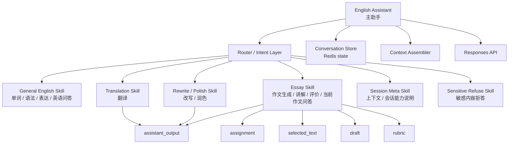
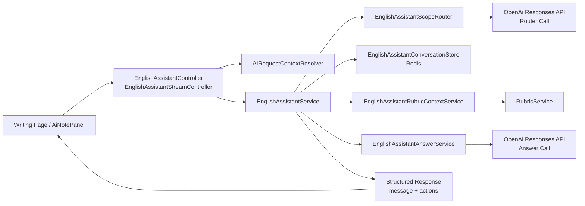
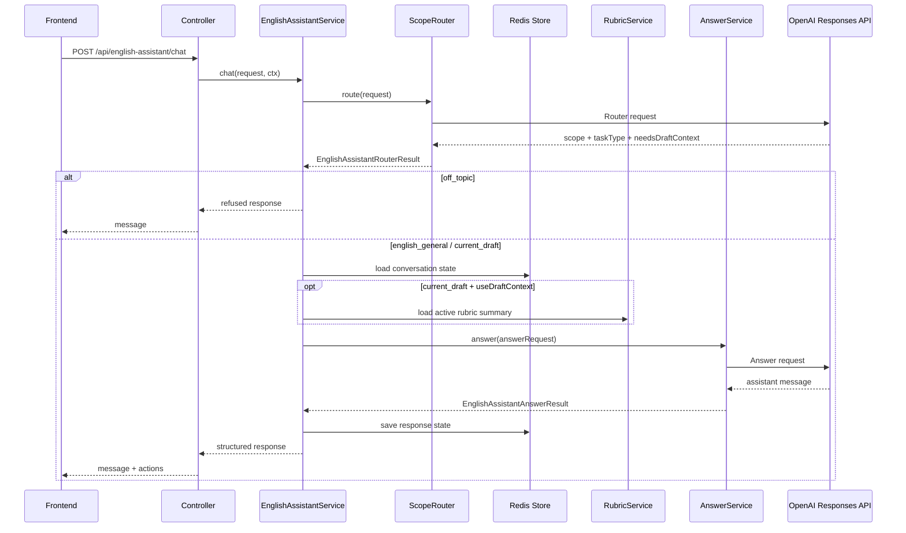
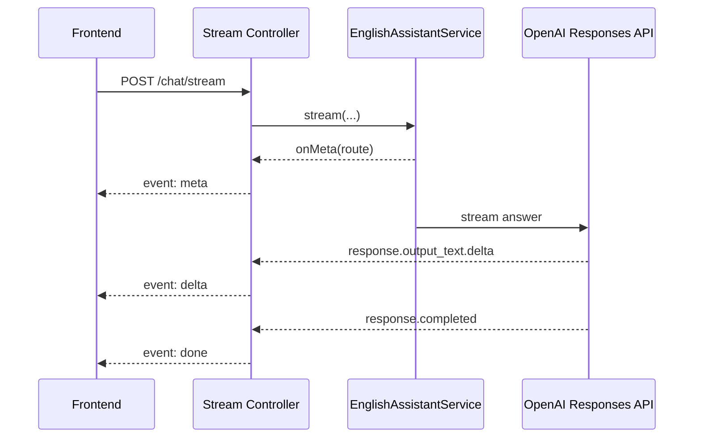
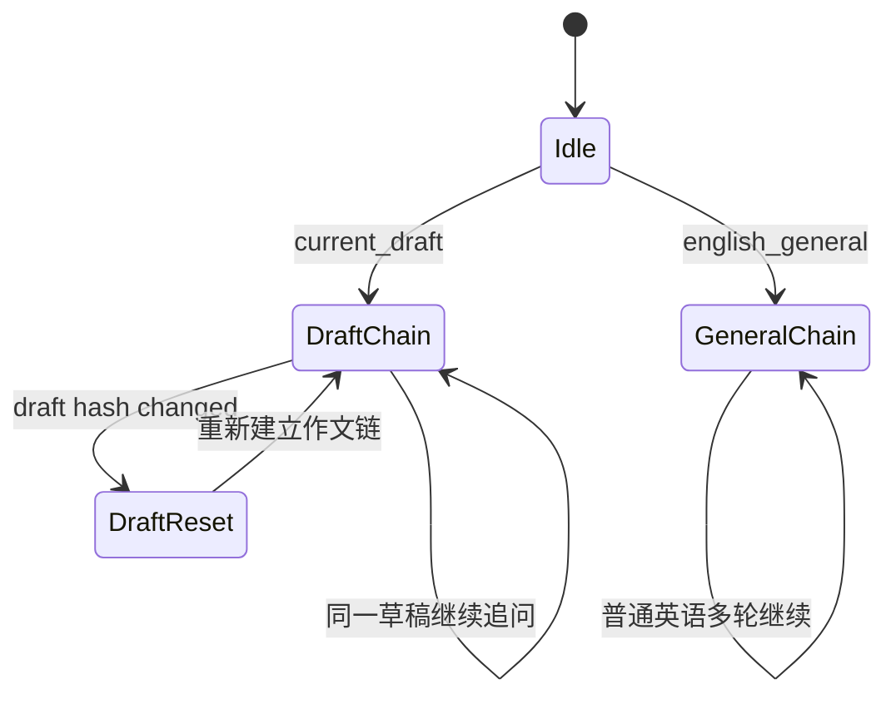
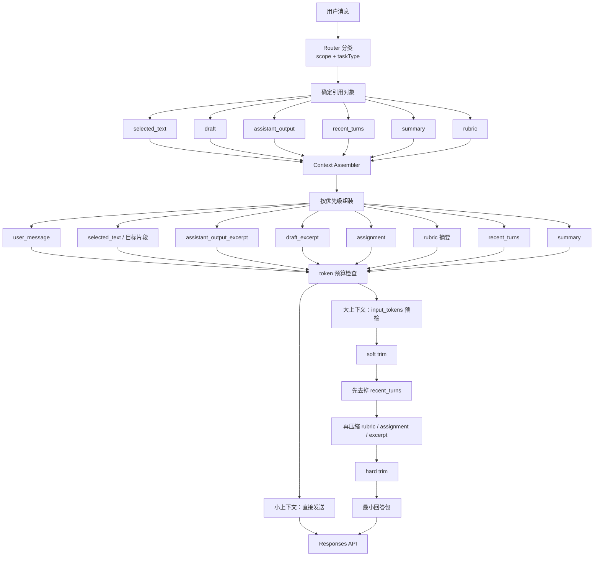

# 英语助手总览

## 1. 定位

当前英语助手是站内专用能力，不是通用 Agent，也不对外提供开放聊天服务。

它的边界很明确：

- 只服务当前网页内的英语学习与英语写作场景
- 只回答英语相关问题、翻译改写润色问题、当前作文相关问题
- 允许处理少量会话元问题，以及继续操作上一轮助手刚生成的内容
- 政治、色情、暴力、违法、极端等敏感高风险话题拒答
- 写作场景下可按需引用当前作文上下文
- 非写作场景不注入作文内容

当前模型固定为 `gpt-4o`，底层调用 OpenAI 官方 `Responses API`。

## 1.1 技术栈与关键技术

当前英语助手不是单一 Prompt 调用，而是一套前后端配合的运行时。

后端技术与基础设施：

- `Spring Boot`
- `Redis`
- `WebClient + Reactor Netty`
- `Jackson`
- OpenAI `Responses API`

前端接入与交互技术：

- `Vue 3`
- 写作页 `EditorShell / RightPanel / AiNotePanel`
- `SSE` 流式消费

OpenAI 侧实际用到的能力：

- `Responses API`
- `previous_response_id`
- `store`
- `stream`
- `Structured Outputs`
- `prompt_cache_key`
- `/v1/responses/input_tokens`
- `truncation: auto`

助手内部的关键实现对象：

- `EnglishAssistantController / EnglishAssistantStreamController`
- `EnglishAssistantService`
- `EnglishAssistantScopeRouter`
- `EnglishAssistantAnswerService`
- `EnglishAssistantConversationStore`
- `EnglishAssistantContextAssembler`
- `EnglishAssistantSummaryService`
- `EnglishAssistantRubricContextService`

## 1.2 当前实现形态

从形态上看，当前系统不是“通用 AI Agent”，而是：

- 一个站内专用的英语助手运行时
- 一个带 Router 的领域助手
- 一个带 Redis 会话状态、上下文裁剪、流式输出和动作协议的受控 AI 服务

因此它的重点不是“让模型自由发挥”，而是：

- 用后端控制边界
- 用状态层维持连续性
- 用上下文组装控制成本
- 用结构化输出降低前端猜测成本

同时，当前产品更适合理解为“**主助手 + 多 skill 域**”，而不是“整个系统只等于写作 Agent”。

这里的含义是：

- `English Assistant` 是主入口
- Router 负责决定当前请求应该进入哪个 skill 域
- 写作能力是主助手下面的一个核心 skill，而不是整个系统的唯一形态
- 各个 skill 共享同一套会话状态、上下文组装和模型调用能力

## 2. 当前功能

### 2.1 英语通用问答

当用户提问属于英语学习但不依赖当前作文时，助手会走 `english_general` 链路，例如：

- 单词辨析
- 语法解释
- 句型说明
- 翻译问答
- 英语写作方法建议

这类问题不会携带当前作文草稿。

### 2.2 当前作文问答

当用户的问题明确围绕当前作文、当前句子、当前段落时，助手会走 `current_draft` 链路，例如：

- “这句为什么别扭”
- “帮我改一下第二段”
- “这一段逻辑有什么问题”
- “这句翻译成英文更自然怎么写”

这类问题可按需注入：

- `assignmentText`
- `selectedText`
- `draftText`

如果识别出需要作文上下文，但前端没开启“引用作文”，后端会直接返回提示，不会硬答。

### 2.3 非英语问题拒答

当 Router 判定为 `off_topic` 时，助手会礼貌收口并把用户引回英语场景；当判定为 `sensitive_refuse` 时，会直接拒绝政治、色情等敏感高风险内容。

### 2.4 上一轮生成内容的继续操作

当前助手不再只认识编辑器里的作文，也能继续处理聊天里刚生成的内容，例如：

- “翻译一下最后一段”
- “把刚才那篇改得更正式”
- “解释一下上面这篇范文的结尾”

这类问题会走 `assistant_output` 链路，后端会从 Redis 会话状态里的 artifact 指针取出最近可复用产物作为引用对象，而不是简单依赖当前链头响应。

### 2.5 任务类型识别

当前支持的任务类型：

- `ask`
- `explain`
- `rewrite`
- `polish`
- `translate`
- `evaluate`
- `generate`

这些任务类型由 Router 先分类，主回答器再按任务风格生成回答。

### 2.6 可应用动作

当前前端不再从正文里“猜”动作，而是消费结构化 `actions[]`。

目前已经接通的动作类型主要有：

- `apply_rewrite`
- `insert_translation`

对应场景：

- `rewrite` 输出可直接应用改写
- `polish` 输出可直接应用润色
- `translate` 输出可直接插入翻译

### 2.7 流式对话

当前写作页助手主链路使用 SSE 流式接口：

- `POST /api/english-assistant/chat/stream`

前端可感知的状态包括：

- thinking
- streaming
- completed
- failed

同时支持：

- 中途停止生成
- 清空会话
- 流式失败后自动回退到非流式 `chat`

### 2.8 会话连续性

助手支持多轮对话，不是每次都完全无状态。

当前会话状态按 `conversationId` 存在 Redis，并拆成两条链：

- 普通英语问答链
- 当前作文问答链

这样可以避免：

- 一般英语答疑污染作文上下文
- 旧作文上下文污染新稿

同时，一期已经补上“成本优先”的上下文策略：

- Router 继续只吃轻量摘要，不吃原始历史
- 主回答器只保留每条链最近少量真实 user turns
- 有 `selectedText` 时优先只注入选中片段
- `assistant_output` 优先只注入局部片段，而不是整篇刚生成内容
- 超长场景先 deterministic trimming，晚触发 summary

### 2.9 动态 Rubric 注入

在 `current_draft` 且 `useDraftContext=true` 时，助手会根据当前请求里的：

- `studyStage`
- `writingMode`

动态读取当前 active rubric，并注入一份“压缩版 rubric 摘要”。

这意味着：

- `postgrad + exam` 会命中硕士考试 rubric
- `highschool + free` 会命中对应学段与模式的 active rubric
- 如果当前组合没有 active rubric，就跳过，不会错用别的标准

## 3. 整体架构

当前助手采用 4 层结构：

1. Chat Controller
2. Scope Router
3. Answer Service
4. Conversation Store

## 3. 技术实现逻辑

当前英语助手的实现逻辑可以概括为 8 步：

1. 前端发起 `/api/english-assistant/chat` 或 `/chat/stream`
2. Controller 解析登录态、用户信息和请求上下文
3. Service 先从 Redis 读取 `conversationId` 对应的会话状态
4. Router 调用 OpenAI `Responses API`，返回结构化 `scope + taskType`
5. Service 根据 Router 结果决定：
   - 是否拒答
   - 是否使用 draft
   - 是否使用 assistant output
   - 是否需要注入 rubric
6. `EnglishAssistantContextAssembler` 统一组装上下文，并做局部裁剪、recent turns 控制和 token 预算处理
7. Answer Service 再调用 OpenAI `Responses API` 生成最终回答
8. Service 把 `responseId / recent turns / artifact / summary` 回写 Redis，并把结构化结果返回前端

这条链路的核心不是“把所有信息直接发给模型”，而是：

- 先路由
- 再组装上下文
- 再回答
- 最后持久化状态

## 4. 输入设计逻辑

当前模型请求不是一股脑把所有上下文都塞进去，而是分成两种输入设计。

### 4.1 Router Input

Router 的输入是轻量摘要，不带整篇作文和完整历史。它只包含：

- `message`
- `useDraftContext`
- `hasAssignmentText`
- `hasSelectedText`
- `hasDraftText`
- `hasAssistantOutput`
- `preferredAction`

它的目标不是回答，而是稳定分类。

### 4.2 Answer Input

Answer 的输入是后端组装后的分段文本，而不是随意拼接聊天历史。主要结构包括：

- `task_type`
- `scope`
- `useDraftContext`
- `trimmed_context_mode`
- `rubric_key`
- `<rubric>`
- `<assignment>`
- `<selected_text>`
- `<draft_excerpt>`
- `<assistant_output_excerpt>`
- `<recent_turns>`
- `
`
- `<user_message>`

这种设计的价值是：

- Router 和 Answer 职责分离
- 输入前缀更稳定，利于 prompt cache
- 后端能显式控制“这轮到底引用的是什么对象”

## 5. 上下文对象设计

当前助手已经不再只认识“当前 draft”，而是把上下文拆成几个正式对象：

- `assignment`
- `selected_text`
- `draft`
- `assistant_output`
- `recent_turns`
- `summary`
- `rubric`

其中最关键的是：

- `draft` 代表编辑器里的当前作文
- `assistant_output` 代表上一轮或最近一轮可继续处理的助手产物

这也是为什么现在系统可以支持：

- “这句为什么别扭”
- “这篇作文有多少字”
- “翻译一下最后一段”
- “把刚才那篇改得更正式”

这些请求虽然都像“继续上一轮”，但实际引用的对象并不相同。

## 6. 请求处理逻辑

### 4.1 非流式链路

### 4.2 流式链路

## 7. Router 逻辑

Router 只做分类，不直接回答。

输出字段：

- `scope`
- `taskType`
- `needsDraftContext`
- `refusalReason`

分类结果：

- `english_general`
- `current_draft`
- `off_topic`

当前 Router 的意义不是“更聪明”，而是把整个助手拆成两步：

1. 先判断这是不是英语问题、是不是作文问题
2. 再决定要不要注入作文、要不要继续进入主回答器

这样做的价值：

- 拒答边界更稳定
- 上下文注入更可控
- 不需要把所有规则都堆进一次大 Prompt

当前 Router 不是完全无状态的单轮分类器：

- 它会尽量复用已有会话链的 `previous_response_id`
- 因此像“请提供作文主题”后的续句补充，不再只能依赖当前这一句文本

同时系统仍保留极少量兜底规则，但只处理明显不该交给模型猜的场景：

- 开启作文上下文时的强指代消息，例如 `这篇作文`、`这句`、`这段`、`上文`、`字数`
- 这类消息即使 Router 偶发误分，也会被纠正回 `current_draft`

当前 scope 实际分为 6 类：

- `english_general`
- `current_draft`
- `assistant_output`
- `session_meta`
- `sensitive_refuse`
- `off_topic`

其中：

- `assistant_output` 处理对上一轮助手生成内容的继续操作
- `session_meta` 处理会话元问题，例如“你能记住我的上下文吗”
- `sensitive_refuse` 只处理政治、色情和其他敏感高风险话题
- `off_topic` 仍保留给普通无关问题，例如数学或泛常识

## 8. Answer 逻辑

主回答器负责真正输出内容。

当前规则：

- `english_general` 不注入作文
- `current_draft` 只在 `useDraftContext=true` 时注入作文
- 有 `selectedText` 时优先围绕选中内容
- `rewrite / polish / translate` 尽量直接输出最终可应用文本
- `ask / explain / evaluate / generate` 走自然问答风格

输入结构大致包含：

- `task_type`
- `scope`
- `useDraftContext`
- `trimmed_context_mode`
- `rubric_key`
- `<rubric>`
- `<assignment>`
- `<selected_text>`
- `<draft_excerpt>`
- `<assistant_output_excerpt>`
- `<recent_turns>`
- `
`
- `<user_message>`

这使得模型既能像 GPT 一样自然回答，又能被后端约束在站内英语场景里。

## 9. 上下文与会话状态

### 7.1 双会话链

当前后端不是只存一个 `last_response_id`，而是拆成：

- `generalLastResponseId`
- `draftLastResponseId`
- `lastDraftHash`
- `generalLastAssistantOutput`
- `draftLastAssistantOutput`
- `generalRecentTurns`
- `draftRecentTurns`
- `generalSummary`
- `draftSummary`
- `generalTurnCount / draftTurnCount`
- `generalSoftOverflowCount / draftSoftOverflowCount`

### 7.2 为什么要拆两条链

如果只有一条链，会出现两个问题：

- 用户刚问完单词辨析，再问作文改写，普通答疑历史会污染作文回答
- 用户改了整篇作文，旧稿上下文还会继续影响新稿

双链 + `lastDraftHash` 的目标就是把这两个问题压住。

同时，最近一轮助手输出文本也会一起持久化，所以“上一轮刚生成了一篇范文，下一轮要翻译最后一段”这种链路不再强依赖编辑器草稿。

为避免引用错对象，当前状态层还会显式保存“最近可复用产物”指针：

- `lastArtifactChain`
- `lastArtifactResponseId`
- `lastArtifactText`
- `lastArtifactTaskType`

只有真正适合继续操作的输出，例如范文生成、改写、润色、翻译结果，才会更新这组字段；普通拒答、会话元回答不会冒充 artifact。若 draft 链因换稿被清空，属于 draft 的 artifact 指针也会同步清掉，避免新稿误引用旧稿生成内容。

### 7.3 一期上下文策略

当前不是把所有上下文无差别塞回模型，而是按优先级组装：

1. `user_message`
2. 显式引用目标，例如 `selected_text`
3. `assistant_output` 的局部片段
4. `draft` 的局部片段
5. `assignment`
6. `rubric` 摘要
7. `recent_turns`
8. `summary`

当前 recent turns 策略：

- `english_general / session_meta`：最多保留最近 4 个真实 user turns
- `assistant_output`：消费最近 2 个真实 user turns
- `current_draft`：消费最近 1 个真实 user turn

这里的“真实 user turn”指一条用户消息及其后对应的 assistant 可见输出。

超长处理策略：

- 动态上下文较大或重上下文组合出现时，后端会更早调用 `/v1/responses/input_tokens` 做精确 token 预检
- 软上限约 2800 input tokens，超出后先裁 recent turns，再缩 rubric、assignment 和 excerpt
- 硬上限约 3600 input tokens，退化到最小回答包
- 主回答请求带 `truncation: auto`，作为预算估算失误时的最后兜底

summary 不是默认主路径，只在这些场景晚触发：

- 同一链累计超过 8 个真实 user turns
- 或连续 2 次组装后仍超过软上限

summary 只为 `general / draft` 两条链服务，`assistant_output` 不走 summary。

### 7.4 上下文压缩与组装逻辑

当前还不是“完整长期记忆压缩系统”，而是**面向当前任务的上下文裁剪系统**。核心思路是：

1. 先判断这轮应该引用哪个对象
2. 再从对象里抽取局部片段
3. 再补少量 recent turns / summary
4. 最后按 token 预算做裁剪

这套机制解决的是：

- 不把整篇 `draft` 或整段历史无差别塞给模型
- 让 `selected_text / draft / assistant_output` 成为清晰的上下文对象
- 在不引入高成本长记忆系统的前提下，先把当前轮回答做准、做稳、做省

## 10. Rubric 注入逻辑

动态 rubric 不会在所有场景都注入，只有满足以下条件才会触发：

- Router 结果为 `current_draft`
- `useDraftContext=true`
- 请求里带有 `studyStage + writingMode`
- 当前组合能找到 active rubric

注入的不是全量 rubric 文件，而是 assistant 专用压缩摘要，主要包含：

- `rubric_key`
- 维度定义
- 关键任务锚点
- 降档规则

这样做的原因：

- 保持评分口径一致
- 降低 token 消耗
- 避免把完整 rubric 全量灌进每次请求

## 11. 前端交互逻辑

前端写作页目前通过 `EditorShell -> RightPanel -> AiNotePanel` 消费英语助手。

当前已接好的体验包括：

- 发送消息
- 选择是否引用作文
- 自动附带 `studyStage + writingMode`
- 实时展示流式文本
- 生成中可停止
- 清空对话
- 根据 `actions[]` 执行“应用改写/插入翻译”

前端收到的 SSE 事件类型：

- `meta`
- `delta`
- `done`
- `error`

## 12. 当前做过的优化

### 10.1 边界优化

- 从“泛化 AI 助手”收口为“站内英语助手”
- 增加 Router，把 off-topic 直接挡在主回答器之前
- 避免模型随意回答数学、政治、编程等问题

### 10.2 上下文优化

- 普通英语问答和作文问答拆成两条会话链
- 加入 `draft hash`，草稿变化大时自动重开作文链
- 只在需要时注入作文内容，不默认塞全文
- 把“上一轮助手输出”建模成正式上下文对象，不再只认编辑器 draft
- recent turns 只保留小窗口，不默认回放整段历史
- `selectedText / paragraph excerpt / assistant_output excerpt` 优先于整篇文本
- 超长场景先 deterministic trimming，再晚触发 summary

### 10.3 输出协议优化

- 前端不再从正文猜测动作
- 后端直接返回 `actions[]`
- `rewrite / polish / translate` 已支持结构化动作消费

### 10.4 流式体验优化

- 使用 SSE 输出 `meta / delta / done / error`
- 前端可展示 thinking / streaming / completed / failed
- 流式失败时可回退到非流式接口

### 10.5 成本优化

- 模型统一固定为 `gpt-4o`
- Router 和 Answer 使用独立 `prompt_cache_key`
- 固定规则前置，便于命中 OpenAI Prompt Caching
- Rubric 使用压缩摘要，而不是全量文本
- `/responses/input_tokens` 只在大上下文场景下按需调用，不在每轮都额外计费探测
- Summary 不做默认每轮生成，避免引入额外 summarizer 成本

### 10.6 稳定性优化

- Router 使用 Structured Outputs，减少分类结构漂移
- 严格处理 schema 必填字段
- 记录 `input_tokens` 与 `cached_tokens`
- 保留 traceId、失败日志和 fallback 路径

### 10.7 UI 稳定性优化

- 修复“相同回复文本不渲染新气泡”的前端问题
- 最终显示文本与流式文本分离处理，减少前端状态错乱

## 13. 当前助手的能力水平

如果从工程成熟度看，当前英语助手已经不是“单次文本补全”，而是一个有边界、有上下文控制、有会话状态、有结构化动作输出的站内 AI 能力。

但它仍然是一期产品，不应被高估成通用智能体。

### 已经具备的能力

- 英语领域限定
- 作文上下文问答
- 多轮对话连续性
- 动态 rubric 对齐
- 前端流式交互
- 基础动作闭环

### 还没有做的能力

- 通用 tool calling 编排
- 外部知识检索
- 向量检索 / RAG
- 用户能力画像动态注入
- 更细粒度的作文段落裁剪与 token 预算调度
- 更复杂的动作系统，例如直接保存到编辑器服务端

## 14. 当前已知边界与风险

### 12.1 不是评分器本体

它可以参考 rubric 回答，但它不是正式评分主链路本身。正式评分仍然应以既有评分系统为准。

### 12.2 Router 仍依赖模型分类

虽然已经比“全靠一个大 Prompt”稳定，但它本质上仍是模型路由，不是硬编码分类器。极端边界输入仍可能误分。

### 12.3 前端动作仍偏少

当前动作闭环主要覆盖：

- 改写
- 润色
- 翻译

更复杂的“保存到草稿某位置”“跨段替换”“后台持久化应用”还没进入一期。

### 12.4 成本仍需持续观察

虽然已经做了缓存和压缩，但作文上下文、rubric 摘要、多轮历史叠加后，token 成本仍然需要持续监控。

## 13. 后续可演进方向

推荐优先级如下：

1. 做 token 观测面板，持续看 `input_tokens / cached_tokens / 平均响应时长`
2. 做更细粒度的作文上下文裁剪，不总是注入整份 draft
3. 接入真正有业务价值的 tool，例如 `save_revision_to_editor`
4. 接入学生画像，但保持“可选注入”而不是每轮必传
5. 在高频固定场景里补少量范例，进一步稳定输出风格

## 14. 相关文档

- 接口细节见 [English Assistant API](english-assistant-api.md)
- Rubric 相关文档见 `docs/scoring-rules/*`
