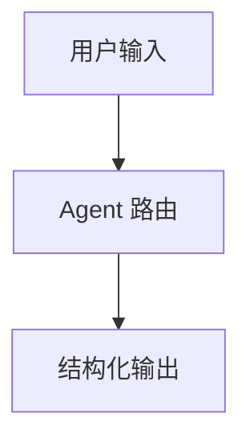

# Markdown 常用语法

Markdown 是一种轻量级文档语法。它的目标是让文档既容易阅读，也容易转换成网页、PDF 或其他格式。

本项目的 `docs/` 使用 VitePress，普通 Markdown 语法基本都支持，同时也支持 Mermaid 图和 YAML frontmatter。

## 1. 文档头信息

`docs/` 下的主文档需要在开头写 frontmatter，用来描述标题、状态、负责人和关联资料。

```markdown
---
title: 文档标题
status: draft
owner: project
last_updated: 2026-05-21
review_cycle: monthly
related_code: []
related_docs: []
---
```

常用字段：

| 字段 | 含义 | 示例 |
| --- | --- | --- |
| `title` | 文档标题 | `Markdown 常用语法` |
| `status` | 文档状态 | `draft`、`active` |
| `owner` | 负责人或模块 | `project`、`ai`、`backend` |
| `last_updated` | 最后更新时间 | `2026-05-21` |
| `related_code` | 相关代码路径 | `python/ai_orchestrator/` |
| `related_docs` | 相关文档路径 | `docs/agent/index.md` |

## 2. 标题

标题用 `#` 表示，`#` 越多，层级越低。

```markdown
# 一级标题

## 二级标题

### 三级标题
```

建议：

- 一篇文档只使用一个一级标题。
- 主要章节用二级标题。
- 不要跳级，例如从 `##` 直接跳到 `####`。

## 3. 段落和换行

普通文本直接写就是段落。

```markdown
这是第一段。

这是第二段。
```

如果只是换行但不空一行，很多 Markdown 渲染器会把它当成同一段。

```markdown
第一行
第二行
```

显示时可能是：

```text
第一行 第二行
```

如果确实需要强制换行，可以在行尾加两个空格，但文档里更推荐用空行分段。

## 4. 加粗、斜体和删除线

```markdown
**加粗**

*斜体*

~~删除线~~
```

效果：

- **加粗**
- *斜体*
- ~~删除线~~

项目文档里最常用的是加粗，用来强调关键概念。

## 5. 无序列表

使用 `-` 写列表。

```markdown
- 第一项
- 第二项
- 第三项
```

效果：

- 第一项
- 第二项
- 第三项

建议列表项保持同一种风格：要么都是短语，要么都是完整句子。

## 6. 有序列表

使用数字加英文句点。

```markdown
1. 第一步
2. 第二步
3. 第三步
```

效果：

1. 第一步
2. 第二步
3. 第三步

如果顺序很重要，用有序列表；如果顺序不重要，用无序列表。

## 7. 任务列表

任务列表适合写检查项。

```markdown
- [x] 已完成
- [ ] 未完成
```

效果：

- [x] 已完成
- [ ] 未完成

注意：项目里的正式任务拆解通常放在 `tasks/`，不要把临时执行清单塞进主文档。

## 8. 行内代码

用反引号包住短代码、路径、命令、字段名。

```markdown
使用 `npm run build` 构建文档站。
```

效果：

使用 `npm run build` 构建文档站。

常见用法：

- 文件路径：`docs/.vitepress/config.ts`
- 命令：`npm run build`
- 字段名：`intent`
- 类型名：`RoutingDecision`

## 9. 代码块

代码块使用三个反引号，并建议写语言名。

````markdown
```python
from pydantic import BaseModel

class User(BaseModel):
    name: str
```
````

效果：

```python
from pydantic import BaseModel

class User(BaseModel):
    name: str
```

常用语言名：

| 语言 | 写法 |
| --- | --- |
| Python | ```` ```python ```` |
| Java | ```` ```java ```` |
| TypeScript | ```` ```ts ```` |
| JSON | ```` ```json ```` |
| PowerShell | ```` ```powershell ```` |
| Mermaid | ```` ```mermaid ```` |

## 10. 引用

引用用 `>`。

```markdown
> 这是一段引用。
```

效果：

> 这是一段引用。

适合引用原则、结论、注意事项。

## 11. 链接

链接格式：

```markdown
[显示文本](链接地址)
```

示例：

```markdown
[Agent 设计总览](../agent/index.md)
```

效果：

[Agent 设计总览](../agent/index.md)

项目文档中建议使用相对路径链接，方便 VitePress 构建和迁移。

## 12. 图片

图片格式比链接多一个感叹号：

```markdown

```

说明：

- `图片说明` 会作为 alt 文本。
- 路径要确认真实存在。
- 不要把大体积临时截图随意放进主文档目录。

## 13. 表格

表格适合整理字段、对比、清单。

```markdown
| 字段 | 类型 | 说明 |
| --- | --- | --- |
| intent | string | 用户意图 |
| confidence | number | 置信度 |
```

效果：

| 字段 | 类型 | 说明 |
| --- | --- | --- |
| intent | string | 用户意图 |
| confidence | number | 置信度 |

建议：

- 表头要短。
- 一格里不要塞太长段落。
- 如果内容很长，改用小节或列表。

## 14. 分割线

三个或更多 `-` 可以生成分割线。

```markdown
---
```

效果：

---

注意：文档开头的 frontmatter 也使用 `---`。不要把正文分割线误放到 frontmatter 未闭合的位置。

## 15. 转义字符

如果你想显示 Markdown 符号本身，可以用反斜杠转义。

```markdown
\*这不是斜体\*
```

效果：

\*这不是斜体\*

常见需要转义的字符：

```text
\*
\_
\#
\[
\]
\`
```

## 16. Mermaid 图

VitePress 支持 Mermaid，可以用来画流程图。

````markdown

````

效果：


建议：

- 节点文字如果包含中文、括号或标点，使用引号包起来。
- 图不要太复杂，复杂系统拆成多个图。

## 17. 相对路径写法

常见路径：

| 场景 | 示例 |
| --- | --- |
| 链接同目录文档 | `[学习资料](./index.md)` |
| 链接上级目录 | `[Agent](../agent/index.md)` |
| 链接子目录 | `[评分规则](../ai/scoring-rules/)` |
| 链接仓库代码 | `../../python/ai_orchestrator/` |

VitePress 中链接文档时，可以保留 `.md`，也可以省略。项目里两种都有，新增文档优先保持当前目录已有风格。

## 18. 常用写法模板

### 学习笔记模板

```markdown
---
title: 学习主题
status: draft
owner: project
last_updated: 2026-05-21
review_cycle: monthly
related_code: []
related_docs: []
---

# 学习主题

## 当前结论

一句话说明这个知识点解决什么问题。

## 核心概念

| 概念 | 说明 |
| --- | --- |
| 示例 | 示例说明 |

## 示例

```text
示例内容
```

## 常见问题

- 问题 1：
- 问题 2：
```

### 接口字段说明模板

```markdown
| 字段 | 类型 | 必填 | 说明 |
| --- | --- | --- | --- |
| id | string | 是 | 唯一标识 |
| name | string | 是 | 名称 |
```

### 对比说明模板

```markdown
| 维度 | 方案 A | 方案 B |
| --- | --- | --- |
| 优点 | 简单 | 稳定 |
| 缺点 | 可扩展性弱 | 实现成本高 |
```

## 19. 本项目文档写作建议

- 文档默认用中文。
- 代码、路径、命令、字段名使用行内代码。
- 新增主文档要写 frontmatter。
- 新增当前有效文档后，检查是否要更新 `docs/.vitepress/config.ts`。
- 修改文档后运行：

```powershell
cd docs
npm run build
```

## 20. 常见错误

| 错误 | 问题 | 正确做法 |
| --- | --- | --- |
| 忘记 frontmatter | 文档元信息不完整 | 按模板补齐 |
| 链接路径写错 | VitePress 构建可能失败 | 使用相对路径并构建验证 |
| 表格内容太长 | 可读性差 | 改成列表或小节 |
| 代码块没闭合 | 后续页面渲染异常 | 检查反引号数量 |
| 标题跳级 | 目录结构混乱 | 按层级递进 |

## 练习

你可以新建一个草稿文档，练习下面内容：

1. 写 frontmatter。
2. 写一级标题和两个二级标题。
3. 写一个无序列表。
4. 写一个表格。
5. 写一个 Python 代码块。
6. 写一个 Mermaid 流程图。
7. 运行 `npm run build` 检查文档站是否正常。
