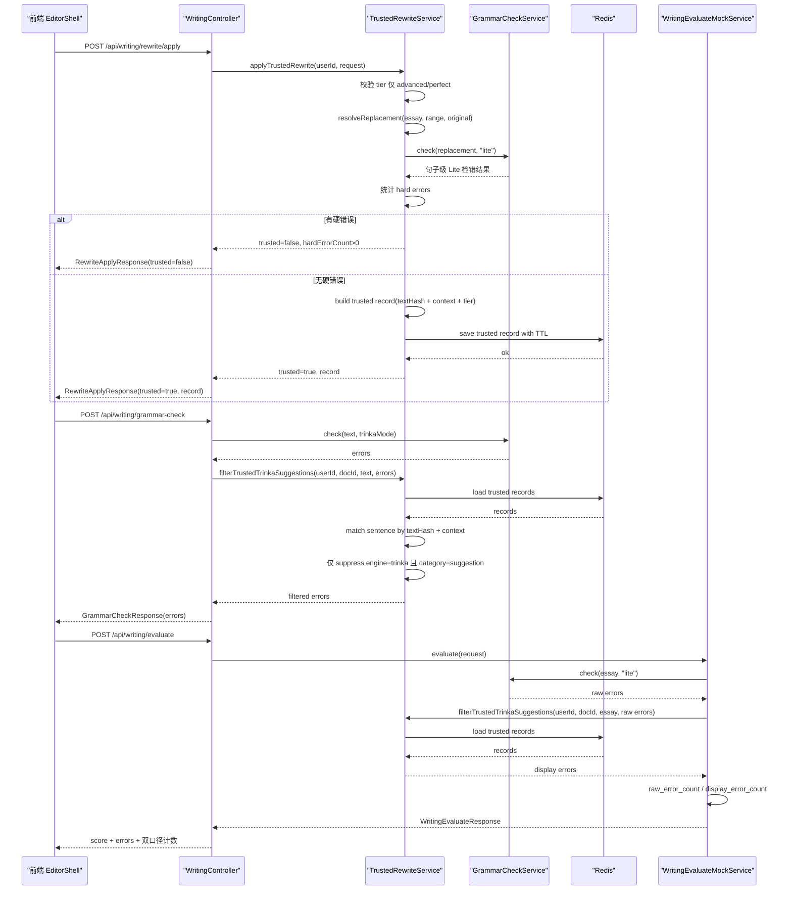

# 润色后 Trinka 重复检错问题记录

## 背景

写作页在接入 `RewritePanel` 的高档润色后，出现了一个明显体验问题：

- 用户在 `advanced / perfect` 档位应用 AI 润色后
- 右侧 `GrammarCheckPanel` 仍会对这些高档润色句子继续做 Trinka 检错
- 其中大量命中属于表达优化或风格增强，而不是硬性基础错误

这会导致用户感知为：

- 系统一边推荐“进阶表达/满分冲刺”
- 一边又立即把 AI 自己改过的句子标成问题

同时，如果只改右侧语法面板、不改评分链路，又会出现：

- 右侧语法检查和提交评分后的错误数量不一致

## 本次任务目标

本次需求的目标是收紧这条链路，解决“润色与 Trinka 互相打架”的问题，但不牺牲模考真实性，也不引入前端可伪造的刷分漏洞。

最终方案采用 `trusted rewrite v2`：

- `advanced / perfect` 替换后的句子才有机会进入 `trustedRewriteSegments`
- `basic / steady` 不进入 trusted
- trusted 不是“这句绝对正确”，而是“这句已通过基础校验，可 suppress Trinka 重复建议”
- 只 suppress `engine=trinka` 且 `category=suggestion` 的命中
- 不 suppress Trinka 的硬错误
- 不影响其他检错引擎
- 评分页保留双口径：
  - `display_error_count`
  - `raw_error_count`

## 已实现的核心机制

### 1. 可信应用链

用户在 `RewritePanel` 点击替换时：

- `basic / steady`：只做普通替换
- `advanced / perfect`：先走后端 `rewrite/apply`

后端会：

1. 解析替换位置和原句
2. 对替换后的句子跑一次 `Lite/basic`
3. 只有当该句 `0` 个硬错误时，才登记 trusted rewrite
4. 将 trusted rewrite 元数据存入 Redis

### 2. trusted 过滤边界

trusted rewrite 只用于 suppress：

- `engine=trinka`
- `category=suggestion`
- 且命中完全落在 trusted 句子边界内

不会 suppress：

- Trinka 硬错误
- LanguageTool / Sapling / TextGears 等其他来源错误

### 3. 评分双口径

评分链路中：

- `raw_error_count`：保留原始错误统计
- `display_error_count`：尊重 trusted rewrite 过滤后的展示口径

这样既能保证辅导体验，也保留模考真实性和审计能力。

## 前端状态流图

```mermaid
flowchart LR
  A["用户在 RewritePanel 点击替换"] --> B["RewritePanel emit replace-sentence(tier, original, replacement, range)"]
  B --> C["EditorShell.onReplaceSentence"]

  C --> D{"tier 是否 advanced/perfect"}
  D -->|"否"| E["直接替换编辑器文本"]
  D -->|"是"| F{"是否有 docId"}
  F -->|"否"| E
  F -->|"是"| G["调用 rewriteApply(docId, essay, tier, start, end, original, replacement)"]

  G --> H{"trusted = true"}
  H -->|"否"| E
  H -->|"是"| I["grammarStore.registerTrustedRewrite(record)"]
  I --> E

  E --> J["DocEditor 内容更新"]
  J --> K["grammarStore.scheduleGrammarCheck()"]

  K --> L["/api/writing/grammar-check"]
  L --> M["返回 errors"]
  M --> N["grammarStore.filterTrustedSuggestions(errors)"]
  N --> O["grammarPanelErrors / grammarPanelSuggestions"]
  N --> P["displayEditorErrors"]

  O --> Q["RightPanel -> GrammarCheckPanel"]
  P --> R["DocEditor 高亮渲染"]

  Q --> S["显示已隐藏重复建议提示"]
  S --> T["用户可点击 恢复检查"]
  T --> U["grammarStore.clearTrustedRewrites()"]

  U --> V["清本地 trusted 状态"]
  U --> W["调用 /api/writing/rewrite/trusted/clear"]

  X["页面刷新 / 同会话重进"] --> Y["grammarStore.restoreFromCache()"]
  Y --> Z["恢复 trustedRewriteSegments"]
  Z --> N

  AA["用户手动修改句子"] --> AB["grammarStore prune trusted 失配记录"]
  AB --> N
```

## 后端 trusted rewrite 服务时序图

## 当前设计取舍

### 解决了什么

- 高档润色后的句子不再被 Trinka 的重复建议反复打回
- 右侧语法面板与评分页的展示口径更一致
- trusted rewrite 不会变成“整句永久白名单”
- 后端不再直接信任前端裸传的 trusted spans

### 有意保留的约束

- 只对白名单档位生效：`advanced / perfect`
- 只豁免 Trinka suggestion，不豁免硬错误
- 只处理 `RewritePanel` 的句子替换链路
- 评分页保留 `raw_error_count`，避免彻底损失模考真实性

## 相关文档

- [grammar-check-feature.md](/F:/personalenglishai/docs/grammar-check-feature.md)
- [polish-feature-spec.md](/F:/personalenglishai/docs/polish-feature-spec.md)
