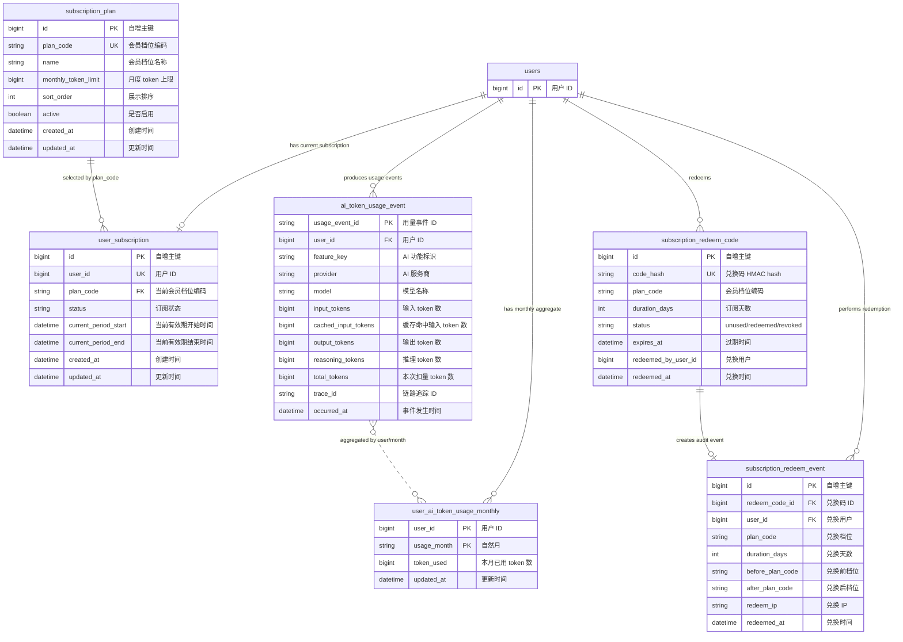
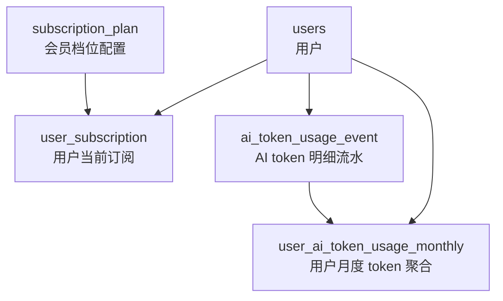
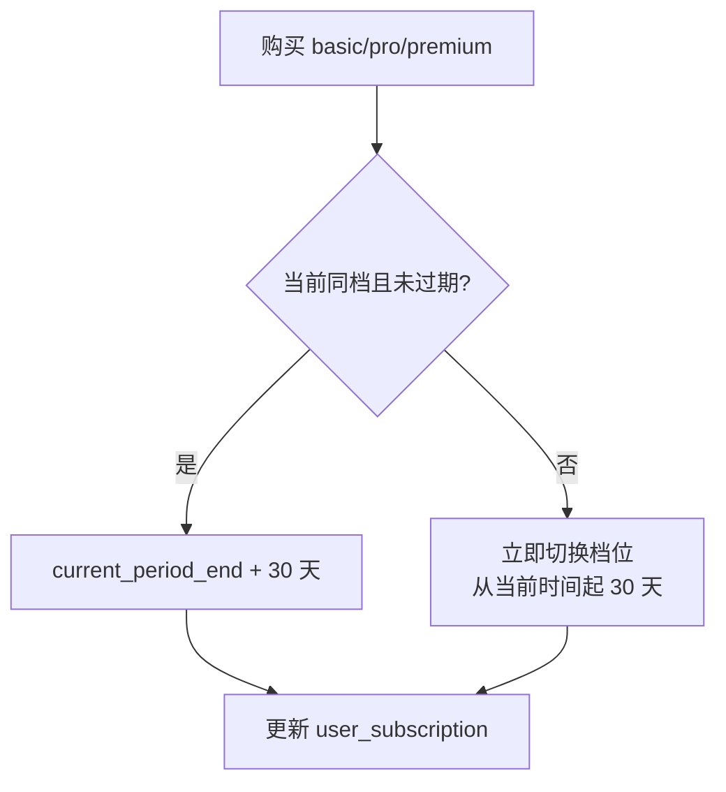
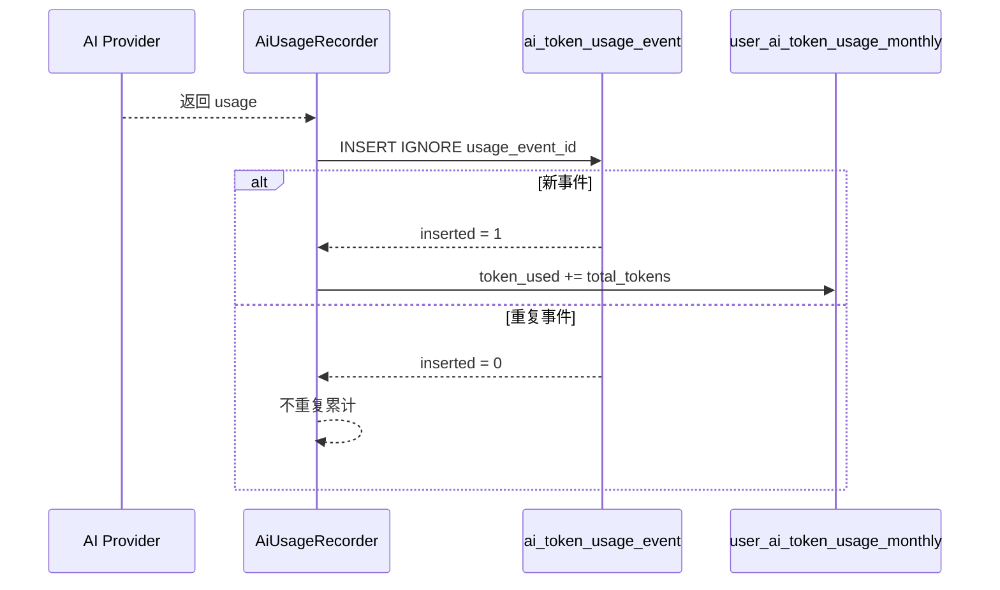
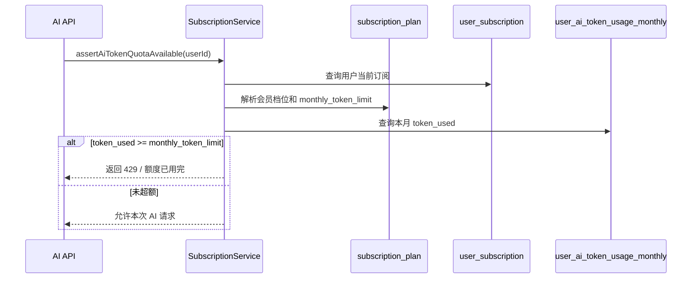
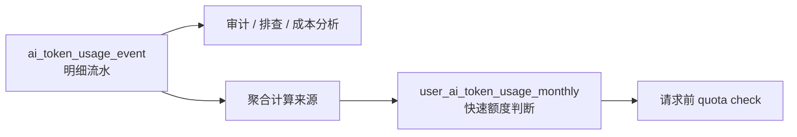

# 会员订阅数据表 ER 图与字段说明

## 1. ER 图



## 2. 表关系说明



- `subscription_plan` 是套餐配置表，定义 Free、Basic、Pro、Premium 的 token 上限。
- `user_subscription` 是用户当前订阅表，一个用户最多一条当前订阅记录。
- `subscription_redeem_code` 是会员码表，只保存兑换码 hash 和权益配置。
- `subscription_redeem_event` 是兑换流水表，便于审计谁在何时兑换了哪个权益。
- `ai_token_usage_event` 是 AI token 用量明细表，每一次可统计 usage 的 AI 调用写一条事件。
- `user_ai_token_usage_monthly` 是月度聚合表，用于快速判断用户本月是否已经超额。
- `users` 是已有用户表，本订阅模块通过 `user_id` 关联它。

## 3. subscription_plan：会员档位配置表

用途：保存会员套餐定义。第一版内置 4 档：`free`、`basic`、`pro`、`premium`。

| 字段 | 中文含义 | 类型 | 说明 |
| --- | --- | --- | --- |
| `id` | 自增主键 | `BIGINT` | 数据库内部主键。 |
| `plan_code` | 会员档位编码 | `VARCHAR(32)` | 业务唯一编码，例如 `free`、`basic`、`pro`、`premium`。 |
| `name` | 会员档位名称 | `VARCHAR(64)` | 展示名称，例如 `Free`、`Basic`、`Pro`、`Premium`。 |
| `monthly_token_limit` | 月度 token 上限 | `BIGINT` | 用户每个自然月可使用的 AI token 总额度。 |
| `sort_order` | 展示排序 | `INT` | 前端展示套餐时的排序值，数字越小越靠前。 |
| `active` | 是否启用 | `TINYINT(1)` | `1` 表示启用，`0` 表示停用。 |
| `created_at` | 创建时间 | `DATETIME` | 记录创建时间。 |
| `updated_at` | 更新时间 | `DATETIME` | 记录最后更新时间。 |

当前默认数据：

| planCode | 名称 | 月度 token 上限 |
| --- | --- | ---: |
| `free` | Free | 100,000 |
| `basic` | Basic | 1,000,000 |
| `pro` | Pro | 5,000,000 |
| `premium` | Premium | 20,000,000 |

## 4. user_subscription：用户当前订阅表

用途：保存用户当前会员档位和有效期。

| 字段 | 中文含义 | 类型 | 说明 |
| --- | --- | --- | --- |
| `id` | 自增主键 | `BIGINT` | 数据库内部主键。 |
| `user_id` | 用户 ID | `BIGINT` | 关联 `users.id`，一个用户最多一条当前订阅记录。 |
| `plan_code` | 当前会员档位编码 | `VARCHAR(32)` | 当前生效的套餐编码，关联 `subscription_plan.plan_code`。 |
| `status` | 订阅状态 | `VARCHAR(16)` | 当前使用 `active` 表示有效订阅。后续可扩展 `canceled`、`expired` 等状态。 |
| `current_period_start` | 当前有效期开始时间 | `DATETIME` | 当前订阅周期开始时间。 |
| `current_period_end` | 当前有效期结束时间 | `DATETIME` | 当前订阅周期结束时间。查询时过期则回落为 Free。 |
| `created_at` | 创建时间 | `DATETIME` | 记录创建时间。 |
| `updated_at` | 更新时间 | `DATETIME` | 记录最后更新时间。 |

模拟购买规则：



## 5. ai_token_usage_event：AI token 用量明细表

用途：保存每次 AI 调用的 token 明细流水，方便幂等、审计、排查和后续成本分析。

| 字段 | 中文含义 | 类型 | 说明 |
| --- | --- | --- | --- |
| `usage_event_id` | 用量事件 ID | `VARCHAR(96)` | 主键。用于幂等去重，重复上报不会重复扣量。 |
| `user_id` | 用户 ID | `BIGINT` | 关联 `users.id`，表示这次 AI 调用属于哪个用户。 |
| `feature_key` | AI 功能标识 | `VARCHAR(96)` | 标记来源功能，例如评分、润色、题单助手、AI command 等。 |
| `provider` | AI 服务商 | `VARCHAR(32)` | 例如 `openai`、`qwen`、`openai_agents`。 |
| `model` | 模型名称 | `VARCHAR(64)` | 实际调用的模型名称。 |
| `input_tokens` | 输入 token 数 | `BIGINT` | provider 返回的输入 token。 |
| `cached_input_tokens` | 缓存命中输入 token 数 | `BIGINT` | provider 返回的 cached input tokens，当前只保存，不单独折算扣量。 |
| `output_tokens` | 输出 token 数 | `BIGINT` | provider 返回的输出 token。 |
| `reasoning_tokens` | 推理 token 数 | `BIGINT` | provider 返回的 reasoning token。 |
| `total_tokens` | 本次扣量 token 数 | `BIGINT` | 当前口径为 `input + output + reasoning`。 |
| `trace_id` | 链路追踪 ID | `VARCHAR(96)` | 用于关联一次请求链路和日志。 |
| `occurred_at` | 事件发生时间 | `DATETIME` | 这条 token 事件的发生时间。 |

扣量口径：

```text
total_tokens = input_tokens + output_tokens + reasoning_tokens
```

如果 provider 没有拆分字段，才退回使用 provider 返回的 `total_tokens`。

## 6. user_ai_token_usage_monthly：用户月度 token 聚合表

用途：保存用户每个自然月的 token 累计值，AI 请求前通过它快速判断是否超额。

| 字段 | 中文含义 | 类型 | 说明 |
| --- | --- | --- | --- |
| `user_id` | 用户 ID | `BIGINT` | 关联 `users.id`。 |
| `usage_month` | 自然月 | `CHAR(7)` | 格式为 `YYYY-MM`，例如 `2026-04`。 |
| `token_used` | 本月已用 token 数 | `BIGINT` | 用户当月累计 AI token 使用量。 |
| `updated_at` | 更新时间 | `DATETIME` | 聚合记录最后更新时间。 |

主键：

```text
(user_id, usage_month)
```

表示同一个用户每个自然月只有一条聚合记录。

## 7. 写入与查询流程

### AI 调用完成后的写入流程



### AI 调用前的额度判断流程



## 8. 为什么同时需要明细表和聚合表



只用明细表的问题：

- 每次额度判断都要 `SUM(total_tokens)`，数据量大后查询成本高。
- 幂等、审计可以做，但实时拦截性能不稳定。

只用聚合表的问题：

- 无法追踪每次 AI 调用明细。
- 不能排查某一次异常扣量。
- 后续做模型成本分析、用户账单明细会缺数据。

因此当前设计采用“明细表 + 月度聚合表”的组合。
