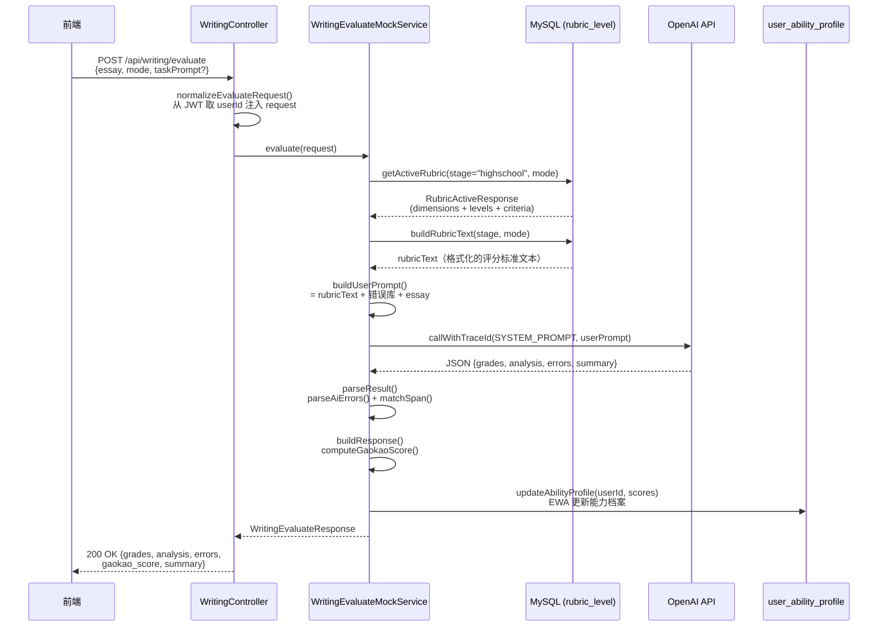
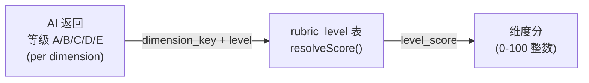
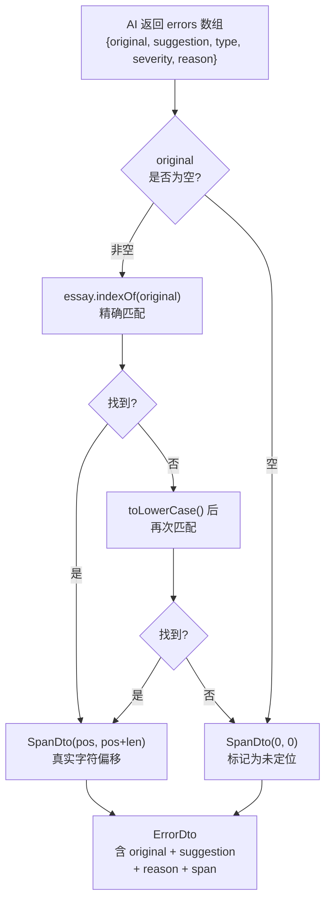
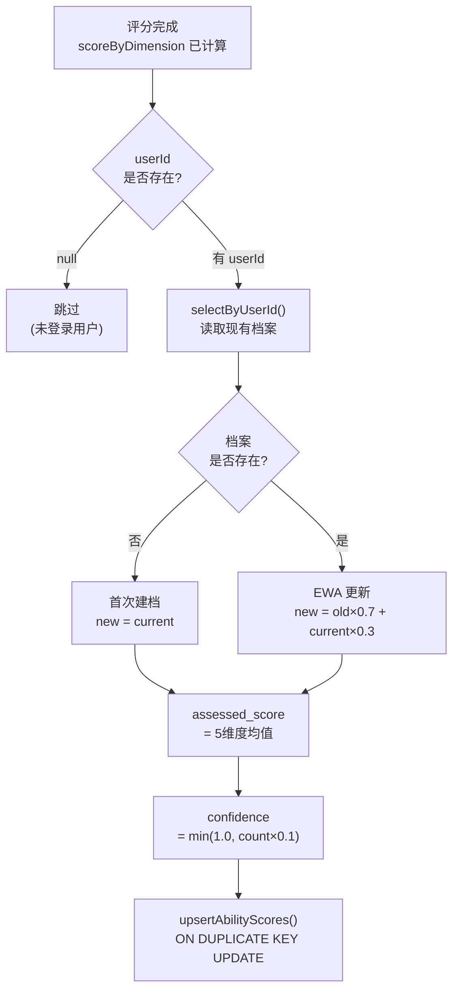

# 评分系统方法论文档

> 本文档说明评分系统的依据来源、计算方法和完整流程。
> 所有图表均基于实际代码绘制，非概念示意。

---

## 一、评分维度来源

### 1.1 维度划分依据

评分维度参考以下来源综合设计：

| 来源 | 说明 |
|------|------|
| **教育部高考英语写作评分原则** | 历年高考评分参考答案中反复出现的核心维度：内容、语言、结构 |
| **《高考试题分析》蓝皮书** | 教育部考试中心每年出版，含详细的阅卷评分说明和分档示例 |
| **剑桥英语写作评分框架（CEFR）** | 国际通行的写作能力四维框架：任务完成、连贯衔接、词汇范围、语法准确 |
| **IELTS Writing Band Descriptors** | Task Achievement / Coherence / Lexical Resource / Grammatical Range 四维，与高考维度高度对应 |

### 1.2 最终维度设计

**free 模式（应用文，满分 15 分）**

| 维度键 | 中文名 | 对应高考评分关注点 |
|--------|--------|-------------------|
| `content_quality` | 内容质量 | 内容是否充实、切题、有具体细节 |
| `structure` | 篇章结构 | 段落划分、逻辑衔接、过渡自然 |
| `vocabulary` | 词汇丰富度 | 词汇准确性、多样性、拼写 |
| `grammar` | 语法准确性 | 句式多样、语法正确率 |
| `expression` | 语言自然度 | 是否地道，避免中式英语 |

**exam 模式（考试写作，满分 25 分）** — 在 free 基础上增加：

| 维度键 | 中文名 | 说明 |
|--------|--------|------|
| `task_achievement` | 任务完成度 | 要点是否覆盖完整、格式是否规范（称呼/落款）、字数是否达标 |

### 1.3 等级划分依据

A–E 五级对齐高考分档惯例：

| 等级 | level_score | free 对应高考分 | exam 对应高考分 | 描述 |
|------|-------------|----------------|----------------|------|
| A | 90 | 13–15 / 15 | 21–25 / 25 | 优秀，接近满分水平 |
| B | 75 | 10–12 / 15 | 16–20 / 25 | 良好，高于平均 |
| C | 60 | 7–9 / 15  | 11–15 / 25 | 及格，平均水平 |
| D | 42 | 4–6 / 15  | 6–10 / 25  | 偏低，明显不足 |
| E | 20 | 0–3 / 15  | 0–5 / 25   | 不及格，严重欠缺 |

> level_score 存储在 `rubric_level` 表，由 `resolveScore()` 方法从数据库读取。

---

## 二、错误库来源

### 2.1 学术依据

中国学生高频英语写作错误库基于以下研究成果综合归纳：

| 来源 | 说明 |
|------|------|
| **CLEC 中国学习者英语语料库** | 桂诗春教授主持建立，收录大量中国在校学生英语写作样本，是国内最权威的学习者语料库，错误类型统计有完整数据支撑 |
| **《外语教学与研究》《外语界》《现代外语》** | 三本核心期刊上有大量"中国学生英语写作错误分析"论文，结论高度一致 |
| **高考阅卷组年度总结** | 各省高考英语阅卷组每年考后发布的常见问题总结，明确列出扣分高频原因 |
| **EFL 迁移错误研究** | 针对以中文为母语的英语学习者（Chinese EFL Learners）的写作错误迁移研究 |

### 2.2 七类高频错误

以下 7 类错误有明确研究支撑，注入系统 Prompt（见 `CHINESE_LEARNER_ERRORS` 常量）：

| 编号 | 错误类型 | 典型例子 | 研究来源 |
|------|----------|----------|----------|
| 1 | 中式直译（Chinglish）| "I very like" / "have a good time to do" | CLEC 语料库高频错误 Top 3 |
| 2 | 时态不一致 | 同段落混用过去式与现在式 | 中文无时态系统导致的负迁移，EFL 研究普遍结论 |
| 3 | 主谓一致 | "Everyone have" / "The number of students are" | 高考阅卷组每年提及 |
| 4 | 弱词依赖 | 过度使用 good/bad/get/have/make/very | 词汇丰富度研究的典型发现 |
| 5 | 连接词滥用 | 机械堆砌 Firstly/Secondly/Thirdly | 高考作文低分区最常见问题 |
| 6 | 应用文格式缺失 | 缺少称呼 Dear... 或落款 Yours sincerely | 直接对应 task_achievement 维度失分 |
| 7 | 介词/搭配错误 | "arrive to" / "depend of" | CLEC 词汇错误中介词占比最高 |

### 2.3 局限性声明

> 本错误库是训练数据与已知研究的综合提炼，**非某单一官方文件的直接引用**。
> 高考评分细则每年可能有细微调整，建议定期与有阅卷经验的英语老师校准。

---

## 三、完整评分流程

### 3.1 API 调用流程



### 3.2 Prompt 组装结构

```
buildUserPrompt() 组装的内容（按顺序）：
┌─────────────────────────────────────────────────┐
│ [RUBRIC_FROM_DB]                                │
│   rubricTextBuilder.buildRubricText()           │
│   → 从 rubric_level 表读取，格式：              │
│     grammar (语法准确性):                       │
│       A: Expert grammatical control...          │
│       B: Good grammatical control...            │
│       ...                                       │
├─────────────────────────────────────────────────┤
│ [CHINESE_LEARNER_ERRORS]                        │
│   7 类中国高中生高频错误模式（静态常量）         │
├─────────────────────────────────────────────────┤
│ [TASK]                                          │
│   维度清单 + 6条输出要求                         │
├─────────────────────────────────────────────────┤
│ Exam task prompt（仅 exam 模式，非空时加入）     │
├─────────────────────────────────────────────────┤
│ User hint（用户自定义提示，非空时加入）           │
├─────────────────────────────────────────────────┤
│ Essay to evaluate:                              │
│   """<学生作文>"""                              │
├─────────────────────────────────────────────────┤
│ [OUTPUT_JSON_SCHEMA]                            │
│   要求 AI 返回固定格式 JSON                      │
└─────────────────────────────────────────────────┘
```

---

## 四、分数计算公式

### 4.1 维度分数：等级 → 数值



**映射表（来自数据库）：**

```
A → 90
B → 75
C → 60
D → 42
E → 20
```

### 4.2 综合分计算

```
// WritingEvaluateMockService.average()
overall = sum(所有维度 level_score) / 维度数量

示例（free 模式，5个维度）：
  grammar=75, vocabulary=60, structure=75, content_quality=60, expression=60
  overall = (75+60+75+60+60) / 5 = 66
```

### 4.3 高考预估分换算

```
// WritingEvaluateMockService.computeGaokaoScore()
maxScore = (mode == "exam") ? 25 : 15
gaokaoScore = round(overall / 100.0 * maxScore)

示例（free 模式，overall=66）：
  gaokaoScore = round(66 / 100.0 * 15) = round(9.9) = 10

档次判定（ratio = gaokaoScore / maxScore）：
  ratio ≥ 0.87 → 优秀   （free: ≥13分，exam: ≥22分）
  ratio ≥ 0.67 → 良好   （free: ≥10分，exam: ≥17分）
  ratio ≥ 0.47 → 中等   （free: ≥7分， exam: ≥12分）
  ratio ≥ 0.27 → 偏低   （free: ≥4分， exam: ≥7分）
  else         → 需要提高
```

### 4.4 完整分数计算示意

```
作文输入
    │
    ▼
AI 评分（每个维度）
    │
    ├── grammar      → 等级 B → level_score = 75
    ├── vocabulary   → 等级 C → level_score = 60
    ├── structure    → 等级 B → level_score = 75
    ├── content      → 等级 C → level_score = 60
    └── expression   → 等级 C → level_score = 60
    │
    ▼
overall = (75+60+75+60+60) / 5 = 66
    │
    ▼
高考换算（free，满分15）
gaokaoScore = round(66/100 * 15) = 10
band = "良好"（ratio=0.67）
    │
    ▼
返回前端：
{
  "score": { "overall": 66, "grammar": 75, ... },
  "gaokao_score": { "score": 10, "max_score": 15, "band": "良好" }
}
```

---

## 五、错误标注流程



> 代码位置：`WritingEvaluateMockService.matchSpan()`（第 274 行）

---

## 六、个性化能力档案更新

### 6.1 维度映射

每次评分完成后，`updateAbilityProfile()` 将维度分数写入 `user_ability_profile` 表：

| 评分维度 | 能力档案字段 |
|----------|-------------|
| `grammar` | `grammar_score` |
| `vocabulary` | `vocabulary_score` |
| `structure` | `structure_score` + `coherence_score` |
| `task_achievement` / `content_quality` | `task_score` |
| `expression` | `variety_score` |

### 6.2 EWA 指数加权平均

```
// WritingEvaluateMockService.ewa()
// 旧值权重 70%，新值权重 30%

第1次评分（无历史）：
  new_score = current_score

第N次评分（有历史）：
  new_score = old_score × 0.7 + current_score × 0.3

示例（grammar 维度）：
  历史: 60  本次: 75
  new  = 60 × 0.7 + 75 × 0.3 = 42 + 22.5 = 64.5
```

**设计意图**：防止单次异常高分/低分大幅影响档案，使能力曲线平滑反映真实水平。

### 6.3 置信度与综合分

```
// 置信度随评分次数增加，最高 1.0
confidence = min(1.0, sample_count × 0.1)
// 10 次评分后置信度达到满值

// 综合分 = 5个主要维度均值
assessed_score = (grammar + vocabulary + structure + task + variety) / 5
```

### 6.4 能力档案更新流程



> 代码位置：`WritingEvaluateMockService.updateAbilityProfile()`（第 344 行）
> 数据库操作：`UserAbilityProfileMapper.upsertAbilityScores()`

---

## 七、数据流总览

```
┌──────────────────────────────────────────────────────────────┐
│                      数据库（MySQL）                          │
│                                                              │
│  rubric_version ──→ rubric_dimension ──→ rubric_level        │
│  (highschool-v1)     (5~6个维度)          (A-E + criteria)   │
│                                                              │
│  user_ability_profile (每用户一行，EWA 历史能力档案)           │
└──────────────────────────────────────────────────────────────┘
         ↕ 读取 rubric                    ↕ 读写能力档案
┌──────────────────────────────────────────────────────────────┐
│               WritingEvaluateMockService                     │
│                                                              │
│  1. 从 DB 加载 Rubric → 格式化为文本                          │
│  2. 组装 Prompt（Rubric + 错误库 + 作文）                     │
│  3. 调用 OpenAI API                                          │
│  4. 解析返回 JSON（等级 + 分析 + 错误 + 摘要）                │
│  5. 字符串匹配 → 计算错误 span                               │
│  6. 计算 overall（平均）→ 换算高考分                          │
│  7. EWA 更新用户能力档案                                      │
└──────────────────────────────────────────────────────────────┘
         ↑ essay + mode                   ↓ grades + errors + gaokao_score
┌──────────────────────────────────────────────────────────────┐
│                     前端（Vue 3）                             │
│                                                              │
│  ScorePanel    → 展示维度等级 + 高考预估分                    │
│  错误高亮      → 使用 span.start/end 定位原文                 │
│  AiNotePanel   → 展示 AI 生成的中文 summary                   │
│  (能力雷达图   → 待开发，数据已在 user_ability_profile)        │
└──────────────────────────────────────────────────────────────┘
```

---

## 八、已知局限与改进方向

| 局限 | 原因 | 改进方向 |
|------|------|----------|
| 分数稳定性依赖 OpenAI | 同一作文两次调用可能略有差异 | 锁定 temperature=0，增加结果缓存 |
| 高考标准非官方直引 | 官方评分细则未完整公开 | 邀请有阅卷经验的老师校准 Rubric 数据 |
| 错误 span 精确度 | AI 返回的 original 有时与原文有细微出入 | 考虑 fuzzy match（编辑距离）兜底 |
| 能力档案初始置信度低 | 前 10 次评分置信度 < 1.0 | 增加"新用户提示：多提交几篇作文让系统了解你" |
| 仅支持高中学段 | Rubric 只有 highschool-v1 | 按路线图扩展初中/四六级/考研 |
