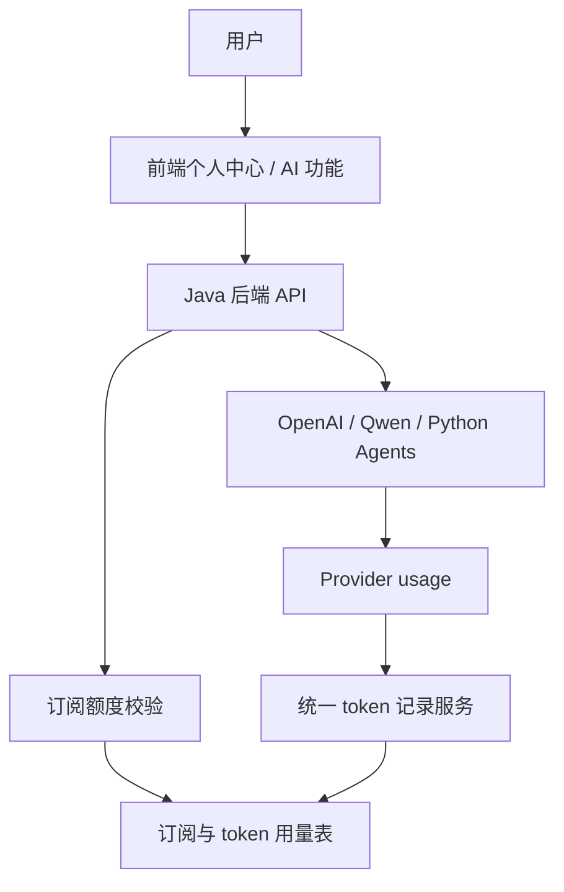
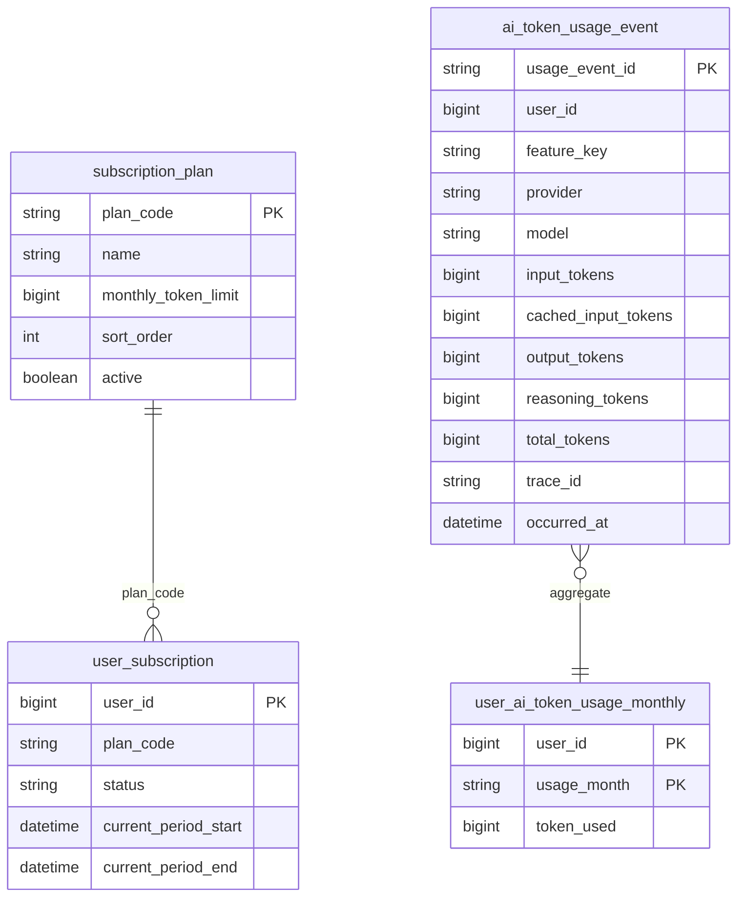
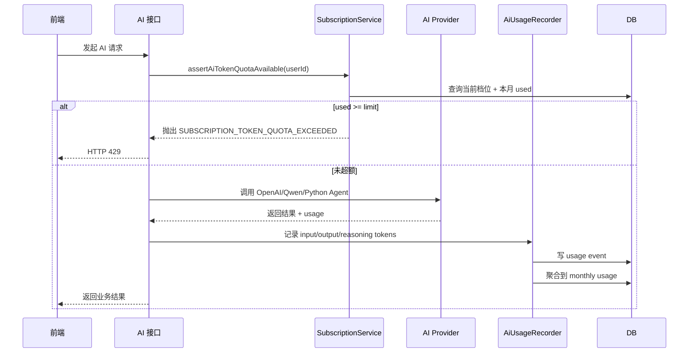
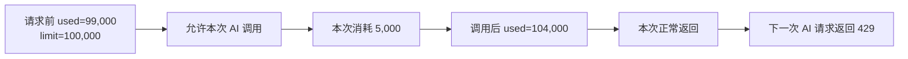
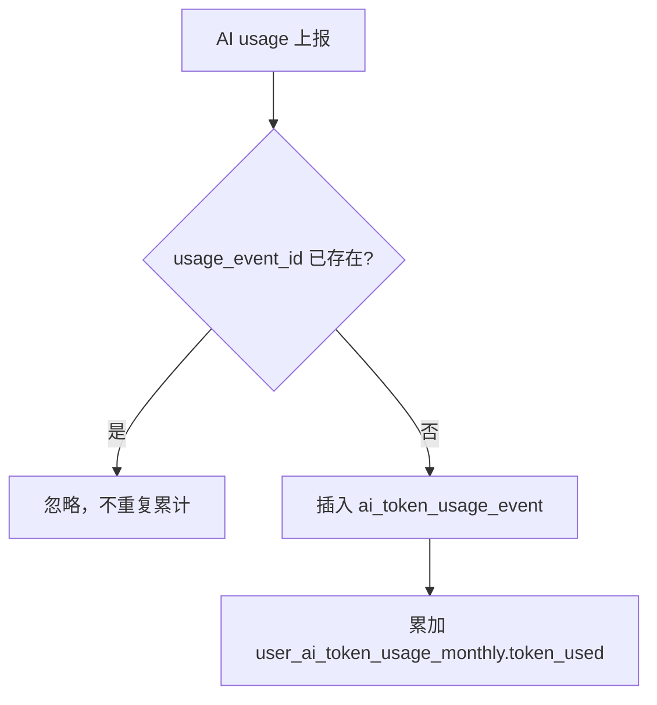
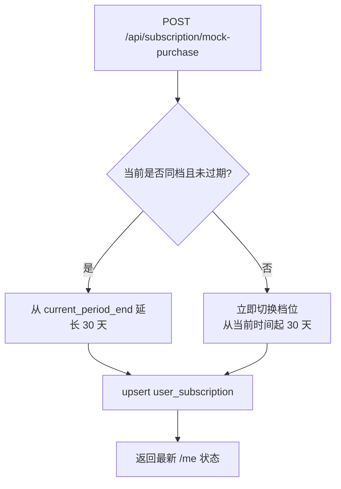
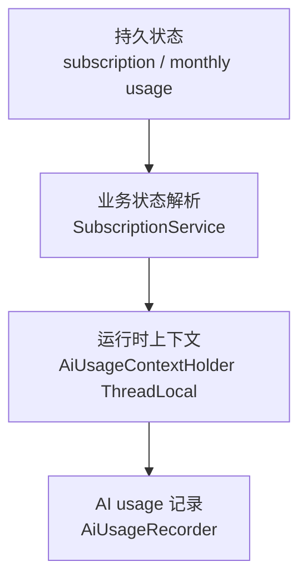
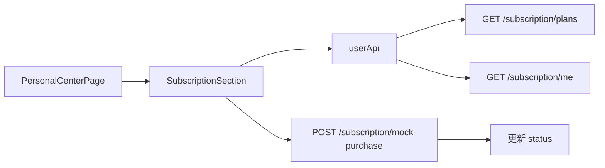
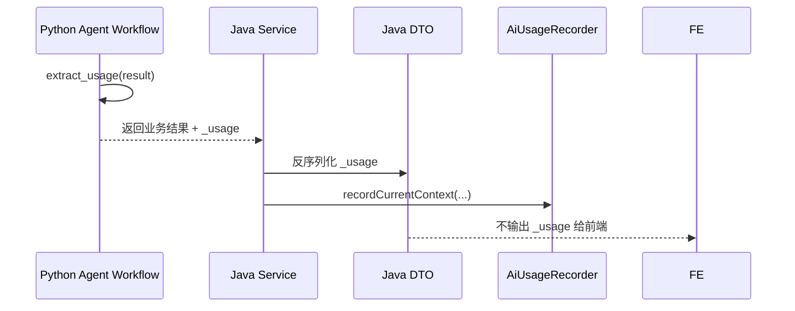

# 会员订阅基础层：AI Token 月度额度

## 1. 当前定位

第一版会员系统只做一件事：按用户每月 AI token 总额度限制 AI 请求。

不做真实支付、订单、退款、自动续费、模型单价、人民币成本估算，也不做功能次数限制。



## 2. 会员档位

| planCode | 名称 | 月度 token 额度 |
| --- | --- | ---: |
| `free` | Free | 100,000 |
| `basic` | Basic | 1,000,000 |
| `pro` | Pro | 5,000,000 |
| `premium` | Premium | 20,000,000 |

新用户默认没有 `user_subscription` 记录，但查询时会被解析为 `Free`。

## 3. 数据模型



核心表：

- `subscription_plan`：会员档位配置。
- `user_subscription`：用户当前会员档位和有效期。
- `ai_token_usage_event`：单次 AI 调用 token 事件，使用 `usage_event_id` 幂等去重。
- `user_ai_token_usage_monthly`：用户自然月聚合 token 用量，用于快速额度判断。

数据库初始化脚本位于：

- `backend/src/main/resources/db/schema.sql`
- `backend/src/main/resources/db/migrate_create_subscription_tables.sql`

## 4. 请求拦截逻辑

核心策略是：请求前只判断用户是否已经超额，不预扣 token。



## 5. 超额规则

本次调用导致超额时，不回滚、不阻止本次结果返回。



已超过本月额度后，后续 AI 请求返回 HTTP `429`。

业务语义错误码：

```text
SUBSCRIPTION_TOKEN_QUOTA_EXCEEDED
```

当前后端统一错误响应仍使用数字 code，映射为：

```text
429010
```

前端同时兼容这两个 code，并提示用户本月 AI token 额度已用完。

## 6. Token 计算口径

统一扣量口径：

```text
totalTokens = inputTokens + outputTokens + reasoningTokens
```

`cachedInputTokens` 会保存，但当前不从总扣量里单独折算成本。

只有当 provider 没有拆分字段时，才退回使用 provider 的 `total_tokens`。

## 7. 幂等机制

每次 AI 调用生成一个 `usageEventId`。



这保证了同一个 AI 响应重复上报时，不会重复扣 token。

## 8. 订阅购买机制

模拟购买只支持 `basic`、`pro`、`premium`。



`Free` 不需要购买。过期 paid subscription 查询时会回落为 `Free`。

## 9. API

### 查询档位

`GET /api/subscription/plans`

返回 4 个档位及其月度 token 上限。

### 查询当前会员

`GET /api/subscription/me`

返回当前档位、有效期、本月 token limit、used、remaining。

### 模拟购买

`POST /api/subscription/mock-purchase`

请求体：

```json
{
  "planCode": "basic"
}
```

规则：

- 同档续购：从当前有效期结束时间继续延长 30 天。
- 换档购买：立即切换，新有效期从当前时间起 30 天。

## 10. 后端状态管理

后端有三层状态：



- 持久状态：DB 是唯一真源。
- 当前请求上下文：用 `AiUsageContextHolder` 传递 `userId`、`featureKey`、`traceId`。
- 额度判断：每次 AI 请求前实时查当前自然月聚合。
- 前端不保存额度真源，只展示 `/api/subscription/me` 返回值。

## 11. 前端状态管理

前端订阅状态目前只在个人中心组件内维护，没有新增 Pinia store。



AI 请求遇到 `429010` 或 `SUBSCRIPTION_TOKEN_QUOTA_EXCEEDED` 时：

- 展示“本月 AI token 额度已用完，请前往个人中心升级”。
- 不触发登录跳转。
- 分发 `subscription-quota-exceeded` 事件，后续可用于自动跳转会员区。

## 12. Python Agents SDK usage 透传

Python 保持原业务 DTO 兼容，只额外带 `_usage` 给 Java 后端消费。



`_usage` 在 Java DTO 中是 write-only，前端看不到，不破坏现有业务响应结构。

## 13. 当前覆盖范围

已接入：

- OpenAI Java 客户端
- Qwen Java 客户端
- AI command
- 写作评分、润色、翻译、模板、素材、范文、题单、助手等 AI 入口
- Python Agents SDK 题单/助手链路 usage 透传

未限制：

- 普通文档
- 历史记录
- 个人资料
- 能力雷达
- 语法工具链
- 无 provider usage 的调用不做字符估算扣费

## 14. 一句话总结

当前实现是一个“订阅状态 + 月度 token 聚合 + AI 请求前拦截 + AI 响应后记账”的基础层。DB 负责长期状态，ThreadLocal 负责单次 AI 调用上下文，前端只展示和触发模拟升级。
