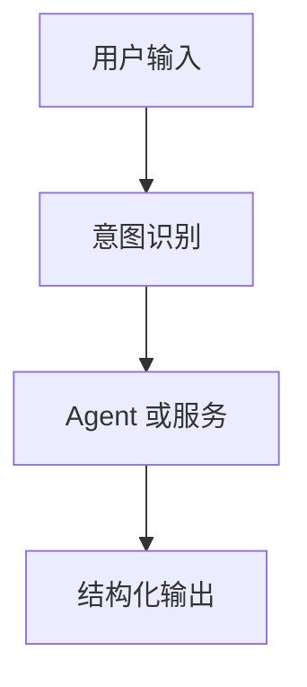

# AI 文档标题

## 当前结论

说明当前 AI 行为、Prompt、模型选择或 agent 路由的权威结论。

## 场景和目标

- 用户场景：
- AI 目标：
- 不应做的事情：

## 输入

| 输入 | 来源 | 必填 | 说明 |
| --- | --- | --- | --- |
| userText | Web / Backend | 是 | 用户输入 |

## 输出

| 输出 | 类型 | 说明 | 兼容性要求 |
| --- | --- | --- | --- |
| reply | string | 用户可见回复 | 不能改变语义 |

## Prompt 或指令结构

```text
填写 Prompt 结构、系统指令或引用具体文件。
```

## 模型和提供商

| 提供商 | 模型 | 用途 | 降级策略 |
| --- | --- | --- | --- |
| OpenAI | model-name | 场景 | 降级方式 |

## 路由和状态



## 失败模式

| 失败 | 用户影响 | 系统响应 | 降级或重试 |
| --- | --- | --- | --- |
| 模型超时 | 回复失败 | 返回明确错误 | 可重试 |

## 安全和质量边界

- 隐私和敏感信息：
- 幻觉控制：
- 输出格式约束：
- 不允许输出：

## 评估和验收

- 离线测试：
- 人工验收样例：
- 质量指标：
- 回归样例：

```powershell
# 填写测试命令
```

## 相关资料

- Prompt 文件：
- Backend 调用：
- Python agent：
- 测试：
