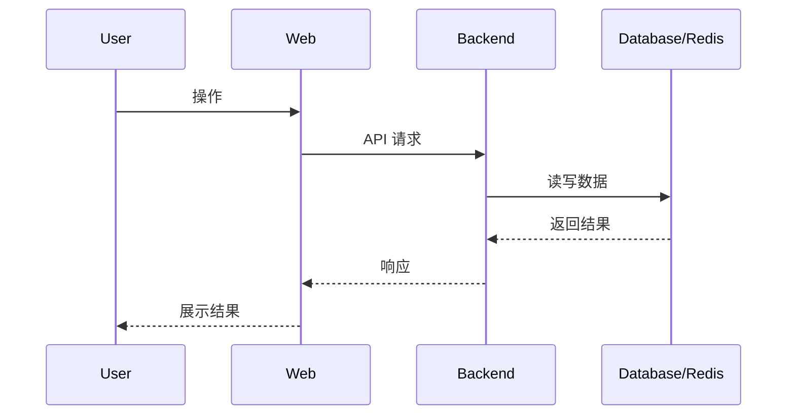

# 架构文档标题

## 当前结论

用 1-3 句话说明当前架构设计、模块边界或技术方向。

## 背景

说明这个架构要解决的问题、历史约束和主要风险。

## 范围

本文覆盖：

- 模块或能力 1。
- 模块或能力 2。

本文不覆盖：

- 非范围项 1。
- 非范围项 2。

## 组件职责

| 组件 | 职责 | 依赖 | 负责人 |
| --- | --- | --- | --- |
| Web | 说明职责 | Backend | frontend |
| Backend | 说明职责 | MySQL / Redis / Python | backend |

## 数据流



## 关键设计

### 设计点 1

- 决策：
- 原因：
- 代价：
- 替代方案：

## 失败模式

| 故障 | 用户影响 | 系统行为 | 处理方式 |
| --- | --- | --- | --- |
| 依赖不可用 | 功能不可用 | 返回明确错误 | 查看 runbook |

## 兼容性

- 需要保持兼容的接口：
- 需要保持兼容的数据：
- 可以安全调整的内部实现：

## 验收方式

```powershell
# 填写验证命令
```

通过标准：

- 标准 1。
- 标准 2。

## 相关资料

- 相关代码：
- 相关文档：
- 相关 ADR：
